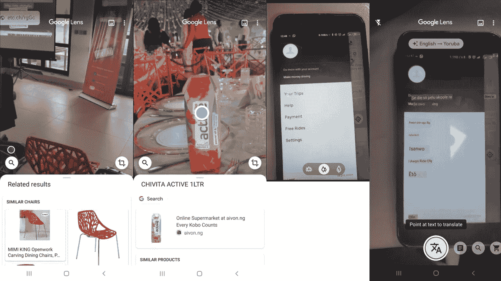

# 今天，每个人工智能爱好者都需要尝试三款移动应用

> 原文：<https://towardsdatascience.com/three-mobile-apps-every-ai-enthusiast-needs-to-try-out-today-3665b96b5a2a?source=collection_archive---------41----------------------->

保罗·花冈在 [Unsplash](https://unsplash.com/?utm_source=unsplash&utm_medium=referral&utm_content=creditCopyText) 上的照片

我们的世界正在以超快的速度前进，这不是什么新闻。技术正在改变一切；我们生活、交往和做生意的方式。处于这一变革前沿的关键技术之一是人工智能(AI)。人工智能已经从研究实验室进入我们的生活。从帮助我们变得更有生产力到帮助我们轻松翻译外语，人工智能正在融入我们的日常生活。我把三个强大的移动应用放在一起，我相信每个人工智能爱好者今天都需要尝试一下。

**谷歌镜头**

谷歌镜头是一个有趣的应用程序，每个人都会在某个时候发现它很有帮助。这是一个人工智能应用程序，使用智能手机摄像头来检测图片中的对象，并根据检测到的内容提供操作。

我已经用这个程序做了很多有趣的事情，你也可以试试。

*   扫描二维码。这是很基本的。
*   在应用程序中识别和购买相机拍摄的相似物品。这个功能太酷了。使用计算机视觉，该应用程序识别应用程序捕获的对象，并在线提供类似的对象。
*   将图片文本转换为可编辑文本。一点也不差。这类似于 OCR，只是它也适用于手写。
*   跨语言自动翻译。这个功能太神奇了。它用新的语言替换了摄像机对准的表面上的文字。把它指向任何文本，你就可以得到几种语言的翻译。我在我的优步应用程序上把英语翻译成我的母语(约鲁巴语)。

谷歌镜头在行动…

**水獭。艾**

Otter.ai 是一款语音转文本工具，可以实时将您的语音或声音转换为文本。我认为这是惊人的相当好的准确性。它可以用于几个方面，例如，我用它写了文章的这一部分。我还尝试了其他一些事情:

*   做会议笔记。不错是吗？如果你厌倦了写会议记录，那么 Otter 已经来帮你了
*   通过识别关键词总结会议记录。
*   使用输出转录视频以进行进一步分析，如 Python 中的情感分析或关键字分析。

谷歌也有一个类似的应用程序，名为 Live transcribe，这是一个为聋人和重听人设计的无障碍应用程序。

**虚拟助手**

虚拟助手？我们已经有他们一段时间了，那么他们到底是怎么上榜的呢？嗯，这可能是因为不是每个人都花时间探索现有的功能和这些应用程序更新的很酷的新功能。

我将在本文中重点介绍谷歌助手。像其他助手比如 Siri，Alexa，Cortana 等。，[它是一个对话式、语音激活的数字助理，可以代表用户执行操作，并提供上下文信息](https://www.techrepublic.com/article/google-assistant-the-smart-persons-guide/)。一些支持它的人工智能技术包括语音识别和自然语言处理。列出一份全面的功能列表[有点困难，尤其是因为新功能不断增加](https://www.blog.google/products/assistant/ces-2020-google-assistant/)。不过，我整理了几个。

“好的，谷歌…”。借助语音识别功能，助手可以:

*   打电话和发短信
*   打开应用程序
*   告诉你天气
*   播放音乐
*   设置提醒
*   寻找地点
*   帮助您导航到特定位置
*   控制你的智能家居——控制智能灯、电视、智能恒温器等。

凭借自然语言处理的能力，该应用程序会自动将航班、酒店和餐厅预订等事件添加到谷歌日历中。对于航班，该应用程序还可以帮助跟踪航班(例如，如果是亲人的航班)，甚至可以捕捉延误。[这个应用程序可以做很多其他的事情。](https://www.cnet.com/how-to/every-google-assistant-command-for-your-nest-speaker-or-display/)

看看今天人工智能能做什么很有趣。过去二十年的进步相当惊人，我们期待看到更多人工智能的惊人应用。老实说，这些应用离完美还很远，但仍然很迷人。我相信每个人工智能爱好者都应该检查它们，并与它们一起玩。如果你像我一样，除了对这些应用着迷，你还会尝试识别驱动这些应用的人工智能领域。