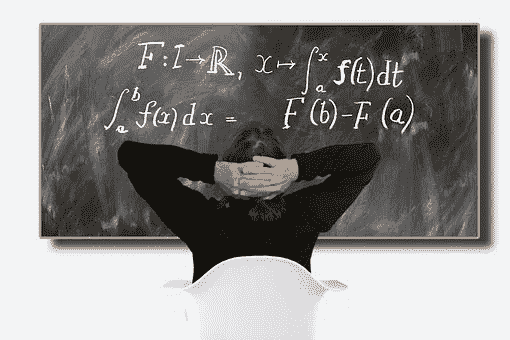

# 三个月计划学习机器学习背后的数学

> 原文：<https://towardsdatascience.com/three-month-plan-to-learn-mathematics-behind-machine-learning-74335a578740?source=collection_archive---------8----------------------->

## 为期 3 个月的计划，学习机器学习背后的数学知识

在 [Unsplash](https://unsplash.com?utm_source=medium&utm_medium=referral) 上拍摄的 [ThisisEngineering RAEng](https://unsplash.com/@thisisengineering?utm_source=medium&utm_medium=referral)

在这篇文章中，我分享了一个 3 个月的计划，学习机器学习的数学。我们知道，几乎所有的机器学习算法都利用了**线性代数、微积分、概率&统计**等概念。一些先进的算法和技术也利用了诸如**测量理论**(概率论的超集)**凸和非凸优化**等主题。为了理解机器学习算法并在机器学习及其相关领域进行研究，数学知识成为一项要求。

我在这篇文章中分享的计划可以用来准备**数据科学面试**，强化数学概念，或者**开始研究机器学习**。该计划不仅有助于理解机器学习背后的直觉，还可以用于许多其他高级领域，如统计信号处理、计算电动力学等。

按照计划，我通过了微软的数据科学实习面试，并收到了微软 2021 年的录用通知。我的采访经历可以在下面这篇文章里看到:

 [## 我在微软的数据科学采访

### 这是一年中的这个时候(即七月)，当软件公司来到各种印度工程学院…

towardsdatascience.com](/my-data-science-interview-with-microsoft-6b7ec840b80e) 

除此之外，人们应该了解在顶级会议/期刊上发表的论文，这些论文可能在早期就已经铺天盖地了。这也有助于开始研究生涯。

该计划主要分为四个部分

1.  **线性代数**
2.  **概率论**
3.  **多变量微积分**
4.  **多元统计**

# 线性代数

照片由 [Isaac Quesada](https://unsplash.com/@isaacquesada?utm_source=medium&utm_medium=referral) 在 [Unsplash](https://unsplash.com?utm_source=medium&utm_medium=referral) 上拍摄

线性代数是机器学习和深度学习中需要的最重要的概念之一。学习线性代数的最佳课程是吉尔伯特·斯特朗博士在麻省理工开放式课程上的 35 个讲座。对于完全初学者来说，完成本课程最多需要一个月的时间。但是因为大多数做机器学习的人都知道线性代数和矩阵的介绍。他们应该能够在每节课 2 小时内完成。**除了讲课，一个人还应该努力完成课程中给出的作业和考试，以进行适当的练习**。本课程最重要的技能是将多维向量可视化并理解它们之间的关系。向量的可视化是数据科学中最重要的技能之一。

为了更好地理解线性代数中的可视化，可以观看 YouTube 频道**“3 blue 1 brown”**上传的播放列表**“线性代数的本质”**。该频道还有其他通过可视化描述数学之美的视频。

# 概率论

(来源:pxfuel.com)

概率是理解不确定性背后的科学的一套原则。有了足够的观测数据，不确定性可以用确定性原理来建模。概率论最好的课程是约翰·齐茨克里斯博士关于麻省理工开放式课程的讲座。本课程讨论概率论的基础知识，并讨论**泊松过程、马尔可夫链、中心极限定理**等等。作业和考试也可以在麻省理工开放式课程上找到，而且**你应该完成所有的作业和考试来测试课程中学到的概念。也为相同的**提供了解决方案。如果你是一个喜欢从教科书中学习的人，那么你可以去看看《概率导论》这本书，第二版。“由 **Bertsekas、Dimitri 和 John Tsitsiklis 负责，**本课程的陪同人员。

# 多元微积分

[https://cdn . pix abay . com/photo/2017/10/05/19/39/differential-calculus-2820657 _ _ 340 . jpg](https://cdn.pixabay.com/photo/2017/10/05/19/39/differential-calculus-2820657__340.jpg)

**了解多变量微积分对于理解许多机器学习算法至关重要**，因为大多数机器学习算法使用不止一个参数(深度学习中有数百万个)，因此计算梯度和反向传播矩阵不能仅通过单变量微积分来完成。因此，多元微积分的知识对于机器学习是必不可少的。

在学习多变量微积分之前，先复习一下单变量微积分的概念。关于这个主题最好的课程之一是由丹尼斯·奥鲁博士讲授的关于 T2 麻省理工开放式课程。此外，一如既往，本课程的练习作业和考试。课程讨论**拉格朗日乘子，偏微分方程，向量场，通量**等。关于这个话题有一系列由“ **3blue1brown** ”制作的短(5-10 分钟)视频播放列表，使用可视化来解释这个话题。强烈建议观看视频，以便更好地理解。

# 多元统计

照片由[克里斯·利维拉尼](https://unsplash.com/@chrisliverani?utm_source=medium&utm_medium=referral)在 [Unsplash](https://unsplash.com?utm_source=medium&utm_medium=referral) 上拍摄

许多机器学习算法在多变量设置中使用统计学的概念。这些主题的概念来源于高维特征空间的线性代数和概率统计。学习这个题目没有指定的课程。但是，建议您通过以下任何一种资源来了解该主题:

*   本书的第 4、7、8 章由***r . Johnson***:***应用多元统计分析。***
*   本书的第 2、3、11 章由***T . w . Anderson***:***多元统计分析导论。***

[Unsplash](https://unsplash.com?utm_source=medium&utm_medium=referral) 上[粘土堤](https://unsplash.com/@claybanks?utm_source=medium&utm_medium=referral)的照片

现在，你可以高枕无忧，回头看看你在三个月的计划中学到了什么。**但这不是结束。**

现在拿任何会议论文或者任何高级机器学习书籍或者在线课程等。大多数人已经看过吴恩达博士的机器学习课程。现在，你可以尝试在斯坦福观看 **CS229 的原版讲座，尝试用数学的严谨深入理解机器学习概念。**

此外，你可以阅读下面提到的任何一本书来学习机器学习:

1.  模式识别和机器学习书由克里斯托弗主教。
2.  计算思维和数据科学导论。
3.  Tommi Jaakkola 教授的机器学习。

如果任何人对此有任何问题，请随时讨论。