# Python 中的三个“开箱即用”的 Web 内容抓取应用程序

> 原文：<https://towardsdatascience.com/three-out-of-box-web-content-scraping-applications-in-python-e342a6836ba4?source=collection_archive---------44----------------------->


照片由[哈尔·盖特伍德](https://unsplash.com/@halgatewood?utm_source=medium&utm_medium=referral)在 [Unsplash](https://unsplash.com?utm_source=medium&utm_medium=referral) 拍摄

## 你不需要通过使用它们来学习刮削

相信你一定知道，Python 的一个常见应用就是从网页中抓取内容。通常，你需要学习使用像 Scrapy 或 BeautifulSoup 这样的库来完成这项工作。

然而，你有没有想过有一种 Python 库“开箱即用”地提供这种特性？当然，对于某些网站来说。

在本文中，我将介绍 3 个为您做这件事的库。你不需要学 Scrapy，我保证。只需很少的几行代码，你就能立刻从这些网站上获得你想要的信息。

# TD；分升

1.  你好

这个库帮助你直接从 StackOverflow 中提取答案。

[](https://github.com/gleitz/howdoi) [## 格列茨/豪多伊

### 你是黑客程序员吗？你是否发现自己经常在谷歌上搜索如何完成基本的编程任务？假设你…

github.com](https://github.com/gleitz/howdoi) 

2.维基百科(一个基于 wiki 技术的多语言的百科全书协作计划ˌ也是一部用不同语言写成的网络百科全书ˌ 其目标及宗旨是为全人类提供自由的百科全书)ˌ开放性的百科全书

您可以使用这个库从维基百科下载和解析信息。

[](https://github.com/goldsmith/Wikipedia) [## 戈德史密斯/维基百科

### Wikipedia 是一个 Python 库，使得访问和解析来自 Wikipedia 的数据变得容易。搜索维基百科，获取文章…

github.com](https://github.com/goldsmith/Wikipedia) 

3.报纸 3k

从带有一些内置 NLP(自然语言处理)功能的新闻网站下载文章。

[](https://newspaper.readthedocs.io/en/latest/) [## Newspaper3k:文章抓取和管理— newspaper 0.0.2 文档

### 受到对其简单性的要求的启发，并因其速度而受到 lxml 的支持:“报纸是一个了不起的 python 库，用于…

newspaper.readthedocs.io](https://newspaper.readthedocs.io/en/latest/) 

# 你好


照片由[凯拉·杜洪](https://unsplash.com/@kayla_marie?utm_source=medium&utm_medium=referral)在 [Unsplash](https://unsplash.com?utm_source=medium&utm_medium=referral) 上拍摄

你写代码吗？我想肯定是的。否则，你不应该在这里看我的文章。那么，你 99%都用过 StackOverflow 吧？

有人开玩笑说，程序员就是那些从 StackOverflow 复制代码并粘贴到他们项目中的人。我不敢说这是真的，但绝对 StackOverflow 对我们很重要。

有了 Python 库“howdoi”，你不需要打开浏览器搜索你的问题。作者在自述文件中说，这将减少你分心的机会。老实说，当我第一次看到这个论点时，我仍然不相信这是一个有用的库，直到我尝试了它。跟我来。

要安装这个库，只需运行`pip` install

```
pip install howdoi
```

在 Python 代码中，导入这个库，

```
from howdoi import howdoi
```

然后，使用字典构建查询。

```
query = "python how to send POST request with json body"
args = {
    'query': query.split(' '),
    'pos': 1,
    'all': False,
    'link': False,
    'color': True,
    'num_answers': 1
}
```

在本词典中:

`query`获取关键字列表。在本例中，我用一个句子编写了我的查询，并将其拆分为关键字。

`pos`每次搜索都会有一个问题排序列表，这个参数让你选择位置。直觉上，很多时候我们应该选择 1 号，才能得到比较靠谱的答案。

`all`显示整个答案文本(True)或只显示有用的答案(False)。

`link`如果为真，将只显示一个链接，因此您必须使用浏览器查看。

`color`将尝试在答案中对代码进行着色以提高可读性。

`num_answers`如果> 1，将立刻返回更多答案。

一旦构建了参数字典，我们只需将它传递给`howdoi`函数来获得输出。

```
output = howdoi.howdoi(args)
print(output)
```

让我们运行它！

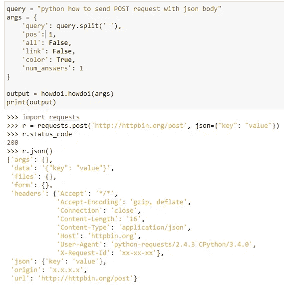

是不是很酷？图书馆即时为你呈现答案。当然，当你有一个相对主观的问题时，这可能并不完美。然而，当你有一个简单的编码问题时，它可以非常简洁和准确。再来几个试试。

## 如何合并到熊猫数据框？

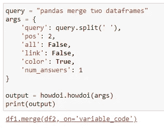

## 如何在 Python 中改变两个变量的值？

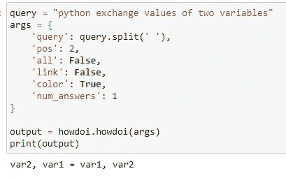

## 如何在 Python 中加入字符串列表？

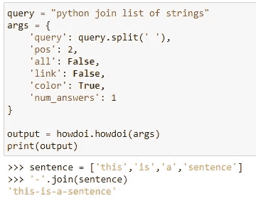

我必须在这里停下来。我可以整天玩这个:)

# 维基百科(一个基于 wiki 技术的多语言的百科全书协作计划ˌ也是一部用不同语言写成的网络百科全书ˌ 其目标及宗旨是为全人类提供自由的百科全书)ˌ开放性的百科全书


照片由[卢克·切瑟](https://unsplash.com/@lukechesser?utm_source=medium&utm_medium=referral)在 [Unsplash](https://unsplash.com?utm_source=medium&utm_medium=referral) 上拍摄

是的，这个库叫做“维基百科”。

您想快速定义术语吗？这个库允许您通过一行代码从维基百科中转储自然语言术语的定义或摘要。

首先，使用`pip`安装。

```
pip install wikipedia
```

然后，将其导入到您的代码中。

```
import wikipedia
```

定义一个术语如下。

```
wikipedia.summary("Hatsune Miku")
```

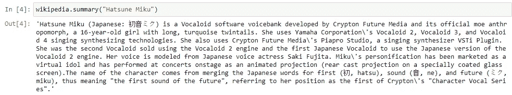

那太长了吗？想有一个简洁的定义？然后，把答案限制在一句话之内。

```
wikipedia.summary("Hatsune Miku", sentences=1)
```

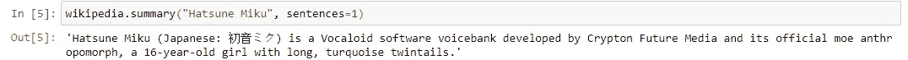

例如，您有一个要定义的术语列表，使用这个库可以在几秒钟内定义所有的术语。

```
# Create a list with terms
terms = ['Python', 'Java', 'PHP', 'C++']# Define the terms in another list
definitions = [wikipedia.summary(term, sentences=1) for term in terms]# Combine them into a dictionary
dictionary = dict(zip(terms, definitions))# Print the dictionary
from pprint import pprint
pprint(dictionary)
```

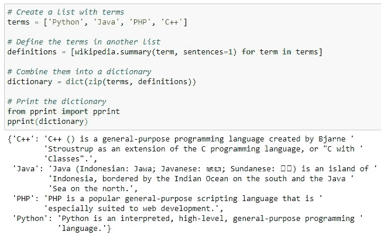

如果是一个模棱两可的术语呢？库抛出一个异常，你可以捕捉并处理它。

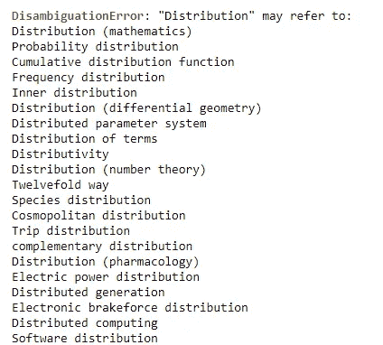

当然，这个库的更多功能等着你去尝试。例如，您可以

*   获取 HTML 格式的整个网页，这样你就可以应用你定制的解析器了
*   获取页面的标题，这样可以帮助你标准化你的术语
*   获取页面上的链接，允许您进行更多的深入研究

# 报纸 3k


由[absolute vision](https://unsplash.com/@freegraphictoday?utm_source=medium&utm_medium=referral)在 [Unsplash](https://unsplash.com?utm_source=medium&utm_medium=referral) 上拍摄的照片

与前两个相比，这个库可能更有用。一个典型的网络抓取应用就是下载最新的新闻，并从中提取有用和有趣的信息。

例如，您可能会下载关于某个特定主题的新闻，并在稍后执行一些情感分析。或者，试图找到所有关于一些股票市场上市公司的新闻文章，使用 NLP(自然语言处理)技术进行一些自动化调查，以方便您的投资。

通常，上述示例用例将从开发一个 web 抓取器/爬虫开始。但是，有了 Newspaper3k，可以简化很多。

还是那句话，我们用`pip`来安装。

```
pip install newspaper3k
```

然后，让我们导入它并构建一个针对特定新闻网站的刮刀。

```
import newspapersite = newspaper.build('[https://www.news.com.au/'](https://www.news.com.au/'))
```

一旦我们构建了 scraper 对象，我们就可以填充它的所有最新消息。

```
for article in site.articles:
    print(article.url)
```

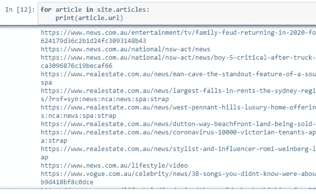

这个库中有许多内置的解析特性。例如，获取新闻文章的标题:

```
# Let's just get the first news article as example
article = site.articles[0]
article.title
```

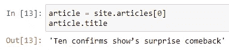

一旦你使用`article.download()`下载文章并由`article.parse()`解析，你将能够从新闻文章中提取更多的信息。

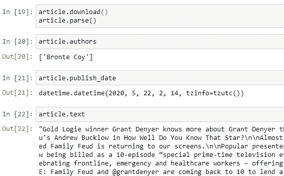

需要 NLP 功能？是的，它也有一些内置的。需要澄清的是，Newspaper3k 使用了`nltk`，这是另一个执行 NLP 功能的 Python 库，当你安装 Newspaper3k 库时，这个库会自动安装。但是，我发现`nltk`需要使用一个叫做`punkt`的子包。我的情况是默认不安装这个子包，需要在`nltk`手动下载。放心，一点都不复杂。下面是启用新闻文章的 NLP 特性的所有代码。

```
# import nltk and download "punkt" package
import nltk
nltk.download('punkt')article.nlp()
```

那么，它有什么样的 NLP 功能呢？获取文章关键词怎么样？

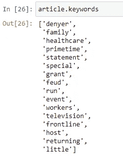

还记得我们上面那篇文章的全文吗？以下是全文:

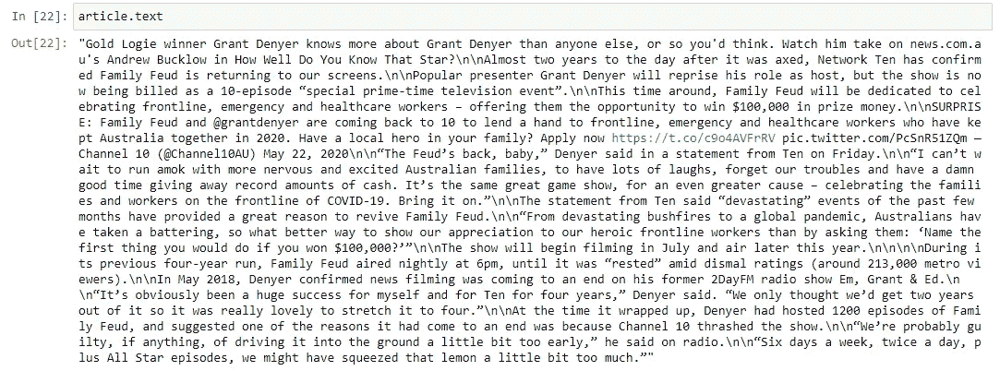

太长了，读不下去。我们来总结一下。

```
article.summary
```

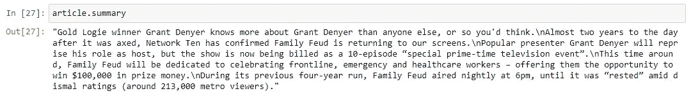

如果你愿意，现在你可以用 Python 来构建你的带有摘要功能的报纸刮刀。

# 摘要


照片由[艾拉·贾尔迪姆](https://unsplash.com/@daniellajardim?utm_source=medium&utm_medium=referral)在 [Unsplash](https://unsplash.com?utm_source=medium&utm_medium=referral) 上拍摄

这里是我推荐的三个“开箱即用”的 web 抓取库。我称它们为网络抓取库，但是正如你所看到的，它们不仅仅是抓取器。

这三个库的特点正是我热爱 Python 的原因之一。编程本身及其蓬勃发展的社区创造了如此多优秀的高级包装器，为我们的应用程序提供了便利。

[](https://medium.com/@qiuyujx/membership) [## 通过我的推荐链接加入 Medium 克里斯托弗·陶

### 作为一个媒体会员，你的会员费的一部分会给你阅读的作家，你可以完全接触到每一个故事…

medium.com](https://medium.com/@qiuyujx/membership) 

如果你觉得我的文章有帮助，请考虑加入 Medium 会员来支持我和成千上万的其他作者！(点击上面的链接)