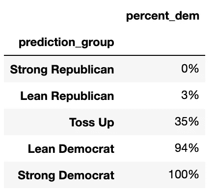
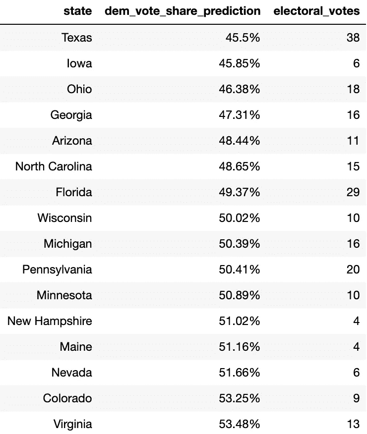
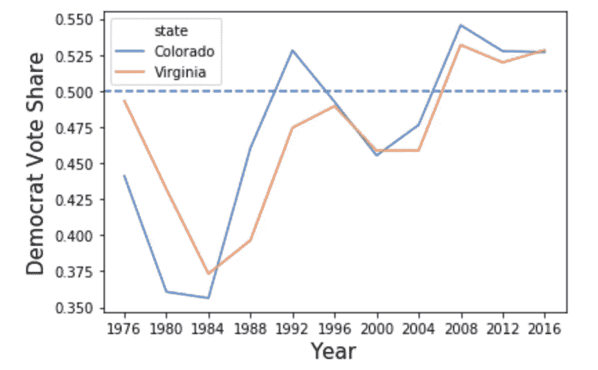
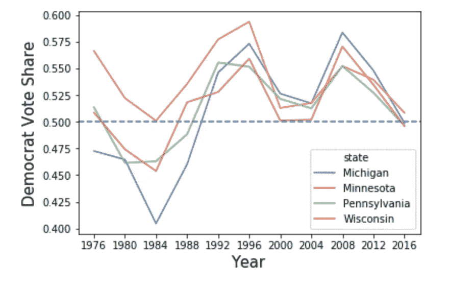
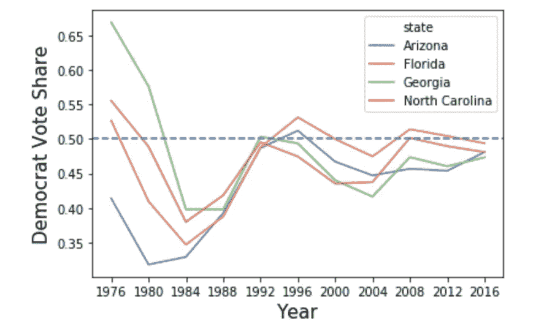
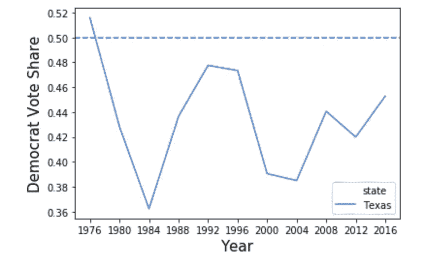

# 赢得 2020 年大选的三条途径

> 原文：<https://towardsdatascience.com/three-paths-to-victory-in-the-2020-election-ff41e029664?source=collection_archive---------36----------------------->

## 使用来自机器学习模型的见解

凯勒·琼斯在 [Unsplash](https://unsplash.com/s/photos/path?utm_source=unsplash&utm_medium=referral&utm_content=creditCopyText) 上拍摄的照片

在我的[上一篇文章](/what-will-happen-in-the-2020-election-e6efb0a7b2ad)中，我分享了一个回归模型，该模型预测了民主党在 2020 年大选中在每个州的投票份额。该模型预测了一个非常接近的结果——民主党以微弱优势(279-259)获胜。

鉴于竞争如此激烈，选举可能取决于每个政党如何在 50 个州投资有限的时间和资源。下面，我使用模型中的预测来讨论获得 270 张选举人票的策略。

# 模型预测

在开始分析之前，下面是对 2020 年大选各州预测的可视化:

每个州被分为五类——“强共和党”、“瘦共和党”、“掷硬币”、“瘦民主党”和“强民主党”。

使用前四次选举的模型预测，我们发现民主党很少失去“强民主党”和“瘦民主党”州，很少赢得“强共和党”和“瘦共和党”州:

如果我们假设预测的政党赢得了这些选举，民主党将获得 182 张选举人票，需要再获得 88 张选举人票才能达到 270 张的目标。

下面是他们应该从中抽取的“抛硬币”状态:

# 必赢之地:科罗拉多和弗吉尼亚

科罗拉多和弗吉尼亚总共有 22 张选举人票，是最有可能支持民主党的州。很难说这些不应该成为 2020 年提名人的主要关注点。

这两个州在 2008 年都被奥巴马击败，民主党在接下来的两次选举中获胜。

值得注意的是，2018 年的国会选举结果对民主党有利，他们在弗吉尼亚州和科罗拉多州分别获得了 56%和 55%的选票。两者都是分析期间(1976 年至 2018 年)的历史新高。

然而，民意调查显示，特朗普在弗吉尼亚州略微领先四名领先的民主党候选人中的三名。

这进一步加强了这一点——科罗拉多州和弗吉尼亚州预计将非常接近，他们值得民主党人花时间和精力来确保胜利。

随着在每个州的胜利，民主党的神奇数字从 88 下降到 66。

现在，让我们探索获得这 66 张选票的三条胜利之路:

# 路径#1 — **收回锈带**

2016 年大选最大的惊喜之一是特朗普在锈带地区的表现，他赢得了密歇根州、威斯康星州和宾夕法尼亚州，并差点赢得明尼苏达州。

当我们随着时间的推移观察这些状态时，我们发现 2000 年和 2016 年都有类似的模式。像特朗普一样，在 1996 年比尔·克林顿相对较大的胜利之后，布什在这方面表现得相当好。因此，我认为 2016 年的结果令人惊讶，但并非史无前例。

同样值得注意的是，特朗普公司认为他们有足够的机会赢得这些州，他们在选举前在这些州进行了竞选活动。他们是对的。在很大比例的[未受过教育的白人](https://www.npr.org/2016/11/12/501848636/7-reasons-donald-trump-won-the-presidential-election)的支持下，川普能够在 2016 年赢得铁锈地带。

然而，到了最后，胜利的差距只有一分钟——密歇根州领先 10，000 票，威斯康星州领先 23，000 票，宾夕法尼亚州领先 43，000 票。

接下来，民主党最直接的胜利之路就是赢回这些州。除了在那里花费时间和金钱之外，他们还应该精心制作他们的竞选信息，记住没有受过教育的白人可能会决定这个地区，因此从他们的词典中删除像“*可悲的*”这样的词。

如果民主党赢得密歇根州(16 票)、威斯康星州(10 票)和宾夕法尼亚州(20 票)，他们将获得 46 张选举人票。剩下的 20 个州可能会与希拉里在 2016 年赢得的州一起——明尼苏达州(10 个)、内华达州(6 个)，以及缅因州(4 个)或新罕布什尔州(4 个)将使民主党获得 270 个席位。

# **路径二——南方的惊喜**

南方有几个州在“活动”。佛罗里达(29 张)和北卡罗来纳(15 张)近年来在两党之间摇摆不定——总共价值 44 张选举人票。自 1996 年以来，亚利桑那州(11 人)和佐治亚州(16 人)每次选举都支持共和党，但近年来最有可能转向蓝色。

该模型预测民主党在佛罗里达、北卡罗来纳和亚利桑那的得票率都在 2%以内。

这三个州在国会选举中的民主党投票份额都有所增加。最引人注目的是，民主党人 Kyrsten Sinema 成为 40 年来第一个赢得亚利桑那州参议员席位的人。

如果民主党赢得佛罗里达州、北卡罗来纳州和亚利桑那州，他们将获得 55 张选举人票。把内华达州(6)、缅因州(4)和新罕布什尔州(4)也算在内，民主党可能会在没有中西部北部支持的情况下取得胜利。

# **路径 3——德克萨斯州的一切都更大**

最后一条道路是一个极其冒险的政治策略，但也是一个有趣的思维练习:*尝试拿下德克萨斯*。

但这可能吗？让我们来看看德克萨斯州在之前的大选中的结果:

自 1976 年吉米·卡特获胜以来，民主党最接近的一次是在 1992 年，当时比尔·克林顿赢得了 48%的选票，民主党或共和党都获得了选票。然而，第三党派候选人、德克萨斯人罗斯·佩罗赢得了 22%的选票，这可能会给希拉里带来额外的帮助。

自 2004 年以来，德克萨斯州的民主党选票份额从 38%上升到 45%。希拉里·克林顿——她在 2008 年几乎每个州的表现都比奥巴马差——在德克萨斯州表现更好。

此外，人口结构的变化可能有利于民主党人，他们现在正在努力吸引年轻和拉丁裔选民。

另一方面，德克萨斯州是一个大州，民主党需要比 2016 年多 80 万张选票才能获胜。这可能需要民主党人将大部分精力投入到这个州——这一策略可能会适得其反。

如果他们设法在德克萨斯州取得胜利，民主党只需要额外的 28 张选举人票，这是他们仅从佛罗里达州或几个摇摆州获得的总数。

# 外卖食品

1.  2020 年的选举预计将非常接近，16 个州预计民主党将在 5%的差距内获胜。
2.  不管他们更广泛的战略是什么，民主党人应该专注于保护科罗拉多州和弗吉尼亚州，因为它们值得大量的选举人票，应该最容易在摇摆州中获胜。
3.  最简单的胜利之路是赢回密歇根州、威斯康星州和宾夕法尼亚州。如果民主党采取这种方式，他们应该把绝大部分精力放在这些州，避免分散精力。这可能是最有效的短期策略，可能导致民主党微弱的胜利。
4.  在一个稍微更具侵略性的方法中，民主党可以通过改变佛罗里达州、北卡罗来纳州和亚利桑那州来试图从南部获胜。这涉及到更多的风险，但对党来说可能有更好的长期效果。这也增加了在选举中以更大优势获胜的可能性。
5.  最后，最具侵略性的策略是试图颠覆德克萨斯。那里的巨大努力可能会导致令人震惊的胜利，改变未来几年的政治格局。