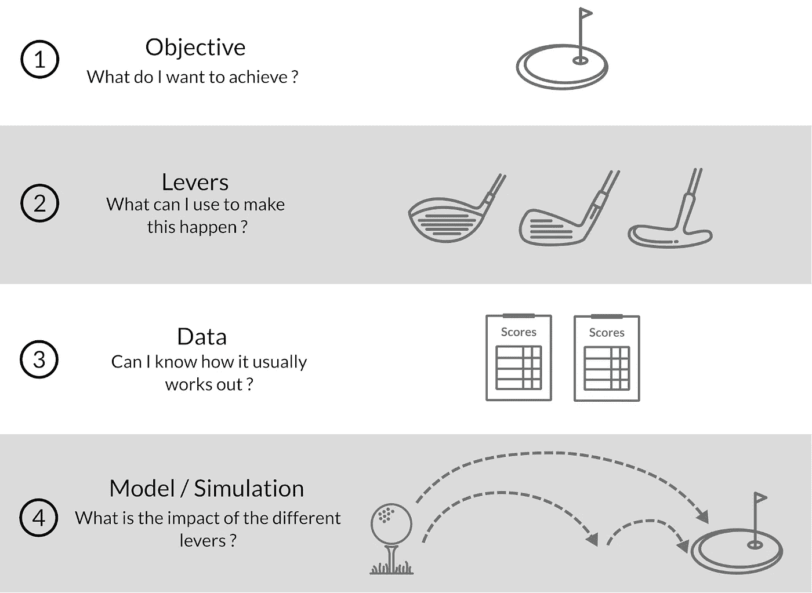
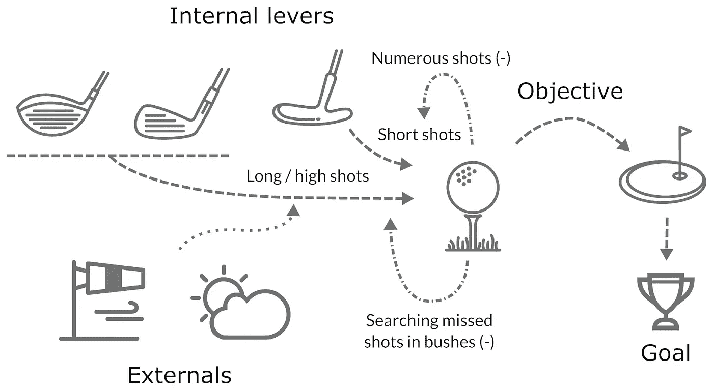

# 实现有效数据项目的三个策略

> 原文：<https://towardsdatascience.com/three-strategies-towards-effective-data-projects-eed29ad05ded?source=collection_archive---------44----------------------->

## 如何使您的数据科学项目符合业务需求？

图片由 [Hebi B.](https://pixabay.com/users/422737-422737/?utm_source=link-attribution&utm_medium=referral&utm_campaign=image&utm_content=787826) 发自 [Pixabay](https://pixabay.com/?utm_source=link-attribution&utm_medium=referral&utm_campaign=image&utm_content=787826)

许多数据科学项目没有[投入生产](https://venturebeat.com/2019/07/19/why-do-87-of-data-science-projects-never-make-it-into-production/)，这是为什么？毫无疑问，在我看来，数据科学是一种高效的工具，具有令人印象深刻的性能。然而，一个成功的数据项目也是关于有效性的:*做正确的事情*正如 Russell Ackoff 在“[变革型领导的系统观点](https://link.springer.com/article/10.1023/A:1022960804854)”中所写的。

> 成功的解决问题需要为正确的问题找到正确的解决方案。我们失败更多的是因为我们解决了错误的问题，而不是因为我们用错误的方法解决了正确的问题——罗素·L·艾可夫(1974)

你如何专注于你的项目，并确保它们将为公司带来价值？你是否在战略性地思考如何让你的项目取得成果？

*注意:我将使用高尔夫——一项战略性运动——作为一个说明性的类比。*

# OKR:设定你承诺要实现的目标

**目标和关键成果(OKR)** 已被成功的组织采用，以推动巨大的增长(英特尔、谷歌……)。它们最初是由约翰·杜尔登引入的，旨在提高创造价值的关注度。

总的想法是设定激励你的目标。想象一下，你对高尔夫球充满热情，下周五有一场大型比赛。在过去的几年里，没有人在球场的 18 个洞里有超过 15 个洞表现出色。设定自己去赢得它是一个很好的目标——它是具体的、雄心勃勃的，并且在给定的时间发生。然后你设定**关键结果**，它可以衡量你在这个目标**上的表现。**在这个高尔夫示例中，他们可能是:

*   在 18 洞当中，至少有 16 洞达到标准杆数(进洞的理想杆数)。
*   避免把球扔进沙坑超过三次——因为你知道你不擅长摆脱它们。
*   比赛前进行 20 分钟的练习——因为你通常会用冰冷的肌肉打出一些糟糕的投篮。

检查所有的关键结果是一个很好的指标，你可能会赢。

在另一个场景中，为一家大银行工作，设想你的任务是建立一个准确率为 80%的贷款风险模型。以下是一些可能的关键结果:

*   通过 XX/YY/ZZZZ 获得 80%的客户还款行为数据。
*   通过 AA/BB/CCCC 测试三种可解释的模型类型。
*   定义并跟踪四个指标，以跟踪模型的性能并了解模型的错误之处。

OKRs 可以用来集中注意力在任何事情上。我发现它们有助于定义我的项目目标:构建一个模型或一个应用程序，什么时候足够好？瞄准关键结果带来清晰。失败成为一种学习经历，激发更好的 OKRs 定义和工作。另一方面，成功是显而易见的，你应该享受它。

**必读题目:**[***衡量什么重要***](https://www.whatmatters.com/the-book/) **作者约翰·杜尔登。**

# 动力传动系统方法

动力系统方法是数据产品定义的综合策略。下图显示了其基本步骤:

高尔夫示例中的传动系统方法——来自 M. Koutero 许可的[库存](https://www.istockphoto.com/)的元素。

在一个新项目中，我们可能会问自己:

*   目标

> 设定目标包括回答以下问题:它是否为企业增加了价值？它与当前的路线图一致吗？应该什么时候做？它打开了新的视角吗？

*   杠杆

> 最终产品中的哪些元素在我的控制之下？我可以改变产品的价格吗？推荐页的排名？…

*   数据

> 给定目标和杠杆，我可以使用什么样的数据？什么是合规性问题？

*   模型/模拟

> 模拟应该表明你的数据中是否有足够的信息与你的杠杆相结合来达到你的目标。在贷款模式示例中，您能以更低的风险推动更多销售吗？

每一步也是退出点。如果你无法单独或集体找到解决方案，这可能意味着不值得你花时间，你应该把注意力放在别的事情上。

**必读专题:** [***设计伟大的数据产品***](https://www.oreilly.com/radar/drivetrain-approach-data-products)***by***[**【杰瑞米·霍华德】**](https://twitter.com/#!/jeremyphoward)****Margit Zwemer****[**Mike Loukides**](http://radar.oreilly.com/mikel/)**。******

# ****决策智能****

****[决策智能](https://en.wikipedia.org/wiki/Decision_intelligence)是一个更加通用的学科，处理如何在复杂的情况下建立给定目标的策略。一般流程整合了外部原因、多重因果联系和反馈循环等概念。创建因果图的团队可以理性地决定一个策略，并清晰地理解手头的问题。人们可能会将决策智能理解为 OKRs 和驱动系统方法之间的扩展合并。****

********

****因果图初级读本——根据 M. Koutero 的许可，包含来自[库存](https://www.istockphoto.com/)的元素。****

****在上面的小例子中，一旦你选择了一个球杆，球是会飞得高(希望飞得远)还是会在地上滚动意味着风或多或少会影响。呆在地面上可能更安全，但是只拍小镜头，你会需要更多的镜头。有一个好的策略意味着你会找到一个合理的平衡来实现你的目标和目的。****

****在 OKR 关于风险贷款模式的例子中，我们将在这里进行更深入的调查。在某些类型的客户身上犯错误的贷款模式会对资产净值造成危害吗？负责验证贷款的员工会不会只依赖这个模型，变得不那么善于思考，在棘手的情况发生时也不太可能调整自己的行为？因果图使你能够理解你的决定的间接后果。如果您认为获得正确的干净数据并构建一个模型以用于生产通常是一项需要几个月的任务，那么是否不值得花一些时间来解释您这样做的原因呢？****

****对于工程师和科学家来说，这与指定一个经典的数字产品的限制和目标性能没有太大的不同，只是拓宽了视角。我感兴趣的是对决策制定的关注(“我应该构建这个产品吗？如何构建？”)将业务和技术人员放在一起，以确保在整个生态系统的范围内，下一步是正确的。****

******必读专题:** [***链接***](https://www.lorienpratt.com/linkthebook-2/) **作者洛里安·普拉特******

****战略并不局限于领导者、经理、产品经理等的自上而下的实践。我认为这是任何工作的一部分，在引擎盖下达成妥协并有一些战略性的思考。也许这些框架有时过于详细，但其核心是，它们从一个简单的问题开始，我们可以问自己:我为什么要做这个项目？****

****作为一个超越人工智能炒作的领域，我们不能停留在一个孤立的系统中，在没有明确显示其价值的情况下扩展我们的专业化水平。*缺少的中层*专业人士在这项任务中可能很重要([保罗·r·道赫蒂](https://paul-daugherty.com/)——埃森哲的 CTIO 和洛里安·普拉特)。他们是否会成为*决策智能专家*、*数据战略家*或*数据产品经理*将是一个语义问题，并在该领域建立新的实践。****

****___________****

****参考资料:****

*   ****阿科夫，R，L: 1998 年，*变革型领导的系统观点*(系统实践和行动研究)。****
*   ****Ackoff，R. L.: 1974 年，*重新设计未来:解决社会问题的系统方法*。****
*   ****Doerr，J: 2018，*衡量什么是重要的:谷歌、博诺和盖茨基金会如何通过 OKRs* (组合企鹅)震撼世界。****
*   ****普拉特，L: 2019，*链接*(翡翠出版有限公司)。****