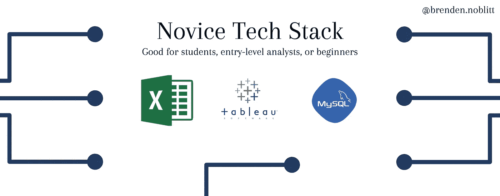
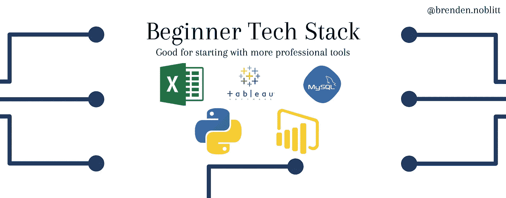
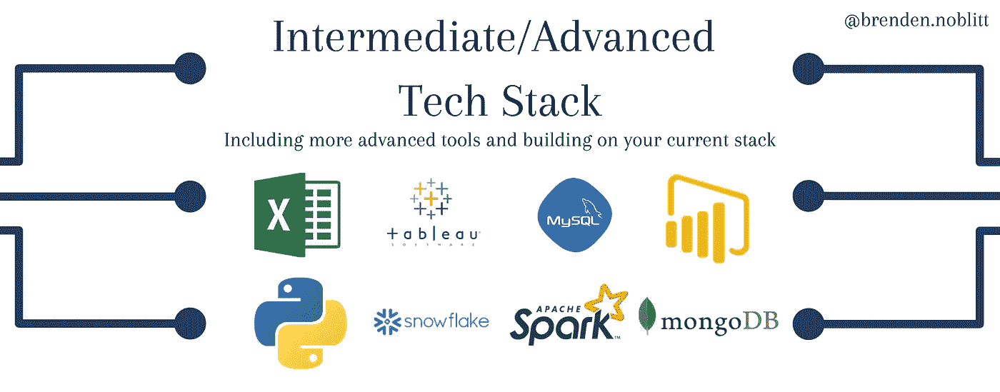
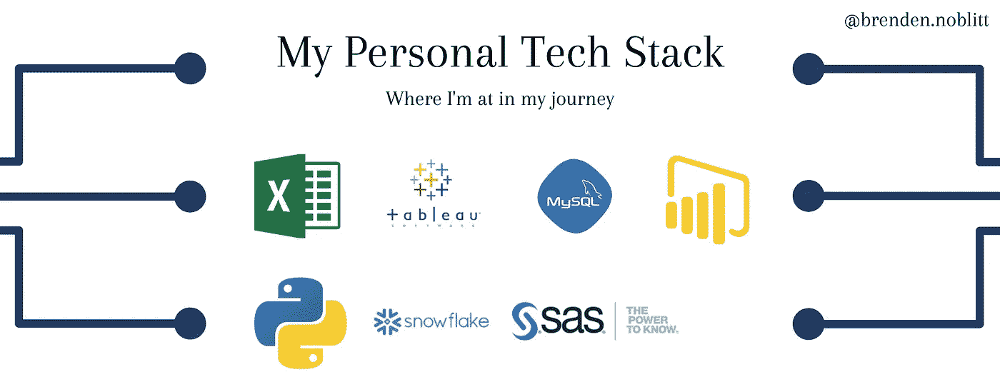

# 面向有抱负的分析师的三大技术平台

> 原文：<https://towardsdatascience.com/three-tech-stacks-for-aspiring-analysts-5cde49a22337?source=collection_archive---------28----------------------->

## 分析/数据科学

## 初学者构建技术堆栈指南

[来源](https://www.pexels.com/photo/blur-close-up-code-computer-546819/)

在今年夏天的实习期间，我花了大量的时间在办公室之外学习新的技术技能，同时完善我的旧技能。当我即将结束营销自动化/分析实习时，我有幸与之共事的终身市场分析师有着非常深厚的技术背景，并教会了我一些我以前从未想过的事情。

当我开始我的分析和数据科学之旅时，我有一个非常小的技术堆栈。这并不是说知道一百万种语言和工具会有所帮助，而是我体验过的工具与分析和数据科学几乎没有关系。现在，每种技术都有其独特的价值，但是，我想就我从我的同事以及我自己的同事那里看到的不同技术提供一些观点！

你们中的许多人会发现，我的技术并不是世界上最先进的。我不是人工智能专家或机器学习大师，因为我仍在学习，并将在相当一段时间内，甚至在大学毕业后。然而，到目前为止，我所学到的东西已经能够帮助我，所以我希望给任何自学或从商业学科转向分析和数据科学的人一些指导。让我们开始吧！

*免责声明:我不是全职的数据专家，我只是简单地转述我从暑期实习和个人实践中获得的经验。这并不是要告诉你你到底需要知道什么，而是从我的经历中给你一些实用的建议。高级技术信息请查看* [*走向数据科学*](https://towardsdatascience.com/) *。如果你对一些帮助你开始分析的建议感兴趣，请继续阅读！*

# 一、新手技术栈

1.  微软优越试算表
2.  （舞台上由人扮的）静态画面
3.  结构化查询语言

这就是你开始工作所需要的一切！你不需要马上了解 Python 或者 NoSQL 数据库。我艰难地了解到，在开始编码和建模之前，你需要知道如何提出问题，如何超越数字，以及如何像数据专家一样思考。每一个伟大的音乐家在学习乐器之前都会学习基本的音乐理论，就像数据专家在学习工具之前会学习专业一样。在我调整了我在许多不同工具中的许多课程之后，我把它带回到这三个工具上。老实说，这可能是入门级分析中最常用的三种工具。在我的实习中，大多数从事建模和机器学习的专业人士都至少有 7-10 年的职业生涯，而这只是他们的**专长**。我实习的所有分析师和数据科学家都在某种程度上使用这三个工具。您可以使用这三个工具完成所有的分析、ETL 和数据库管理。现在他们是最快的还是最好玩的？我个人喜欢 SQL，但在大多数情况下，它不像 Python 或其他高级工具那样令人兴奋。然而，这些工具是开始学习基本概念的好方法！

# 二。初级技术堆栈

1.  微软优越试算表
2.  （舞台上由人扮的）静态画面
3.  结构化查询语言
4.  Python(新手/初学者)
5.  功率 BI

在您花一些时间了解分析和数据科学中的不同概念(如数学、统计、工作流)并提出正确的问题后，您就可以开始实施 Power BI 和 Python 等工具了。当我第一次开始学习 Python 时，我的一位导师说，“Python 是一个非常强大的工具，但也非常令人难以置信。对于数据科学，学习基础知识，然后开始一次学习一个不同的包。当你看到不同的元素如何结合在一起形成一门伟大的语言时，Python 就有意义了”。所以对我来说，我掌握了 Python 的基础知识，比如语法、循环、数据类型等等。之后开始做熊猫，Matplotlib，Numpy。这是我建议首先学习的三个软件包，因为它们简单易学，但是功能强大，并且在您将要做的许多工作中都可以使用。

> “Python 是一个非常强大的工具，但也令人难以置信。对于数据科学，学习基础知识，然后开始一次学习一个不同的包。当你看到不同的元素如何结合在一起形成一门伟大的语言时，Python 就有意义了”

# 三。中级/高级技术堆栈

1.  微软优越试算表
2.  （舞台上由人扮的）静态画面
3.  结构化查询语言
4.  Python(中级/高级)
5.  功率 BI
6.  雪花
7.  火花
8.  NoSQL

我想以一句警告的话开始:你不需要了解这些工具中的每一个！Excel、Tableau/Power BI、Python 和 SQL 是分析师和数据科学家的主要工具，也是我自己技术堆栈的一部分。在你对这些工具有了扎实的知识和经验之前，我不会将任何其他东西加入你的堆栈。也就是说，一旦你觉得你已经掌握了上述工具，那么将是一个很好的时机来添加其他东西，这取决于你认为你会需要什么。你打算在数据库工作吗？像 MongoDB 这样的 NoSQL 工具是开始学习的好工具。数据仓库？雪花是个不错的选择。ETL 还是机器学习？火花是一个受欢迎的最爱。对我个人来说，我将更深入地研究雪花，因为我知道我的职业生涯将从数据仓库开始。请注意，我没有说我正在学习所有三个新工具，只是其中一个。当您发现不同工具的用例时，那将是您开始获得更多的时候。“如果你不使用它，你就会失去它”，这是一个真实的事情，所以不要陷入拥有最大的技术堆栈的陷阱！公司更希望你有三种你非常了解的工具，而不是十种你一无所知的工具。

# 四。我的个人技术资料

如你所见，我不是机器学习专家或数据库专家。我的工具箱里有一些工具，但是我还有很多东西要学。然而，我把这个放在这里是为了告诉你，一旦你开始做了，你将会一帆风顺，并且在做的过程中不断增加新的东西。我学习这些工具并不一定只是为了学习它们，我学习每一个工具是因为我要么处于需要这些工具的情况下，要么处于这些工具是我唯一能得到的情况下。不要陷入你想要学习的不同工具中，学习分析和数据科学的过程和工艺，因为这就是它的全部！

# 结论

希望这在某种程度上有所帮助！这并不是要告诉你你到底需要学习什么，而是给你一张地图，你可以在那里规划自己的旅程。慢慢来，一次学习一种工具，在需要的时候选择不同的工具。我保证，如果你慢慢来，这个过程将会是愉快和充实的。稳扎稳打赢得比赛！一定要在个人项目和编码挑战中练习这些技能，这样你就可以巩固你所学到的东西。所以深呼吸，打开你的网络浏览器，开始学习吧！我们对这个世界有太多的不了解，尤其是在新冠肺炎期间，这个世界需要分析师和数据科学家的帮助来理解和理解我们面临的不同问题。上面的图片应该是可以下载的，所以当你决定下一步应该学什么的时候，可以随意下载它们作为指导。快乐学习！

**看看我的其他一些故事吧！**

*成功实习的 10 个秘诀*

*[*我作为营销分析实习生学到的东西*](/what-i-learned-as-a-marketing-analytics-intern-f96307976bb3)*

*[*营销分析实习生的一天*](/a-day-in-the-life-of-a-marketing-analytics-intern-2bed4d11d30f)*

**要联系我或接收更多内容，请在 Twitter 上关注我@*[*BMNAnalytics*](https://twitter.com/BMNAnalytics)*！**