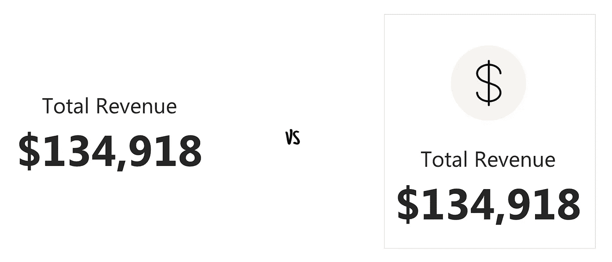

# 您可以做三件简单的事情来改进任何 Power BI 报告的设计

> 原文：<https://towardsdatascience.com/three-things-to-instantly-improve-the-design-of-any-power-bi-report-25a9e8d58f6f?source=collection_archive---------52----------------------->

## 如何使用风格指南、图标和登录页面来推进您的商务智能游戏

PowerBi 是一个强大的工具。但是，和许多复杂的产品一样，它也有一些局限性。对于几乎所有这些问题，您都可以采取一些变通办法，使您的开发和典型用户的生活更加轻松。来说说他们吧。

# 1.样式指南

颜色。咩。无聊。但同时你也不希望你的报告看起来像一堆垃圾，不是吗？你不希望你在 2020 年开发的报告看起来像是在 Windows 95 时代创建的。为什么？因为现在每个人都习惯于好看的界面、好看的设备、好看的工具和网站，它们 a)功能性强，b)用户友好，c)简单美观。

Windows 95 与 macOS

所有公司都有自己的风格指南或品牌手册，基本上都是 pdf 格式的文档，有一套解释你的品牌如何运作的规则。对我们来说，最重要的是**颜色，我们必须使用**使我们的报告看起来像一个品牌。一个例子。如果你正在为 Spotify 做一份报告，让它看起来像 Spotify 本身。使用合适的标志，使用正确的颜色，为图表添加与品牌一致的颜色，瞧。你的报告将看起来现代、专业，没有人会意外地认为这是关于脸书的报告。但是这里还有一个免责声明，因为我知道你现在想说什么。是的，应用程序本身处于黑暗模式。我知道，没关系。但是说到可读性，光模式对你的眼睛来说更容易。Spotify 应用程序不是为阅读和分析数据而设计的。PowerBI 则相反。

# 2.核标准情报中心

你解锁你的手机，看到图标。你打开一个 Instagram 应用程序，看到图片和图标作为导航。你打开 Spotify(不，他们不会为此付钱给我，但他们可以💸)要搜索艺术家，你只需点击放大镜，放大镜是一个被广泛认可的图标，象征着搜索功能。图标是任何用户界面(UI)中最受欢迎的构件之一。请告诉我，如果你在谷歌图片中输入“Power BI report”，为什么前 14 个例子的报告根本没有使用图标？

前往 https://www.google.com/search?q=power+bi+report 的[查看！](https://www.google.com/search?q=power+bi+report)

那么，为什么您应该在 Power BI 报告中使用图标呢？它们能很好地抓住用户的注意力，提升用户体验(UX)。它们提供功能并创建好看的报告。

假设您正在寻找一个 KPI。总收入。哪个磁贴能更快吸引你的注意力？上面写着“总收入”的那个还是上面写着“总收入”和一个**大**美元符号的那个？

但是要小心！需要考虑两件事:

1.  不要走上去掉任何标签，只用图标代替的道路。只有图标的界面是不好的界面。将一个标签和一个图标结合起来，让用户体验更好。
2.  与图标保持一致。还记得我之前说的品牌书或者风格指南吗？有可能有人想到了，图标就在那里，在营销或设计部门，等着你。沉住气，在你去网站上挑选图标之前，比如 [Flaticon](https://www.flaticon.com/) 去看看有没有图标。

# 3.登录页面

谁不喜欢标签呢(我这里说的不是浴缸)？这是一种简单有效的报告切换方式。数据科学家通过使用 Excel 对它们很熟悉，我们在 Power BI 中使用它们，所以为什么要改变它呢？答案很简单，而且在政治上非常正确——有些人可能对使用 Excel 有不好的记忆。有些人认为它是邪恶的😼

那么，为什么不改善报告的整体用户体验，并创建一个登录页面，用户可以从该页面导航到任何可用的报告，而无需使用选项卡呢？这就是流程。

用户总是从登录页面开始。从这里，她可以决定她对什么报告感兴趣。要打开特定的报告，用户只需点击它。报告打开。如果用户想要查看其他报告，她可以单击公司名称并返回到登录页面。

那么为什么呢？因为这是互联网上每一个网站都有的模式。你点击图标(或名称)返回主页。这里没什么新鲜的。一切都很清楚，每个只使用过一次互联网的人都知道它是如何工作的。那么为什么不在 PowerBI 中重用这种模式呢？

**关于作者** 我是一名资深 UX 和产品设计师，喜欢人、数据和金毛。选择你的毒药，在 [LinkedIn](https://www.linkedin.com/in/michalbutkiewicz/) 、 [Twitter](https://twitter.com/MikeBeUX) 或 [Medium](https://medium.com/@michalbutkiewicz) 上关注我。