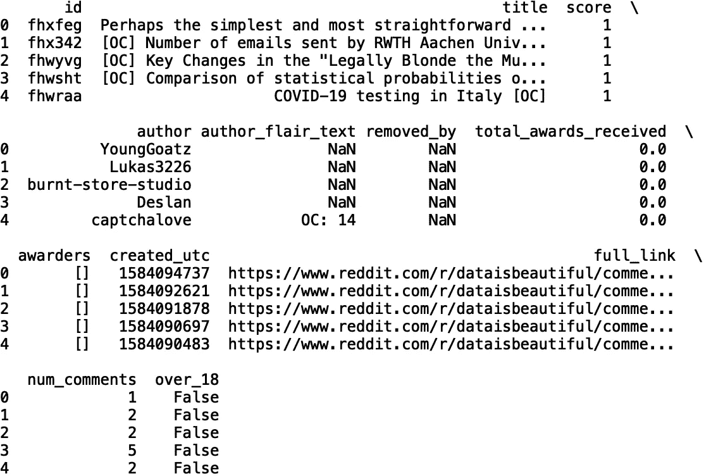
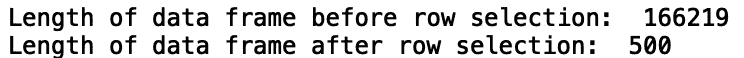
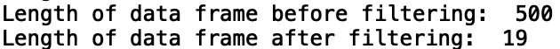
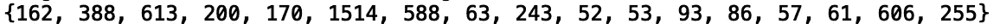
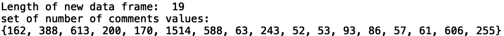

# 三个有用的熊猫方法

> 原文：<https://towardsdatascience.com/three-useful-pandas-methods-f05addd926c3?source=collection_archive---------41----------------------->

## 读取、选择和写入数据


[来源](https://www.pexels.com/photo/coffee-cup-notebook-pen-64775/)

Pandas 是一个非常有用的 python 库，它支持数据读取、从数据生成统计数据、转换数据等等。在这篇文章中，我将讨论我作为数据科学家经常使用的三种方法。

我们开始吧！

# 读取数据

我们将讨论的第一种方法是熊猫中的 CSV 文件读取方法。如果我们有一个。csv '文件，我们可以使用' read_csv()'将数据读入 Pandas 数据帧。Pandas 数据框是一个包含行和列的表格数据结构。对于我们的示例，让我们将 *Reddit —数据是美丽的* CSV 文件(可在[这里](https://www.kaggle.com/unanimad/dataisbeautiful)找到)读入熊猫数据框:

```
import pandas as pd
df = pd.read_csv("r_dataisbeautiful_posts.csv")
```

为了显示我们已经成功地读入了数据，我们可以打印前五行:

```
print(df.head())
```



对于其他文件扩展名，还有其他方法。例如，我们用' read_html()'来表示。' html '文件，' read_excel()' for '。xls '文件，' read_parquet()'，for '。镶木地板的文件和更多。你可以在 pandas [这里](https://pandas.pydata.org/docs/user_guide/index.html)找到 IO 工具的完整列表。

现在我们将继续选择熊猫的数据。

# 选择数据

假设我们想从我们之前看到的 *Reddit — Data is Beautiful* 数据集中选择前 500 行数据。我们可以使用。iloc[]'方法按索引选择前 500 行。我们还可以打印选择前后数据框的长度:

```
print("Length of data frame before row selection: ", len(df))
df = df.iloc[:500]
print("Length of data frame after row selection: ", len(df))
```



我们也可以使用'基于我们选择的列中的值来选择数据。loc[]'。让我们选择“num_comments”值(注释的数量)大于或等于 50 的数据，并打印结果:

```
print("Length of data frame before filtering: ", len(df))
df = df.loc[df.num_comments >= 50]
print("Length of data frame after filtering: ", len(df))
```



我们还可以打印“num_comments”的一组值，以验证我们所做的更改:

```
print(set(df['num_comments']))
```



我们看到所有的唯一值都大于 50。

# 将数据写入文件

类似于 Pandas 中用于读取数据的工具套件，有几种方法可以将数据写入文件。假设我们想将之前处理的过滤后的数据帧写入 a’。csv。我们可以使用。to_csv()”方法将结果写入。“csv”文件:

```
df.to_csv("new_file_r_dataisbeautiful_posts.csv")
```

然后，我们可以将数据读入数据框:

```
new_df = pd.read_csv("new_file_r_dataisbeautiful_posts.csv")
```

并打印结果:

```
print("Length of new data frame: ", len(new_df))
```



这正是我们所期待的。

# 结论

总之，在这篇文章中，我们讨论了三种对熊猫有用的方法。我们讨论了如何使用“read_csv()”方法来读取。csv 文件转换成数据帧。接下来，我们讨论了如何通过行和列值选择和过滤数据。最后，我们演练了如何将过滤后的数据帧写入新的。csv 文件。我希望你觉得这篇文章有用/有趣。这篇文章的代码可以在 GitHub 上找到。感谢您的阅读！