# 创建 Dockernized LaTeX 环境的三种方法

> 原文：<https://towardsdatascience.com/three-ways-to-create-dockernized-latex-environment-2534163ee0c4?source=collection_archive---------6----------------------->

## LeTeX + Docker + VSCode 远程容器入门


图片由来自 [Pixabay](https://pixabay.com/?utm_source=link-attribution&utm_medium=referral&utm_campaign=image&utm_content=5312500) 的[斯蒂芬·凯勒](https://pixabay.com/users/kellepics-4893063/?utm_source=link-attribution&utm_medium=referral&utm_campaign=image&utm_content=5312500)拍摄

```
**Table of Contents**[**Introduction**](#7f9b)1\. [Setup](#cdb9)
2\. [Method 1: tianon/latex](#3fca)
3\. [Method 2: Remote-Containers](#7949)
4\. [Method 3: Creating your container](#1707)
5\. [How to switch Remote containers](#2ca1)
6\. [Opening a PDF](#9b9a)[**Conclusion**](#95c4)
```

# 介绍

我们可以在任何环境下运行 Docker 应用程序，Linux、Windows 或 Mac。Docker 为最常用的操作系统和应用程序提供了一组[官方](https://hub.docker.com/search?q=&type=image&image_filter=official)基础映像。Docker 允许您完全控制您的环境，安装您需要的东西，从 Dockerfile 删除和安装。

在本文中，我将向您展示如何在 Docker 和 [VSCode 远程容器扩展](https://code.visualstudio.com/docs/remote/containers)上使用 LaTeX 的三种方式。第一部分使用 [tianon/latex](https://hub.docker.com/r/tianon/latex) 图像，第二部分使用[qmc gaw/latexdevcontainer](https://hub.docker.com/r/qmcgaw/latexdevcontainer)Docker 图像。最后，我们基于 qmcgaw/latexdevcontainer Docker 映像创建我们的映像。

# 设置

如果你愿意，你可以从你的电脑上删除 LaTeX。

对我来说，我需要跑步:

```
$ brew uninstall mactex
```

请安装 [Docker 桌面](https://www.docker.com/products/docker-desktop)和 [VSCode 的远程容器](https://marketplace.visualstudio.com/items?itemName=ms-vscode-remote.remote-containers)和 [LaTeX-Workshop VSCode 扩展](https://marketplace.visualstudio.com/items?itemName=James-Yu.latex-workshop)。

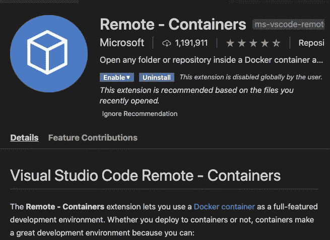

VSCode 扩展 Microsoft Remote —容器。作者图片


VSCode 扩展 LaTeX 研讨会。作者图片

[](/how-to-auto-update-pdf-when-working-on-latex-ad9eeabdb7a1) [## 使用 Latex 时如何自动更新 PDF

### 使用 latexmk 和 VSCode 自动更新 PDF 的指南

towardsdatascience.com](/how-to-auto-update-pdf-when-working-on-latex-ad9eeabdb7a1) 

# 方法 1:天农/乳胶

拉 tianon/latex 图像:

```
$ docker pull tianon/latex
```

按 SHIFT+CMD+P 打开 settings.json:

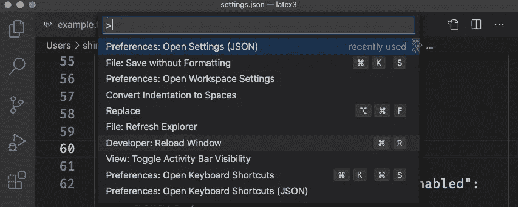

VSCode SHIFT+CMD+P .图片作者。

并添加以下内容:

```
{
    // ... YOUR OTHER SETTINGS ... // latex
    "latex-workshop.docker.enabled": true,
    "latex-workshop.latex.outDir": "./out",
    "latex-workshop.synctex.afterBuild.enabled": true,
    "latex-workshop.view.pdf.viewer": "tab",
    "latex-workshop.docker.image.latex": "tianon/latex",
    // End
  }
```

创建一个 tex 文件，并输入以下内容:

```
\documentclass{article}
\begin{document}An Example for a very \tiny{tiny} \normalsize \LaTeX \ document.\end{document}
```

您可以通过单击构建图标或在 Mac 上使用 OPTION+CMD+B 来构建 LaTeX 文件。

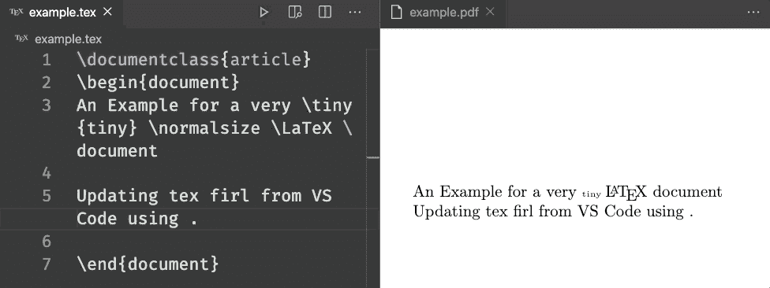

单击构建图标。图片作者。

此后，每当你保存一个文件，它会自动更新 PDF。

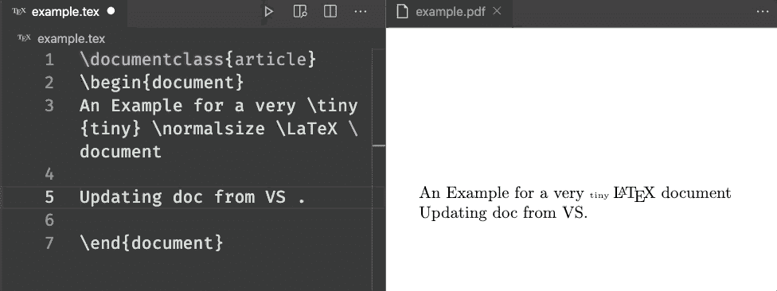

保存时，文件将被更新。图片作者。

现在你在 Docker 上运行 LaTeX。

# 方法 2:远程容器

> Visual Studio Code Remote-Containers 扩展允许您使用一个 [Docker 容器](https://docker.com/)作为全功能开发环境。它允许您打开容器内(或装入容器中)的任何文件夹，并利用 Visual Studio 代码的完整功能集。项目中的一个 [devcontainer.json 文件](https://code.visualstudio.com/docs/remote/containers#_create-a-devcontainerjson-file)告诉 VS 代码如何使用定义良好的工具和运行时堆栈来访问(或创建)开发容器。—来自[在容器内展开](https://code.visualstudio.com/docs/remote/containers)

在您的目录中，创建`[.devcontainer/devcontainer.json](https://github.com/qdm12/latexdevcontainer/blob/master/.devcontainer/devcontainer.json)` [并添加以下内容:](https://github.com/qdm12/latexdevcontainer/blob/master/.devcontainer/devcontainer.json)

```
{
    "name": "project-dev",
    "dockerComposeFile": ["docker-compose.yml"],
    "service": "vscode",
    "runServices": ["vscode"],
    "shutdownAction": "stopCompose",
    "workspaceFolder": "/workspace",
    "postCreateCommand": "",
    "extensions": [
        "james-yu.latex-workshop",
        // Git
        "eamodio.gitlens",
        // Other helpers
        "shardulm94.trailing-spaces",
        "stkb.rewrap", // rewrap comments after n characters on one line
        // Other
        "vscode-icons-team.vscode-icons",
    ],
    "settings": {
        // General settings
        "files.eol": "\n",
        // Latex settings
        "latex-workshop.chktex.enabled": true,
        "latex-workshop.latex.clean.subfolder.enabled": true,
        "latex-workshop.latex.autoClean.run": "onBuilt",
        "editor.formatOnSave": true,
        "files.associations": {
            "*.tex": "latex"
        },
        "latex-workshop.latexindent.args": [
            "-c",
            "%DIR%/",
            "%TMPFILE%",
            "-y=\"defaultIndent: '%INDENT%',onlyOneBackUp: 1\"",
        ]
    }
}
```

在设置中，我们允许用 ChkTeX 列出 LaTeX，递归地删除子文件夹中的 LaTeX 辅助文件，并在构建时删除 LaTeX 辅助文件。

如果你愿意，你可以在 vs code > Preferences > Settings > Extensions > LaTeX 中看到更多设置。

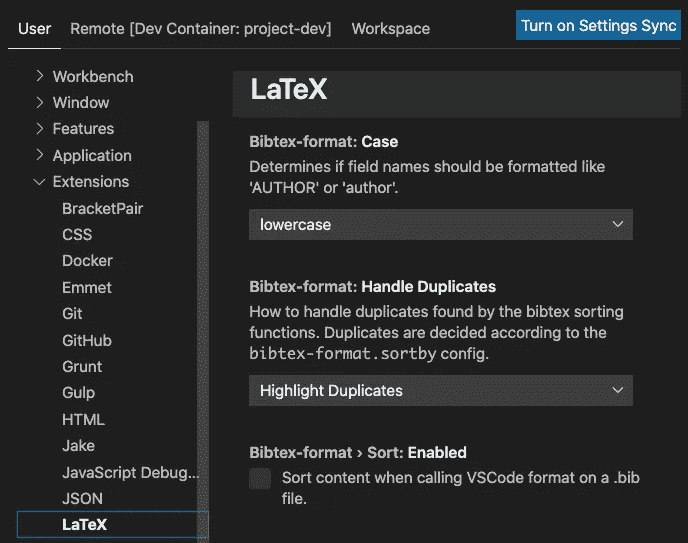

LaTeX 的 VSCode 设置。作者图片

创建`[.devcontainer/docker-compose.yml](https://github.com/qdm12/latexdevcontainer/blob/master/.devcontainer/docker-compose.yml)` [并添加以下内容:](https://github.com/qdm12/latexdevcontainer/blob/master/.devcontainer/docker-compose.yml)

```
version: "3.7"services:
  vscode:
    image: qmcgaw/latexdevcontainer
    volumes:
      - ../:/workspace
      - ~/.ssh:/home/vscode/.ssh:ro
      - ~/.ssh:/root/.ssh:ro
      - /var/run/docker.sock:/var/run/docker.sock
    environment:
      - TZ=
    cap_add:
      - SYS_PTRACE
    security_opt:
      - seccomp:unconfined
    entrypoint: zsh -c "while sleep 1000; do :; done"
```

我们用`qmcgaw/latexdevcontainer`作为`image`。它使用 [texlive 2020](https://www.tug.org/texlive/acquire-netinstall.html) 基本方案和 [latexmk](https://mg.readthedocs.io/latexmk.html) 将 LaTeX 编译成 PDF。它使用[LaTeX ident](https://github.com/cmhughes/latexindent.pl)在保存时格式化，并使用 [chktex](https://www.nongnu.org/chktex) 用于 LaTeX 林挺。

您具有以下结构:

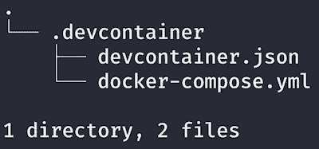

目录结构。作者图片

点击左下方的绿色图标，或者在 Visual Studio 代码中打开命令调板(CMD/CTRL+SHIFT+P)，选择`Remote-Containers: Open Folder in Container...`，选择你的项目。

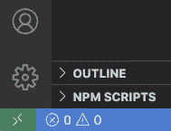

绿色远程容器图标。作者图片

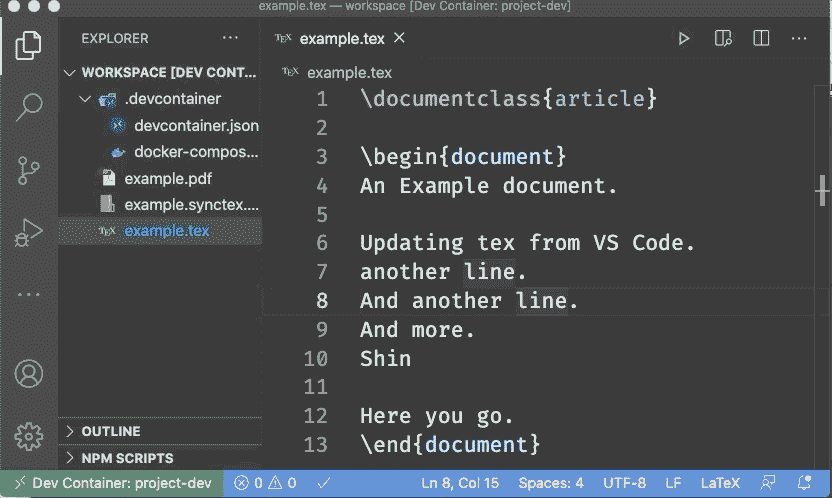

选择远程-容器:打开容器中的文件夹…作者图像

它将提取 Docker 图像，在本例中为`qmcgaw/latexdevcontainer`，并在后台运行一个容器。

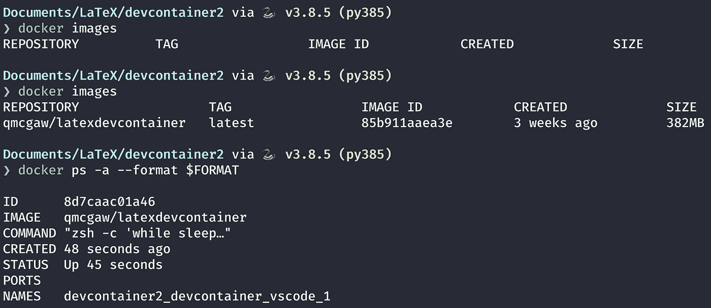

结果来自 docker images，docker PS-a . images by Author

一旦完成，你会在 VSCode 的左下方看到“Dev Container”。

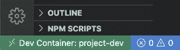

左下方显示开发容器。作者图片

如果您需要安装 LaTeX 包，您可以在 VSCode 终端中使用`tlmgr`:

```
$/workspace tlmgr update --self
$/workspace sudo apk add xz
$/workspace tlmgr install lastpage
$/workspace texhash
```

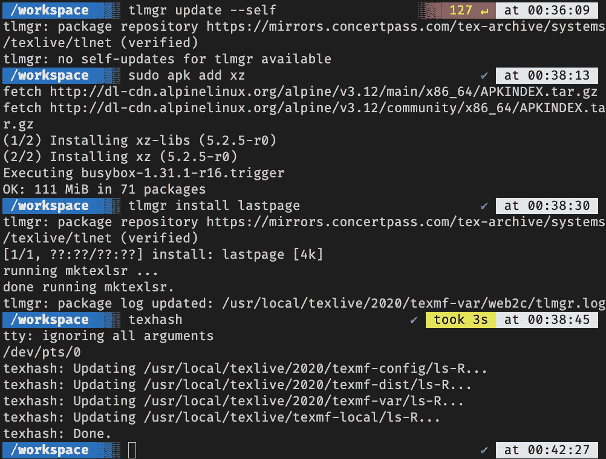

容器中的终端命令。作者图片

创建一个简单的 tex 文件:

```
\documentclass{article} 
\usepackage{lastpage}
\begin{document}
An Example document.
\[
 \frac{4}{12}
\]
\end{document}
```

当你保存它时，它会创建一个 PDF 文件。

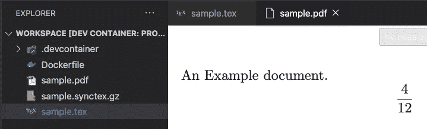

保存 tex 文件创建 PDF 文件。作者图片

# 方法 3:创建容器

[qmcgaw/latexdevcontainer](https://github.com/qdm12/latexdevcontainer)是创建 docker 文件并在映像中安装所有包的一个很好的起点。这里有一个例子。

创建一个新目录，并在其中创建一个 Dockerfile 文件:

```
FROM qmcgaw/latexdevcontainer
ARG USERNAME=vscode
USER root
RUN tlmgr update --self && \
    tlmgr install latexindent latexmk && \
    tlmgr install mathexam setspace adjustbox xkeyval collectbox enumitem lastpage && \
    texhash
USER ${USERNAME}
```

这将更新`tlmgr`并安装我需要的所有软件包。我们可以使用`tlmgr install ...`添加任何乳胶包。

我们从这个 Dockerfile 文件构建一个图像。

```
$ docker build -t shinokada/latexexam .
```

我从 Docker 文件所在的目录运行这个命令。

让我们检查一下我们刚刚创建的图像。

```
$ docker images
REPOSITORY                 TAG                 IMAGE ID            CREATED             SIZE
shinokada/latexexam        latest              7035f718823c        32 seconds ago      401MB
qmcgaw/latexdevcontainer   latest              85b911aaea3e        3 weeks ago         382MB
```

它比 qmcgaw/latexdevcontainer 多 19 MB。

可以推送到 Docker Hub，这样以后就可以用了，还可以分享给别人。

```
$ docker login
...
$ docker push shinokada/latexexam
...
```

我们将更新`.devcontainer/docker-compose.yml`文件，以便 VSCode 使用我们新的 Docker 映像。

```
version: "3.7"services:
  vscode:
    image: shinokada/latexexam
    volumes:
      - ../:/workspace
      - ~/.ssh:/home/vscode/.ssh:ro
      - ~/.ssh:/root/.ssh:ro
      - /var/run/docker.sock:/var/run/docker.sock
    environment:
      - TZ=
    cap_add:
      - SYS_PTRACE
    security_opt:
      - seccomp:unconfined
    entrypoint: zsh -c "while sleep 1000; do :; done"
```

唯一不同的是`image: shinokada/latexexam`。

来更新一下`.devcontainer/devcontainer.json`。我们将输出 PDF 到`/out`目录。我们使用和以前一样的文件，并添加一行:

```
...
"settings": {
        // General settings
        "files.eol": "\n",
        // Latex settings
        "latex-workshop.chktex.enabled": true,
        "latex-workshop.latex.outDir": "./out",
        ...
```

让我们创建一个名为 [percent.tex](https://gist.github.com/shinokada/0ffa32ee5bd4f2261f39511619085e9e) 的样本 tex 文件。

您的目录结构如下:

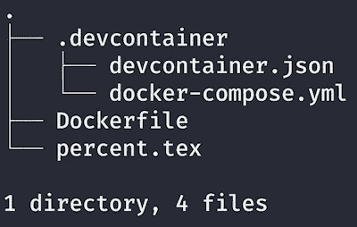

目录结构。作者图片

然后像之前一样选择“打开容器中的文件夹”。它将启动开发容器。

保存 percent.tex 文件，看到在`out`目录下创建了一个 PDF。

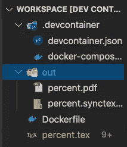

目录外。作者图片

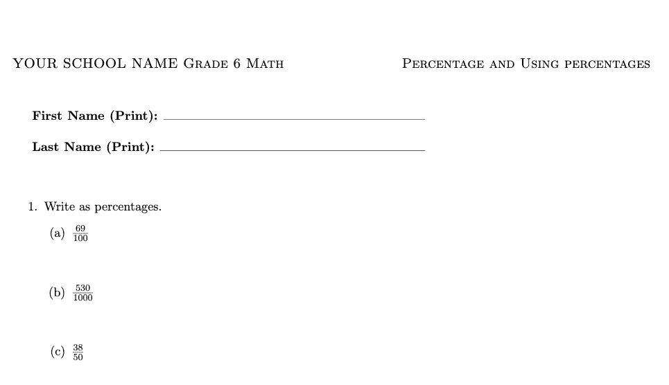

创建的 PDF。作者图片

# 如何切换远程容器

当您更改`.devcontainer`目录中的文件时，您需要重建一个容器。选择“远程-容器:重建容器”。

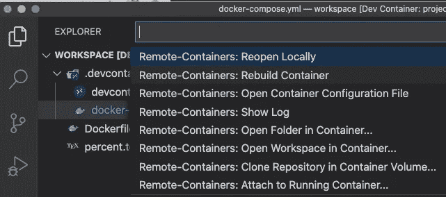

当您切换到另一个容器时，使用 Remote-Containers:重建容器。作者图片

如果上述方法不起作用，您可能需要先选择“远程容器:本地重新打开”，然后选择“远程容器:打开容器中的文件夹”。

# 打开 PDF

您可以在 VSCode 选项卡或 web 浏览器中查看 tex 文件。请注意，你需要从一个 tex 文件。如果您尝试从另一种类型的文件中打开它，它将不起作用。

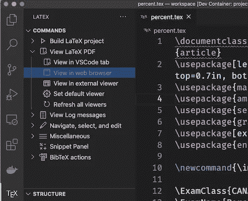

乳胶工作坊查看乳胶 PDF 菜单。作者图片

# 结论

`qmcgaw/latexdevcontainer`的大小是 382MB，比`tianon/latex`小很多。您可以通过创建 docker 文件并使用`FROM`指令指定您正在构建的父映像来定制您的映像。

即使`tianon/latex`的文件大小很大，但是使用它的好处是不需要安装包。它已经有了大部分的标准包。

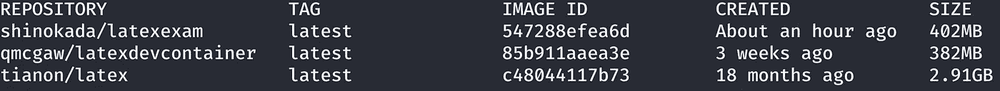

比较图像大小。作者图片

**通过** [**成为**](https://blog.codewithshin.com/membership) **会员，获得媒体上所有故事的访问权限。**


[https://blog.codewithshin.com/subscribe](https://blog.codewithshin.com/subscribe)

# 参考

*   [最新集装箱](https://github.com/qdm12/latexdevcontainer)
*   [带有 vscode 和语法的简易 Docker LaTeX 设置](https://dev.to/michidk/easy-docker-latex-setup-with-vscode-and-grammarly-4e53)
*   [在容器内显影](https://code.visualstudio.com/docs/remote/containers)