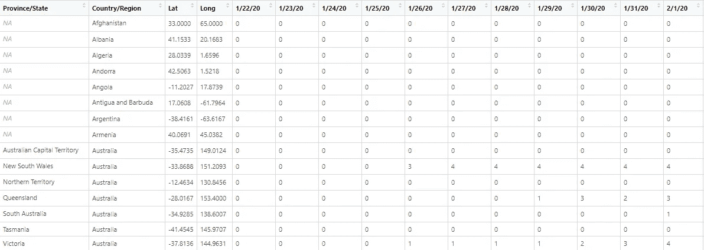
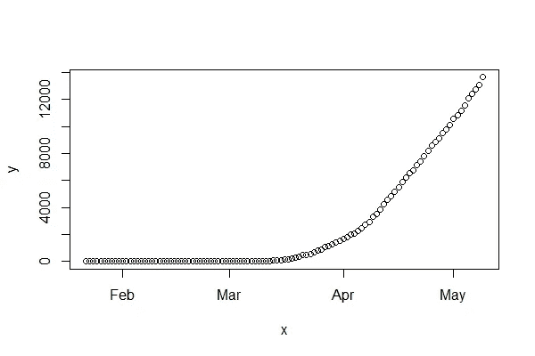
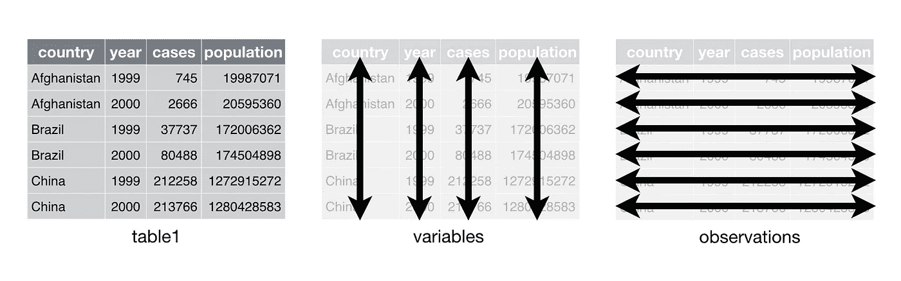
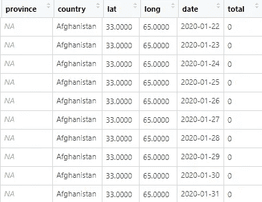
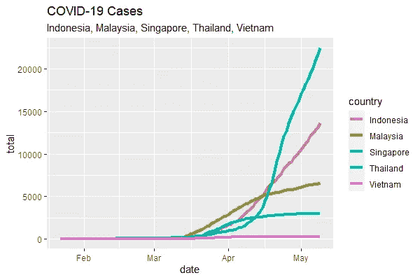

# 用 R 整理数据

> 原文：<https://towardsdatascience.com/tidy-data-with-r-f3d078853fc6?source=collection_archive---------43----------------------->


来自 [StockSnap](https://stocksnap.io) 的[山姆·沃克](https://stocksnap.io/author/28055)的照片

## 为什么你应该在它上面投资更多，为什么这使你的分析变得容易得多

## 介绍

在现实世界中，数据并不干净。清理数据是分析前的一个重要步骤，因为我们用于分析的程序不能使用任何不干净的数据，因此我们必须首先清理它。就清理而言，我指的是诸如缺失值、非正态分布、离群值、离散化等。

在我们清理完这些数据后，我们可以用它来进行分析。尽管它已经很干净了，但这并不意味着数据本身已经很整洁了。在本文中，我将向您展示一些不整齐的数据，以及为什么我们应该在进行分析或建模之前先整理数据的原因。

## 为什么？

让我们谈谈为什么。给定这些数据，这是来自约翰·霍普斯金大学的新冠肺炎数据，包括来自世界各国和地区的确诊、死亡和康复病例数。我给你看确认的数据，

```
library(readr)
confirmed <- read_csv("[https://raw.githubusercontent.com/CSSEGISandData/COVID-19/master/csse_covid_19_data/csse_covid_19_time_series/time_series_covid19_confirmed_global.csv](https://raw.githubusercontent.com/CSSEGISandData/COVID-19/master/csse_covid_19_data/csse_covid_19_time_series/time_series_covid19_confirmed_global.csv)")
head(confirmed)
```



数据

在每一行中，数据都包含从 2020 年 1 月 22 日到最近日期的位置和日期等信息。假设我们有兴趣可视化一个国家的线图，例如印度尼西亚。我们该怎么做？首先，我们确定 x 轴和 y 轴，然后我们可以制作情节，但可笑的是，它并不那么容易，为什么？我们想要的 x 轴，在这个例子中是日期，是数据集的列名。然后，要获取 y 轴，我们必须通过过滤指定数据的位置，然后获取数据上的值，最后绘制一个图。

```
x <- as.Date(colnames(confirmed)[5:length(colnames(confirmed))], format="%m/%d/%y")
y <- confirmed[confirmed$`Country/Region` == "Indonesia", 5:length(colnames(confirmed))]
plot(x, y)
```



基于代码的情节

这不容易也不吸引人，对吧？这不是一种整洁的分析方式。tidyverse 库，如 ggplot2、tidyr、dplyr 等。支持使用整齐的数据。这就是为什么我们必须先整理数据的原因。因此，我将向您介绍使用 tidyr 整理数据的概念。但是等等，什么是整齐的数据？

## 什么？

整齐的数据是一组规则，用于格式化数据集，以便更好地进行分析。规则是:
1。每个变量都放在它们的列上，
2。每个观察值被放置在它们的行上，
3。每个值都放在它们的单元格中



图来自数据科学的 [R，作者*加勒特·格罗勒蒙德和哈德利·威克姆*](https://r4ds.had.co.nz/tidy-data.html)

## 怎么会？

回到我们的数据，数据本身不符合上面的要求。在该示例中，日期变量作为一行放置。然后，每一列由该日期每个国家的值组成。这样，我们必须将日期作为列，然后与之对应的值也成为列。这被称为旋转，我们将数据集从长变高。为此，我们将使用 tidyr 包中的 R 函数 pivot_longer。

```
library(tidyr)**# Pivot the data set**
confirmed_tidy <- confirmed %>%
  pivot_longer(5:(length(colnames(confirmed))), names_to = "date", values_to = "total")**# Specify the names of the column**
colnames(confirmed_tidy) <- c("province", "country", "lat", "long", "date", "total")**# Convert to date format**
confirmed_tidy$date <- as.Date(confirmed_tidy$date, format="%m/%d/%y")confirmed_tidy
```



整洁的数据

Pivot_longer 函数通过指定列的索引返回一个更高的数据集。整理完数据集后，现在我们可以更容易地进行分析了。我给你举个例子，我想画出这些国家的线图，印度尼西亚，马来西亚，泰国，新加坡和越南。有了这个整洁的数据集，我们可以轻松做到这一点。首先，我们使用 dplyr 库根据东盟国家对其进行过滤，然后我们根据它绘制一个线图，并使用 ggplot2 库根据变量指定每个轴和颜色。代码本身看起来像这样，

```
library(dplyr)
library(ggplot2)asean <- c("Indonesia", "Singapore", "Vietnam", "Malaysia", "Thailand")**# Filter the data based on the list**
confirmed_tidy %>%
  filter(country %in% asean) %>%
  **# Create the plot**
  ggplot(aes(x=date, y=total, color=country)) +
  geom_line(size=1.5) +
  ggtitle("COVID-19 Cases", subtitle = "Indonesia, Malaysia, Singapore, Thailand, Vietnam")
```



这个图是根据整理好的数据绘制的

简单明了，不是吗？有了这个例子，我们就没有理由不投入一点时间来使我们的数据更加整洁。有了更整齐的数据，我们就可以很容易地进行分析和建模。

## 参考资料:

[1] Hadley Wickham 和 Garrett Grolemund， [R for Data Science: Import，Tidy，Transform，Visualize，and Model Data (2017)](https://r4ds.had.co.nz/) ，O'Reilly Media，Inc .