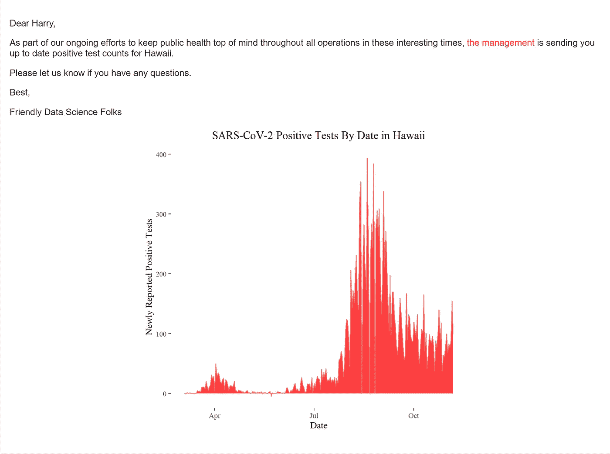

# 使用 R Markdown 整理邮件合并

> 原文：<https://towardsdatascience.com/tidy-mail-merge-using-r-markdown-7c5a2ee1995e?source=collection_archive---------34----------------------->

卡罗尔·郑在 [Unsplash](https://unsplash.com/s/photos/mail?utm_source=unsplash&utm_medium=referral&utm_content=creditCopyText) 上的照片

## [实践教程](https://towardsdatascience.com/tagged/hands-on-tutorials)

## 因为自动化枯燥的东西不只是 Python 才有的！

在现代社会，企业的生死取决于电子邮件。电子邮件(你还记得我们以前用连字符[连接](http://www.future-perfect.co.uk/grammar-tip/is-it-e-mail-email-e-mail-or-email/)吗？)是大多数行业的主要通信工具，也可能是所有行业的关键外部通信工具。

从数据科学的角度来看，电子邮件很无聊，太平常了，不值得关注。但是关于电子邮件，有一件事我们可以说，但对于 streamlit 仪表板我们不能说，那就是如果我们用电子邮件向利益相关者发送消息，他们几乎肯定至少会看一眼。像仪表板这样的被动资源需要分析消费者选择并获得他们想要的结果。但是电子邮件可以主动推送给决策者。这是一个很小的差别，但不应该被低估。

有了电子邮件报告手机嗡嗡声和你的分析会得到关注！

当然，这并不意味着我们作为数据科学家想要花很多时间起草电子邮件。我们更愿意阅读媒体上的文章？).因此，我们希望通过电子邮件为任意长的收件人列表自动定制分析报告。

有趣的是，文字处理器在几年前用邮件合并打印解决了这个问题。细节因供应商而异，但实际上您可以用姓名、地址和其他特定于邮件的细节填充一个表，然后为表中的每条记录打印(或保存到文件中)一条单独的消息。虽然 wordperfect 在 1990 年能做的事情很明显，R 在 2020 年也能复制，但令人惊讶的是，使用 tidyverse、R markdown 和 R package blastula 通过电子邮件向任意长的人发送定制分析列表是多么容易。

这些家伙在 1990 年有一首热门歌曲！

举一个具体的例子，假设我们的任务是每天向三个人发送 covid19 新的阳性检测结果。我们将从[https://covidtracking.com/](https://covidtracking.com/)获取数据，并创建一封友好的电子邮件，在底部附上每个州的图表，这样我们的数据消费者就不必费力查看他们所在州的当前情况。这将避免每个同事需要打开单独的文件或访问特定的门户网站。我们可以快速轻松地设计出一个流程来创建类似这样的电子邮件:

您收件箱中的 ggplot 图形！

虽然这种形式不会赢得任何美学奖项，但它非常干净，非常低调。而且，由于我们将把 R markdown 渲染成一个 html 文件，如果我们愿意进入 html，它是 100%可定制的(也许使用这里的[指针](https://www.r-bloggers.com/2020/06/rmarkdown-css-selector-tips/))。

我们需要创建的第一个文件是邮件模板。在这种情况下，这将是一个使用输出类型 blastula_email 的 R markdown 文档，我们成功的一个关键因素是在文件顶部的 YAML 头块中创建参数，以便我们可以用每个收件人不同的细节来填充这些值。

文件的其余部分非常简单，包括一个用于提取数据的块、一个用于观众的文本块和一个 ggplot 调用。

这里的另一个关键组件是一个 R 脚本，它将接受一个收件人列表及其相关细节(在本例中是他们所处的状态、他们的姓名以及与每个人一起使用的签名)，然后将 markdown 文件转换成适合他们每个人的消息，并发送出去。tidyverse lmap()函数(来自 purrr 包)允许我们将每个人的详细信息存储在 tibble 的一行中，然后应用 blastula 函数来编织和通过电子邮件发送消息，而无需任何显式循环。

现在，我们仍然不得不承认发送这些邮件并不是完全自动的，因为每天我们都必须运行我们的 R 脚本。但是 1)这意味着运行一个脚本，而不是潜在地写几十封电子邮件，2)我们可以使用一个任务调度器来使它成为一个“无按钮”的过程(奇妙的 [taskscheduleR](https://cran.r-project.org/web/packages/taskscheduleR/vignettes/taskscheduleR.html) 包将在 Windows 机器上帮助实现这一点)。

我鼓励每个人都使用调度作业来实现全自动解决方案，但是即使没有这一步，我们也可以用一百行代码每周节省几个小时。

> 有人曾经问爸爸:“但是你想节省时间做什么呢？”你打算用它做什么？"“工作，如果你最喜欢的话，”爸爸说。"为了教育，为了美丽，为了艺术，为了快乐。"他从夹鼻眼镜的上方看过去。"对曼波蒂-佩格来说，如果那是你的心所在。”
> ― **欧内斯廷** [**按打便宜**](https://www.goodreads.com/work/quotes/1925199)

在我看来这是一个胜利！