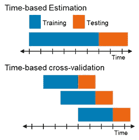

# 基于时间的交叉验证

> 原文：<https://towardsdatascience.com/time-based-cross-validation-d259b13d42b8?source=collection_archive---------3----------------------->

柯蒂斯·麦克牛顿在 [Unsplash](https://unsplash.com/s/photos/time-based-validation?utm_source=unsplash&utm_medium=referral&utm_content=creditCopyText) 上的照片

## **当我们的数据不是时间序列，但仍然有一个非常重要的时间维度时，会发生什么？这是一个用于基于时间的交叉验证的** Python 解决方案，具有所有必需的输入和一个匹配 scikit-learn 方法的输出。

训练和评估机器学习模型通常需要一个训练集和一个测试集。在大多数情况下，训练和测试拆分是随机进行的，取 20%的数据作为测试数据，模型看不到，其余的用于训练。

在处理与时间相关且动态变化的环境时，环境的特征会随着时间的推移而变化，因此最好使用基于时间的分割来提供统计上稳健的模型评估，并最好地模拟真实场景。为此，我们应该使用基于时间的交叉验证，这是一种来自时间序列领域的方法，它形成了一种“滑动窗口”训练方法。

基于时间的交叉验证方法

这种方法在时间序列领域是众所周知的，其中我们有一个信号，它是在连续的等间隔时间点上获得的序列。

但是，当我们的数据不是时间序列，但仍然有一个非常重要的时间维度时，会发生什么呢？

# **需要基于时间的交叉验证的问题示例**

我们想预测订单的交货时间。每条记录都是一个订单，由一组特征来表示，以创建数据表。我们知道**每个订单发生的时间**，并且**几个**订单可以在同一天下达。关于这个问题的详细解释可以在我之前的[博客](/delivery-date-estimation-5aff1a0ff8dc)中找到。在这种情况下，我们的目的是根据上个月的订单训练一个新模型，然后应用它来预测下周订单的交货时间。
为了最好地模拟真实世界，我们应该使用一个月的数据来训练我们的模型，然后用下一周的新数据来测试它们。为了创建稳健和通用的模型，我们应该使用几个时间分割点，并应用基于时间的交叉验证。我们的最终测试结果将是所有测试窗口的加权平均值。

*我们需要注意 3 个重要方面:*

1.**基于时间的训练\测试分割** -在每次分割中，测试指标必须高于之前。

2.我们希望选择我们的**训练\测试集大小**，以便模拟真实世界的场景，在这些场景中，我们将在一段时间内训练一个模型，然后在接下来的时间内应用它。例如，根据上个月的数据训练模型，并应用它来预测未来一周的数据。

3.**枣事**。就我们的意图而言，每个集合中记录的数量并不重要。重要的是以天为单位的窗口大小。我们希望分割数据，以便每个窗口都包含 X 天的数据。

# 其他部分解决方案

Scikit-learn 有[时间序列分割](https://scikit-learn.org/stable/modules/generated/sklearn.model_selection.TimeSeriesSplit.html)方法，但是它有几个缺点。假设我们的数据是按时间排序的，这种方法以一种“滑动窗口”的方式将它分成训练集\测试集，但是它不允许我们选择集的大小，我们只能选择我们想要多少个分裂。Scikit-learn TimeSeriesSplit 还假设每个日期有一个观察值，因此没有解决上面的 2 和 3。

另一个解决方案是 Germayne 建议的，并在他的博客[中提出。他很好地解释了整个方法以及与 Scikit-learn 方法的区别。这个解决方案的输入之一是训练集大小(称为初始)和测试集大小(称为范围)，但是它创建包含固定数量的**记录**的集。出于我们的目的，我们应该创建包含固定天数**的集合**。这个解决方案没有解决第 3 点。](https://medium.com/eatpredlove/time-series-cross-validation-a-walk-forward-approach-in-python-8534dd1db51a)

# 建议的解决方案

因此，我为基于时间的训练和测试分割编写了自己的解决方案，它不仅允许我们选择相关的集合大小，还解决了根据天数(而不是根据记录)考虑窗口大小的重要方面。

*返回的 CV splits 像任何其他 scikit-learn 交叉验证器一样工作，并且可以与它们的任何方法一起使用。*

请注意，您的数据框必须有一列包含每条记录的日期，因为此解决方案利用了数据的日期。

## 参数:

*   train_period: int，default=30
    包含在每个训练集中的时间单位数。
*   test_period: int，default=7
    每个测试集中包含的时间单位数。
*   freq: string，default='days'
    输入参数的频率。可能的值有:天、月、年、周、小时、分钟、秒。

## 方法:

**get _ n _ splits**(self)
返回交叉验证器中的拆分迭代次数

**split** (self，data，validation_split_date=None，date_column='record_date '，gap=0)
返回类似于 sklearn 交叉验证器的元组列表(train_index，test_index)。

*   数据:pandas DataFrame
    您的数据包含一个指示记录日期的列
*   validation _ split _ date:datetime . date
    执行拆分的第一个日期。这是第一个测试集开始的日期。
*   date_column:字符串
    每条记录的日期
*   gap: int
    如果测试集没有紧跟在训练集之后，则训练集和测试集之间有*gap*天的间隔

# 示例-如何使用

# 关闭

建议的解决方案对我过去遇到的各种问题非常有效。请让我知道它是如何为你工作的，如果你认为可以做更多的调整来改进这个类。

特别感谢 Noga Gershon 与我分享了她应对相关挑战的经验。
感谢 Noga 和 Idan Richman-Goshen 提供的出色的技术反馈以及对本文的校对和评论。