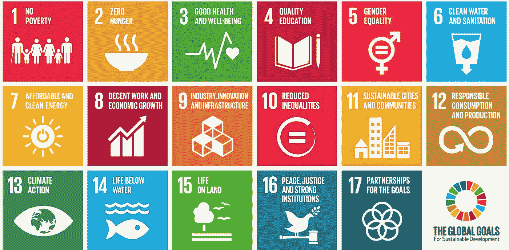
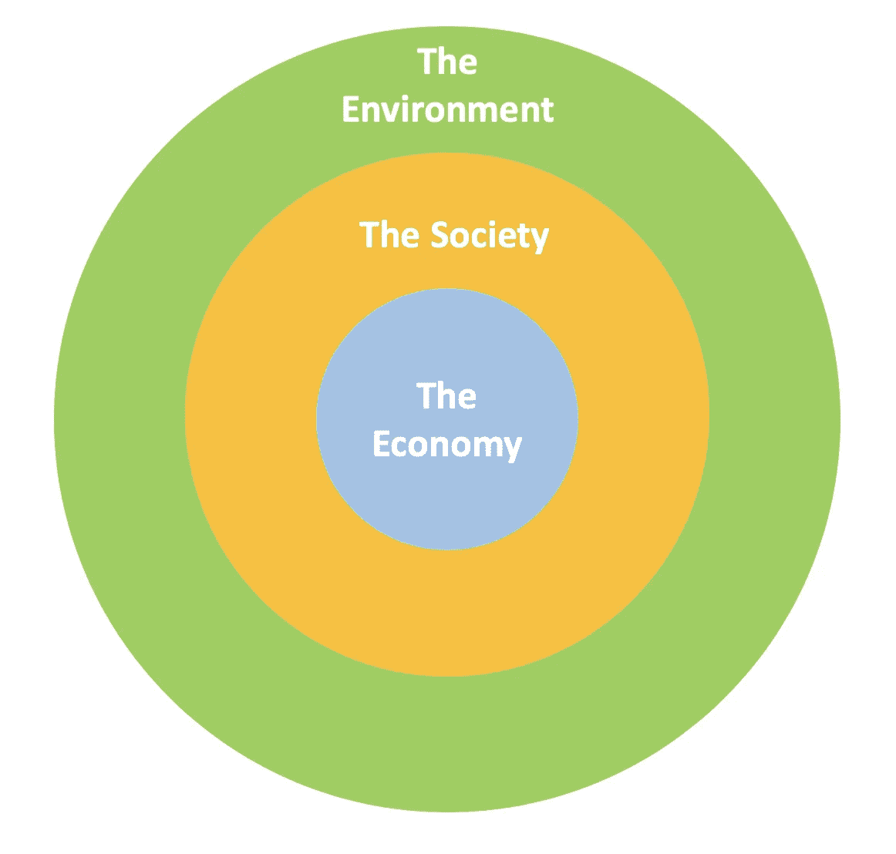
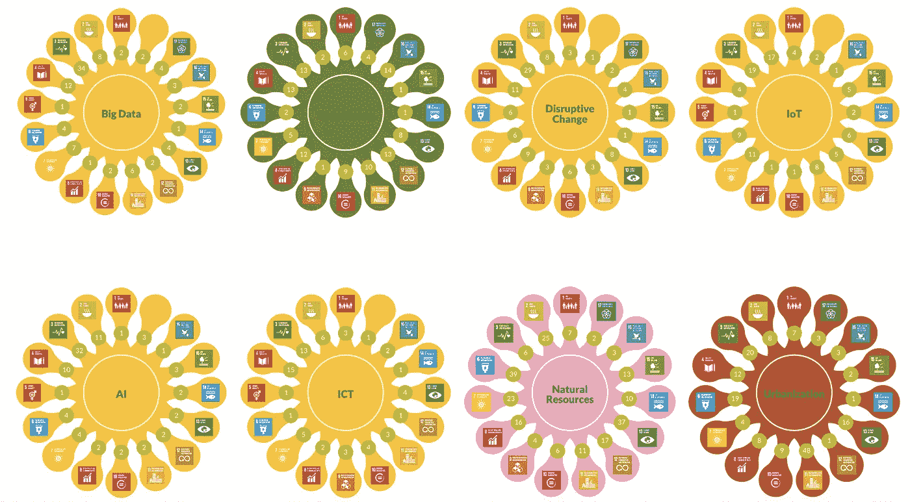
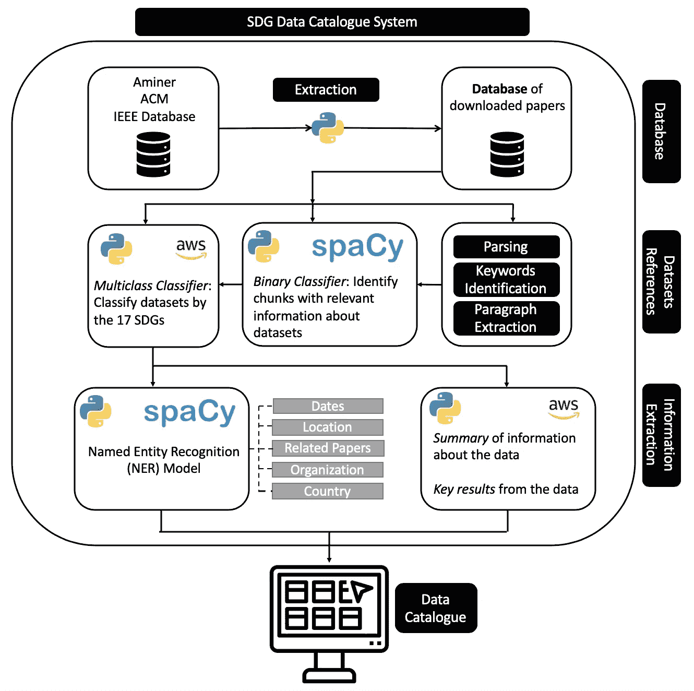
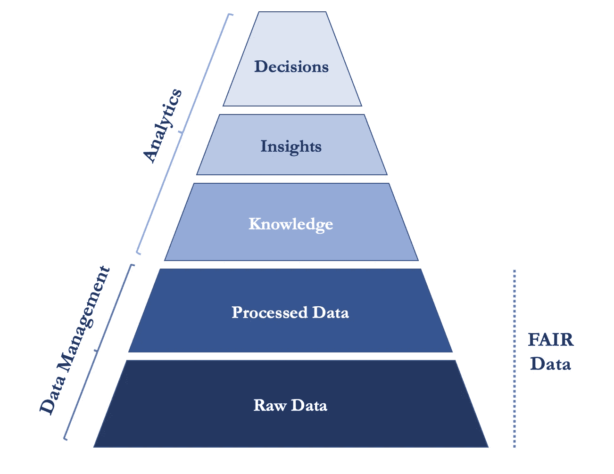
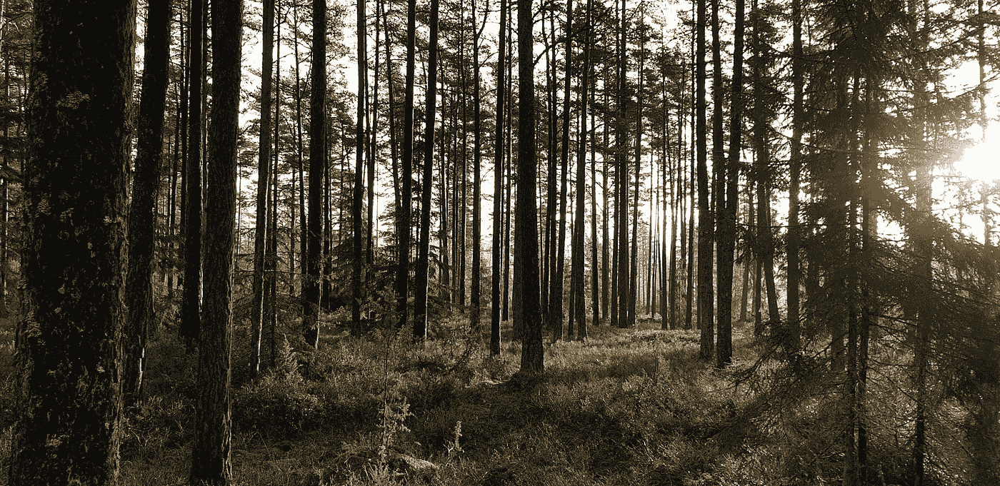

# 可持续发展的时候到了

> 原文：<https://towardsdatascience.com/time-for-sustainable-development-26ba969f5b46?source=collection_archive---------35----------------------->

## 为什么数据和人工智能在这个旅程中至关重要

全球目标为更大的可持续性提供了一个框架——图片由 Pine Watt 提供，Unsplash

由黑人的命也是命运动领导的 2019 年和 2020 年的冠状病毒疫情和 2020 年的民权危机凸显了我们当今社会的一些主要局限性。

虽然我们的经济正以越来越快的速度增长，但许多发展领域仍未得到充分考虑。发展的不同方面之间相互联系的全球视野将有助于实现生活条件的可持续改善。

> “[可持续发展是:]满足当代人需求的发展，同时保护地球的生命支持系统，这是今世后代的福祉所依赖的。”[1]

# 17 项可持续发展目标

SDG 涵盖了 17 个相互关联的目标，这些目标定义了跨越发展的**社会**、**经济**和**环境**维度的全球可量化目标。[1]它们旨在成为一套通用的指标和参考框架，供国际社会在 2030 年之前用来推动政策和实施。

这些目标是联合国在 2015 年制定的，作为千年发展目标的后续行动，为减少极端贫困的全球伙伴关系提供了一个框架。

这一新框架支持向更可持续发展的长期过渡。它促进了问责制，同时也促进了全球合作。它是一个**工具，用于指导决策**，但其本身并不是一个说明性和可操作的指南。因此，成员国和机构可以根据自己的背景、资源和可用的科学证据自由地推行政策和计划。

联合国确定的 17 个全球目标[2]，使用 17 个 SDG 图标图像[7]

# 相互联系和问责制

全球目标强调了 17 个目标是如何相互关联的。贫困的增加有可能导致卫生条件的下降和健康挑战的增加。与此同时，由于贫困，接受教育更加困难，暴力行为可能更容易出现。同样，气候变化危及野生动物(陆地和水下)，并将增加人与人之间已经存在的不平等。这解释了为什么*格里戈斯 D、斯塔德-史密斯 M、加尼 O 等人* [1]建议应特别重视**地球生命支持系统**和**减贫**。

> “因为如果生态系统崩溃，经济本身也会死亡”莱昂纳多·迪卡普里奥，联合国和平使者

可持续发展领域可以被认为是一个各部分相互联系的大有机体。经济存在于社会之中，而社会又存在于地球的全球生态系统之中。这一框架强调，经济离不开社会，而社会离不开周围的环境。

地球的经济、社会和全球生态系统之间的相互联系

# 从愿景到实际行动和持久变化

全球目标已被定义为激励领导者。然而，17 个总体目标和 169 个具体目标本身并不足以**引发持久而有影响力的决策**。为了走向更可持续的国家和企业，我们需要意识到什么样的变化会产生持久的影响。这需要**全球伙伴关系**(目标 17)以及**集中化**和轻松**获取**信息。

研究人员、科学家、企业家和创新者群体每天都在创造大量的知识、想法和新产品，这在一定程度上有助于实现可持续发展目标。然而，还需要做大量的工作来收集知识和信息，并使其为利益相关者和决策者所用。

例如，如果决策者想知道:*我可以做些什么来改善教育，同时减少人口中的不平等？*一组清晰的科学和商业证据应随时可用，以支持解决方案的头脑风暴。

因此，一些额外的信息将有助于利益相关者采取可持续的变革:

*   对与目标相关的**历史数据**的良好集中访问
*   **情景**和**指导**对不同政策或业务变化的影响，以及对不同目标的积极和消极影响的证据
*   **集中**和**汇总与目标相关的** **研究**和**专利**

特别强调不同情景的相互联系和相互影响。

# 利用数据和人工智能实现可持续发展目标

人工智能将在改善知识获取方面发挥重要作用。特别是，**文本挖掘**和**自然语言处理**将有助于理解研究团体、行业和政府每天发布的不断增长的信息量。

# 趋势扫描仪

由联合国开发计划署(开发署)、瑞典 RISE 研究所和 AI for Good 基金会牵头的一项倡议是 Trendscanner。这个**可视化浏览器**将物联网、城市化、大数据等主要**当前趋势**映射到 SDGs，并汇集相关**报告**和**文件**。

与可持续发展目标联系最多的趋势类别，来源:[https://sdg.trendscanner.online/](https://sdg.trendscanner.online/)

# SDG 数据目录

考虑到这一点，我们与 James H .和 AI for Good Foundation 一起，正在建立**可持续发展数据目录**，这是一个开放的、可扩展的全球数据库，包含数据集、元数据和研究网络，通过挖掘数百万已出版的开放存取学术著作自动构建。SDG 数据目录关注数据发现和数据共享问题，以**加快可持续发展目标的进展**。

下面的系统设计中总结了生成此目录的过程。从收集研究论文信息的开放存取数据库中，创建了一个已发表论文的大型数据集(在我们的第一个版本中有 500 万篇论文)。然后对这些论文进行解析，提取出**数据集提及的**和与之相关的元数据。

SDG 数据目录的系统设计

提取阶段使用一个灵活的 web-scraper，它是可伸缩的、轻量级的，并且具有版权意识。该过程在 PDF 检索中有 65%的成功率。

信息提取管道的主要组件是**命名实体识别模型**，它识别数据集名称、数据集描述、所有者、样本数量以及其他引用和文档元数据。

分类器和 NER 模型都利用了一种主动学习策略。他们从一些手动注释开始，逐渐利用这些注释来训练模型，建议不确定性最高的注释示例，注释更多的实例，并提高任务的整体准确性。多亏了 Prodigy 软件，这才成为可能。

下一步，我们希望在 SDG 数据目录之上构建查询和可视化层。最终，我们希望为**创造一个易于导航的类似维基百科的体验，来记录有用的数据**。

# 数据的公平化

虽然创建的科学数据数量巨大，但许多研究出版物并不包含所用数据集以及如何访问它们的详细描述。这有多种解释。首先，一些数据集具有很大的科学价值，但不会因此而得到认可，因此科学家可能更愿意将它们保密，以开发它们的分析潜力。[5]此外，**许多数据集被私人持有**，并被商业实体作为竞争优势保留。

公平数据项目在地球、空间和环境科学领域的承诺声明[6]就是为了解决这个问题而创建的。公平数据代表**可发现**、**可访问**、**可互操作**，以及**可重用**。这一承诺使得在这些领域的大多数期刊上发表时，如果不包括以支持公平原则的方式使用的数据集，就更加困难。

让数据公平将在几个方面改善研究和科学。这是向开源和最新发现的可用性迈进的一步，将使大多数科学出版物更具可复制性和可比性。

我们构建 SDG 数据目录的工作有助于使 SDG 数据**公平**。

从原始公平数据到决策

# 结论

如果不是可操作的可持续发展指南，至少全球目标是一种通用语言，世界各地的公司、非政府组织和政府都可以用来制定政策和决策。作为科学家、研究人员、创新者和企业家，我们的职责是在目标和导致必要变化的决策之间架起桥梁。

没有合适的智能系统，就不可能跟上新发现的步伐

# 参考

[1] *格里戈斯、大卫等*“政策:为了人类和地球的可持续发展目标。”*性质* 495.7441 (2013): 305。

[2]联合国网站，可持续发展部分。[https://www . un . org/sustainable development/sustainable-development-goals/](https://www.un.org/sustainabledevelopment/sustainable-development-goals/)

科恩、大卫、莱斯·阿特拉斯和理查德·拉德纳。“主动学习提高概括能力。”*机器学习*15.2(1994):201–221。

[4]神童软件:[https://prodi.gy/](https://prodi.gy/)

[5] *施托尔，s .，雅梅，l .，卡特彻-格申费尔德，j .，汉森，b .，勒恩哈特，k .，诺塞克，b .，等人(2019)* 。让科学数据变得公平。*性质* 570，27–29。

[6]地球、空间和环境科学领域的承诺声明。[https://copdess . org/enabling-fair-data-project/commitment-statement-in-the-earth-space-and-environmental-sciences/](https://copdess.org/enabling-fair-data-project/commitment-statement-in-the-earth-space-and-environmental-sciences/)

[7]使用 17 个 SDG 图标图片:[https://www . un . org/sustainable development/WP-content/uploads/2019/01/SDG _ Guidelines _ AUG _ 2019 _ final . pdf](https://www.un.org/sustainabledevelopment/wp-content/uploads/2019/01/SDG_Guidelines_AUG_2019_Final.pdf)