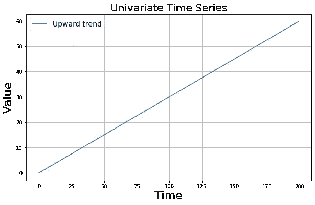
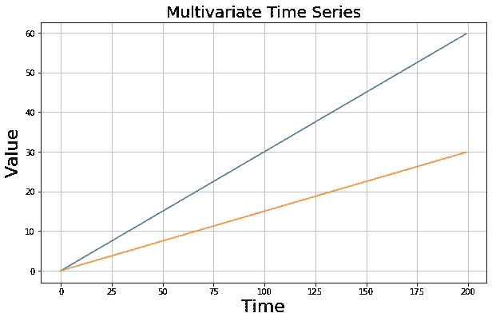
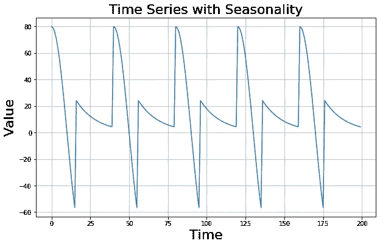
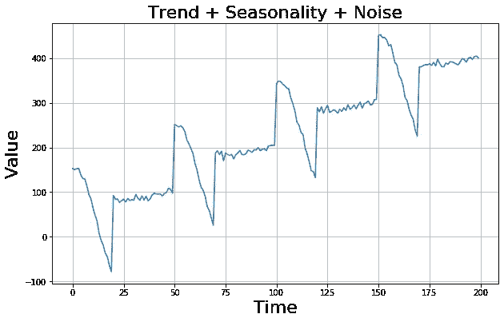
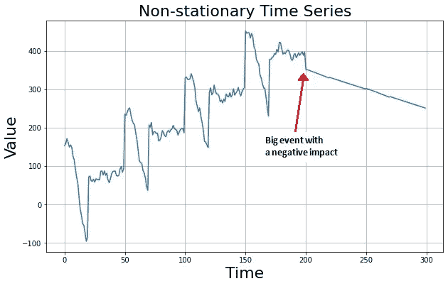
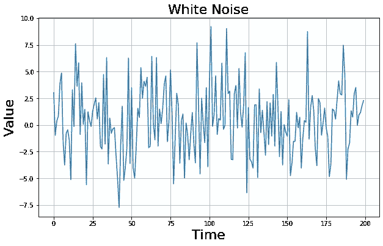
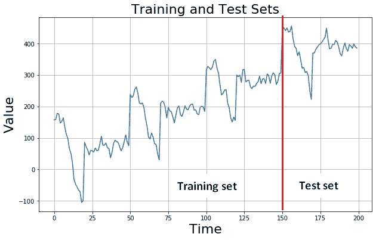
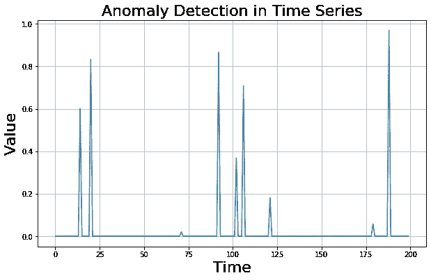

# 时间序列分析:基本概念

> 原文：<https://towardsdatascience.com/time-series-analysis-basic-concepts-1d9a090d7d8c?source=collection_archive---------28----------------------->

## 顺序很重要。

在 [Unsplash](https://unsplash.com/s/photos/time?utm_source=unsplash&utm_medium=referral&utm_content=creditCopyText) 上 [NeONBRAND](https://unsplash.com/@neonbrand?utm_source=unsplash&utm_medium=referral&utm_content=creditCopyText) 拍摄的照片

时间序列是按时间顺序排列的一系列值。我们可能会在几乎任何领域遇到时间序列数据。天气预报、汇率、销售数据、声波只是几个例子。时间序列可以是表示为有序序列的任何类型的数据。

例如，下图是一个遵循上升趋势的简单时间序列:

这是一个**单变量**时间序列，这意味着在每个时间步长都有一个值。我们还有**多元**时间序列，它在每个时间步都有多个值:

# **时间序列中的模式**

到目前为止，我们看到的图中的时间序列遵循一个**趋势**，这意味着总体方向向上或向下。这只是我们在时间序列中可以观察到的模式之一。

另一个常见的模式是**季节性**，它表示重复观察到的或可预测的间隔的模式。例如，零售商店的销售数据通常显示季节性。销售额会在特定时间或特殊日期增加或减少。让我们看一个例子:

我们通常会遇到组合了多种模式的时间序列，例如趋势和季节性。很可能还会有一些噪音:

到目前为止，我们已经看到了遵循某种模式的平稳时间序列数据。然而，生活充满了惊喜，因此很可能一些事件打破了这种模式，产生了**非平稳**时间序列。比如冠状病毒就是这么大的事件，搞乱了很多格局。

时间序列并不总是遵循某种模式或包含季节性。有些过程只产生随机数据。这种时间序列被称为**白噪声**，这使得几乎不可能做出准确的预测。

# **时间序列分析的应用**

时间序列分析的一个常见应用是**预测**，这意味着根据过去的值预测未来的模式。对企业来说，有准确的预测是非常重要的。例如，如果需求预测准确，零售企业可以优化库存。它还提高了客户满意度，因为客户的需求将毫无例外地得到满足。能够未雨绸缪是一笔宝贵的财富。

在预测分析中，我们用已知数据(训练数据)训练模型，并期望模型预测新的、以前未见过的数据(测试数据)。这个训练和测试的过程被称为**监督学习**，因为我们用已知的(标记的数据)来监督模型。当处理正常数据时，我们可以将其随机分为训练和测试子集。但是，在处理时间序列时，我们不能随意分割。我们将一个时间点定义为分割点，将整个数据集分成训练和测试子集。由于时间序列数据是连续的，测试集遵循训练集。

**注意**:如果时间序列有季节性，重要的是训练集和测试集都包含整数个季节。例如，在上图中，训练集包含 3 个季节，测试集包含 1 个季节。如果我们在一个季节内的某一点进行分割，模型可能无法很好地捕捉趋势或季节性。

我们有时需要预测过去。考虑一个从时间 t 到(t+400)的时间序列。通过分析这些数据，我们可以尝试预测从时间(t-40)到(t-1)的序列。这是一种预测是什么产生了我们所拥有的数据。有时在某些时间点会有缺失的数据，我们可能也需要预测那些缺失的点。这个预测过去数据或缺失点的过程被称为**插补**。

另一个应用是异常检测，这意味着检测时间序列数据中的异常活动。考虑一个网站流量的时间序列数据。正常趋势中的峰值可能表示恶意攻击。另一个例子是零售店销售的意外高峰，这可能是由于冠状病毒等事件。异常检测是一种**无监督学习**，其中模型试图找到数据中的结构并检测异常值。

下图显示了时间序列数据中异常的峰值。请记住，异常可能并不总是那么容易被发现。

语音识别任务也是用时间序列数据完成的。对声波进行分析，以捕捉某些单词，从而构建完整的语音。

时间序列分析是数据科学领域的一个广阔领域。对时间序列分析的全面理解需要机器学习、统计学方面的知识，当然还有领域专业知识。为了理解时间序列的特征及其应用，我们刚刚介绍了一些基本概念。我计划继续撰写关于时间序列分析的文章，从简单的概念到高级的分析技术。敬请关注以下帖子。

感谢您的阅读。如果您有任何反馈，请告诉我。