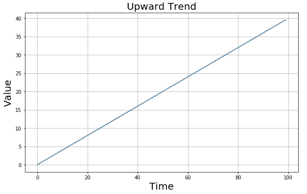
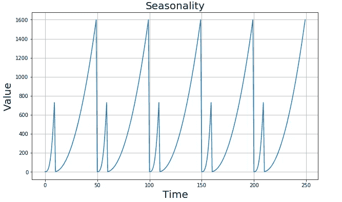
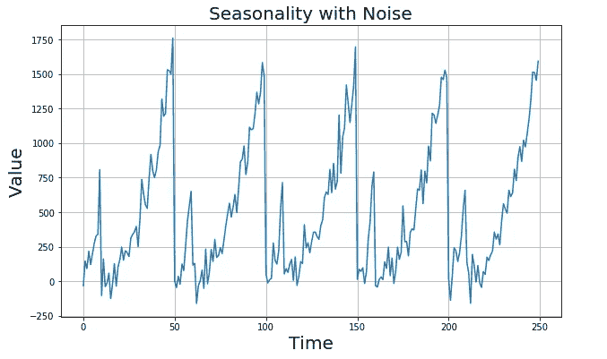
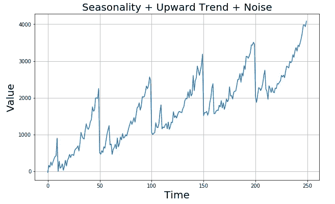
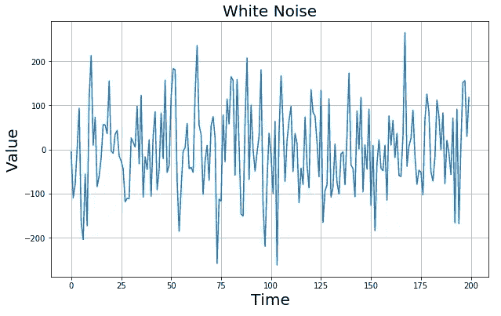
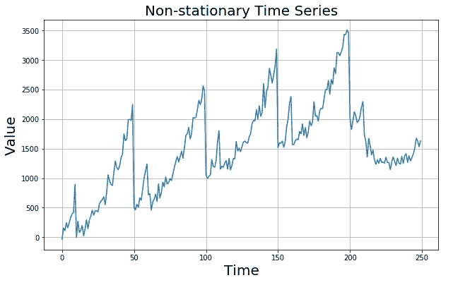

# 时间序列分析:创建合成数据集

> 原文：<https://towardsdatascience.com/time-series-analysis-creating-synthetic-datasets-cf008208e014?source=collection_archive---------13----------------------->

## 如何创建具有不同模式的时间序列数据集


在 [Unsplash](https://unsplash.com/s/photos/time?utm_source=unsplash&utm_medium=referral&utm_content=creditCopyText) 上 [NeONBRAND](https://unsplash.com/@neonbrand?utm_source=unsplash&utm_medium=referral&utm_content=creditCopyText) 拍摄的照片

时间序列是按时间顺序排列的一系列值。我们可能会在几乎任何领域遇到时间序列数据。天气预报、汇率、销售数据、声波只是几个例子。时间序列可以是表示为有序序列的任何类型的数据。

[在之前的一篇文章](/time-series-analysis-basic-concepts-1d9a090d7d8c)中，我介绍了时间序列分析的基本概念。在本帖中，我们将创建不同模式的时间序列数据。合成数据集的一个优势是，我们可以测量模型的性能，并了解它在真实生活数据中的表现。

在时间序列中观察到的常见模式有:

*   **趋势:**整体上升或下降的方向。
*   **季节性:**重复观察到的或可预测的间隔的模式。
*   **白噪声:**时间序列并不总是遵循某种模式或包含季节性。有些过程只产生随机数据。这种时间序列称为白噪声。

**注意**:图案并不总是平滑的，通常包含某种**噪声**。此外，时间序列可以包括不同模式的组合。

我们将使用 numpy 生成值数组，使用 matplotlib 绘制系列。让我们从导入所需的库开始:

```
import numpy as np
import matplotlib.pyplot as plt%matplotlib inline
```

我们可以定义一个函数，将数组作为输入并创建绘图:

```
def plot_time_series(time, values, label):
    plt.figure(figsize=(10,6))
    plt.plot(time, values)
    plt.xlabel("Time", fontsize=20)
    plt.ylabel("Value", fontsize=20)
    plt.title(label, fontsize=20)
    plt.grid(True)
```

# **时间序列趋势**

第一个图是最简单的一个，是一个有上升趋势的时间序列。我们用一个斜率为时间和值创建数组。然后将这些数组作为参数传递给我们的函数:

```
time = np.arange(100)
values = time*0.4plot_time_series(time, values, "Upward Trend")
```



# **时间序列中的季节性**

我们现在可以绘制一个带有季节性的时间序列。我们需要一个重复相同模式的系列。

```
# Just a random pattern
time = np.arange(50)
values = np.where(time < 10, time**3, (time-9)**2)# Repeat the pattern 5 times
seasonal = []
for i in range(5):
    for j in range(50):
        seasonal.append(values[j])# Plot
time_seasonal = np.arange(250)
plot_time_series(time_seasonal, seasonal, label="Seasonality")
```



这只是一个随机的模式。请随意使用 numpy 尝试不同的模式。

# **噪音**

让我们给这些值添加一些噪声，因为在现实生活中，我们更可能处理有噪声的数据，而不是平滑的曲线。

我们可以使用 **np.random.randn** 函数创建随机噪声。然后将该噪声添加到原始的季节性序列中:

```
noise = np.random.randn(250)*100
seasonal += noisetime_seasonal = np.arange(250)plot_time_series(time_seasonal, seasonal, label="Seasonality with Noise")
```



# **多种模式**

我们可能会在时间序列中看到不同模式的组合。例如，以下时间序列包含上升趋势和季节性。当然，也有一些噪音。

```
seasonal_upward = seasonal + np.arange(250)*10time_seasonal = np.arange(250)
plot_time_series(time_seasonal, seasonal_upward, label="Seasonality + Upward Trend + Noise")
```



# **白噪声**

有些过程只是产生不遵循任何模式的随机数据。这种时间序列被称为**白噪声**，很难分析和预测。让我们创建一个白噪声的例子:

```
time = np.arange(200)
values = np.random.randn(200)*100plot_time_series(time, values, label="White Noise")
```



# **非平稳时间序列**

到目前为止，我们已经看到了连续遵循某种模式的时间序列。这种时间序列称为**平稳**。然而，生活充满了惊喜，所以我们可能会遇到一些打破模式的事件，并创建**非平稳**时间序列。例如，冠状病毒是一个非常大的事件，它打乱了许多模式，企业需要更新他们的时间序列分析。让我们创建一个示例:

```
big_event = np.zeros(250)
big_event[-50:] = np.arange(50)*-50non_stationary = seasonal_upward + big_eventtime_seasonal = np.arange(250)
plot_time_series(time_seasonal, non_stationary, label="Non-stationary Time Series")
```



我们在时间点 210 之后引入了一个大事件，效果可以在之后看到。

时间序列分析是数据科学领域的一个广阔领域。对时间序列分析的全面理解需要机器学习、统计学方面的知识，当然还有领域专业知识。在这篇文章中，我们介绍了如何创建合成数据集。我们可以使用这些数据集来检查我们建立的模型的性能。在早先的一篇文章中，我解释了时间序列分析中的基本概念，以理解时间序列的特征及其应用。我计划继续撰写关于时间序列分析的文章，从简单的概念到高级的分析技术。敬请关注以下帖子。

感谢您的阅读。如果您有任何反馈，请告诉我。