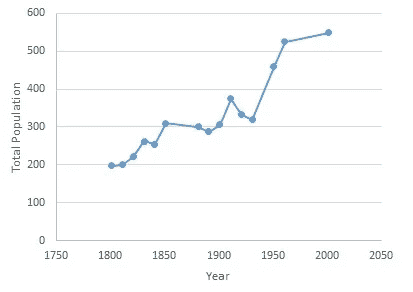
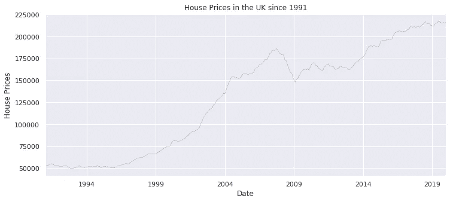
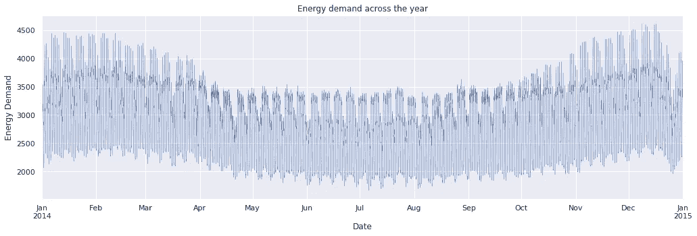

# 面向初学者的时间序列分析

> 原文：<https://towardsdatascience.com/time-series-analysis-for-beginners-8a200552e332?source=collection_archive---------13----------------------->

[人口时间序列](https://commons.wikimedia.org/wiki/File:Gisleham_Population_Time_Series_1801-2011.jpg)

如果你正在冒险进入数据分析和机器学习的世界，你可能已经发布了时间序列分析是多么重要。不管怎样，我会尽量提供一个温和的介绍。

完成本文后，您应该能够:

1.  定义什么是时间序列
2.  从非时间序列数据中识别时间序列数据
3.  识别和描述时间序列的组成部分。
4.  提及一些用于时间序列预测的模型

**定义**

> 时间序列是按时间顺序记录的一系列数据点，通常在连续的等节奏时间点采集。

时间序列数据可以是每年、每月、每周、每小时甚至每分钟。

**时间序列分析**包括分析时间序列数据的方法，以提取有意义的统计数据和其他数据特征。它与**时间序列*预测*** 不同，后者是使用[模型](https://en.wikipedia.org/wiki/Model_(abstract))根据之前观察到的值来预测未来值。而时间序列分析大多是统计，随着时间序列预测进入机器学习。时间序列分析是时间序列预测的预备步骤。

**时序数据的例子**

*   股票价格、销售需求、网站流量、每日气温、季度销售额

时间序列不同于回归分析，因为它的**与时间相关**的性质。

1.  **自相关:**回归分析要求数据中很少或没有自相关。当观察值不是相互独立时，就会发生这种情况。例如，在股票价格中，当前价格并不独立于先前价格。
2.  **季节性**，这是我们将在下面讨论的一个特征。

时间序列分析和预测是基于这样的假设，即被预测变量的过去模式将 ***持续不变*** 到未来。

**时间序列分析为什么重要？**

因为时间序列预测很重要！商业预测、对过去行为的理解和对未来的规划，尤其是对政策制定者而言，严重依赖于时间序列分析。

**时序数据与非时序数据**

如果时间是唯一区分一个观测值和另一个观测值的因素，那么它很可能是一个时间序列数据集。不是每一个收集的时间数据都代表一个时间序列。观察结果必须依赖于时间。

# 时间序列的组成部分

*   *趋势*:是事物发展或变化的大致方向。趋势可以是向上的(上升趋势)或向下的(下降趋势)。在给定的时期内，增加或减少并不总是必要的。

看涨

*   *季节性*:定期重复出现的可预测模式。季节性通常在一年或更短时间内观察到。

能源需求的季节性

上例中的能源需求在冬季较高，在夏季较低，这与气候季节相吻合。这种模式每年重复，表明时间序列中的季节性。

另一个例子是零售业，商店在一年的最后一个季度经历了高销售额。

*   *周期*:当一个序列遵循非季节性的涨跌模式时出现。*周期性变化本质上是周期性的，像商业周期一样不断重复，有四个阶段(i) *高峰* (ii) *衰退* (iii) *低谷/萧条* (iv) *扩张*。*

*季节性不同于周期性，因为季节性周期是在一个日历年内观察到的，而周期性影响的持续时间可能短于或长于一个日历年。*

*   **不规则波动:*这些是由于突发原因而发生的变化，是不可预测的。例如，由于战争、洪水、地震、农民罢工等导致的食品价格上涨。*

***何时不用时间序列分析***

1.  *当值是常数时，这意味着它们不依赖于时间，所以 1，数据不是时间序列数据，2，这是没有意义的，因为值永远不会改变。*
2.  *函数形式的值，例如 sin x、cos x 等。同样，在使用函数计算数值时，使用时间序列分析是没有意义的。*

## *建模和评估技术*

*虽然本文的重点不是预测，但我将提到一些用于建模的技术。*

**建模*:朴素逼近、移动平均、简单指数平滑、霍尔特线性趋势模型、自回归综合移动平均(ARIMA)、SARIMAX 等。*

**评估*:均方差(MSE)、均方根误差(RMSE)等。*

*现在您已经知道什么是时间序列及其特征，通过分析时间序列数据集来巩固您的知识。这篇[文章](https://machinelearningmastery.com/time-series-datasets-for-machine-learning/)涵盖了练习新技能所需的不同类型的时间序列数据！你也可以利用这个[免费短训班](https://courses.analyticsvidhya.com/courses/creating-time-series-forecast-using-python/)进行深度报道。*