# 机器学习的时间序列分析

> 原文：<https://towardsdatascience.com/time-series-analysis-for-machine-learning-with-python-626bee0d0205?source=collection_archive---------3----------------------->


## 趋势、异常值、平稳性、季节性

## 摘要

在描述统计学中，时间序列被定义为一组按时间排序的随机变量。研究时间序列是为了解释一种现象，确定趋势、周期性、季节性的组成部分，并预测其未来值。我认为它们是经济学领域和数据科学(股票价格、经济周期、预算和现金流……)之间结合的最佳例子。

通过这篇文章，我将一步一步地解释时间序列分析标准方法，并展示一些有用的工具(python 代码)，这些工具可以很容易地用于其他类似的情况(只需复制、粘贴和运行)。我将带着注释遍历每一行代码，以便您可以轻松地复制这个示例(下面是完整代码的链接)。

我们将使用 Kaggle 竞赛“**预测未来销售**”(链接如下)的数据集，其中为您提供每日历史销售数据，任务是预测销售的产品总量。该数据集呈现了一个有趣的时间序列，因为它与现实世界中的用例非常相似，因为我们知道任何产品的日常销售都不会是固定的，并且总是受到季节性的严重影响。

说到这里，本教程的主要目的是在设计和测试用于预测的模型之前，了解**时间序列分析** **的基本步骤(*注意，本文假设了该主题的基本知识，所以我不会过多地进行定义，但我会插入所有有用的超链接*)。特别是，我们将了解:**

*   [趋势分析](https://en.wikipedia.org/wiki/Trend_analysis)确定它是否是线性的，因为大多数模型需要此信息作为输入
*   [异常值检测](https://en.wikipedia.org/wiki/Outlier)了解如何发现和处理异常值
*   [平稳性测试](https://en.wikipedia.org/wiki/Stationary_process)了解我们是否可以假设时间序列是平稳的
*   [季节性分析](https://en.wikipedia.org/wiki/Seasonality)确定建模时使用的最佳季节性参数。

**完整代码** (Github):

[](https://github.com/mdipietro09/DataScience_ArtificialIntelligence_Utils/blob/master/time_series/example_forecast.ipynb) [## mdipietro 09/data science _ 人工智能 _ 实用工具

### permalink dissolve GitHub 是超过 5000 万开发人员的家园，他们一起工作来托管和审查代码，管理…

github.com](https://github.com/mdipietro09/DataScience_ArtificialIntelligence_Utils/blob/master/time_series/example_forecast.ipynb) 

**数据集** (Kaggle):

[](https://www.kaggle.com/c/competitive-data-science-predict-future-sales) [## 预测未来销售

### Coursera 课程“如何赢得数据科学竞赛”的期末项目

www.kaggle.com](https://www.kaggle.com/c/competitive-data-science-predict-future-sales) 

## **设置**

首先，我们将导入以下库

```
**## For data**
import **pandas** as pd
import **numpy** as np**## For plotting**
import **matplotlib**.pyplot as plt**## For outliers detection**
from **sklearn** import preprocessing, svm**## For stationarity test and decomposition**
import **statsmodels**.tsa.api as smt
import **statsmodels**.api as sm
```

然后我们将数据读入熊猫数据帧

```
dtf = pd.read_csv('data.csv')dtf.head()
```

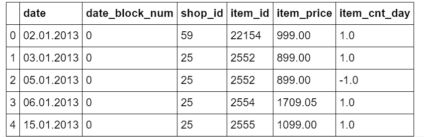

原始数据集有不同的列，但是出于本教程的目的，我们只需要下面的列:日期和售出产品的数量(item_cnt_day)。换句话说，我们将创建一个 [pandas Series](https://pandas.pydata.org/pandas-docs/stable/reference/api/pandas.Series.html) (名为“sales”)的每日频率日期时间索引，仅使用每日销售额

```
**## format datetime column**
dtf["**date**"] = pd.to_datetime(dtf['**date**'], format='**%d.%m.%Y**')**## create time series**
ts = dtf.groupby("**date**")["**item_cnt_day**"].sum().rename("**sales**")ts.head()
```

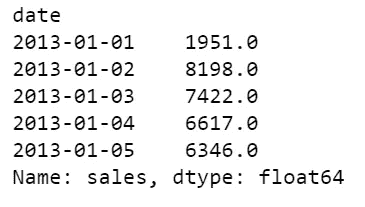

```
ts.tail()
```

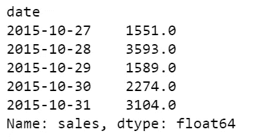

所以时间序列范围从**2013–01–01**到**2015–10–31**，它有 **1034 个观测值**，一个**平均值 3528，**和一个**标准差 1585** 。它看起来是这样的:

```
ts.plot()
```

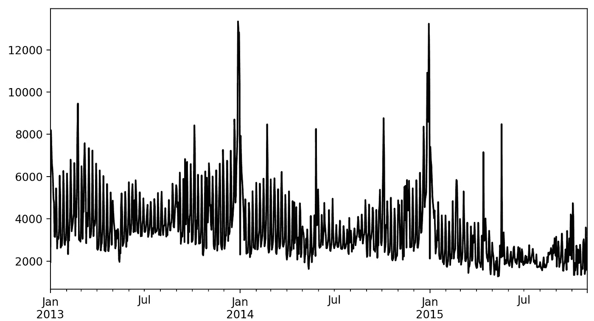

我们现在开始吧，好吗？

## **趋势分析**

[趋势是时间序列的组成部分，代表时间序列中低频的变化，高频和中频的波动已被滤除。](https://stats.oecd.org/glossary/detail.asp?ID=6692)

这种分析的目的是了解数据中是否有趋势，以及这种模式是否是线性的。这项工作的最佳工具是**可视化**。

让我们写一个函数，它可以帮助我们理解时间序列的趋势和运动。我们希望在图中看到一些滚动统计数据，例如:

*   M [移动平均值](https://en.wikipedia.org/wiki/Moving_average):前一个 *n* 数据的未加权[平均值](https://en.wikipedia.org/wiki/Arithmetic_mean)(也称“移动平均值”)
*   [布林线](https://en.wikipedia.org/wiki/Bollinger_Bands):高于移动平均线的 k 倍 *n* 周期标准差的上带，低于移动平均线的 k 倍 *N* 周期标准差的下带。

```
**'''
Plot ts with rolling mean and 95% confidence interval with rolling std.
:parameter    
  :param ts: pandas Series    
  :param window: num - for rolling stats
  :param plot_ma: bool - whether plot moving average
  :param plot_intervals: bool - whether plot upper and lower bounds
'''**
def plot_ts(ts, plot_ma=True, plot_intervals=True, window=30,
            figsize=(15,5)):   
   rolling_mean = ts.rolling(window=window).mean()    
   rolling_std = ts.rolling(window=window).std()
   plt.figure(figsize=figsize)    
   plt.title(ts.name)    
   plt.plot(ts[window:], label='Actual values', color="black")    
   if plot_ma:        
      plt.plot(rolling_mean, 'g', label='MA'+str(window),
               color="red")    
   if plot_intervals:
      lower_bound = rolling_mean - (1.96 * rolling_std)
      upper_bound = rolling_mean + (1.96 * rolling_std)
   plt.fill_between(x=ts.index, y1=lower_bound, y2=upper_bound,
                    color='lightskyblue', alpha=0.4)
   plt.legend(loc='best')
   plt.grid(True)
   plt.show()
```

当数据集至少有一整年的观察时间时，我总是从一个 **30 天**的滚动窗口开始:

```
**plot_ts(**ts, window=30**)**
```

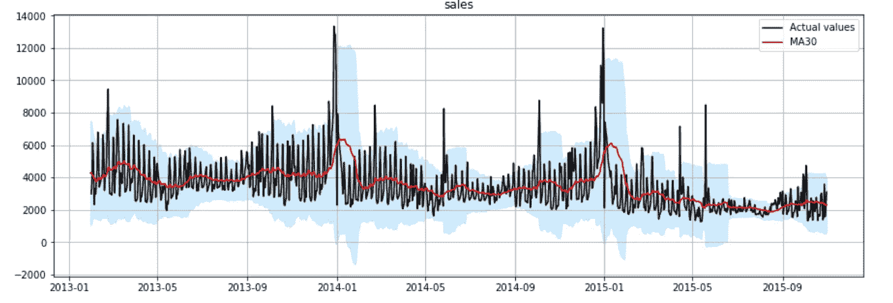

观察图中的红线，您可以很容易地发现一种模式:时间序列遵循线性下降趋势，每年一月都有严重的季节性高峰。当使用至少 **1 年**的滚动窗口时，趋势变得明显

```
**plot_ts(**ts, window=365**)**
```

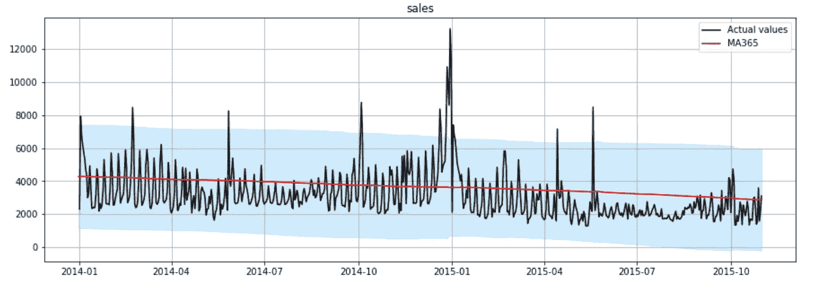

如你所见，这是一个明显的线性下降趋势。这在模型设计中很有用，因为大多数模型要求您指定趋势组件是否存在，以及它是线性的(也称为“加法”)还是非线性的(也称为“乘法”)。

## 离群点检测

[离群值是位于一组数据值的统计分布尾部的数据值。](https://stats.oecd.org/glossary/detail.asp?ID=3465)

本节的目标是找出异常值并决定如何处理它们。在实践中，通常使用传统的确定性方法，如绘制分布图，并将高于或低于选定阈值的每个观察值标记为异常值。例如:

```
**## Plot histogram**
ts.hist(color="black", bins=100)
```

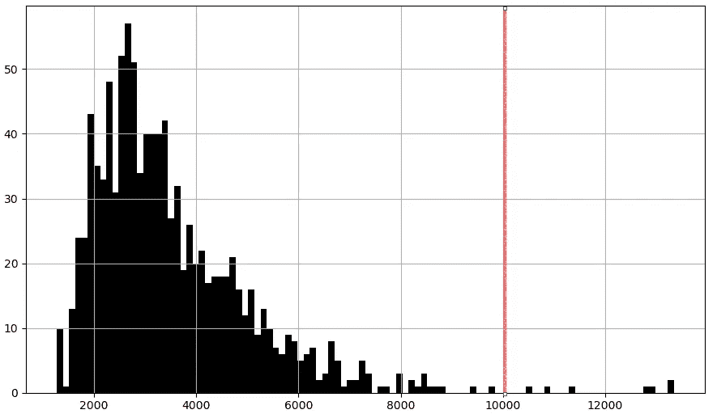

```
**## Boxplot** ts.plot.box()
```

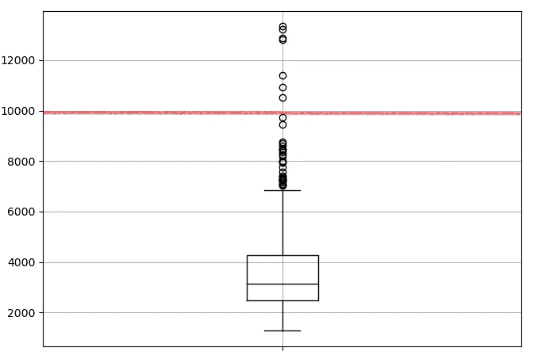

这种方法特别适用于您非常熟悉您的数据，并且您已经知道它遵循什么样的过程和分布，因此什么阈值更适用的情况。然而，**我个人发现让机器学习算法在任何时间序列数据集上为我做这件事都更容易。**

让我们编写一个函数，使用 scikit-learn 库中的**聚类算法**自动检测时间序列中的异常值:[单类支持向量机](https://scikit-learn.org/stable/modules/generated/sklearn.svm.OneClassSVM.html)，它学习分布的边界(称为“[支持](https://en.wikipedia.org/wiki/Support_(mathematics))”)，因此能够将位于边界之外的任何点归类为异常值。

```
**'''
Find outliers using sklearn unsupervised support vetcor machine.
:parameter
    :param ts: pandas Series
    :param perc: float - percentage of outliers to look for
:return
    dtf with raw ts, outlier 1/0 (yes/no), numeric index
'''**
def find_outliers(ts, perc=0.01, figsize=(15,5)):
    **## fit svm**
    scaler = preprocessing.StandardScaler()
    ts_scaled = scaler.fit_transform(ts.values.reshape(-1,1))
    model = svm.OneClassSVM(nu=perc, kernel="rbf", gamma=0.01)
    model.fit(ts_scaled) **## dtf output**
    dtf_outliers = ts.to_frame(name="ts")
    dtf_outliers["index"] = range(len(ts))
    dtf_outliers["outlier"] = model.predict(ts_scaled)
    dtf_outliers["outlier"] = dtf_outliers["outlier"].apply(lambda
                                              x: 1 if x==-1 else 0)
    **## plot**
    fig, ax = plt.subplots(figsize=figsize)
    ax.set(title="Outliers detection: found"
           +str(sum(dtf_outliers["outlier"]==1)))
    ax.plot(dtf_outliers["index"], dtf_outliers["ts"],
            color="black")
    ax.scatter(x=dtf_outliers[dtf_outliers["outlier"]==1]["index"],
               y=dtf_outliers[dtf_outliers["outlier"]==1]['ts'],
               color='red')
    ax.grid(True)
    plt.show()
    return dtf_outliers
```

有了这个函数，我们将能够发现异常值，但是一旦发现异常值，我们该如何处理呢？这里没有最优策略:没有与其他观察值显著不同的数据点时，时间序列预测更容易，但删除这些点会极大地改变数据的分布。如果您已经决定排除异常值，最方便的方法是通过**插值**来移除它们。

让我们编写一个函数，在检测到异常值后，通过对异常值前后的值进行插值来移除异常值。

```
**'''
Interpolate outliers in a ts.
'''**
def remove_outliers(ts, outliers_idx, figsize=(15,5)):
    ts_clean = ts.copy()
    ts_clean.loc[outliers_idx] = np.nan
    ts_clean = ts_clean.interpolate(method="linear")
    ax = ts.plot(figsize=figsize, color="red", alpha=0.5,
         title="Remove outliers", label="original", legend=True)
    ts_clean.plot(ax=ax, grid=True, color="black",
                  label="interpolated", legend=True)
    plt.show()
    return ts_clean
```

现在让我们使用这些函数。首先，我们检测异常值:

```
dtf_outliers = **find_outliers(**ts, perc=0.05**)**
```

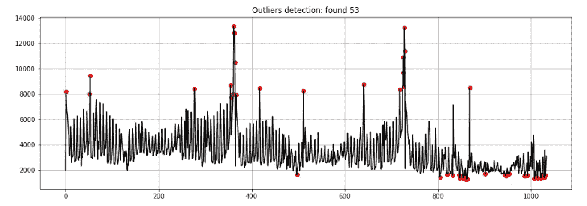

然后处理它们:

```
**## outliers index position**
outliers_index_pos = dtf_outliers[dtf_outliers["outlier"]==1].index**## exclude outliers**
ts_clean = **remove_outliers(**ts, outliers_idx=outliers_index_pos**)**
```

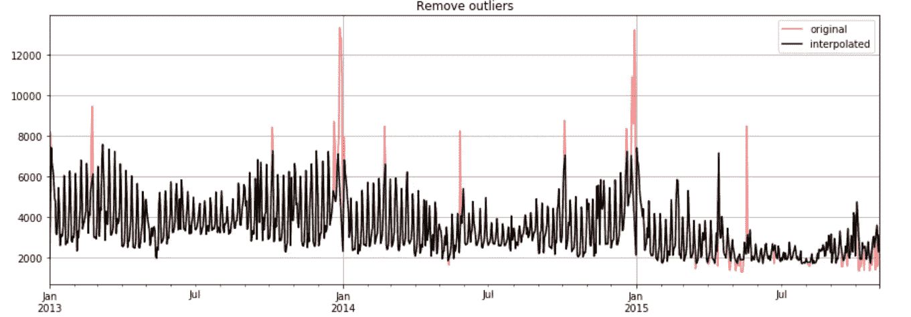

出于本教程的目的，我将继续讨论原始时间序列(包括异常值)，但是去除异常值并在干净的时间序列(没有异常值)上建立模型也是一个好策略。

## 平稳性检验

[平稳过程是一种随机过程，其无条件联合概率分布随时间推移不发生变化。因此，均值和方差等参数也不会随时间变化](https://en.wikipedia.org/wiki/Stationary_process)，因此平稳时间序列更容易预测。

有几种方法可以确定一个时间序列是否是平稳的，最常见的是很好的可视化，查看自相关和运行统计测试。

最常见的测试是 [Dickey-Fuller 测试](https://en.wikipedia.org/wiki/Augmented_Dickey%E2%80%93Fuller_test)(也称为“ADF 测试”)，其中**零假设是时间序列有一个单位根，换句话说，时间序列不是平稳的**。我们将通过比较 p 值和选定的阈值(α)来测试是否可以拒绝零假设，因此，如果 p 值较小，我们可以拒绝零假设，并假设时间序列是平稳的，置信水平为 1-α(从技术上讲，我们不能说它不是):

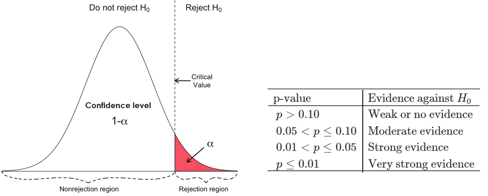

[来源](https://userpage.fu-berlin.de/soga/200/2070_hypothesis_tests/20713_The_Critical_Value_and_the_p-Value_Approach_to_Hypothesis_Testing.html)

让我们编写一个函数，将所有这些方法放在一起，并显示一个由以下内容组成的图形:

*   95% (α=0.05) ADF 测试的结果(将打印在输出图的标题中)。
*   第一张图将绘制数据的前 x%的平均值和方差，这是一个图形测试:如果时间序列的属性是常数，我们将看到 1-x%的数据在平均值附近徘徊，并在前 x%的观测值的方差范围内
*   最后两个图描绘了 [PACF](https://en.wikipedia.org/wiki/Partial_autocorrelation_function) 和 [ACF](https://en.wikipedia.org/wiki/Autocorrelation)

```
**'''
Test stationarity by:
    - running Augmented Dickey-Fuller test wiht 95%
    - plotting mean and variance of a sample from data
    - plottig autocorrelation and partial autocorrelation
'''**
def test_stationarity_acf_pacf(ts, sample=0.20, maxlag=30, figsize= 
                              (15,10)):
    with plt.style.context(style='bmh'):
        **## set figure**
        fig = plt.figure(figsize=figsize)
        ts_ax = plt.subplot2grid(shape=(2,2), loc=(0,0), colspan=2)
        pacf_ax = plt.subplot2grid(shape=(2,2), loc=(1,0))
        acf_ax = plt.subplot2grid(shape=(2,2), loc=(1,1))

        **## plot ts with mean/std of a sample from the first x%** 
        dtf_ts = ts.to_frame(name="ts")
        sample_size = int(len(ts)*sample)
        dtf_ts["mean"] = dtf_ts["ts"].head(sample_size).mean()
        dtf_ts["lower"] = dtf_ts["ts"].head(sample_size).mean() 
                          + dtf_ts["ts"].head(sample_size).std()
        dtf_ts["upper"] = dtf_ts["ts"].head(sample_size).mean() 
                          - dtf_ts["ts"].head(sample_size).std()
        dtf_ts["ts"].plot(ax=ts_ax, color="black", legend=False)
        dtf_ts["mean"].plot(ax=ts_ax, legend=False, color="red",
                            linestyle="--", linewidth=0.7)
        ts_ax.fill_between(x=dtf_ts.index, y1=dtf_ts['lower'], 
                y2=dtf_ts['upper'], color='lightskyblue', alpha=0.4)
        dtf_ts["mean"].head(sample_size).plot(ax=ts_ax,
                legend=False, color="red", linewidth=0.9)
        ts_ax.fill_between(x=dtf_ts.head(sample_size).index, 
                           y1=dtf_ts['lower'].head(sample_size), 
                           y2=dtf_ts['upper'].head(sample_size),
                           color='lightskyblue')

        **## test stationarity (Augmented Dickey-Fuller)**
        adfuller_test = sm.tsa.stattools.adfuller(ts, maxlag=maxlag,
                                                  autolag="AIC")
        adf, p, critical_value = adfuller_test[0], adfuller_test[1], 
                                 adfuller_test[4]["5%"]
        p = round(p, 3)
        conclusion = "Stationary" if p < 0.05 else "Non-Stationary"
        ts_ax.set_title('Dickey-Fuller Test 95%: '+conclusion+
                        '(p value: '+str(p)+')')

        **## pacf (for AR) e acf (for MA)** 
        smt.graphics.plot_pacf(ts, lags=maxlag, ax=pacf_ax, 
                 title="Partial Autocorrelation (for AR component)")
        smt.graphics.plot_acf(ts, lags=maxlag, ax=acf_ax,
                 title="Autocorrelation (for MA component)")
        plt.tight_layout()
```

让我们运行它:

```
**test_stationarity_acf_pacf(**ts, sample=0.20, maxlag=30**)**
```

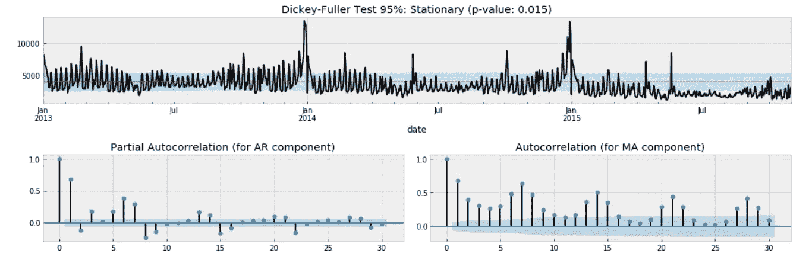

Dickey-Fuller 检验的结果表明，时间序列可能是平稳的，因为我们可以以 95%的置信度拒绝非平稳性的零假设(p 值为 0.015 < α of 0.05). However, this does not match with the “eye test” as we can see that the time series moves away from the mean after January 2015\. Moreover, we couldn’t reject the null hypothesis of non-stationarity with a confidence level of 99% (p-value of 0.015 > α为 0.01)，并且自相关无法收敛到零。

在**对时间序列**进行差分后，我们将运行相同的测试。差异可以通过消除观察水平的变化来帮助稳定平均值，从而消除(或减少)趋势和季节性。基本上，我们将应用以下转换:

> diff[t] = y[t] — y[t 滞后]

现在让我们尝试用 1 个滞后来区分时间序列，并再次运行之前的函数

```
diff_ts = ts - ts.shift(1)
diff_ts = diff_ts[(pd.notnull(diff_ts))]**test_stationarity_acf_pacf(**diff_ts, sample=0.20, maxlag=30**)**
```

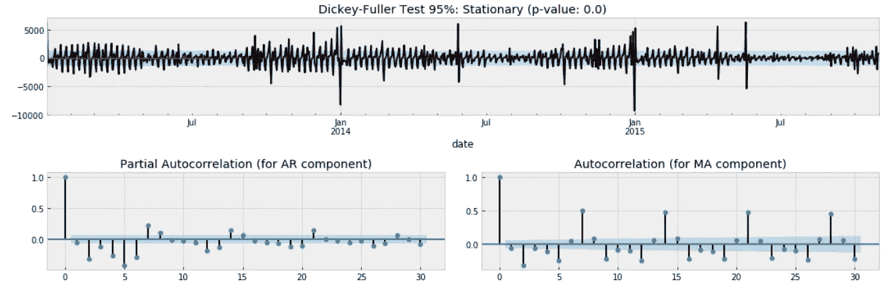

这一次，我们可以用 95%和 99%的置信度拒绝非平稳性的零假设(p 值为 0.000)。我们可以得出结论，最好假设时间序列不是平稳的。

关于自相关图，显然每 2 天有一个负的季节性，这意味着在一周的开始有较少的销售，每 7 天有一个正的季节性(周末有更多的销售)。

## 季节性分析

[季节性成分是时间序列中的变化部分，代表年内波动，在时间、方向和幅度方面年复一年或多或少是稳定的。](https://stats.oecd.org/glossary/detail.asp?ID=6695)

最后一部分的目标是了解哪种季节性影响数据(如果每 7 天出现一次波动，则为每周季节性；如果每 30 天出现一次波动，则为每月季节性，以此类推)。

这对于分析会议之后的模型设计部分至关重要。特别是，当使用季节性自回归模型时，您必须指定每个季节的观察次数:我说的是 **SARIMA (p，D，q)x(P，D，Q，s)** 中的参数**“s”**。

在 [statsmodel 库](https://www.statsmodels.org/dev/generated/statsmodels.tsa.seasonal.seasonal_decompose.html)中有一个超级有用的函数，允许我们[分解时间序列](https://en.wikipedia.org/wiki/Decomposition_of_time_series)。该函数将数据分为 3 个部分:趋势、季节性和残差。

让我们用 7 天的季节性来绘制时间序列的分解图

```
decomposition = **smt.seasonal_decompose(**ts, freq=7**)**
trend = decomposition.trend
seasonal = decomposition.seasonal
residual = decomposition.resid   
fig, ax = plt.subplots(nrows=4, ncols=1, sharex=True, sharey=False)
ax[0].plot(ts)
ax[0].set_title('Original')
ax[0].grid(True) 
ax[1].plot(trend)
ax[1].set_title('Trend')
ax[1].grid(True)  
ax[2].plot(seasonal)
ax[2].set_title('Seasonality')
ax[2].grid(True)  
ax[3].plot(residual)
ax[3].set_title('Residuals')
ax[3].grid(True)
```

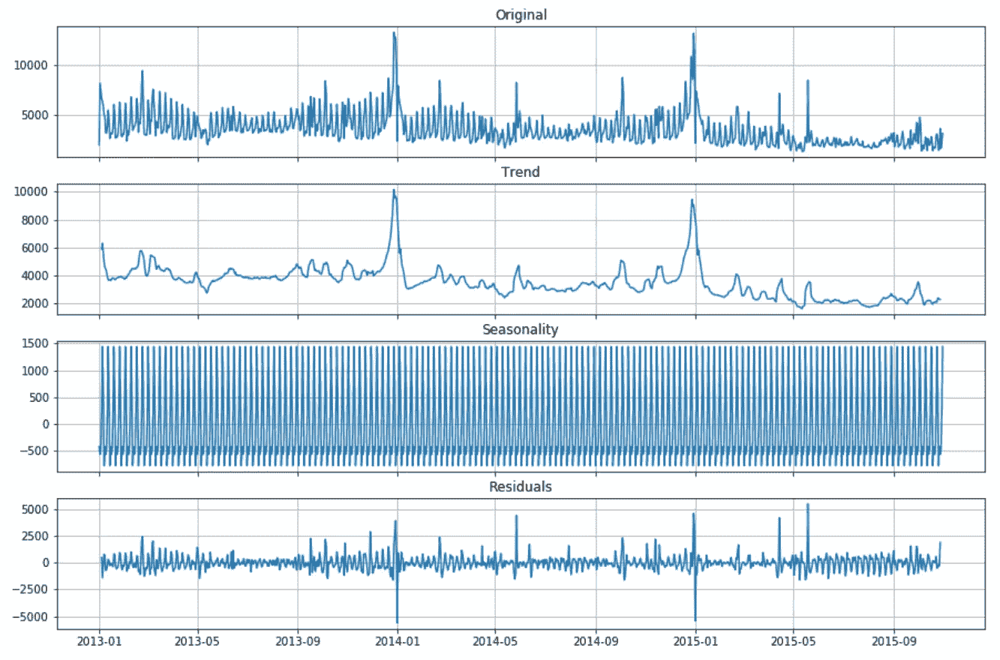

我通常选择导致较小残差的季节性参数。在这种情况下，尝试使用 2 天、7 天和 30 天，每周季节性(s = 7)的结果更好。

## 结论

本文是一篇教程，讲述在开始构建预测模型之前，如何使用统计和机器学习来分析现实世界的时间序列。这种分析的结果对于设计能够很好地适应时间序列的模型是有用的(这将在下一个教程中完成，顶部的链接)。特别是:

*   我们可以在预测模型中加入线性趋势成分
*   我们可以在包含异常值的原始数据和不包含异常值的已处理数据上训练模型，并测试哪一个表现更好
*   我们知道时间序列不是平稳的，因此我们应该使用 AR-I-MA 模型而不是 ARMA 模型
*   我们可以在我们的预测模型中包含一个每周的季节性因素。

我希望你喜欢它！如有问题和反馈，或者只是分享您感兴趣的项目，请随时联系我。

> 👉[我们来连线](https://linktr.ee/maurodp)👈

> 本文是使用 Python 进行时间序列预测系列**的一部分**，另请参见:

[](https://medium.com/analytics-vidhya/time-series-forecasting-arima-vs-lstm-vs-prophet-62241c203a3b) [## 时间序列预测:ARIMA vs LSTM vs 预言家

### 基于机器学习和 Python 的时间序列预测

medium.com](https://medium.com/analytics-vidhya/time-series-forecasting-arima-vs-lstm-vs-prophet-62241c203a3b) [](https://medium.com/analytics-vidhya/time-series-forecasting-with-random-walk-58e84c93058b) [## 随机游走时间序列预测

### 基于机器学习和 Python 的时间序列预测

medium.com](https://medium.com/analytics-vidhya/time-series-forecasting-with-random-walk-58e84c93058b) [](https://medium.com/analytics-vidhya/how-to-predict-when-the-covid-19-pandemic-will-stop-in-your-country-with-python-d6fbb2425a9f) [## 简单参数曲线拟合的时间序列预测

### 预测新冠肺炎疫情什么时候会停在你的国家

medium.com](https://medium.com/analytics-vidhya/how-to-predict-when-the-covid-19-pandemic-will-stop-in-your-country-with-python-d6fbb2425a9f)