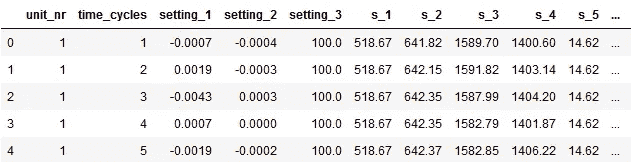
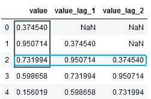
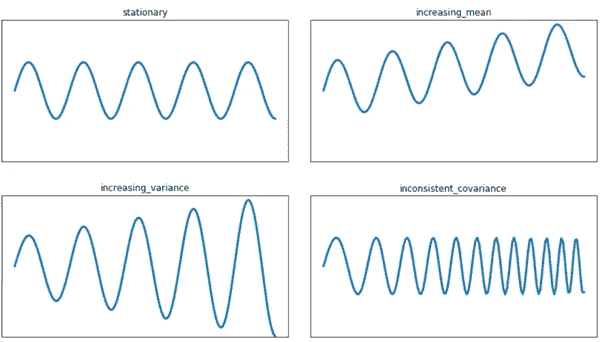
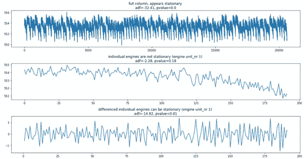
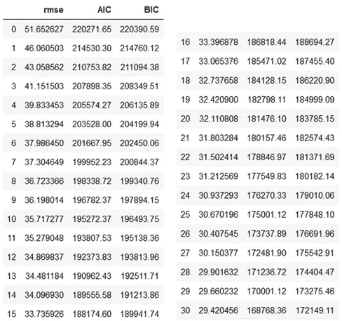
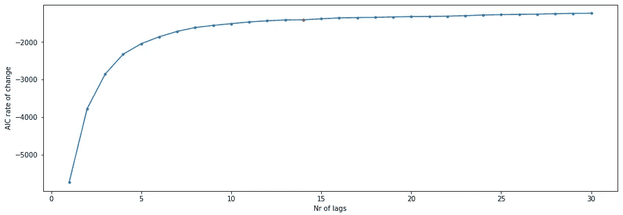
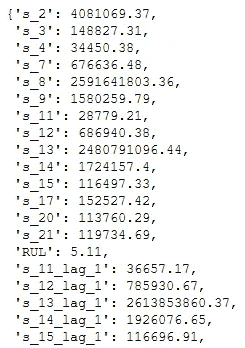
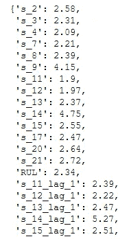
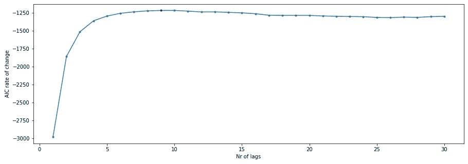

# 涡轮风扇发动机预测维修的时间序列分析

> 原文：<https://towardsdatascience.com/time-series-analysis-for-predictive-maintenance-of-turbofan-engines-1b3864991da4?source=collection_archive---------7----------------------->


艾萨克·史密斯在 [Unsplash](https://unsplash.com?utm_source=medium&utm_medium=referral) 上拍摄的照片

## [探索美国宇航局的涡轮风扇数据集](https://towardsdatascience.com/tagged/exploring-nasa-turbofan)

## 使用分布滞后模型预测剩余使用寿命

*<免责声明:我的目的是展示模型开发过程中不同方法和选择的效果。这些影响经常使用测试集来显示，这被认为是(非常)不好的做法，但有助于教育目的。>*

欢迎来到“探索 NASA 的涡轮风扇数据集”系列的另一部分。这将是对 FD001 的第三次分析，在 FD 001 中，所有发动机在相同的操作条件下运行，并产生相同的故障。

最初，我们假设发动机的剩余使用寿命(RUL)呈线性下降。在我的[上一篇文章](/the-importance-of-problem-framing-for-supervised-predictive-maintenance-solutions-cc8646826093?source=friends_link&sk=ec51cbfa29f084ed94fe59d0daf51df0)中，我们通过截取任何大于 125 的值来重新检验这个假设。剪切 RUL 将基线线性回归提高了 31%(从 31.95 的 RMSE 到 21.90 的 RMSE)。然后，我们切换到支持向量回归，并挤出另外 6%的改善，总 RMSE 为 20.54。

今天，我们将重点关注时间序列分析，以预测发动机何时需要保养。但是，在进入时间序列部分之前，我们首先必须回顾几个处理步骤。我们开始吧！

# 加载数据

首先，我们将导入一些库并读取数据。



train.head()的结果

看起来不错。接下来，计算线性递减 RUL(稍后添加裁剪)，并删除无信息列。

RUL 在击穿时可以认为是 0，我们天真地假设 RUL 是一个线性函数。意味着在击穿前的 10 个周期时 RUL 是 10，在击穿前的 50 个周期时是 50，等等。


很好，现在我们来讨论一下我们的方法。

# 方法

此数据集的时间序列分析和预测可以通过以下三种方法之一完成:

1.  预测传感器值并设置“报警”阈值。当预测传感器越过该阈值时，部件劣化到即将击穿的状态。对于当前数据集使用这种方法有一些注意事项。
    (a)每个传感器都必须单独建模，因此我们无法利用传感器之间的相互作用。
    (b)它需要大量的领域知识来设置适当的阈值，并且
    (c)它不直接通知我们关于我们的目标特性，剩余使用寿命(RUL)。
2.  向量自回归(VAR)型模型。这些类型的模型可以处理多变量时间序列，但是模型最初会产生 X 和 Y 变量的滞后。通常，在时间序列中，Y 的过去值在确定 Y 的未来值时起着很大的作用。但是，由于我们假设 Y 的值在训练集中保持不变或线性下降，因此将这些自定义目标纳入模型并使用它们进行预测会严重影响模型结果，并过分强调 Yt-1 对 Yt 的影响。您可以编写一些自定义代码，将滞后 Y 变量的权重系数设置为 0，但在我看来，有一种更简单的方法。
3.  分布式滞后模型。基本上，这是一个回归模型，您可以完全控制为每个变量添加多少滞后。

在创建分布式滞后模型时，我们可以使用时间序列和回归分析中的许多工具和测试。但是，我们将从小处着手，并根据需要增加复杂性。

我们要实现的模型的基本形式如下:

`Yt = a + B1*Xt + B2*Xt-1 + … + Bn*Xt-n`

其中`a`是截距，`B1`到`Bn`是系数。`Xt-1`和`Xt-n`是`Xt`的滞后变量，分别滞后 1 到 n，`Yt`是当前时刻`t`的目标变量。
*注意:为了与之前的帖子保持一致，我们预测 Yt 的 RUL，如果你想预测下一个 time_cycle (Yt+1)的 RUL，你可以简单地将目标移动一位，如下所述*。

# 添加滞后变量

我们可以使用熊猫移动函数来添加滞后变量。



您可以看到滞后列包含以前时间戳的数据。例如，第 2 行附加了时间 0 和 1 的数据。这就是我们如何从一行中表示的多个时间实例中获取数据，这是供我们的模型使用的一种方便的表示。

现在让我们将这个原则应用到我们的数据集。我们删除由于添加滞后变量而引入 NaN 值的行，并拟合新的回归模型。

```
# returns
# train set RMSE:39.367692351135005, Variance:0.6709929595362338
# test set RMSE:31.423109839706022, Variance:0.42820706786532714
```

太好了！增加一个滞后已经给了我们的基线模型一个小的改进，基线模型的 RMSE 是 31.95。上面的例子展示了我们试图实现的基本目标。

> 更正:在上面的例子中，我忘记删除 index_names。当这些被丢弃时，结果与基线相比没有改善。感谢[宣昂刘](https://medium.com/u/69f7d21d394b?source=post_page-----1b3864991da4--------------------------------)指出这一点！幸运的是，这对整个流程几乎没有影响，添加更多的滞后将开始改善结果(正如您可以在下面进一步阅读)

让我们将这个功能封装在两个函数中以备后用，一个用于添加从 1 到 n 的滞后，另一个用于添加特定的滞后。

在应用时间序列分析和回归时，需要考虑一些假设，现在让我们来看看这些假设。

# 平稳性

平稳性意味着时间序列的统计特性，如均值和方差不随时间变化，此外，协方差(时间序列的分布)不应依赖于时间(见下图 1)。

这些统计属性保持不变很重要，因为许多统计模型依赖这些属性进行预测。因此，如果均值、方差或协方差随时间变化，模型将无法准确预测下一个值[1]。



图一。展示平稳与非平稳数据

幸运的是，有测试来检查数据的平稳性，如果测试没有通过，也有方法使时间序列平稳。

为了测试平稳性，我们将使用扩展的 Dickey-Fuller 测试，您可以查看[1–5]了解更多信息。目前，adf 检验统计量和 p 值是最重要的。测试统计越负，信号越稳定。当 p 值低于 0.05 时，可以假定时间序列是平稳的。让我们在一台发动机的立柱上进行这个测试。

```
# returns
# single unit, single column test results
# adf: -2.276666927948019 
# pvalue: 0.17960380425358546
# Significant: False
```

检验统计是负的，但不显著。我们可以对数据进行一次差分，以试图消除趋势并再次测试[6]。

```
# returns
# single unit, single column test results after differencing
# adf: -14.824168539718967 
# pvalue: 1.9431018596392618e-27
# Significant: True
```

更好的是，p 值现在是< 0.05 allowing us to assume stationarity.

*注意:重要的是要考虑你如何实现你的测试，例如测试一个传感器列的平稳性有所有 100 个引擎的时间序列。所有引擎一起形成稳定的信号，但是单个引擎的信号不是稳定的！*(见图 2)



图 2:(上图)单一特征的所有引擎的数据被认为是固定的。(中间)同一特性的单个发动机的数据不被认为是稳定的。(底部)在对信号进行一次差分后，相同特征的单个引擎的数据被认为是稳定的。

由于我们事先不知道每个发动机的每个传感器的时间序列在达到稳定之前需要差分多少次，所以最好创建一些函数来为我们处理这些步骤。我们将使用 p 值作为假设平稳性的决定性因素。

## 应用我们目前所拥有的

我们应用这些函数来使我们的数据稳定。


intermediate_df.head()的结果

让我们拟合一个新的线性回归来了解静态数据对模型性能的影响。

```
# returns
# train set RMSE:51.63375613791181, Variance:0.4340864011385228
```

由于使数据静止，训练 RMSE 变得相当糟糕。这可以解释为数据不再具有趋势，从而难以拟合回归线。当添加滞后变量时，性能将再次提高，因为这将告知模型传感器值随时间的变化之间的关系。

接下来，我们可以开始搜索，以确定要添加多少滞后才能获得最佳模型结果。

# AIC:寻找正确的滞后数

赤池信息准则(AIC)是一种反映模型质量的度量，常用于时间序列分析。它同时考虑过拟合和欠拟合。当训练多个相似的模型时，可以比较 AIC 分数用于模型选择[7]。较低的分数通常会更好，但通常会在复杂性和模型质量改进之间进行权衡。让我们训练一些具有 0 到 n 个滞后的模型，并计算 AIC 来确定最高质量的模型。



具有 0–30 个滞后的回归模型的评估度量表

我们正在寻找 AIC 中的一个转折点，通过增加更多的滞后来表明模型改进的收益递减。然而，根据度量表，并不清楚要添加多少滞后，因为度量似乎在稳步提高。让我们尝试绘制 AIC 的任何视觉问题。



AIC 变化率与添加的滞后 nr 的关系图

根据图表，质量改进在 14 个滞后之后似乎停滞不前。对我来说，这表明模型复杂性和质量之间的平衡已经达到，因为增加更多的滞后(复杂性)不再能实质上提高模型质量。

添加同一变量的多个滞后的一个问题是引入多重共线性的可能性，接下来让我们检查一下。

# 多重共线性

当多元回归模型中的独立变量高度相关时，就会出现多重共线性[8]。由于时间序列的性质，即上一个时间点的值与下一个时间点的值存在内在联系，因此添加滞后变量时引入多重共线性的可能性很大。多重共线性会影响模型的系数和稳定性，增加新数据出现错误结果的可能性。让我们通过计算方差膨胀因子(VIF)来测试我们模型的多重共线性，根据经验法则，低于 5 的 vif 值被认为是安全的[9]。



计算的 vif 的前 20 个结果

我们的模型似乎深受 vif 值远大于 5 的多重共线性之苦。在寻找减少多重共线性的方法时，我发现 statsmodels 用于计算多重共线性的方法可能会受到缩放的严重影响[10]。这将是一个相当简单的修复，所以让我们实现一个缩放转换，并希望我们不必进一步寻找解决我们的问题。



缩放后计算的 vif 的前 20 个结果

好多了！我们现在有所有组件来训练、预测和评估，以找到最佳模型。

# 组合、预测和评估

我们首先重复确定要添加的滞后数量的过程。



AIC 变化率与缩放特征后添加的滞后 nr 的关系图

在增加缩放比例后，这个点有一点点移动，模型质量的提高现在停滞在 9 个滞后而不是 14 个。

让我们把我们的管道放在一起，用 9 个滞后来训练我们的模型，看看它的表现如何。从现在开始，我们还将加入剪辑后的 RUL。

```
# returns
# train set RMSE:20.80233928213837, Variance:0.7523208224684113
# test set RMSE:21.14895857012398, Variance:0.7409888687595052
```

21.14 的 RMSE 并不坏，但我认为我们可以再挤出一点。目前，我们的模型使用连续滞后变量。然而，相邻的 lag 不一定必须保存不同的信息。例如，在滞后 6、7 和 8 的传感器值的变化可能是最小的，因此对模型来说不是真正的信息。当增加滞后之间的时间步长时，传感器值的变化变得更加明显。例如，滞后 5、10 和 20 处的传感器值可能相差很大，足以提供信息。注意，通过增加更高的滞后变量，你也丢弃了更多的数据行，所以需要考虑一个折衷方案。

当发动机恶化并接近故障时，传感器中有明显的趋势，这在单个时间步长之间是可区分的。所以就我个人而言，在增加滞后之间的时间步长之前，我选择保持前几个滞后连续。让我们尝试一些变化，看看哪个得分最高。

```
# Results of different lags and test RMSE
# RMSE = 21.76, lags = [1,2,3,4,5]
# RMSE = 21.14, lags = [1,2,3,4,5,6,7,8,9]
# RMSE = 21.06, lags = [1,2,3,4,5,10,20,30]
# RMSE = 20.85, lags = [1,2,3,4,5,10,20]
```

当然还有更多的可能性，但通过最少的测试，并考虑到增加更多连续滞后带来的停滞不前的改善，滞后[1，2，3，4，5，10，20]在 RMSE 为 20.85 时表现最佳。这些结果非常接近我们上次的支持向量回归(RMSE = 20.54)。

最后，我觉得分布式滞后模型对于解决这个用例的可能方法是一个有价值的补充。它在模型开发过程中提供了很大的灵活性和控制力，同时也易于业务人员进行解释和说明。完整的笔记本你可以查看我的 github 页面[这里](https://github.com/kpeters/exploring-nasas-turbofan-dataset)。

我要感谢 Wisse Smit 和 Maikel Grobbe 对我的文章的评论。下次我们将深入研究生存分析。你能找到表现更好的特定滞后(不完全连续)的组合吗？请在下面的评论中告诉我！

参考资料:
【1】[https://medium . com/open-machine-learning-course/open-machine-learning-course-topic-9-time-series-analysis-in-python-a 270 CB 05 E0 b 3](https://medium.com/open-machine-learning-course/open-machine-learning-course-topic-9-time-series-analysis-in-python-a270cb05e0b3)
【2】[https://en . Wikipedia . org/wiki/Augmented _ Dickey % E2 % 80% 93 fuller _ test](https://en.wikipedia.org/wiki/Augmented_Dickey%E2%80%93Fuller_test)
【3】[https://www . stats models . org/stable/generated/stats models。](https://www.statsmodels.org/stable/generated/statsmodels.tsa.stattools.adfuller.html)