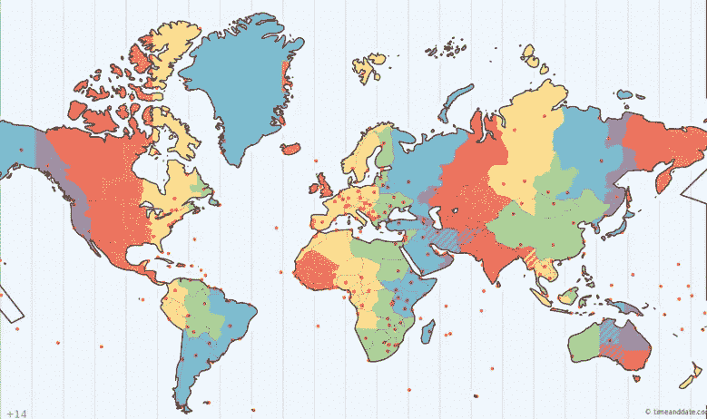
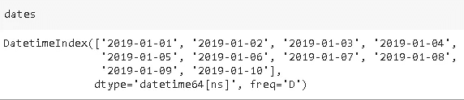
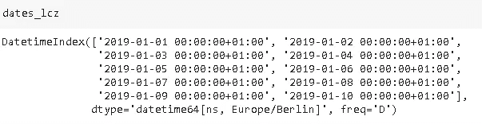
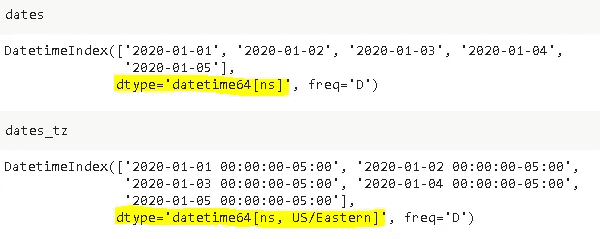
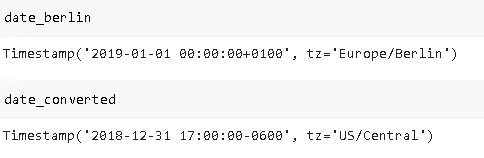
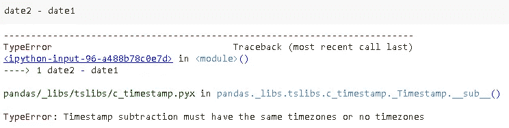

# 时间序列分析-处理时区

> 原文：<https://towardsdatascience.com/time-series-analysis-handling-time-zones-b6fcb324c7b?source=collection_archive---------26----------------------->

## 如何处理熊猫的时区问题



[图源](https://www.timeanddate.com/time/map/)

你坐过从东到西的长途飞机吗？如果你有，你知道那是什么感觉。假设飞机下午 1 点起飞，10 个小时到达目的地。飞机一着陆你就往外看。天还亮着，好像你只飞了一个小时。你查一下当地时间。现在才下午 3 点。这感觉像是你生命中最漫长的一天。

由于地球的形状和运动，地球上不同的部分同时从不同的角度接收阳光。当你在德国喝咖啡的时候，你在美国的朋友可能正准备睡觉。根据阳光调整时间是不可避免的，因为如果可能的话，我们希望白天有阳光，晚上睡觉。因此，出现了一个叫做“本地时间”的概念。也就是根据太阳光束的角度计算的时间。为了使用方便，地球被划分为不同的地区，这些地区被称为“时区”。有些国家的领土上只有一个时区，而有些国家却有多个时区。在这个时区的小介绍之后，让我们开始真正的话题。

**在时间序列分析中我们如何处理时区？**

时间序列数据包括附加到连续时间戳的数据点。时间序列数据的来源是周期性的测量或观察。时间序列数据的分析对于许多行业中的关键任务是必不可少的。在这篇文章中，我将重点介绍时区，但是如果你想学习时间序列分析的基础知识，你可以从以下几点开始:

[](/time-series-analysis-with-pandas-e6281a5fcda0) [## 熊猫的时间序列分析

### 如何处理和操作时间序列数据

towardsdatascience.com](/time-series-analysis-with-pandas-e6281a5fcda0) 

我们生活在一个全球化的世界里。大公司通常希望在位于不同时区的许多不同国家开展业务。数据是公司的宝贵资产，需要正确分析。对于时间序列分析，忽略时区将是一个严重的错误。在这篇文章中，我将讲述时区的关键概念，以及如何在熊猫身上处理它们。

让我们从导入相关库开始:

```
import numpy as np
import pandas as pdimport datetime
import dateutil
import pytz
```

然后我们创建一个简单的时间序列数据:

```
dates = pd.date_range('2019-01-01','2019-01-10')
```



默认情况下，熊猫的时间序列对象没有指定的时区:

```
#date_range object
dates.tz is None
True#Timestamp object
date = pd.Timestamp('2019-01-01')
date.tz is None
True
```

我们可以使用 **tz_localize** 方法给这些对象分配一个时区:

```
dates_lcz = dates.tz_localize('Europe/Berlin')dates_lcz.tz
  <DstTzInfo 'Europe/Berlin' LMT+0:53:00 STD>
```



**Pytz vs dateutil**

> 注意:Pandas 通过标准库的 **pytz** 和 **dateutil** 库或 **datetime.timezone** 对象支持时区。

要分配时区，请执行以下操作:

*   传递 pytz 或 dateutil 时区对象，或者
*   传递奥尔森时区字符串

pytz 时区字符串的一个示例是“美国/太平洋”。dateutil 的相同时区字符串是“dateutil/US/Pasific”。您可以使用以下命令检查整个时区字符串列表:

*   从 pytz 导入公共时区
*   从 pytz 导入所有时区

我们还可以使用关键字参数 **tz** 创建一个带有时区的时间序列对象:

```
#using pytz
date_pytz = pd.Timestamp('2019-01-01', tz = 'Europe/Berlin')
date_pytz.tz
    <DstTzInfo 'Europe/Berlin' CET+1:00:00 STD>#using dateutil
date_util = pd.Timestamp('2019-01-01', tz = 'dateutil/Europe/Berlin')
date_util.tz
  tzfile('/usr/share/zoneinfo/Europe/Berlin')
```

没有时区的时间序列的数据类型是 datetime64[ns]。如果指定了时区，则数据类型变为 datetime64[ns，tz]:

```
dates = pd.date_range('2020-01-01', periods = 5, freq = 'D')dates_tz = pd.date_range('2020-01-01', periods = 5, freq = 'D', tz='US/Eastern')
```



我们可能还需要将时间序列数据转换到不同的时区:

```
date_berlin = pd.Timestamp('2019-01-01', tz = 'Europe/Berlin')date_converted = date_berlin.tz_convert('US/Central')
```



> **注:世界协调时**
> 
> 协调世界时(UTC)是一种时间标准，不同国家的当地时间根据 UTC 来描述。例如，马来西亚的当地时间是 UTC + 8。关于 Pandas 的时间序列分析，所有时间戳都存储在 UTC 下。当您转换时间戳对象的时区时，新对象有自己的日期和时间，但它被认为与原始对象相同。

让我们通过检查前面示例中的 date_berlin 和 date_converted 进行确认:

```
date_berlin == date_converted
True
```

**删除时区信息**

我们还可以使用 **tz_localize(None)** 或 **tz_convert(None)** 删除时区信息:

```
date = pd.Timestamp('2020-02-01', tz='US/Eastern')date
  Timestamp('2020-02-01 00:00:00-0500', tz='US/Eastern')date.tz_localize(None)
  Timestamp('2020-02-01 00:00:00')
```

要减去时间戳，它们必须在同一个时区或不在同一个时区:

```
date1 = pd.Timestamp('2020-02-01 15:00', tz='US/Eastern')date2 = pd.Timestamp('2020-02-01 09:00', tz='US/Pacific')
```



我们可以去掉时区，做减法:

```
date1.tz_localize(None) - date2.tz_localize(None)Timedelta('0 days 06:00:00')
```

感谢您的阅读。如果您有任何反馈，请告诉我。

如果你想了解更多关于熊猫的时间序列，你可以随时在熊猫官方网站上查看[用户指南](https://pandas.pydata.org/pandas-docs/stable/user_guide/timeseries.html)。