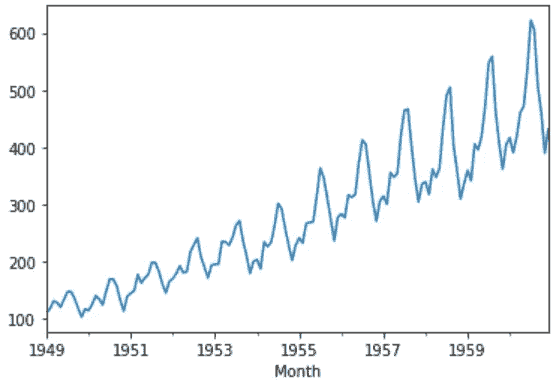
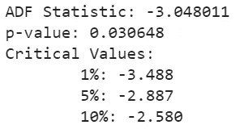

# 时间序列分析、建模和验证

> 原文：<https://towardsdatascience.com/time-series-analysis-modeling-validation-386378cd3369?source=collection_archive---------4----------------------->

## 时间数列预测法

## 用 Python 实现 ARIMA 时间序列预测的端到端项目


# 背景

本文是时序数据系列的第四篇文章。我们首先讨论了各种探索性分析和数据准备技术，然后构建了一个健壮的 T2 模型评估框架。最后，在我们的上一篇文章中，我们讨论了在转向机器学习算法之前必须探索的广泛的[经典](/lets-forecast-your-time-series-using-classical-approaches-f84eb982212c)预测技术。

现在，在当前的文章中，我们将把所有这些知识应用到现实生活的数据集中。我们将从头到尾完成一个时间序列预测项目，从导入数据集、分析和转换时间序列到训练模型，以及对新数据进行预测。我们将完成这个项目的步骤如下:

1.  问题描述
2.  数据准备和分析
3.  建立评估框架
4.  静态检查:增强的迪基-富勒试验
5.  ARIMA 模型
6.  残差分析
7.  偏差校正模型
8.  模型验证

# 问题描述

问题是预测每月航空乘客的数量。在这个练习中，我们将使用航班乘客数据集。该数据集描述了一段时间内航空公司乘客的总数。单位是以千为单位的航空乘客数量的计数。从 1949 年到 1960 年有 144 个月的观测。下面是数据集前几行的示例。


样本数据集

你可以从[这里](https://www.kaggle.com/rakannimer/air-passengers?select=AirPassengers.csv)下载这个数据集。

## 这个项目的 Python 库

我们需要以下库来完成这个项目。这些名字是不言自明的，但是如果你没有得到任何一个也不用担心。随着我们的深入，你会理解这些库的用法。

```
import numpy 
from pandas import read_csv 
from sklearn.metrics import mean_squared_error
from math import sqrt
from math import log
from math import exp
from scipy.stats import boxcox 
from pandas import DataFrame
from pandas import Grouper
from pandas import Series
from pandas import concat
from pandas.plotting import lag_plot
from matplotlib import pyplot
from statsmodels.tsa.stattools import adfuller
from statsmodels.tsa.arima_model import ARIMA
from statsmodels.tsa.arima_model import ARIMAResults
from statsmodels.tsa.seasonal import seasonal_decompose
from statsmodels.graphics.tsaplots import plot_acf
from statsmodels.graphics.tsaplots import plot_pacf
from statsmodels.graphics.gofplots import qqplot
```

# 数据准备和分析

我们将使用 read_csv()函数将时间序列数据作为 series 对象加载，这是一个一维数组，每行都有一个时间标签。查看数据以确认数据已经被正确加载总是有好处的。

```
series = read_csv('airline-passengers.csv', header=0, index_col=0, parse_dates=True, squeeze=True)
print(series.head())
```


## 让我们通过查看汇总统计数据来开始数据分析，我们将快速了解数据分布。

```
print(series.describe())
```


我们可以看到观察值与我们的预期相符，平均值约为 280，我们可以考虑我们在这个系列中的水平。其他统计数据，如标准差和百分位数，表明数据分布很广。

## 下一步，我们将可视化线图上的值，这个工具可以提供很多关于问题的见解。

```
series.plot()
pyplot.show()
```



这里，线图表明，随着时间的推移，航空乘客有增加的趋势。我们还可以观察到每年旅行模式的系统性季节性，季节性信号似乎随着时间的推移而增长，这表明了一种倍增关系。

这种见解给了我们一个提示，数据可能不是静态的，我们可以探索一个或两个级别的差异，使其在建模之前是静态的。

## 我们可以通过年线图来证实我们的假设。

对于下面的图，创建了不同年份的独立数据组，并绘制了 1949 年至 1957 年间每年的线图。您可以创建此图任意年数。

```
groups = series['1949':'1957'].groupby(Grouper(freq='A'))
years = DataFrame()
pyplot.figure()
i = 1
n_groups = len(groups)
for name, group in groups:
  pyplot.subplot((n_groups*100) + 10 + i)
  i += 1
  pyplot.plot(group)
pyplot.show()
```


我们可以通过按年查看数据集的线图来观察季节性是一个年周期。我们可以看到每年年末都有所下降，从 7 月到 8 月有所上升。这种模式存在多年，再次建议我们采用基于季节的建模。

## 让我们探索观察的密度，以进一步了解我们的数据结构。

```
pyplot.figure(1)
pyplot.subplot(211)
series.hist()
pyplot.subplot(212)
series.plot(kind='kde')
pyplot.show()
```


我们可以观察到该分布不是高斯分布，这种认识鼓励我们在建模之前探索一些数据的对数或幂变换。

## 让我们按年分析月度数据，了解每年观察值的分布情况。

我们将通过盒须图进行分析。

```
groups = series['1949':'1960'].groupby(Grouper(freq='A'))
years = DataFrame()
for name, group in groups:
  years[name.year] = group.values
years.boxplot()
pyplot.show()
```


数据的分布(蓝框)表明了多年来的增长趋势，这也表明了我们对数据非平稳性的假设。

## 分解时间序列以更清楚地了解其组成部分——水平、趋势、季节性和噪声。

根据我们目前的分析，我们有一种直觉，我们的时间序列是乘法的。所以，我们可以假设一个乘法模型来分解这个序列。

```
result = seasonal_decompose(series, model='multiplicative')
result.plot()
pyplot.show()
```


我们可以看到，从序列中提取的趋势和季节性信息验证了我们早期的发现，即序列具有增长趋势和每年的季节性。残差也很有趣，显示了在该系列的早期和后期的高度可变性。

# 建立评估框架以构建稳健的模型

在进行模型构建练习之前，我们必须开发一个评估框架来评估数据和评估不同的模型。

## 第一步是定义验证数据集

这是历史数据，因此我们无法收集未来的更新数据来验证该模型。因此，我们将使用同一系列的最后 12 个月作为验证数据集。我们将这个时间序列分成两个子集—训练和验证，在整个练习中，我们将使用这个名为“数据集”的训练数据集来构建和测试不同的模型。所选模型将通过“验证”数据集进行验证。

```
series = read_csv('airline-passengers.csv', header=0, index_col=0, parse_dates=True, squeeze=True)
split_point = len(series) - 12
dataset, validation = series[0:split_point], series[split_point:]
print('Train-Dataset: %d, Validation-Dataset: %d' % (len(dataset), len(validation)))
dataset.to_csv('dataset.csv', header=False)
validation.to_csv('validation.csv', header=False)
```


我们可以看到，训练集有 132 个观察值，验证集有 12 个观察值。

## 第二步是开发基线模型。

时间序列预测的基线预测也称为简单预测。在这种方法中，前一个时间戳的值是对下一个时间戳的预测。

我们将使用步行向前验证，这也被认为是时间序列世界的 k 倍交叉验证技术。您可以在我以前的一篇文章“[构建预测模型的评估框架](/build-evaluation-framework-for-forecast-models-fbc1bd775edd)”中详细探讨这种技术。

```
series = read_csv('dataset.csv', header=None, index_col=0, parse_dates=True, squeeze=True)
X = series.values
X = X.astype('float32')
train_size = int(len(X) * 0.5)
train, test = X[0:train_size], X[train_size:]
```

这是我们的简单模型的实现和单步预测的向前验证结果。

```
history = [x for x in train]
predictions = list()
for i in range(len(test)):
  yhat = history[-1]
  predictions.append(yhat)
  obs = test[i]
  history.append(obs)
  print('>Forecast=%.3f, Actual=%3.f' % (yhat, obs))
# display performance report
rmse = sqrt(mean_squared_error(test, predictions))
print('RMSE: %.3f' % rmse)
```


作为一种性能衡量标准，我们使用了 RMSE(均方根误差)。现在，我们有了一个基线模型精度结果，RMSE: 40.350

我们的目标是建立一个比基线更精确的模型。

# 静态检查—增强的迪基-富勒试验

我们已经从探索性数据分析中获得了一些证据，证明我们的时间序列是非平稳的。

我们将使用这个扩展的 Dickey-Fuller 检验来证实我们的假设。这是一个统计测试，它使用自回归模型，并在多个不同的滞后值上优化信息标准。

检验的无效假设是时间序列不是平稳的。

由于我们有一个强烈的直觉，即时间序列不是平稳的，所以让我们创建一个具有不同值的新序列，并检查这个转换后的序列的平稳性。

## 让我们创建一个差异系列。

我们将从当前值中减去前一年的同一个月的值，得到这个新的序列。

```
def difference(dataset, interval=1):
  diff = list()
  for i in range(interval, len(dataset)):
    value = dataset[i] - dataset[i - interval]
    diff.append(value)
  return Series(diff)
X = series.values
X = X.astype('float32')# differenced datamonths_in_year = 12
stationary = difference(X, months_in_year)
stationary.index = series.index[months_in_year:]
```

## 现在，我们可以对差异序列进行 ADF 检验，如下所示。

我们将使用 adfuller 函数来检验我们的假设，如下所示。

```
result = adfuller(stationary)
print('ADF Statistic: %f' % result[0])
print('p-value: %f' % result[1])
print('Critical Values:')
for key, value in result[4].items():
  print('\t%s: %.3f' % (key, value))
```



结果表明，检验统计值-3.048011 小于临界值-3.488 的 1%。这表明我们可以拒绝显著性水平小于 1%的零假设。

*拒绝零假设意味着时间序列是平稳的。*

## 让我们来看一下差异数据集。

我们可以看到图中的模式看起来是随机的，不显示任何趋势或季节性。

```
stationary.plot()
pyplot.show()
```


使用差分数据集作为我们的 ARIMA 模型的输入是理想的。我们知道这个数据集是固定的，因此参数' d '可以设置为 0。

## 接下来，我们必须决定自回归(AR)和移动平均(MA)参数的滞后值。

这些参数也分别称为 p 和 q。我们可以使用自相关函数(ACF)和偏自相关函数(PACF)来识别这些参数。

```
pyplot.figure()
pyplot.subplot(211)
plot_acf(stationary, lags=25, ax=pyplot.gca())
pyplot.subplot(212)
plot_pacf(stationary, lags=25, ax=pyplot.gca())
pyplot.show()
```


ACF 显示了 4 个月的显著滞后，这意味着 p 的理想值是 4。PACF 显示了 1 个月的显著滞后，这意味着 q 的理想值是 1。

现在，我们有了 ARIMA 模型所需的所有参数。

1.  自回归参数(p): 4
2.  Integrated (d): 0 ( *)如果我们考虑将原始观察结果作为输入，我们可以使用 1。我们已经看到我们的系列在一级差分*后转变为平稳
3.  移动平均参数(q): 1

## 让我们创建一个函数来反转差值

因为我们是在差异数据集上建模，所以我们必须通过添加前一年的同一个月的值来恢复原始比例的预测值。

```
def inverse_difference(history, yhat, interval=1):
  return yhat + history[-interval]
```

# 使用人工识别参数的 ARIMA 模型

```
history = [x for x in train]
predictions = list()
for i in range(len(test)):
  # difference data
  months_in_year = 12
  diff = difference(history, months_in_year)
  # predict
  model = ARIMA(diff, order=(3,0,1))
  model_fit = model.fit(trend='nc', disp=0)
  yhat = model_fit.forecast()[0]
  yhat = inverse_difference(history, yhat, months_in_year)
  predictions.append(yhat)
  # observation
  obs = test[i]
  history.append(obs)
  print('>Forecast=%.3f, Actual=%.3f' % (yhat, obs))
# report performance
rmse = sqrt(mean_squared_error(test, predictions))
print('RMSE: %.3f' % rmse)
```


我们可以看到，与基线相比，误差显著减少。

## 我们将进一步尝试使用网格搜索来优化参数

我们将评估具有不同参数(p，d，q)值的多个 ARIMA 模型。

```
# grid search ARIMA parameters for time series
# evaluate an ARIMA model for a given order (p,d,q) and return RMSE
def evaluate_arima_model(X, arima_order):
  # prepare training dataset
  X = X.astype('float32')
  train_size = int(len(X) * 0.66)
  train, test = X[0:train_size], X[train_size:]
  history = [x for x in train]
  # make predictions
  predictions = list()
  for t in range(len(test)):
    # difference data
    months_in_year = 12
    diff = difference(history, months_in_year)
    model = ARIMA(diff, order=arima_order)
    model_fit = model.fit(trend='nc', disp=0)
    yhat = model_fit.forecast()[0]
    yhat = inverse_difference(history, yhat, months_in_year)
    predictions.append(yhat)
    history.append(test[t])
  # calculate out of sample error
  rmse = sqrt(mean_squared_error(test, predictions))
  return rmse
# evaluate combinations of p, d and q values for an ARIMA model
def evaluate_models(dataset, p_values, d_values, q_values):
  dataset = dataset.astype('float32')
  best_score, best_cfg = float("inf"), None
  for p in p_values:
    for d in d_values:
      for q in q_values:
        order = (p,d,q)
        try:
          rmse = evaluate_arima_model(dataset, order)
          if rmse < best_score:
            best_score, best_param = rmse, order
          print('ARIMA%s RMSE=%.3f' % (order,rmse))
        except:
          continue
print('Best ARIMA%s RMSE=%.3f' % (best_param, best_score))
# load dataset
series = read_csv('dataset.csv', header=None, index_col=0, parse_dates=True, squeeze=True)
# evaluate parameters
p_values = range(0, 5)
d_values = range(0, 2)
q_values = range(0, 2)
warnings.filterwarnings("ignore")
evaluate_models(series.values, p_values, d_values, q_values)
```


网格搜索输出

我们通过网格搜索找到了最佳参数。我们可以通过使用建议的参数(1，1，1)来进一步减少误差。

RMSE: 10.845

# 残差分析

最后一项检查是分析模型的残差。理想情况下，残差的分布应该遵循均值为零的高斯分布。我们可以通过从实际值中减去预测值来计算残差，如下所示。

```
residuals = [test[i]-predictions[i] for i in range(len(test))]
residuals = DataFrame(residuals)
print(residuals.describe())
```

然后简单地使用 describe 函数来获得汇总统计信息。


我们可以看到，模型中有一个很小的偏差。理想情况下，平均值应该为零。我们将使用该平均值(0.810541)来修正预测中的偏差，方法是将该值添加到每个预测中。

# 偏差校正模型

作为对模型的最后改进，我们将产生一个有偏差的调整预测。下面是 Python 的实现。

```
history = [x for x in train]
predictions = list()
bias = 0.810541
for i in range(len(test)):
  # difference data
  months_in_year = 12
  diff = difference(history, months_in_year)
  # predict
  model = ARIMA(diff, order=(1,1,1))
  model_fit = model.fit(trend='nc', disp=0)
  yhat = model_fit.forecast()[0]
  yhat = bias + inverse_difference(history, yhat, months_in_year)
  predictions.append(yhat)
  # observation
  obs = test[i]
  history.append(obs)
# report performance
rmse = sqrt(mean_squared_error(test, predictions))
print('RMSE: %.3f' % rmse)
# errors
residuals = [test[i]-predictions[i] for i in range(len(test))]
residuals = DataFrame(residuals)
print(residuals.describe())
```


偏差校正输出

我们可以看到误差略有减少，平均值也向零偏移。图表还显示了高斯分布。


在我们的例子中，我们有一个非常小的偏差，所以这种偏差校正可能没有被证明是一个重大的改进，但在现实生活中，这是一个重要的技术，在任何偏差存在的情况下，在最后进行探索。

## 检查残差中的自相关

作为最后的检查，我们应该调查残差中是否存在任何自相关。如果存在，意味着模型有改进的机会。理想情况下，如果模型拟合良好，残差中不应留有任何自相关。


这些图表表明，模型中已经捕获了所有的自相关，并且残差中不存在自相关。

所以，我们的模型通过了所有的标准。我们可以保存这个模型以备后用。

# 模型验证

我们已经完成了模型，现在可以将它保存为. pkl 文件供以后使用。偏置号也可以单独保存。

> 这包括预测所需的系数和所有其他内部数据。
> 
> npy:这是存储在 NumPy 数组中的偏差值。

```
bias = 0.810541
# save model
model_fit.save('model.pkl')
numpy.save('model_bias.npy', [bias])
```

## 加载模型并对验证数据集进行评估

这是本练习的最后一步。我们将加载保存的模型和一个偏差数，并对验证数据集进行预测。

```
# load and evaluate the finalized model on the validation dataset
validation = read_csv('validation.csv', header=None, index_col=0, parse_dates=True,squeeze=True)
y = validation.values.astype('float32')
# load model
model_fit = ARIMAResults.load('model.pkl')
bias = numpy.load('model_bias.npy')
# make first prediction
predictions = list()
yhat = float(model_fit.forecast()[0])
yhat = bias + inverse_difference(history, yhat, months_in_year) predictions.append(yhat)
history.append(y[0])
print('>Forecast=%.3f, Actual=%.3f' % (yhat, y[0]))
# rolling forecasts
for i in range(1, len(y)):
  # difference data
  months_in_year = 12
  diff = difference(history, months_in_year)
  # predict
  model = ARIMA(diff, order=(1,1,0))
  model_fit = model.fit(trend='nc', disp=0)
  yhat = model_fit.forecast()[0]
  yhat = bias + inverse_difference(history, yhat, months_in_year)
  predictions.append(yhat)
  # observation
  obs = y[i]
  history.append(obs)
  print('>Forecast=%.3f, Actual=%.3f' % (yhat, obs))
# report performance
rmse = sqrt(mean_squared_error(y, predictions))
print('RMSE: %.3f' % rmse)
pyplot.plot(y)
pyplot.plot(predictions, color='red')
pyplot.show()
```

我们可以观察验证数据集的实际值和预测值。这些值也绘制在线图上，显示了我们的模型的一个有希望的结果。


实际与预测—验证数据集

您可以在我的 Gist 资源库中找到完整的代码。

# 摘要

本教程可以作为你的单变量时间序列具体问题的模板。在这里，我们学习了任何预测项目中涉及的每个步骤，从探索性数据分析到模型构建、验证，最后保存模型以备后用。

您应该探索一些额外的步骤来改善结果。您可以尝试对原始序列进行 box cox 转换，并将其用作模型的输入，对转换后的数据集应用网格搜索以找到最佳参数。

感谢阅读！请随时分享任何意见或反馈。

希望你发现这篇文章信息丰富。在接下来的几篇文章中，我将讨论一些高级的预测技术。

# 参考

[1] Galit Shmueli 和 Kenneth Lichtendahl，实用时间序列预测与 R:实践指南，2016 年。

[2]杰森·布朗利，[https://machinelearningmastery.com/](https://machinelearningmastery.com/)

[3][https://scikit learn . org/stable/modules/generated/sk learn . model _ selection。TimeSeriesSplit.html](https://scikit-learn.org/stable/modules/generated/sklearn.model_selection.TimeSeriesSplit.html)

[4][https://www . stats models . org/stable/user-guide . html #时序分析](https://www.statsmodels.org/stable/user-guide.html#time-series-analysis)