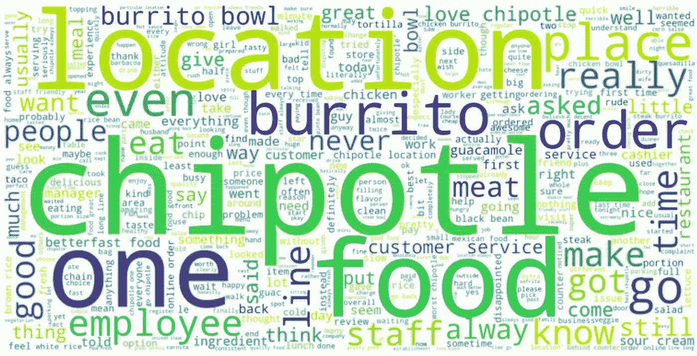
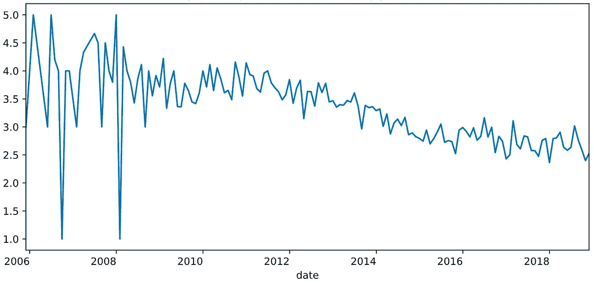
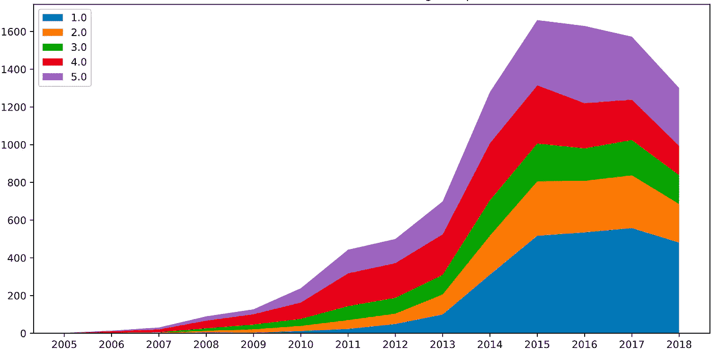
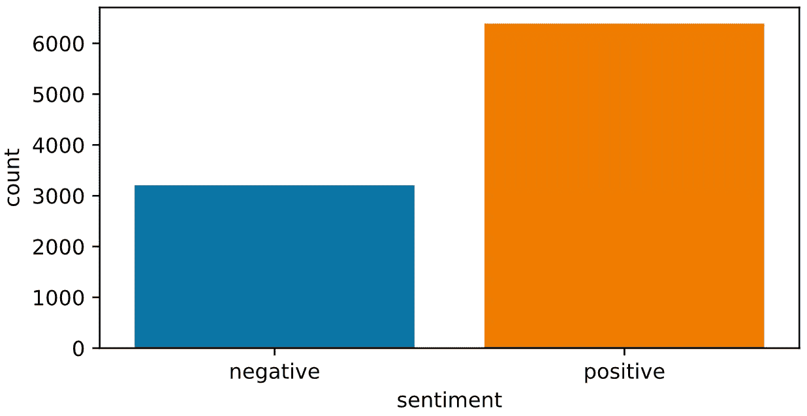
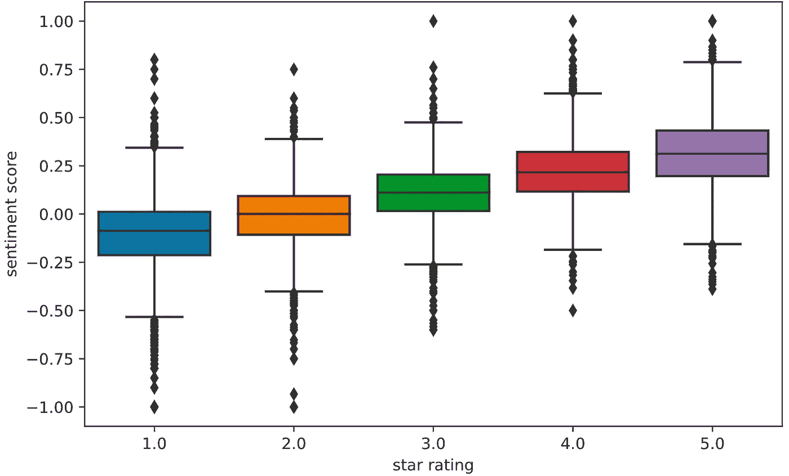
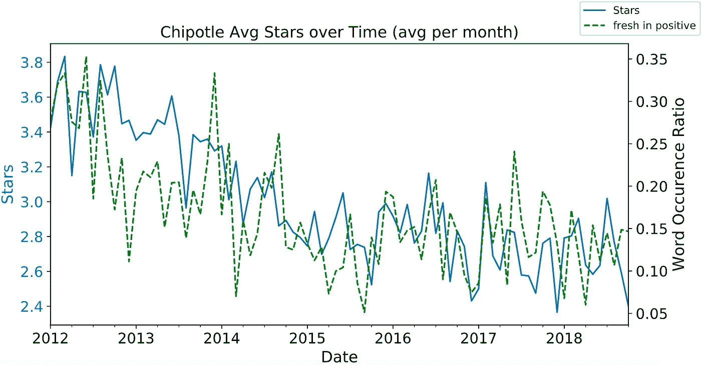
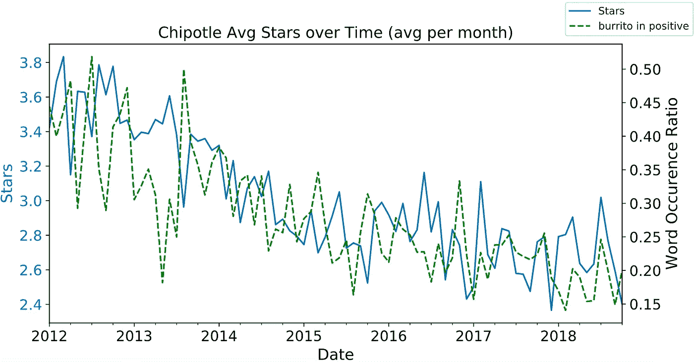
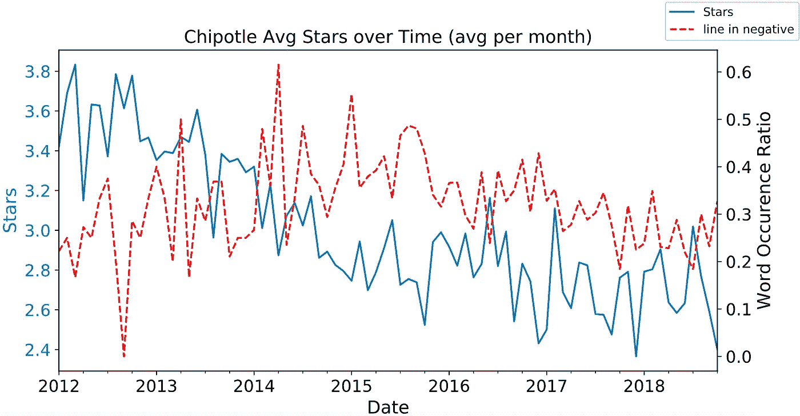
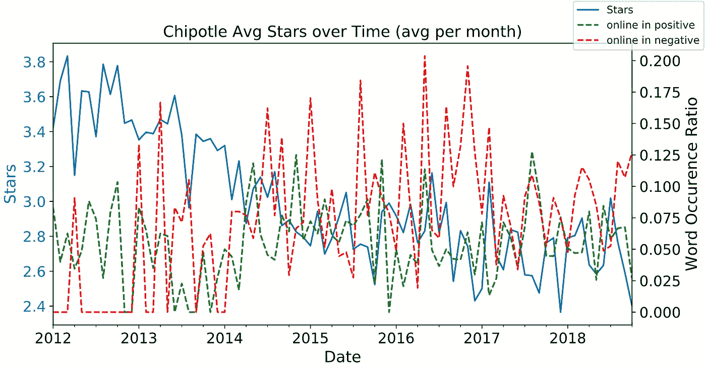
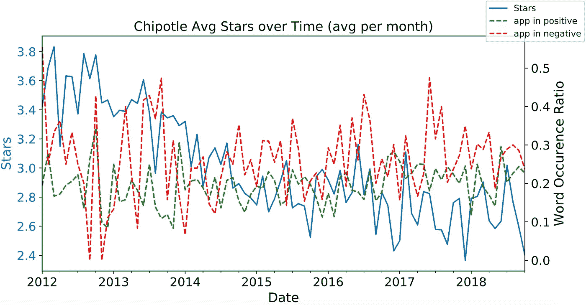

# Chipotle 的下一步是什么？

> 原文：<https://towardsdatascience.com/time-series-analysis-of-chipotles-yelp-reviews-with-natural-language-processing-75e11bf3074f?source=collection_archive---------35----------------------->

## Chipotle 的 Yelp 评论的时间情感分析

词云 Chipotle 的 Yelp 评论中出现频率最高的词

这个作品是基于我们团队[加州大学戴维斯分校 MSBA](https://gsm.ucdavis.edu/msba-masters-science-business-analytics) 项目的机器学习课程的最终项目([浩浩](https://www.linkedin.com/in/haohao1996/)、[杰克叶](https://www.linkedin.com/in/jack-ye/)、[黄毅军](https://www.linkedin.com/in/yijun-huang/)、[李玉婷](https://www.linkedin.com/in/yutingliucd/))。利用自然语言处理，我们用时间序列方法分析了 Chipotle 在 Yelp 上的评论。我们首先对 Chipotle 进行市场调查，以确定其价值、问题和战略因素。然后，我们通过情感分析研究这些关键因素，并揭示 Chipotle 业务的趋势和见解。

# 背景和目标

Chipotle Mexican Grill 由 Steve Ellis 于 1993 年创立，是一家声誉卓著的快速休闲连锁餐厅，每天为 100 多万顾客提供德州-墨西哥美食。Chipotle 采用溢价定价策略，以合理的价格为客户提供最优质的产品。它的品牌建立在“诚信食品”的承诺和关键价值观上，如食品的新鲜度和食材的高质量采购。根据 CSI Market 的数据，[凭借这些战略因素，Chipotle 成功地在竞争中获得了一席之地，并占据了餐饮业 2.4%的市场份额。](https://csimarket.com/stocks/competitionSEG2.php?code=CMG)

然而，自 2015 年以来，由于诺如病毒、大肠杆菌和沙门氏菌等一系列健康问题导致美国大量消费者患病，Chipotle 开始失去客户[其收入在 2015 年和 2016 年大幅下降](https://www.fool.com/investing/2017/01/11/why-chipotle-stock-tumbled-21-in-2016.aspx)。在幕后，消费者对 Chipotle“诚信食品”的承诺失去了信任。据路透社报道，2018 年，Chipotle 关闭了多达 65 家表现不佳的商店，以努力改造和提高盈利能力。

为了重新赢得顾客，Chipotle 实施了几项措施，比如建立新的安全协议和推出新的菜单。它还试图通过引入手机应用程序和在线订购来克服客户等待时间的问题。随着 Chipotle 顺应电子商务的大趋势，变得越来越数字化，我们建议它采取更加数据驱动的方法来改善其业务。通过分析 Yelp 上的评论，Chipotle 可以找到关于其业务关键方面或趋势的宝贵见解，并相应地制定策略来增加收入。

# 数据描述和处理

## 数据描述

对于这个项目，我们利用了 [Yelp 开放数据集](https://www.yelp.com/dataset)。我们首先使用业务 id 合并业务表和评论表。然后我们过滤合并后的表，只包含 Chipotle Mexican Grill 上的 9590 条评论。

## 自然语言处理

我们为每篇评论标注情感。使用 [TextBlob](https://textblob.readthedocs.io/en/dev/index.html) ，我们计算每条评论的情感分数，从-1 到 1。我们将“正面”情绪分配给具有正面情绪分数的评论，“负面”情绪分配给负面分数，“中性”情绪分配给 0 分。接下来，我们对每个评论文本应用停用词移除、否定处理和词条化。

过滤掉不相关的列后，最终的数据集有 9590 行，日期、星级、评论文字、情感评分、情感 5 列。

# 探索性数据分析

我们先看 Chipotle 的星级。通过可视化月度平均星级评分，我们看到 Chipotle 的评分自 2011 年以来一直稳定下降，从 4.0 降至 2.5。

**Chipotle 的月平均星级**

然后，我们可视化所有星级组的评论数量。我们注意到，在所有群体中，一星和二星评论的数量增长最为显著，这可能导致 Chipotle 的整体星级下降。

不同星级组中的评论

我们还创建了评论观点的可视化。

有史以来，正面情绪评论的数量是负面情绪评论的两倍。

正面/负面情绪评论的数量

此外，我们验证了情绪得分随着星级的增加而增加。

查看星级评定组之间的情感分布

# 评论情感的时间序列分析

在以前的 EDA 中，我们揭示了评论的情绪与星级评定密切相关，因此也与业务绩效密切相关。现在，我们感兴趣的是确定对评论情绪贡献最大的因素。我们认为这些因素是 Chipotle 应该注意的关键方面。在这种分析中，我们将这些因素识别为出现频率与星级密切相关的单词。

我们首先通过查看 Chipotle 过去采取的商业策略，建立一个词汇库，或感兴趣的词汇库(WOI ):

> 1.建立新的安全协议(WOI: **新鲜，安全，**等)。)

从健康危机中吸取教训，Chipotle 建立了新的安全协议，将公司定位为“[食品安全行业的领导者](https://www.eater.com/2016/2/2/10900204/chipotle-turnaround-sales-down)这样的协议包括一些规则，比如在新鲜农产品被使用前对其进行分支。

> 2.推出新的菜单项目(WOI: **菜单，卷饼，**等。)

Chipotle 推出了新的菜单项目，如油炸玉米饼和油炸玉米饼。为什么会突然改变？是不是 Chipotle 想在有限的菜单中解决自己的缺点？还是顾客对它的主食墨西哥卷饼失去了兴趣？

> 3.介绍移动和在线订购(WOI: **线下、线上、移动、**等)。)

2014 年，Chipotle 推出了一款移动点餐应用，让顾客在来到餐厅前几分钟点餐并付款。这有助于减少客户排队的时间，改善他们的订购体验。

现在，我们将所选 WOIs 出现率的变化与每月星级的变化一起可视化。正面和负面评审中 WOIs 的出现率正式定义如下:

其中 ***s*** 表示评论情绪(s = *正* / *负* ), ***R*** 指单篇评论， ***N*** 为有情绪 ***s*** 的评论总数， **I** 为指标函数。

我们分析发生率，而不是原始发生数，因为评论的总数每月都在变化。因此，该指标测量在任一情绪类别的评论中 WOI 的归一化频率。我们还决定只分析 2012 年之后的评论，因为 2012 年之前没有足够的评论。

我们从三个方面解释了 WOI 度量的可视化:WOI 在正面/负面评论中的出现率随时间的变化以及 WOI 在两个评论中的出现率的比较。

> 1.正面评价中 WOI 出现率的变化

如果一个词曾经有很高的阳性率，我们可以说它是企业的强项。正比率的下降表明餐厅在这方面正在失去优势。根据下图，Chipotle 应该调查其菜单项的新鲜度及其墨西哥卷饼产品的质量。

如下图所示，Chipotle 的关键值“新鲜”在正面评论中的出现率下降了一半，从 0.3 降至 0.15。

正面评价中“新鲜”的每月出现率

这同样适用于 Chipotle 最重要的产品“墨西哥卷饼”，其出现率从 0.4 降至 0.2。

正面评价中“墨西哥卷饼”的每月出现率

> 2.负面评论中 WOI 出现率的变化

负面评价出现率较高的 WOI 表明 Chipotle 在这方面可能表现不佳。从下图中可以看出，从 2012 年开始,“线”的出现率增加。但从 2015 年开始下降。我们可以推断，2015 年的转折点是由 Chipotle 在 2014 年推出其移动点餐 app 引起的，该 app 旨在减少 line。从这个意义上说，Chipotle 通过数字订购减少顾客等待时间的策略是成功的。展望未来，Chipotle 应该继续推行这一举措。

负面评价中“线”的月出现率

> 3.两种综述中 WOI 发生率的比较

如果一个 WOI 在正面评论中的出现率比负面评论中的出现率高，我们说它带有正面情绪。因此，当一个本身中立的 WOI 在正面评论中的出现率高于负面评论时，它可以被视为该业务的一个积极方面。反之亦然。

“在线”和“应用程序”都是中性词，但在负面评论中的出现率始终高于正面评论。这表明 Chipotle 在数字商务渠道中表现不佳。它需要改进其移动订购应用程序和在线订购系统，以增强客户的购买体验。

# 商业见解和建议

根据我们的分析结果，我们在配料质量、等待时间和数字订购方面向 Chipotle 提出了建议。

通过可视化关键词“新鲜”随时间的出现率，我们发现“新鲜”正在慢慢消失在正面评论中。这表明，从消费者的角度来看，Chipotle 正在失去其在采购新鲜食材方面的优势。因此，Chipotle 应该调查其原料的新鲜度和质量，以重新获得战略优势。就其菜单产品而言，Chipotle 需要调查其最重要的产品墨西哥卷饼的当前质量，这种产品在正面评价中越来越少。Chipotle 需要调查为什么它的主食对顾客失去了吸引力。

另一方面，等待时间和排队显然是 Chipotle 的一个问题。我们的市场研究和数据分析都指出,“线”是导致顾客对 Chipotle 产生负面情绪的一大因素。为了解决这一问题，Chipotle 已经寻求在线订购和移动应用订购等数字渠道来改善这一问题。我们的情感分析显示，移动点餐应用的推出对等待时间产生了一些积极的影响。然而，这还不够。我们发现“在线”和“应用程序”在顾客评论中的负面影响更大，表明顾客对 Chipotle 的数字订购体验不满意。有鉴于此，Chipotle 需要改进其在线订购系统和移动应用程序，以便更好地解决等待时间问题并改善客户购买体验。

# 结论

在这篇博客中，我们比较了用户评论中词出现的变化，以揭示导致 Chipotle 的 Yelp 评级变化的关键因素。结合市场研究和 NLP 工具，我们揭示了对 Chipotle 业务状况的宝贵见解，并相应地提出了建议。这种分析管道也可以应用于其他衰退业务的评估，以形成见解和行动。