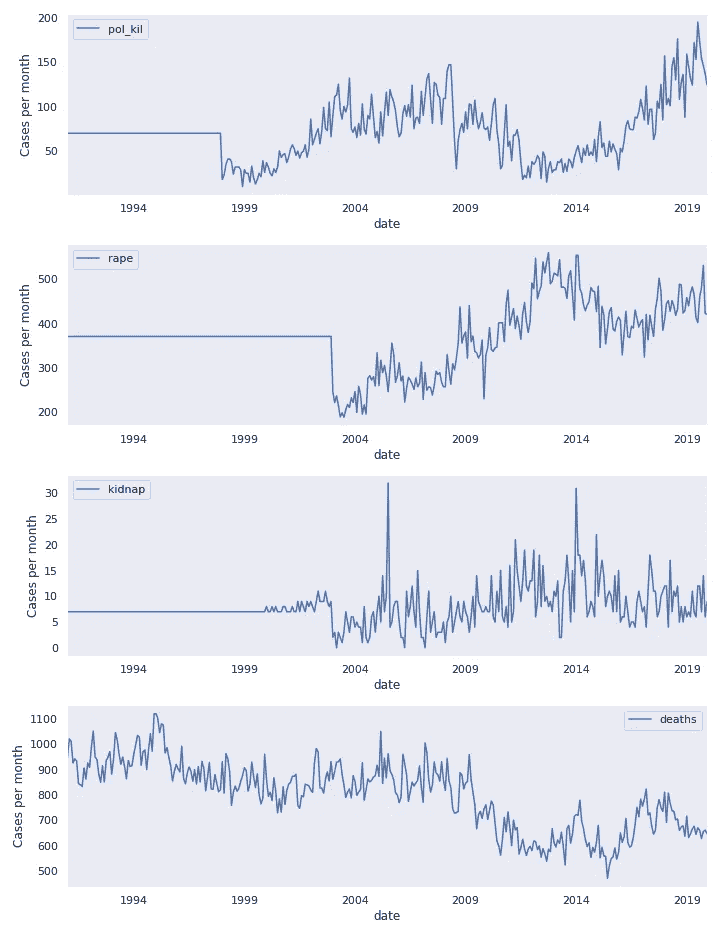
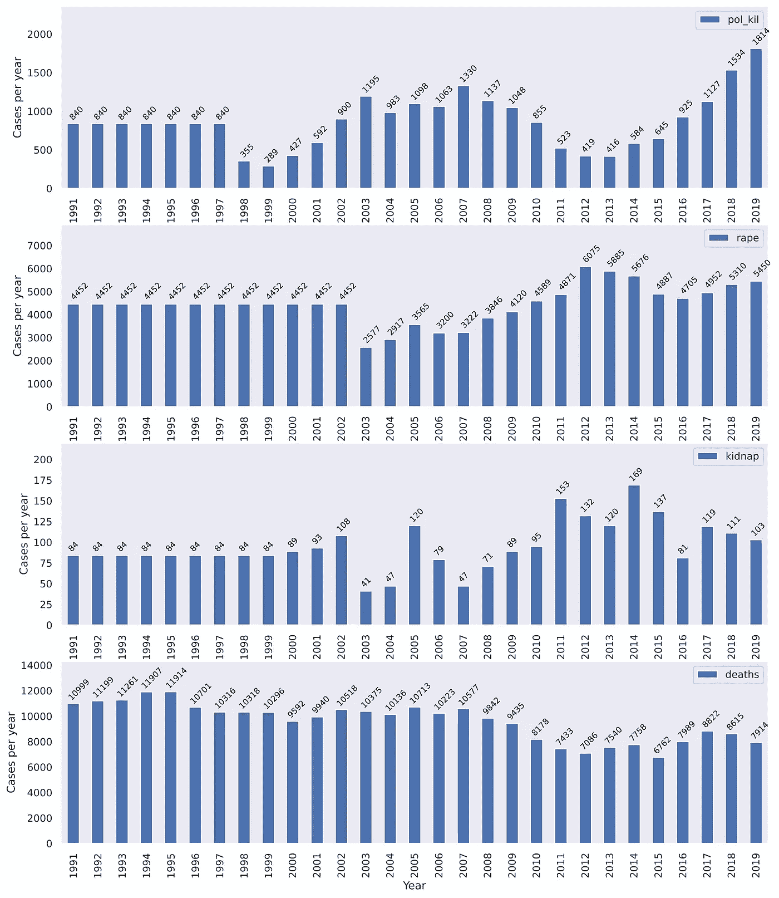
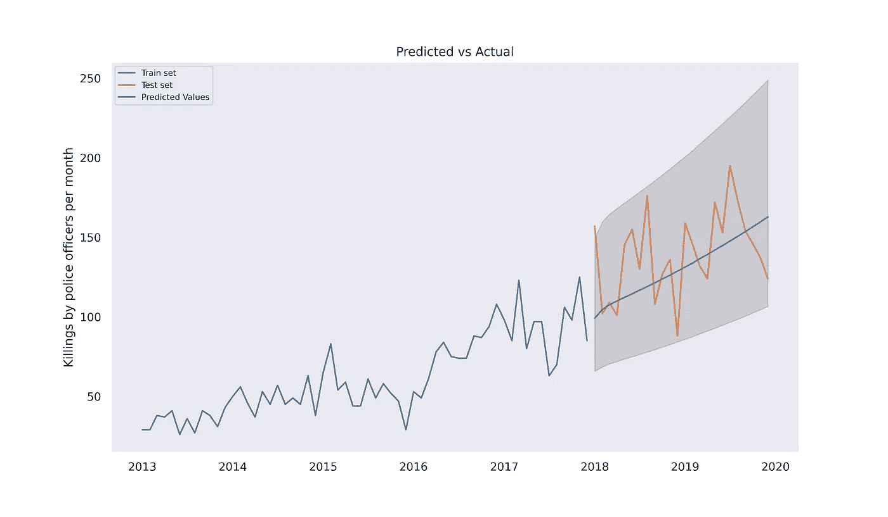

# 里约热内卢暴力事件的时间序列分析

> 原文：<https://towardsdatascience.com/time-series-analysis-of-violence-in-rio-de-janeiro-310067976b7?source=collection_archive---------59----------------------->

## 警察造成的平民死亡人数如何影响该州的暴力犯罪率

乔治·弗洛伊德的死在美国争取人权和反对种族主义的斗争中留下了深刻的印记。发布在互联网上的令人震惊的视频展示了事件是如何发生的，使得世界各地的人们走上街头，要求结束种族主义和适当的警察行为。考虑到这一点，我决定寻找更多关于巴西如何与这些话题相关的数据，并找到了 BBC 的这份[出版物](https://www.bbc.com/news/world-latin-america-51220364)，其中显示了**2019 年里约热内卢州警察杀人的记录。**

里约热内卢因是世界上最美丽的地方之一而闻名。不幸的是，它也被认为是一个非常暴力的城市，有很高的犯罪率和公共安全问题。

里约热内卢 Pixabay 摄于 Pexels

在英国广播公司的文章中，可以读到安全机构在过去实施的“对抗政策”，以帮助降低凶杀率。

所以我决定自己查看里约热内卢州的整体暴力数字，看看警察杀人数量的增加是否反映了暴力犯罪率的实际下降。

# 数据分析

我将把研究重点放在需要当局密切关注的更暴力的犯罪上:任何犯罪情况下的强奸、绑架和平民死亡。这项研究将包括时间序列趋势分析、相关性验证和时间序列预测。变量描述如下。

**图例:**

*   `pol_kil`是被警察杀死的人数。
*   `rape`是官方公布的强奸受害者人数
*   `kidnap`是特定时期绑架案件的总和
*   `deaths`是在犯罪情况下丧生的平民人数。这是数据集所有涉及平民死亡的列的总和。
*   `ano`和`mes`分别是案件发生的年份和月份。

经过适当的预处理后，可以将时间序列绘制成图表进行初步验证。由于自 1991 年以来没有收集所有变量的数据，一些图表中会出现一些直线。

作者图片

可以从这些变量的时间序列中获得一些信息:

*   警察杀人——据 BBC 报道，警察造成的平民死亡人数正在显著增加。这是自 1991 年开始记录这一数据以来的最高数字。
*   强奸——从 2003 年到 2019 年，该州每月官方公布的强奸案件增加了一倍多。实际的强奸数量在增加吗？还是这些年来更多的受害者开始报案并提出指控？结果可以有多种解释，结论也完全不同，因此批判性思维是基础，必须提出额外的数据来支持任何新的理论。**根据现有信息，也不可能说强奸案件正在随着时间的推移而减少。相反，公共机构应该检查更多的数据，如果犯罪率确实在上升，他们需要从根本上采取行动。**
*   绑架——案件也呈上升趋势，但我们可以在图表中看到峰值，显示与平均行为相比，月与月之间的变化很大。
*   死亡——2007 年至 2013 年，犯罪事件中的死亡人数大幅减少。然后震荡，从 2016 年开始再次回升。如果我们看看强奸的时间序列，2016 年也是趋势发生变化的一年。

对此很感兴趣，我在网上快速搜索了一下 2016 年里约热内卢的公共安全，想起了一个重要的事实:**那是里约热内卢举办奥运会的一年。许多出版物，比如路透社的这篇文章，讨论了在安全措施方面的投资是多么糟糕，而这些投资仅仅足以掩盖奥运会期间的暴力事件。奥运会结束后，资源明显减少，随之而来的是暴力犯罪又卷土重来。这是这个数列的一个可能的理论。**

但自 2007 年以来，死亡人数一直在减少，因此对奥运会的投资只是故事的一部分。有趣的是，从 2007 年到 2013 年，暴力犯罪的死亡率随着警察杀人的减少而下降。对 2007 年至 2013 年的安全政策历史进行更详细的调查，有助于开发新的想法，并改善打击犯罪的工作。

现在，抛开每年的长期趋势不谈，逐月变化可以更好地理解。下图显示了研究中每个变量每年的总病例数。

在强奸、绑架和谋杀的受害者中，每年有超过 1 万人直接受到里约热内卢暴力事件的影响。在巴西的一个州，每天有超过 27 人经历将结束他们生命或严重改变他们生命的事件。这还不包括抢劫、伤害以及这种情况带来的心理影响。

在第一张图表中，我们还可以看到在警察行动中死亡的人数从 2013 年的 416 人增加到 2019 年的 1814 人。6 年增加到 4.36 倍。**然而，在这段时间内，暴力犯罪的趋势并没有下降。**2019 年的数字与 2013 年几乎相同。

所以，我决定看看变量之间的相关性。如果有任何迹象表明其中一个方面的变化可以反映在其他方面，我会在相关矩阵中看到它。

作者图片

表中最强的相关性是死亡和年数之间的相关性，这表明犯罪事件中的死亡总数正在随着时间的推移而减少。但这种相关性是对整个数据集的分析，从 1991 年到 2019 年，所以这与最近几年没有严格的关系。**当我们审视警察杀人时，没有迹象表明这与犯罪率的任何变化有很强的相关性。**

然后我决定用现有的数据来看看这些数字未来几年的趋势。在预测中，我只使用了 2012 年对抗政策开始后的汇率。我还使用扩展的 Dickey-Fuller (ADF)测试来测试时间序列的平稳性，以确保模型具有代表性。在对数据集做了一些转换后，我将自回归综合移动平均(ARIMA)模型应用于警察杀人事件，并将其绘制在图表中。

作者图片

该模型似乎很好地预测了结果，并且没有显示出未来几年斜率变化的迹象。这意味着，如果不采取重大行动改变里约热内卢的公共安全方式，未来几年可能会有越来越多的人在警察行动中丧生。

# 结论

这项研究的目的是了解里约热内卢州过去几年实施的“对抗政策”是否有助于降低犯罪率。对里约热内卢州的暴力犯罪数量进行简要分析后，我们可以得出几个问题和结论:

*   6 年来，警察与嫌疑犯对峙时的杀人事件增加了 4 倍多。这不是随机变化，因此可能是不同安全程序或措施的结果。
*   官方公布的强奸案数量正在增加，但是在得出实际暴力增加的结论之前，还需要更多的数据。在这种类型的犯罪中，子通知被认为是一个问题，其结果也可能意味着更多的受害者站出来报案。然而，不能忽视这些数据，安全机构必须采取行动，确保强奸率不会上升。
*   绑架案件在几个月和几年内波动很大，因此不可能根据现有数据将最近的下降归因于任何原因。**需要更多的信息，以确保这不是一个常见的原因变异。**
*   如果我们分析自 1991 年以来的整个数据集，犯罪情况下的平民死亡有减少的趋势。然而，自 2013 年警察杀人事件开始增加以来，T4 没有减少的迹象。被警察杀害的人数与强奸、绑架和刑事案件中的死亡人数之间也没有很强的相关性。
*   最好的假设是，犯罪率和警察杀人都是其他因素的因变量，如街上警察的数量、与罪犯对峙的次数以及关键地区主要警察行动的数量。然而，重要的是要再次记住，从 2007 年到 2012 年，死亡率持续下降，警察杀人事件也持续下降，因此有比使用暴力更好的替代方法来解决这个问题。
*   运行时间序列预测分析我们可以看到**被警察杀害的人数预计在未来几年还会上升。由于新冠肺炎的隔离，2020 年肯定会是一个例外，但需要采取实际行动来确保数字不会回升。乔治·弗洛伊德死后的抗议活动可能会引发新的讨论和新的想法，以更好地解决里约热内卢的暴力问题。**

公共安全问题涉及数百个变量，解决方案不仅需要公共安全机构的巨大努力，也需要整个政府的巨大努力。这一分析的目的是用一些额外的数据来扩展 BBC 文章中的讨论，并可能提出新的理论，这些理论可以在我们通往更加平等与和平的社会的道路上进一步研究。利用现有的数据集可以进行许多其他分析，所以我鼓励人们和组织这样做，并把相关信息带给人们。在这一代人中，个人的个人观点可以影响成千上万的人，我真的相信我们必须透过表面，依靠数据来解决我们社会的问题。

如果你想了解分析的更多细节，你可以查看我的 GitHub 中的完整研究。在接下来的几周里，我会发布一些非常好的文章，如果你喜欢这篇文章，请查看我的[媒体](https://medium.com/@dp.alcalde)或 [LinkedIn](https://www.linkedin.com/in/diegopesco/) 个人资料！感谢您的阅读！