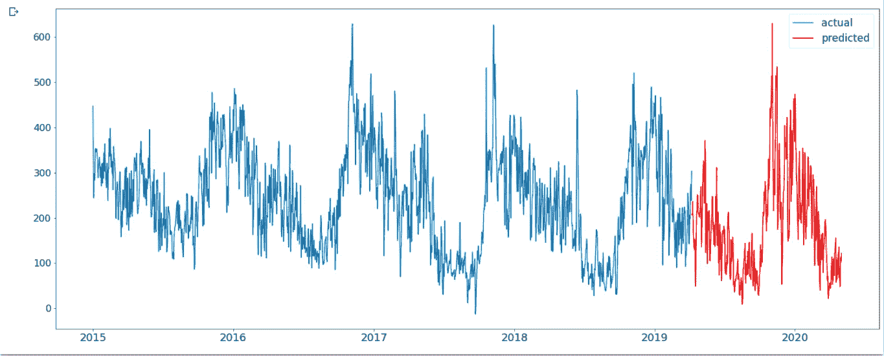

# Tensorflow 中多元数据的时间序列分析

> 原文：<https://towardsdatascience.com/time-series-analysis-on-multivariate-data-in-tensorflow-2f0591088502?source=collection_archive---------19----------------------->


杰森·布里斯科在 [Unsplash](https://unsplash.com?utm_source=medium&utm_medium=referral) 上的照片

# 什么是时间序列分析

通俗地说，时间序列分析处理的是主要用于从过去的值预测未来值的时间序列数据。应用范围可以从预测股票、原油等商品的价格、汽车等产品的销售、洗发水等快速消费品的销售，到预测特定地区的空气质量指数。时间序列可以分为单变量和多变量时间序列。单变量时间序列数据仅由随时间记录的单个观察值组成，而多变量时间序列由与我们感兴趣的主题相关的多个观察值组成。本文的重点将放在多元数据上。

# 从 Kaggle 获取数据:

为了执行时间序列分析，我们需要数据来构建我们的模型；为此我们将参考来自 [kaggle](https://www.kaggle.com/) 的公开可用数据集。对于本文，我们将使用**印度主要城市过去五年的空气质量指数**数据，在[链接](https://www.kaggle.com/rohanrao/air-quality-data-in-india)中提供。要将数据直接下载到 Google Colab，您可以参考以下链接:

 [## 在 Google Colab |数据科学和机器学习中下载 kaggle 数据的最简单方法

### 针对我们社区的活动和主题| Kaggle 论坛

www.kaggle.com](https://www.kaggle.com/general/74235) [](/setting-up-kaggle-in-google-colab-ebb281b61463) [## 在 Google Colab 中设置 Kaggle

### 一个简单的新手教程

towardsdatascience.com](/setting-up-kaggle-in-google-colab-ebb281b61463) 

如果您遵循了必要的步骤，您应该在下载的数据中看到以下文件。我们对 city_day.csv 文件感兴趣。


让我们选择分析所需的数据。我们将选择与德里市相对应的最近两年的数据。该数据有 1948 行和 15 列，包括我们想要为其建立模型的 AQI。

通过检查数据，我们发现我们的数据包含缺失值。因此，在开始分析之前，我们用每一列的平均值填充缺失值，去掉不必要的列。

现在我们已经有了数据，让我们进入下一部分。

# 时间序列的组成部分

顾名思义，时间序列数据由单个或多个观测值/变量组成，这些观测值/变量是在一个确定的时间间隔内顺序记录的。时间序列数据有多个方面，我们将通过执行一些探索性数据分析来了解这些方面:

## 季节性

在时间序列数据中，季节性是指数据中以固定间隔(通常少于一年)出现的周期性变化。一些例子是，圣诞节期间零售/电子商务销售的高峰，冬天期间保暖衣服销售的增加，等等。季节性可以通过查看图表本身来发现。下面的代码呈现了一个图表，看着它，我们可以说，尽管有几个波峰和波谷，但它们并不是以固定的间隔出现的，因此数据不是季节性的。


## 趋势

在时间序列数据中，趋势是指数据的总体趋势，无论是随着时间的推移而增加还是减少(长期方向)。看上面的图表，我们可以说数据的总趋势是既不增加也不减少，而是一个恒定的趋势。

## 不规则

不规则或随机成分是无法预测的。大多数情况下，它们持续时间短，不重复，并且由于不可预见的事件而发生。

## 周期性

当上升和下降模式存在，但不是在一个固定的时间间隔，然后它被称为周期性。一个例子可以是考虑一个国家的 GDP 数字，当绘制在一个相对于时间的图表上时，它会在衰退期间看到巨大的下降，如 1929 年、2000 年和 2008 年，但这些间隔不是固定的。因此，从上图中，我们可以说我们的数据是周期性的。

## 自相关

它意味着当前值与其过去值的相关性。自相关函数衡量当前序列与其滞后序列(过去值)的相似程度。AQI 指数的 ACF 图在蓝色区域上方显示尖峰，这表明该序列是自相关的。同样，您也可以检查数据集的其他系列的自相关。


## 平稳性:

如果一个时间序列的相应统计特性(如均值、标准差和自相关)在整个时间内保持不变，则称该时间序列是平稳的。为了检验多元时间序列的平稳性，我们对以数组形式返回特征值的时间序列进行 Johansen 协整检验。如果特征值小于 1，则称该级数是平稳的。


johansen 协整检验的特征值

因为我们得到的值小于 1，所以这个数列是平稳的。

# LSTMs 在时间序列数据建模中的应用

递归神经网络(RNNs)是一种用于建模时间序列和自然语言等数据序列的神经网络。常规神经网络将一些信息 x 作为输入，并输出一个值 y。一层的输出不会馈入另一层。

RNNs 通过将一层的输出环回至另一层来克服这一缺点。

这意味着 RNNs 应该能够基于先前数据的上下文来预测接下来会发生什么，但是在实践中，RNNs 仅在该上下文和预测之间的差距很小时才解决该问题，并且如果该差距变得很大，则表现很差。幸运的是，长短期记忆解决了这个问题，它是一种特殊类型的 RNNs。

如上所述，RNNs 记住了序列中的每个信息，这导致了消失梯度的问题。在反向传播期间，梯度变得如此之小，以至于隐藏层在更新时学习得非常少。LSTMs 解决了这个问题，同时只记住相关信息并丢弃其他信息。rnn 只有一个激活功能，而 LSTMs 有一系列激活功能和门，通过它们来执行这个任务。

现在我们对 LSTMs 和它们的用途有了一些了解，让我们继续构建我们的模型。

## 数据准备

到目前为止，我们已经将超过 100 个数据加载到我们的机器中进行建模.经过一些检查，我们发现我们的数据不包含任何 NULL 或 NaN 值。当我们通过机器学习建模执行时间序列分析时，我们需要将数据转换为因变量(y)和自变量(X)的形式。这里我们的因变量是空气质量指数和其他变量，如 PM2.5、PM10、NO、NO2…..等等都是自变量。

我们将缩放数据以更快地处理它，并消除由于数据范围造成的偏差。现在我们需要按照 80:20 的比例将数据分为训练数据和测试数据。请注意，由于我们正在执行时间序列分析，我们不能将数据随机分为训练和测试，正如我们在建立其他机器学习模型时所做的那样，否则，该模型将找到最重要的本质，即时间。

## 创建和拟合模型

我们将使用 Tensorflow 库顶部的 Keras API 来构建我们的模型。下面是我们模型架构的蓝图。

```
model.add(LSTM(hidden_nodes, input_shape=(timesteps, input_dim)))
model.add(Dropout(dropout_value))
model.compile(loss, optimizer)
```


LSTM 网络的输入形状

**hidden_nodes:** 隐藏层的神经元个数。我们将取出 250 个神经元

**剔除:**用于减少模型的过拟合。根据经验，它被设置为 20%。

**编译:**编译函数将接受损失和优化器等参数。这里我们将把**平均绝对误差**作为误差度量，把 **Adam** 作为优化算法。


历元期间的训练和测试损失

## 预测并比较这些值:

在拟合模型之后，我们将在测试数据上检查我们的模型的性能。由于我们在拟合模型之前先对数据进行了归一化处理，因此我们必须对其进行反向缩放，以恢复原始比例的值。

现在我们已经有了测试数据集和原始测试数据的预测值，让我们通过计算 RMSE 并将它们绘制在一起来比较两者。

火车 RMSE: 41.096

测试 RMSE: 30.493


对于我们的模型来说，训练和测试数据上的 RMSE 没有太大差异，这是一个很好的指标。请注意，每次构建和运行模型时，您可能会获得不同的 RMSE 值。

时间序列预测可以说是单步或多步预测，这取决于它能够预测未来的时间步数。基于从我们的训练数据训练的模型，我们预测对应于测试数据的时间框架的未来值，因此它是多步预测。还记得我们在文章开头看到的 AQI 的图表吗，根据模型的预测，图表看起来是这样的:



# 结论:

1.  在本文中，我们看到了如何使用 RNN-LSTM 建立一个多元时间序列模型，因为他们擅长从序列数据中提取模式。

2.时间序列数据不应该被随意划分为训练集和测试集，因为这样会失去其最重要的本质，即时间。

3.传统的时间序列预测方法如 ARIMA 方法有其局限性，因为它只能用于单变量数据和一步预测。

4.在各种研究中观察到，深度学习模型在多元时间序列数据上优于传统的预测方法。

5.由于提供的数据包含季节性，我们可以进一步降低数据的季节性，以便我们的模型可以专注于潜在的信号。

您可以在这里找到本文的完整代码