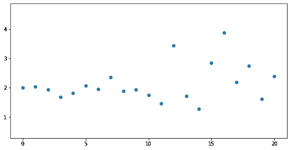
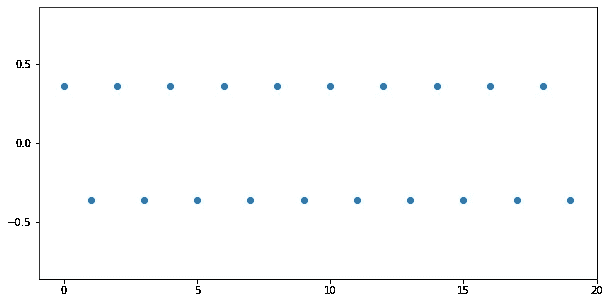
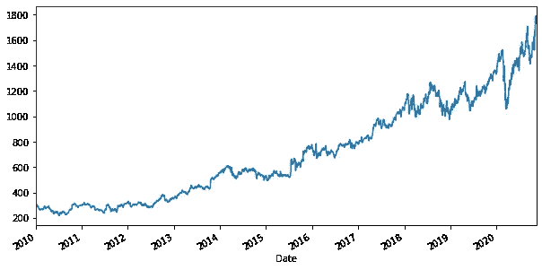
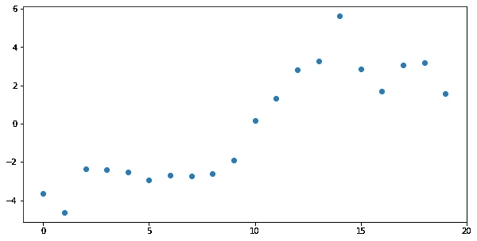
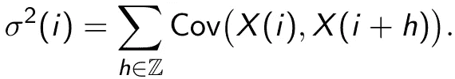

# 时间序列分析—第一部分/第二部分

> 原文：<https://towardsdatascience.com/time-series-analysis-part-i-3be41995d9ad?source=collection_archive---------11----------------------->

## [入门](https://towardsdatascience.com/tagged/getting-started)

## 从独立同分布到相依非平稳数据

[澳门图片社](https://unsplash.com/@macauphotoagency?utm_source=medium&utm_medium=referral)在 [Unsplash](https://unsplash.com?utm_source=medium&utm_medium=referral) 上拍摄的照片

17 世纪热那亚大议会的选举和 21 世纪全世界的股票价格有什么共同点？它们在某种程度上是随机的，人们在它们上面下注(见[1])。从简单的概率游戏到复杂的衍生品，人们试图(现在仍然试图)通过模拟随机性来赚钱。

18 和 19 世纪概率论的突破包括伯努利大数定律和德莫维尔-拉普拉斯定理(中心极限定理的早期版本)。两者都基于对给定观测值的强有力假设。随着现代概率论的发展，这两个结果被推广到许多方向，并被证明在相当弱的假设下成立。今天，从业者和数据科学家可以利用时间序列分析的各种工具，即允许数据的时间依赖性，甚至允许基本数据生成过程的分布变化的方法。

对于数据科学家来说，能够处理时间序列尤其重要，因为在高层次上，生产中的任何机器学习模型的[质量都是时间序列](/monitoring-ml-models-in-production-768b6a74ee51)，因此应该进行相应的分析。

在这个小型系列的第一部分中，我们介绍了理解 *i.i.d.* 数据和时间序列之间的差异所需的基本概念。

在下一部分的[中，我们将对独立性和稳定性这两个常见假设进行测试，并查看它们在 Python 中的实现。](/time-series-analysis-part-ii-ii-bece7ecc9647)

## 独立性ˌ自立性

让我们去一个可以说是概率论和统计学中许多理论出现的地方:一个赌场。如果我们玩轮盘赌，一轮的结果似乎不会影响下一轮的结果。任何给定数字的概率都是 1/37，因为总共有 37 个数字。同样的数字下一轮再出现的概率还是 1/37。如果连续出现 10 个“红”，下一轮出现另一个“红”的概率与之前相同，即 18/37，因为有 18 个红色和 19 个非红色数字。几轮轮盘赌的结果是*独立*。

相反，当用一副普通的扑克牌玩扑克，并且我们的第一张牌是黑桃 a 时，抽到另一张黑桃 a 的概率应该为零。否则，那里会发生一些事情…无论如何，从一副牌中抽牌的结果是*相关的*。

上面的例子说明了独立的概念。数学上，两个实值随机变量 *X* 和 *Y* 如果联合概率“因式分解”是独立的，即 *P(X ≤ x，Y ≤ y) = P(X ≤ x) P(Y ≤ y)* 对于任意实数 *x* 和 *y* 。如果概率没有因选择 *x* 和 *y* 而分解，则随机变量是相关的。这看似数学上的吹毛求疵，却是一个非常重要的概念，因为单个概率 *P(X ≤ x)* 和 *P(Y ≤ y)* 比联合概率更容易处理。如果我们处理的不仅仅是两个，而是 n 个随机变量，那就更是如此了。

图 1:具有不同方差的独立数据，x 轴:时间，y 轴:数据值——作者图片

## 相同分布

回到我们新喜欢的地方，赌场，我们可以观察更多。特定事件的概率，例如轮盘赌桌上的“红色”，在每个轮盘赌桌上是相同的。类似地，某张牌的概率，比如黑桃 a，在任何牌桌上都是一样的。在两种情况下，分布都是相同的。

再次，有一个数学定义将这个概念形式化:两个实值随机变量 *X* 和 *Y* 是*同分布*如果 *P(X ≤ z) = P(Y ≤ z)* 对于任意实数 *z* 。同样，这一数学特性极大地简化了统计分析。

图 2:相同分布和相关的数据，x 轴:时间，y 轴:数据值——作者图片

# 时间序列

满足独立同分布两个条件的随机变量序列 *X(1)，…，X(n)* 称为*独立同分布*或*I . I . d .*。统计学中的许多重要结果，如*中心极限定理*，都是首先为独立同分布随机变量制定的。在某些情况下，独立同分布数据的假设可能是合理的，但在许多领域，感兴趣的数据既不是独立的，也不是同分布的。

例如，股票今天的价格取决于昨天的价格，股票的波动性可能会随着时间的推移而变化，这意味着基础分布的变化。

图 3:谷歌股票的美元价格，x 轴:时间，y 轴:股票的美元价格——作者图片

在这些情况下，我们希望放松独立同分布数据的强假设，并拥有一种对既不是独立的也不是同分布的数据有效的方法，这就是时间序列发挥作用的地方。

一个*时间序列*是由时间索引的随机变量的集合，例如 *X(1)，…，X(n)* 。特别地，随机变量可以是相关的，并且它们的分布可能随时间而改变。由于这个定义不能确保大量的结构，我们需要一些额外的假设来推导出有意义的结果。

图 4:具有相关数据和时变平均值的时间序列，x 轴:时间，y 轴:时间序列的值——作者图片

## 平稳性(强、弱、局部)

时间序列的定义并不意味着对基本分布的任何限制。所以理论上，这种分布在任何时候都可能完全改变。这种行为不允许太多的统计推断，并且经常受到平稳性假设的限制。如果一个时间序列的分布不随时间变化，则称其为*平稳*。

例如，在定量金融中，在有效市场假设下，对数收益通常被假定为平稳的。

更正式地说，一个由整数索引的时间序列 *X(i)* 是*(强)平稳的*，如果对于任何实数 *x₁、x₂,…、xₖ* 和任何整数 *t₁、…、tₖ* 和 *h* 它保持*p[x(t₁]≤x₁、x(t₂)≤x⊙、…，x(t𔔭)≤x𔔭]= p*

在实践中，许多时间序列是平稳的，如某些 ARMA 模型，大量的文献都是基于这一假设。然而，在其他情况下，这种假设可能过于严格。因此，平稳性的第一个松弛是弱平稳性，这基本上意味着期望值和协方差结构不随时间改变。形式上，一个方差有限的时间序列 *X(i)* 是*弱平稳*如果 E[*X(I)*]= E[*X(0)*和 E[*X(I)X(I+h)*]= E[*X(0)X(h)*对于任意时刻 *i* 和任意整数 *h 请注意，平稳性意味着弱平稳性，而不是相反。*

我们在实践中遇到的大多数时间序列可能是(弱)平稳的，或者可以通过差分或其他变换转换成平稳的时间序列。然而，还有第三个不太为人所知的概念，我想简单地提一下，但不涉及太多细节。考虑一系列 i.i.d .误差 *ε(1)，ε(2)，…，ε(n)* 和一个连续函数 *μ* 。那么 *X(i，n) = μ(i/n) + ε(i)* 显然不是平稳的。但是，它可以通过一族平稳时间序列进行局部近似，即对于任何 *u* 使得 *i/n* 接近于 *u* ， *X(i，n)* 接近于 *Y(i|u) = μ(u) + ε(i)* 。该模型是称为*局部平稳*的更大时间序列类别的一部分，文献中对局部平稳性有不同的定义，允许使用不同的方法(参见[2]、[3]或[4])。每当基本分布平稳变化时，局部平稳时间序列自然出现。一个重要的例子是全球气候，它随着时间逐渐变化。

## 依赖结构

不仅时变分布，而且相关结构也给统计分析带来了额外的挑战。很难直接测量随机变量之间的相关性，因此我们经常使用它们的相关性作为代理。如果两个随机变量 *X* 和 *Y* 的协方差 Cov( *X，Y* )为零，则它们*不相关*。根据经验，协方差越大，两个随机变量的相关性越强。注意，两个随机变量的独立性意味着不相关，但反之则不然。

为了测量整个时间序列的相关性，我们使用类似的方法。对于整数索引的时间序列 *X(i)* ，我们将*长期方差*定义为

对于平稳时间序列，和中的(自)协方差不依赖于 *i* 和σ ( *i* )=σ。如果 *X(i)* 是一个独立同分布的随机变量序列，那么长期方差就是简单的方差 Var( *X(i)* )。我们将在后面看到长期方差所起的作用类似于中心极限定理中的方差。当然，长期方差定义中的级数是否收敛还不清楚。事实上，我们说一个时间序列是*弱*或*短程相关*如果该序列收敛并且长期方差存在。如果长期方差发散到无穷大，则时间序列是*长期相关的*。

直观上，如果过去的事件对当前时刻时间序列的值只有很小的影响，则时间序列是弱相关的。例如，去年的温度对今天的温度影响很小，而昨天的温度影响较大。

有不同的概念暗示弱相关性，例如不同的*混合条件*、*弱物理相关性*或*累积条件*。对于应用中的大多数时间序列，这些条件应该得到满足，并且使用基于它们的方法是合理的。

## 包裹

到目前为止，我们已经看到了独立性和同分布的概念，以及从独立同分布数据到时间序列的推广。在这个小系列的第二部分中，我们将使用中心极限定理来进一步探索独立同分布数据和时间序列之间的差异。

作为数据科学家，我们日常使用的许多工具都是基于独立性或平稳性的假设。在这些情况下，确保假设得到满足是至关重要的。在下一部分中，我们将看到如何在实践中测试这些假设。

[1] D. R. Bellhouse，热那亚彩票(1991 年)，统计学家。Sci。6，第 2 号，第 141 至 148 页。doi:10.1214/ss/1177011819。[https://projecteuclid.org/euclid.ss/1177011819](https://projecteuclid.org/euclid.ss/1177011819)
【2】r .达尔豪斯，关于局部平稳过程的 Kullback-Leibler 信息散度(1996)，随机过程及其应用，62(1)，139–168。
[3]周，吴文波，非平稳时间序列的局部线性分位数估计(2009)，统计年鉴，37(5B)，2696–2729。
[4] M. Vogt，局部平稳时间序列的非参数回归(2012)，统计年鉴，40(5)，2601–2633。