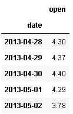
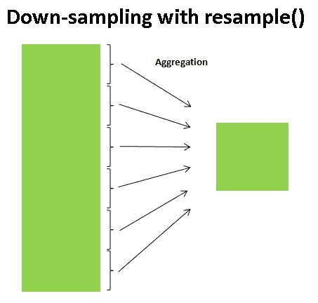
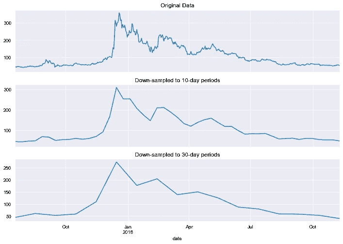
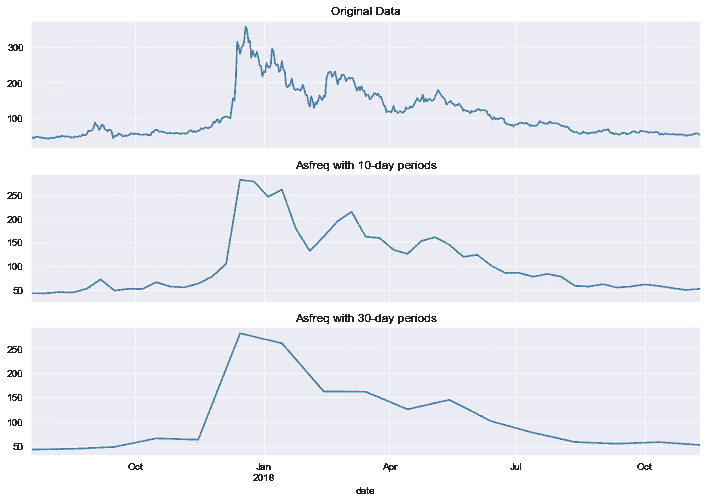
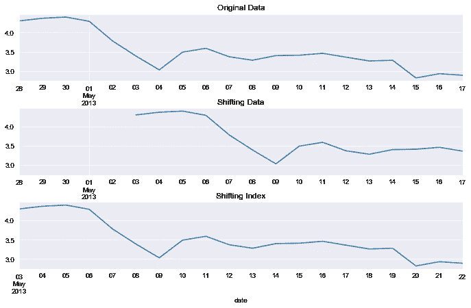
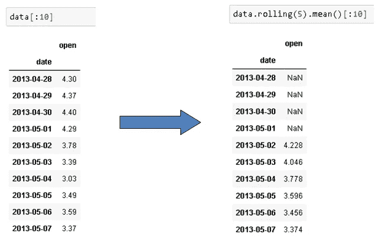

# 时间序列分析:重采样、移位和滚动

> 原文：<https://towardsdatascience.com/time-series-analysis-resampling-shifting-and-rolling-f5664ddef77e?source=collection_archive---------3----------------------->

## 如何重新组织时间序列数据

时间序列数据有许多定义，所有这些定义都以不同的方式表示相同的含义。一个直截了当的定义是，时间序列数据包括附加到连续时间戳的数据点。时间序列数据的来源是周期性的测量或观察。我们观察很多行业的时间序列数据。仅举几个例子:

*   一段时间内的股票价格
*   每日、每周、每月销售额
*   过程中的定期测量
*   一段时间内的电力或天然气消耗率


克里斯·利维拉尼在 [Unsplash](https://unsplash.com/s/photos/stock-price?utm_source=unsplash&utm_medium=referral&utm_content=creditCopyText) 上的照片

机器学习的进步增加了时间序列数据的价值。公司将机器学习应用于时间序列数据，以做出明智的商业决策，进行预测，比较季节性或周期性趋势。欧洲粒子物理研究所的大型强子对撞机(LHC)通过对亚原子粒子的测量产生了大量的时间序列数据。所以，它无处不在。处理好时间序列数据对于这类领域的数据分析过程至关重要。Pandas 是由 Wes Mckinney 创建的，旨在提供一个高效灵活的工具来处理财务数据。因此，对时间序列数据进行处理是一个非常好的选择。

在这篇文章中，我将介绍三种非常有用的操作，它们可以对时间序列数据进行操作。

*   重采样
*   改变
*   旋转

我们先导入数据。我将使用 Kaggle 上的[加密货币数据集](https://www.kaggle.com/jessevent/all-crypto-currencies)。

和往常一样，我们从导入我们需要的库开始:

```
import numpy as np
import pandas as pdimport matplotlib.pyplot as plt
import seaborn as sns
sns.set_style("darkgrid")
%matplotlib inline
```

这是一个巨大的数据集，但我将只使用莱特币的开盘价，这足以证明如何重采样，移动和滚动窗口的工作。

```
df = pd.read_csv("crypto-markets.csv", parse_dates=["date"], index_col="date")df = df[df.slug == "litecoin"][["open"]]df.shape
(2042,1)df.head()
```



在处理时间序列数据时，最好使用日期作为数据帧的索引。

# **重采样**

重采样基本上意味着用不同的频率表示数据。假设我们有一个每分钟都进行测量的温度传感器。如果我们不需要分钟级的精度，我们可以取一小时内 60 分钟测量值的平均值，并显示每小时的温度变化。这是下采样，意味着转换到较低的频率。

可以使用 **resample()** 或 **asfreq()** 函数进行重采样。

*   **重采样**:根据指定的频率和聚合函数聚合数据。
*   **Asfreq** :根据指定的频率选择数据，并在指定的间隔结束时返回值。



让我们看看它在真实数据集上的样子。

```
fig, ax = plt.subplots(3, sharex=True)df[-500:].plot(figsize=(12,8), ax=ax[0], title="Original Data",
legend=False)df[-500:].resample('10D').mean().plot(figsize=(12,8), ax=ax[1], 
title="Down-sampled to 10-day periods",legend=False)df[-500:].resample('30D').mean().plot(figsize=(12,8), ax=ax[2],
title="Down-sampled to 30-day periods",legend=False)
```



带重采样的下采样()

如您所见，随着频率的增加，下采样使数据更加平滑。



使用 asfreq()进行下采样

**Asfreq** 选择指定间隔结束时的值，as **重采样**聚合(通常是平均值)指定间隔内的值。

顾名思义，上采样是下采样的反义词。频率增加了。当我们增加频率时，会有一些数据丢失。

我们可以将这些缺失值留空(缺失),或者选择一种方法来填充这些缺失值，如向前填充或向后填充。

# **换挡**


由 [LumenSoft Technologies](https://unsplash.com/@candelarms?utm_source=unsplash&utm_medium=referral&utm_content=creditCopyText) 在 [Unsplash](https://unsplash.com/s/photos/watches?utm_source=unsplash&utm_medium=referral&utm_content=creditCopyText) 上拍摄的照片

时间序列数据分析可能需要移动数据点来进行比较。**移位**和**t 移位**功能及时移位数据。

*   移位:移位数据
*   tshift:移动时间索引

shift 和 tshift 之间的区别可以用可视化来更好地解释。让我们从数据集中抽取一个样本并应用移位:

```
data = df.iloc[:20,:]
```

我们现在可以绘制原始数据和移位版本:

```
fig, ax = plt.subplots(nrows=3, figsize=(10,6), sharey=True)
fig.tight_layout(pad=2)data.plot(ax=ax[0], title="Original Data", legend=None)
data.shift(5).plot(ax=ax[1], title="Shifting Data", legend=None)
data.tshift(5).plot(ax=ax[2], title="Shifting Index", legend=None)
```



根据任务的不同，我们可以移动数据点或索引。

> **matplotlib 的 tight_layout** 函数允许使用 **pad** 参数调整子情节之间的间隙。

# **滚动**

滚动是对时间序列数据非常有用的操作。滚动意味着创建一个指定大小的滚动窗口，并对该窗口中的数据执行计算，当然，该窗口会滚动数据。下图解释了滚动的概念。


值得注意的是，计算是在整个窗口都在数据中时开始的。换句话说，如果窗口的大小为三，则第一次聚合在第三行完成。让我们将大小为 5 的滚动应用于我们在上一部分中创建的示例数据帧:



滚动后 2013 年 5 月 2 日的值是原始数据中前 5 个值的平均值。2013–05–03 上的值是原始数据中第二到第六个值的平均值，依此类推。

时间序列数据是预测分析旨在解决的许多问题的核心。因此，如果你打算在预测分析领域工作，你肯定应该学习如何处理好时间序列数据。

感谢阅读。如果您有任何反馈，请告诉我。