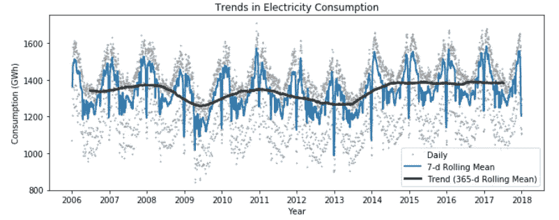
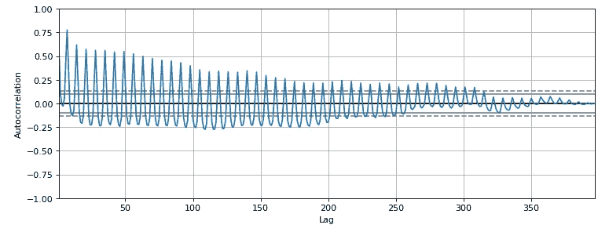
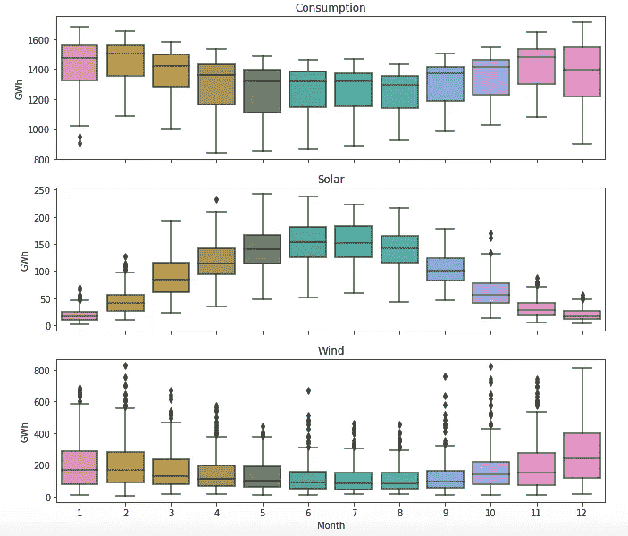

# 使用 Python 中的 Pandas 进行时间序列分析

> 原文：<https://towardsdatascience.com/time-series-analysis-using-pandas-in-python-f726d87a97d8?source=collection_archive---------1----------------------->

## 对季节性、趋势、自相关等关键词的额外介绍。


来源:[迷因生成器](https://www.google.com/url?sa=i&url=https%3A%2F%2Fmemegenerator.net%2Finstance%2F12285574&psig=AOvVaw34w5OHkrFMF7ReEEzeX68D&ust=1591861120789000&source=images&cd=vfe&ved=0CAMQjB1qFwoTCPietPje9ukCFQAAAAAdAAAAABAD)

马上，时间序列数据不是你的平均数据集！您可能已经处理过住房数据，其中每一行代表一所特定房屋的特征(例如总面积、卧室数量、建造年份)，或者学生数据集，其中每一行代表学生的信息(例如年龄、性别、以前的 GPA)。在所有这些数据集中，共同点是所有样本(或数据集中的行)通常都是相互独立的*。这些数据集与时间序列数据的区别在于，在后者中，每一行都代表一个时间点，因此很自然地，数据有一些固有的*排序*。典型的时间序列数据看起来是这样的:*


在上面的数据集中，我们记录了 1991 年 1 月的每一天的一些*值*(比如温度)。当然，除了温度之外，您还可以在特定的一天收集更多的值，比如当天的湿度或风速。

# 让我们开始研究数据吧！

我们将使用公开的数据集开放电力系统数据。你可以在这里下载数据[。它包含 2006-2017 年的电力消耗、风力发电和太阳能发电。](https://raw.githubusercontent.com/jenfly/opsd/master/opsd_germany_daily.csv)

将数据集加载到 Jupyter 笔记本:

```
url='[https://raw.githubusercontent.com/jenfly/opsd/master/opsd_germany_daily.csv'](https://raw.githubusercontent.com/jenfly/opsd/master/opsd_germany_daily.csv')
data = pd.read_csv(url,sep=",")
```

我们的数据看起来是这样的:


图一

# 将数据转换为正确的格式

如果你读过我以前的文章，你就会知道正确的日期时间格式的重要性。同样，当处理时间序列时，如果我们将`Date`列表示为一个**时间戳**，就会变得容易得多。时间戳是 pandas 处理日期和时间的主要数据结构。pandas 函数`to_datetime()`可以帮助我们将字符串转换成适当的日期/时间格式。

```
*# to explicitly convert the date column to type DATETIME*
data['Date'] = pd.to_datetime(data['Date'])
data.dtypes
```


我们现在将继续使用`set_index()`调用将该列设置为数据帧的索引。

```
data = data.set_index('Date')
data
```


如果将它与上面图 1 中的输出进行比较，您会注意到数据帧的索引不再在 0 到 4382 的范围内。取而代之的是，现在这些指数是各自收集数据的日期。

我们也可以明确地检查索引:

```
data.index
```


这里要注意一个有趣的事情是`freq = None`。这意味着不知道数据是按小时、天、分钟等收集的。然而，仅仅通过目测这些指数，我们可以看到这些数据似乎是按天收集的。将这些信息显式地放入数据框也是很好的，我们将很快看到如何做到这一点！但首先快速绕道…

## 如果我想将日期*和时间*都设为索引，该怎么办？

您会遇到这样的数据集，在收集数据时，**日期**和**时间**被记录为单独的列。将它们设置为数据索引的一个简单而巧妙的技巧是:

*   连接这两列，但在它们之间留一个空格。
    空间很重要！！
*   使用`to_datetime()`将这个串联的列转换成时间戳。
*   使用`set_index()`将该串联列设置为索引。

```
df['Datetime'] = pd.to_datetime(df['date'] + ' ' + df['time'])
df = df.set_index('Datetime')
```

或者，您可以在读取文件时将它们设置为索引，如下所示:

```
pd.read_csv('xyz.csv', parse_dates = [['Date','Time']], index_col = 0)
```

# 缺失值插补

正如我们前面提到的，快速浏览一下数据表明它是以 24 小时(或一天)的间隔收集的。但是，数据反映的是`freq = None`。我们可以纠正如下:

```
data_freq = data.asfreq('D')
data_freq
```

> 注意:pandas 中可用的频率包括每小时一次(' H ')、日历每天一次(' D ')、商业每天一次(' B ')、每周一次(' W ')、每月一次(' M ')、每季度一次(' Q ')、每年一次(' A ')以及许多其他频率。

我们在上面所做的就是说“嘿，数据是以一天为间隔收集的，因此每一行都是新的一天”。所以从技术上讲，我们应该有从 2006 年到 2017 年所有天的电力消耗、太阳能生产、风力生产等的数值。

如果我们的数据中缺少某些天，上面的代码将插入空行，并且在这些行的每一行中，对应于列的值都将是`NaNs.`为了避免这些`NaN`值，我们可以告诉`as.freq`函数如何填充这些空值

```
data_freq = data.asfreq('D', method = 'ffill')
data_freq
```

`ffill`是指*正向填充*。这意味着当某一列为空时，它将被前一行中的值替换。举个例子:


在上表中，向前填充空值将产生以下数据帧:


这种向前填充的技术在某种程度上是有意义的——如果我们不知道今天的耗电量，我们总是可以假设它与昨天相同。

类似地，填充时间序列数据集中的缺失数据可以通过以下方式实现:

```
data = data.ffill().head()
```

> 请记住，对于时间序列数据，用中位数或平均值替换缺失数据并不是一个好主意。存在更好的替代方案，例如向前填充、向后填充、线性插值、最近邻居的平均值等。

最后，在修复了频率类型并输入缺失值后，查看我们的数据集，我们发现我们的数据集与以前一样(没有添加新行。我猜不管是谁做的数据收集工作都做得很出色！)


您可能想知道为什么仍然有一些空值，尤其是在数据集的开头。原因是这些*已经被*向前填充了，但是因为第一行的值是空的，所以我们看不出有什么不同。

# 重采样

重采样简单地指的是某个时间段内的数据聚合。其性能类似于 SQL 中的 group by 函数，即首先将数据拆分到时间仓中，然后在每个仓上执行一些计算。例如，给定我们的每日数据，我们可以按月或年对其进行*重采样*(或 bin)并生成一些相关的统计数据，如最小值、最大值或平均值。

## 每周重新取样

要计算电力消耗、风力和太阳能生产的周平均值:

```
data_columns = ['Consumption', 'Wind', 'Solar', 'Wind+Solar']
data_weekly_mean = data[data_columns].resample('W').mean() # W stands for weekly
data_weekly_mean
```


如果你注意到输出中的指数，你会发现它们有一周的间隔，我们有 2006 年 1 月 1 日，接着是 2006 年 1 月 8 日，等等。上面标记为 2006–01–01 的第一行包含时间框 2006–01–01 到 2006–01–07 中包含的所有数据的平均值。

## 每月重新取样

类似地，要计算电力消耗、风力和太阳能生产的月最大值:

```
data_columns = ['Consumption', 'Wind', 'Solar', 'Wind+Solar']
data_monthly_max = data[data_columns].resample('M').max() # W stands for weekly
data_monthly_max
```

# 滚动窗户

这与我们刚刚学习的重采样过程非常相似。区别在于在其上执行一些聚合功能的仓)是重叠的。

*   每周**重采样**的箱:1 月 1 日-1 月 7 日；1 月 8 日至 1 月 14 日、1 月 15 日至 1 月 21 日等等
*   每周**滚动**的箱柜:1 月 1 日-1 月 7 日；1 月 2 日至 1 月 8 日、1 月 3 日至 1 月 9 日等等。

要计算 7 天滚动平均值:

```
data_columns = ['Consumption', 'Wind', 'Solar', 'Wind+Solar']
data_7d_rol = data[data_columns].rolling(window = 7, center = True).mean()
data_7d_rol
```

在上面的命令中，`center = True`表示时间框，比如 1 月 1 日到 1 月 8 日，滚动平均值将被计算并放置在框的中心附近，即 1 月 4 日。为了更清楚，让我们检查一下上面代码的输出:


如您所见，2006 年 1 月至 2004 年的平均消费值(1361.471 英镑)是通过对 2006 年 1 月至 2006 年 1 月至 2007 年的值进行平均计算得出的。同样，2006 年 1 月至 2005 年的平均消费值(1381.300 英镑)是通过平均 2006 年 1 月至 2006 年 1 月至 2008 年的值计算出来的。

按照同样的逻辑，要计算 2006 年 1 月 1 日的平均消费值，我们需要计算 2005 年 12 月 29 日至 2006 年 1 月 4 日的平均值。但是，缺少 2005 年的数据，因此我们获得了前几行的空值。

## 使用滚动方法可视化数据趋势

滚动方法对于评估我们数据集中的**趋势**非常方便。但是首先，什么是趋势？

> 趋势是时间序列的平滑长期趋势。随着时间的推移，它可能会改变方向(增加或减少)。

一个增长趋势是这样的:


图 3

> 可视化这些趋势的一个简单方法是使用不同时间尺度的`rolling`方法。

让我们以年度为尺度(365 天)使用滚动平均值来查看我们的数据集中的电力消耗趋势:

```
data_365d_rol = data[data_columns].rolling(window = 365, center = True).mean()
```

让我们将我们的结果可视化，以便更好地了解趋势。我们将根据每日和 7 天滚动平均值绘制年度趋势图:

```
fig, ax = plt.subplots(figsize = (11,4))*# plotting daily data*
ax.plot(data['Consumption'], marker='.', markersize=2, color='0.6',linestyle='None', label='Daily')*# plotting 7-day rolling data* ax.plot(data_7d_rol['Consumption'], linewidth=2, label='7-d Rolling 
Mean')*# plotting annual rolling data*
ax.plot(data_365d_rol['Consumption'], color='0.2', linewidth=3, label='Trend (365-d Rolling Mean)')*# Beautification of plot*
ax.xaxis.set_major_locator(mdates.YearLocator())
ax.legend()
ax.set_xlabel('Year')
ax.set_ylabel('Consumption (GWh)')
ax.set_title('Trends in Electricity Consumption')
```



观察 365 天的滚动平均时间序列，我们可以看到，电力消费的整体年度趋势相当稳定，2009 年和 2013 年左右的消费量较低。

## 去趋势时间序列

有时，从我们的数据中移除趋势是有益的，特别是当趋势非常明显时(如图 3 所示)，这样我们就可以评估季节变化(几分钟后会详细介绍)或时间序列中的噪声。移除趋势(或去趋势)还可以简化建模过程并提高模型性能。

> 有趋势的时间序列称为**非平稳**。
> 没有趋势或趋势被移除的时间序列被称为**平稳**。

去趋势时间序列用作学习算法的输入，例如 ARIMA(用于分析和预测时间序列数据的 Python 库)，或者也可以用作机器学习算法的附加输入。

## 如何从时间序列中去除趋势？

我们可以使用一种叫做`differencing`的方法来消除这种趋势。这实质上意味着创建一个新的时间序列，其中
**时间(t)的值=时间(t)的原始值-时间(t-1)的原始值**

> 差分对于将你的时间序列转化为平稳的时间序列非常有帮助。

## 用于差分的 Python 代码

要创建时间序列的一阶差分:

```
*# creating the first order differencing data*
data_first_order_diff = data[data_columns].diff()
```


左:原始数据集；右图:数据集的差异去趋势版本

左边是原始数据集，右边是去趋势差异的版本。查看“消耗”列，我们可以看到 2006–01–02 年的值现在已从 1380.521 变为 311.337，这是通过减去 2006–01–02 年和 2006–01–01 年的消耗值获得的(1380.521–1069.184 = 311.337)。

一般来说，差分时间序列告诉我们的不是特定时间点的实际值，而是它与前一时间点的值有多少差异。这意味着当我们绘制这个差分时间序列时，这些值中的大部分将位于 x 轴的任一侧(或`y=0`)。

绘制不同时间序列的图像:

```
start, end = '2017-01', '2017-06'

fig, ax = plt.subplots(figsize=(11, 4))

ax.plot(data_first_order_diff.loc[start:end, 'Consumption'],
marker='o', markersize=4, linestyle='-', label='First Order Differencing')ax.set_ylabel('Electricity Consumption (GWh)')
ax.legend();
```


首先，我们没有任何趋势，所以你可能很难看出趋势是否已经消除。但你不一定要相信我的话！当您对自己的数据执行一阶差分时(如左图所示，该数据具有趋势分量)，您应该能够看到类似于右图的变换:


左:非平稳时间序列(有趋势)；右图:平稳时间序列(去趋势)

页（page 的缩写）s:如果一阶差分无法消除趋势，您可以使用公式进行二阶差分:
**(t)时的值= t 时的原始值—2 * t-1 时的原始值+t-2 时的原始值**

P.P.S .:二阶差分得到的时间序列有 *N — 2* 个观测值。这是因为不能为前两个观察值创建差值(没有什么可以从中减去)。

# 季节性(或周期性)

如果时间序列以相等的间隔重复，比如每 12 个月、每 1 周、每 4 个月等等，那么它就是周期性的。

让我们检查一下我们的时间序列是否有季节性因素。

```
plt.figure(figsize=(11,4), dpi= 80)
data['Consumption'].plot(linewidth = 0.5)
```


似乎我们的消费时间序列每 12 个月重复一次。我们可以在每年的年初和年末看到一个高峰，在仲夏月份看到一个低谷。

我们可以深入研究某一年，看看是否有任何周季节性。这里我们来看两个月的数据:2010 年 1 月和 2010 年 2 月:

```
data.loc['2010-01': '2010-02','Consumption'].plot(marker = 'o', figsize=(11, 9))
```


如你所见，周线振荡非常明显。周末的耗电量通常较低，而工作日的耗电量则相当高。

# 自相关

自相关是一种分析季节性的技术。它描绘了时间序列在不同时间滞后时与其自身的相关性。

很困惑吗？

通过使用教程[这里的](https://www.datacamp.com/community/tutorials/time-series-analysis-tutorial)，我学到了一种理解自相关的非常直观的方法。它基本上是说，如果你把一个时间序列向前或向后移动 12 个月(滞后= 12)，它会以某种方式映射到自身。自相关是判断这种映射有多好的一种方式。如果非常好，这意味着时间序列和移位的时间序列几乎相似，并且在该时间滞后处的相关性会很高。自相关的概念捕捉到了一个时间序列与其自身的这种移动版本的相关性(大声喊出[雨果·鲍恩-安德森](https://medium.com/u/f2a4d039f34a?source=post_page-----f726d87a97d8--------------------------------)这个精彩的解释，我在这里重复了一遍)。

## 用 Python 绘制时间序列的自相关

```
plt.figure(figsize=(11,4), dpi= 80)
pd.plotting.autocorrelation_plot(data.loc['2012-01': '2013-01', 'Consumption']);
```

在我展示剧情之前，最好能给我一些关于如何阅读剧情的建议。在 x 轴上，你有滞后，在 y 轴上，你有时间序列在滞后时的相关程度。如果原始的消费时间序列每两天重复一次，您将会在自相关图中看到滞后 2 天的峰值。



从图中，我们可以看到在第 7 天的滞后时有一个相关性高峰，然后在第 14 天再次出现，依此类推。这意味着时间序列每 7 天重复一次，即每周一次。这种模式会在 3 个月后(大约 100 天)消失。随着你越走越远，相关性越来越小。

上面图中的虚线实际上告诉了你相关的统计意义。上升到虚线之上或下降到虚线之下的每个尖峰被认为是统计上显著的。

因此，我们可以确定消费序列是真正的自相关的，滞后一周。

注意:为了简洁，我们只绘制了时间序列数据子集的自相关图。如果我们要扩展到包括完整的数据集，自相关图看起来还是一样的。

# 从时间序列数据中提取重要特征

有时，提取每个时间戳(即我们数据的每一行)的月份、星期几、日期等是很重要的。由于我们已经有了日期时间格式的索引集，提取这些元素变得非常容易:

```
*# Extract the year, month, date separately using the index set*
data['Year'] = data.index.year
data['Month'] = data.index.month
data['Weekday_Name'] = data.index.weekday_name
```


我们还可以将这些附加特征作为模型的输入。但是在 Python 中的时间序列建模的第 2 部分中会有更多的介绍(希望下周)。

这些附加功能对于数据集的探索性分析也很有用。例如，我们可以画出每个月的中值功耗。

```
import seaborn as snsfig, axes = plt.subplots(3, 1, figsize=(11, 10), sharex=True)for name, ax in zip(['Consumption', 'Solar', 'Wind'], axes):
    sns.boxplot(data=data, x='Month', y=name, ax=ax)
    ax.set_ylabel('GWh')
    ax.set_title(name)
    *# Keep the x-axis label for only the bottom subplot*
    if ax != axes[-1]:
        ax.set_xlabel('')
```



希望这篇热情洋溢的时序数据介绍足以让您入门。在本文的[第 2 部分](https://medium.com/@vishi2020/time-series-modeling-using-scikit-pandas-and-numpy-682e3b8db8d1)中，我们将学习如何开发预测模型来预测某一天的用电量。在[第三部分](https://medium.com/towards-artificial-intelligence/tackling-the-time-series-take-home-assignment-a-case-study-in-python-b2a3bd78d956)，我们将进行一个案例研究，分析呼叫中心产生的时间序列数据，主要是分析(可怕的)放弃率的增加。

直到下次:)

我喜欢写循序渐进的初学者指南、操作指南、面试问题、ML/AI 中使用的解码术语等。如果你想完全访问我的所有文章(以及其他媒体上的文章)，那么你可以使用 [***我的链接***](https://varshitasher.medium.com/membership)**这里* ***注册。****

*[](/data-scientists-guide-to-efficient-coding-in-python-670c78a7bf79) [## 数据科学家的 Python 高效编码指南

### 我每天用来编写干净代码的技巧和窍门

towardsdatascience.com](/data-scientists-guide-to-efficient-coding-in-python-670c78a7bf79) [](/understanding-python-imports-init-py-and-pythonpath-once-and-for-all-4c5249ab6355) [## 了解 Python 导入，__init__。py 和 pythonpath —一劳永逸

### 了解如何导入包和模块(以及两者之间的区别)

towardsdatascience.com](/understanding-python-imports-init-py-and-pythonpath-once-and-for-all-4c5249ab6355) [](/time-series-modeling-using-scikit-pandas-and-numpy-682e3b8db8d1) [## 使用 Scikit、Pandas 和 Numpy 进行时间序列建模

### 直观地利用季节性来提高模型准确性。

towardsdatascience.com](/time-series-modeling-using-scikit-pandas-and-numpy-682e3b8db8d1) [](/step-by-step-guide-to-explaining-your-ml-project-during-a-data-science-interview-81dfaaa408bf) [## 在数据科学面试中解释你的 ML 项目的逐步指南。

### 在结尾有一个额外的样本脚本，让你谨慎地展示你的技术技能！

towardsdatascience.com](/step-by-step-guide-to-explaining-your-ml-project-during-a-data-science-interview-81dfaaa408bf) [](/beginners-guide-to-building-artificial-neural-networks-using-keras-in-python-bdc4989dab00) [## 使用 Python 中的 Keras 构建人工神经网络的初学者指南

### 创建网络架构、训练、验证和保存模型并使用它进行推理的提示和技巧。

towardsdatascience.com](/beginners-guide-to-building-artificial-neural-networks-using-keras-in-python-bdc4989dab00)*