# 熊猫的时间序列分析

> 原文：<https://towardsdatascience.com/time-series-analysis-with-pandas-e6281a5fcda0?source=collection_archive---------8----------------------->

## 如何处理和操作时间序列数据

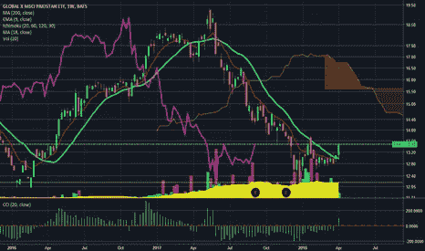

[图源](https://www.tradingview.com/chart/PAK/qcQzs5Xj-PAK-money-rotation-trade-wars/)

时间序列数据有许多定义，所有这些定义都以不同的方式表示相同的含义。一个直截了当的定义是，时间序列数据包括附加到连续时间戳的数据点。时间序列数据的来源是周期性的测量或观察。我们观察很多行业的时间序列数据。仅举几个例子:

*   一段时间内的股票价格
*   每日、每周、每月销售额
*   过程中的定期测量
*   一段时间内的电力或天然气消耗率

机器学习的进步增加了时间序列数据的价值。公司将机器学习应用于时间序列数据，以做出明智的商业决策，进行预测，比较季节性或周期性趋势。欧洲粒子物理研究所的大型强子对撞机(LHC)通过对亚原子粒子的测量产生了大量的时间序列数据。所以，它无处不在。处理好时间序列数据对于这类领域的数据分析过程至关重要。Pandas 是由 Wes Mckinney 创建的，旨在提供一个高效灵活的工具来处理财务数据。因此，对时间序列数据进行处理是一个非常好的选择。

# **熊猫时间序列数据**

时间序列数据可以是特定日期、持续时间或固定定义间隔的形式。

时间戳可以是一天中的日期，也可以是给定日期中的纳秒，具体取决于精度。例如，“2020–01–01 14:59:30”是一个基于秒的时间戳。

Pandas 提供灵活高效的数据结构来处理各种时间序列数据。下表显示了基本的时间序列数据结构及其相应的索引表示:

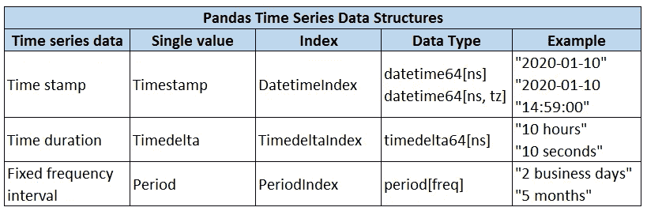

对于任何题目，学好基础是根本。休息可以通过练习来积累。让我们探索熊猫的时间序列数据功能。像往常一样，我们首先导入库:

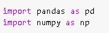

最基本的时间序列数据结构是时间戳，可以使用 **to_datetime** 或 **Timestamp** 函数创建:

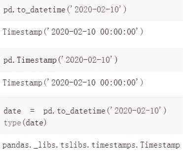

在现实生活中，我们几乎总是处理连续的时间序列数据，而不是单个的日期。Pandas 也使得处理时序数据变得非常简单。例如，如果我们将多个日期传递给 to_datetime 函数，它会创建一个 **DatetimeIndex** ，它基本上是一个日期数组。

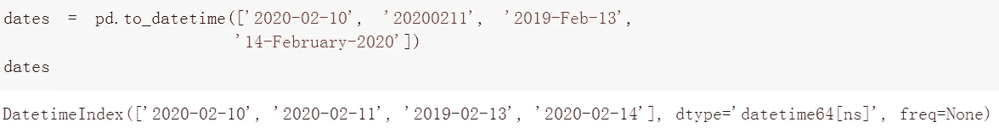

我们不必遵循特定的格式来输入日期。to_datetime 将不同格式的日期转换为标准格式。通过传递单个日期的列表来创建时间索引似乎不太方便。当然，还有其他方法来创建时间索引。

我们可以使用 date 和 **to_timedelta** 函数创建日期索引:

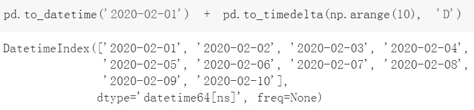

“2020–02–01”作为起点，to_timedelta 创建一个具有指定时间增量的序列。在上面的例子中，“D”用于表示“日”,但还有许多其他选项可用。你可以点击查看整个列表[。](https://pandas.pydata.org/pandas-docs/stable/reference/api/pandas.to_timedelta.html)

我们也可以使用 [**date_range**](https://pandas.pydata.org/pandas-docs/stable/reference/api/pandas.date_range.html) 函数从头创建时间索引:

*   使用开始和结束日期

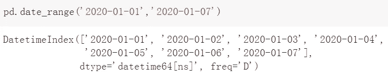

*   使用开始或结束日期和周期数(默认为“开始”)

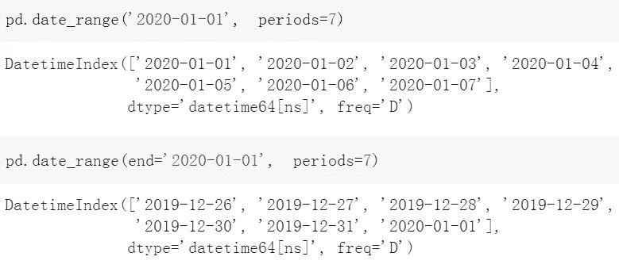

默认频率是“天”，但有许多选项可用。

*注:“M”表示一个月的最后一天，而“MS”代表“月初”。*

我们甚至可以从默认频率中推导出频率:

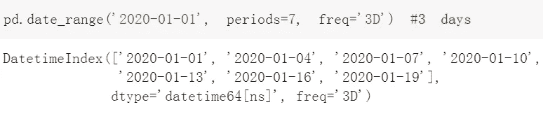

Pandas 还提供了 [**period_range**](https://pandas.pydata.org/pandas-docs/stable/reference/api/pandas.period_range.html) 和[**time delta _ range**](https://pandas.pydata.org/pandas-docs/stable/reference/api/pandas.timedelta_range.html)函数来分别创建 PeriodIndex 和 TimedeltaIndex:

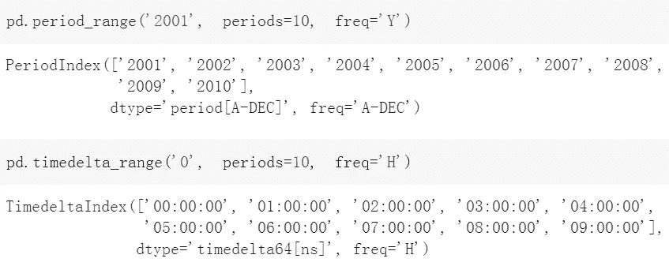

我们已经学习了如何创建时间序列数据，但是熊猫还可以对时间序列数据进行许多其他操作。我还将介绍**移位**、**重采样**和**滚动**时间序列数据。

# **移位时间序列数据**

时间序列数据分析可能需要移动数据点来进行比较。**移位**和**t 移位**功能及时移位数据。

*   移位:移位数据
*   tshift:移动时间索引

shift 和 tshift 之间的区别可以用可视化来更好地解释。让我们首先用时间序列数据创建一个样本数据框架:

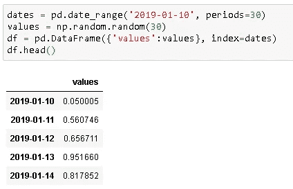

然后，我们可以在同一张图上绘制原始数据和移位数据，以查看差异:

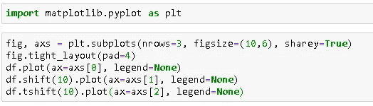

订单:原始数据，班次，t 班次

# **重采样**

时间序列数据的另一个常见操作是重采样。根据任务的不同，我们可能需要以更高或更低的频率对数据进行重新采样。熊猫很好地处理了这两种操作。重采样可以通过**重采样**或 **asfreq** 方法完成。

*   asfreq 返回指定间隔结束时的值
*   重采样创建指定内部的组(或箱),并允许您对组进行聚合

用例子会更清楚。让我们首先创建一年的时间序列数据。

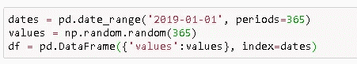

**asfreq('M')** 返回每月最后一天的值。我们可以通过检查 1 月底的值来确认:

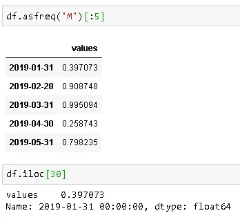

**resample('M')** 创建月份的箱，但我们需要应用聚合函数来获取值。让我们来计算每月的平均值。我们还可以通过比较一月份的平均值来确认结果:

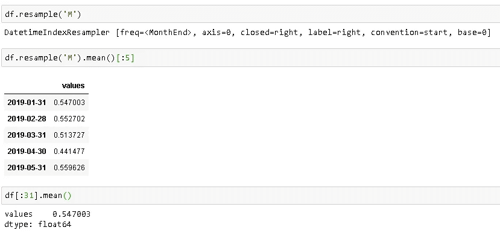

# **滚动**

滚动是对时间序列数据非常有用的操作。滚动意味着创建一个指定大小的滚动窗口，并对该窗口中的数据执行计算，当然，该窗口会滚动数据。下图解释了滚动的概念。

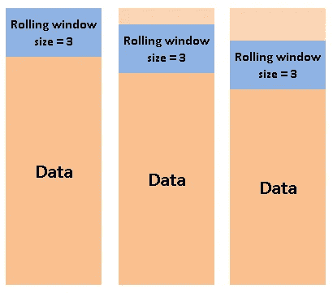

值得注意的是，计算是在整个窗口都在数据中时开始的。换句话说，如果窗口的大小为三，则第一次聚合在第三行完成。让我们对我们创建的数据帧应用大小为 3 的滚动:

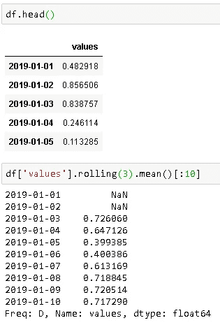

# **关于时间序列分析的更多信息**

如果你想了解更多关于时间序列分析的知识，这里有一个我的相关帖子列表:

*   [时间序列分析—处理时区](/time-series-analysis-handling-time-zones-b6fcb324c7b)
*   [时间序列分析:基本概念](/time-series-analysis-basic-concepts-1d9a090d7d8c)
*   [时间序列分析:创建合成数据集](/time-series-analysis-creating-synthetic-datasets-cf008208e014)

# **结论**

预测分析在数据科学领域非常有价值，时间序列数据是预测分析旨在解决的许多问题的核心。因此，如果你打算在预测分析领域工作，你肯定应该学习如何处理时间序列数据。

感谢您的阅读。如果您有任何反馈，请告诉我。

# **我关于数据操作和分析的其他帖子**

*   [数据科学中最被低估的工具:NumPy](/the-most-underrated-tool-in-data-science-numpy-68d8fcbde524)
*   [数据科学中最被低估的工具:NumPy(第二部分)](https://medium.com/swlh/the-most-underrated-tool-in-data-science-numpy-part-2-d9bfb4b2313a)
*   [使用熊猫组合数据帧](/combining-dataframes-using-pandas-b9e2e83b9869)
*   [用熊猫处理缺失值](/handling-missing-values-with-pandas-b876bf6f008f)
*   [熊猫的 3 个有用功能](https://medium.com/@soneryildirim1988/3-useful-functionalities-of-pandas-f4cb342a77ab)

# **参考文献**

*   [https://pandas . pydata . org/pandas-docs/stable/user _ guide/time series . html](https://pandas.pydata.org/pandas-docs/stable/user_guide/timeseries.html)
*   https://jakevdp.github.io/PythonDataScienceHandbook/