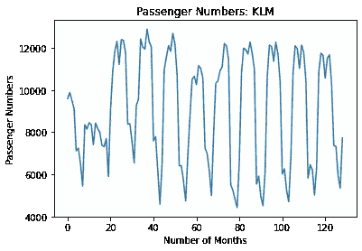
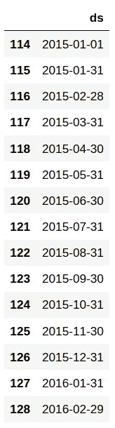
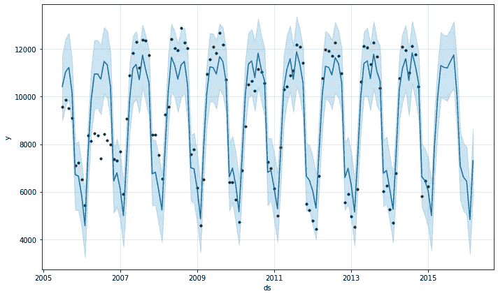
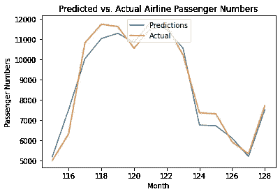
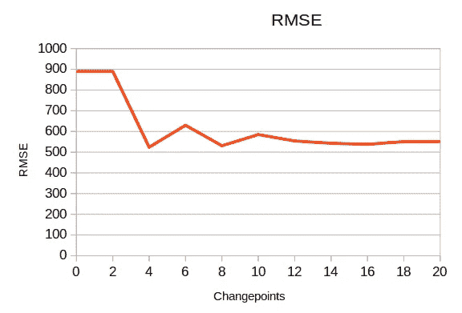

# 用 Prophet 进行时间序列分析:航空乘客数据

> 原文：<https://towardsdatascience.com/time-series-analysis-with-prophet-air-passenger-data-6f29c7989681?source=collection_archive---------24----------------------->

## 使用 Prophet 进行时间序列分析


来源:图片由 [Free-Photos](https://pixabay.com/users/free-photos-242387/) 来自 [Pixabay](https://pixabay.com/photos/plane-trip-journey-explore-841441/)

**Prophet** 是脸书开发的一个预测模型，它通过对季节性、假期和变点等因素进行特殊调整来预测时间序列。

让我们通过构建一个预测航空乘客数量的 Prophet 模型来进一步研究这个问题。

# 背景

数据集来源于**旧金山国际机场关于航空公司**月度客运量统计的报告，该报告可从 *data.world(原始来源:旧金山开放数据)*获得，如下文参考资料部分所示。

具体来说，对航空公司**荷航** (enplaned)调整后的乘客人数进行过滤，作为从 2005 年 5 月**到 2016 年 3 月**期间的时间序列进行分析。



来源:Jupyter 笔记本输出

正如我们所看到的，时间序列显示了一个相当稳定的模式(其中有一个恒定的均值，方差和自相关。

我们不会在这里正式测试这种情况，但同样明显的是，数据集中似乎存在显著的**季节性**——即在特定时间间隔发生的时间序列趋势的显著变化。

从时间序列的视觉检查来看，似乎这种转变大约每八个月**左右发生一次。**

# 模型结构

记住这一点，让我们开始构建预测模型。

第一步是正确格式化数据，以便使用 Prophet。

```
train_dataset= pd.DataFrame()
train_dataset['ds'] = train_df['Date']
train_dataset['y']= train_df['Adjusted Passenger Count']
train_dataset.head(115)
```


来源:Jupyter 笔记本输出

以下是将用作测试集的数据帧(我们试图预测的时间序列的一部分)，时间间隔定义为**每月**:

```
future= prophet_basic.make_future_dataframe(periods=14, freq='M')
future.tail(15)
```



来源:Jupyter 笔记本输出

我们首先定义一个模型如下:

```
prophet_basic = Prophet()
prophet_basic.fit(train_dataset)
```

这是一个预测图:

```
forecast=prophet_basic.predict(future)
fig1 =prophet_basic.plot(forecast)
```



来源:Jupyter 笔记本输出

以下是预测的组成部分:

```
fig1 = prophet_basic.plot_components(forecast)
```


一些观察结果:

*   我们可以看到，从 2007 年到 2009 年，这一趋势有显著增长，此后乘客人数趋于平稳。
*   我们还观察到，乘客数量似乎在大约 5-9 月份达到最高，之后我们会看到今年剩余时间乘客数量的下降。

请注意，我们直观地观察到季节性似乎出现在数据集中。然而，考虑到我们正在处理一个月度数据集——在这种情况下，我们不会使用 Prophet 来明确地模拟季节性。

这有两个原因:

1.  如果我们使用每日数据，对季节性的检测会更准确——但我们没有这样做。
2.  在这种情况下，假设年度季节性可能不是特别准确。检查数据集显示，虽然某些季节变化每年都会发生，但其他季节变化每 6 到 8 个月就会发生一次。因此，在这种情况下，在模型中明确定义季节性参数可能弊大于利。

# 变革点

转折点代表时间序列中的重大结构转变。

例如，新冠肺炎疫情爆发后航空乘客数量的大幅下降，将代表着数据中的重大结构性转变。

例如，当适当的参数设置为 **4** 时，这是模型上显示的变化点。

```
pro_change= Prophet(n_changepoints=4)
forecast = pro_change.fit(train_dataset).predict(future)
fig= pro_change.plot(forecast);
a = add_changepoints_to_plot(fig.gca(), pro_change, forecast)
```


来源:Jupyter 笔记本输出

我们看到，模型中显示的重大转折点出现在 2007 年至 2009 年之间。

有趣的是，虽然 2009 年的乘客数量确实出现了显著下降，但平均而言，这一时期的乘客数量仍高于 2005 年至 2007 年，这表明航空旅行的总体需求(至少对于从旧金山出发的荷航航班而言)在近十年内实际上有所增长。

# 模型验证

现在，预测模型已经建立，预测的乘客数量与测试集进行比较，以确定模型的准确性。

将变点设置为 **4** ，我们获得以下误差指标:

*   均方根误差:524
*   平均预测误差:71



来源:Jupyter 笔记本输出

平均每月 8，799 名乘客(与该数字相比，误差非常低)，表明该模型在预测每月乘客人数方面表现良好。

然而，重要的是要注意，模型精度受到变点参数的显著影响。

让我们看看当变点被修改时，RMSE 会发生什么。



来源:作者的计算

我们可以看到，随着更多变点的引入，RMSE 急剧下降——但是 RMSE 在 **4** 变点处最小化。

# 结论

在本例中，您看到了:

*   如何使用 Prophet 进行时间序列预测
*   如何使用 Prophet 分析趋势和季节性波动
*   变点在确定模型准确性中的重要性

希望你发现这有用，并感谢任何想法或反馈！

*免责声明:本文是在“原样”的基础上编写的，没有任何担保。本文旨在提供数据科学概念的概述，不应以任何方式解释为专业建议。*

# 参考

*   [加法和乘法季节性——你能正确识别它们吗？](https://kourentzes.com/forecasting/2014/11/09/additive-and-multiplicative-seasonality/)
*   [data.world:空中交通乘客数据](https://data.world/data-society/air-traffic-passenger-data)(原始来源:[三藩市公开数据](https://data.sfgov.org/Transportation/Air-Traffic-Passenger-Statistics/rkru-6vcg))
*   [GitHub: facebook/prophet](https://github.com/facebook/prophet)
*   罗布·J·海曼:月度季节性