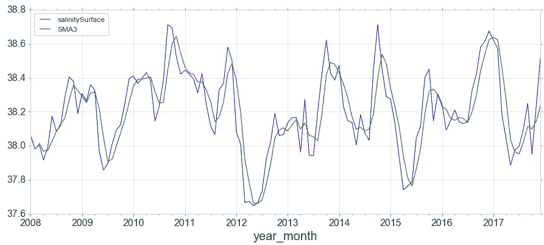
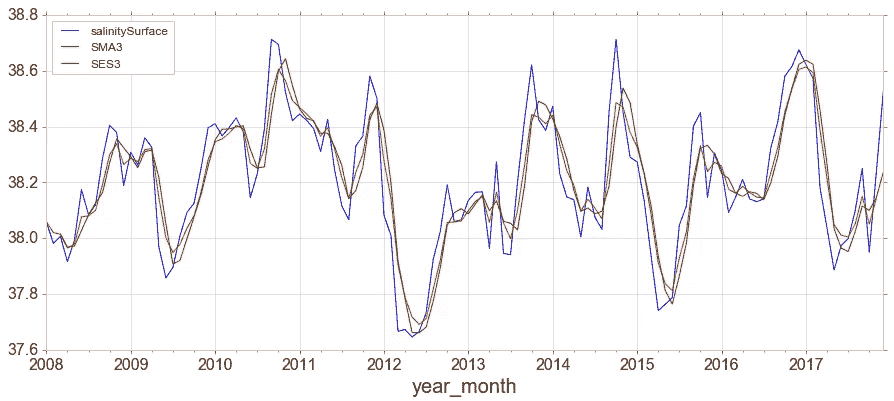

# 时间序列分析与理论、图表和代码第 2 部分

> 原文：<https://towardsdatascience.com/time-series-analysis-with-theory-plots-and-code-part-2-c72b447da634?source=collection_archive---------32----------------------->

在第一部分中，我们看了:

*   什么是时间序列
*   预测任务的基本步骤
*   时间序列图形，包括时间图、季节图和季节子序列图
*   时间序列成分和分解。

一切都伴随着理论和代码。

在第 2 部分，我们将继续我们的旅程:

*   平稳性
*   自相关
*   滞后散点图
*   简单移动平均线
*   指数加权移动平均
*   双重和三重指数平滑

让我们先看一下我们的数据集的第一行。

海面温度和盐度的月数据。

# 1.平稳性

平稳时间序列的性质不依赖于序列被观察的时间。因此，**具有趋势或季节性的时间序列并不是平稳的** —趋势和季节性会影响时间序列在不同时间的值。另一方面，白噪声序列是稳定的——当你观察它时，这并不重要，它在任何时间点看起来都应该差不多。

具有周期行为(但没有趋势或季节性)的时间序列是平稳的。这是因为周期不是固定长度的，所以在我们观察序列之前，我们不能确定周期的波峰和波谷在哪里。也就是说，序列的统计属性(如平均值、方差和自相关性)是恒定的。

大多数统计预测方法都是针对平稳的时间序列而设计的。预测过程的第一步通常是进行一些转换，将非平稳序列转换为平稳序列。预测平稳序列相对容易，预测结果也更可靠。

我们知道，如果预测值(X 个变量)彼此不相关，线性回归效果最好。因此，平稳化序列解决了这个问题，因为它消除了任何持久的自相关，从而使预测模型中的预测因子(序列的滞后)几乎独立。

为了**使**成为一个时间序列**静止**我们可以:

*   将序列差分一次或多次(用当前值减去下一个值)
*   取序列的对数(有助于稳定时间序列的方差。)
*   以 nₜₕ根为例
*   以上各项的组合

但是首先，为了测试**时间序列**是否平稳**，我们可以:**

*   看时间图。
*   将序列分成两部分，并计算描述性统计数据。如果它们不同，那么它就不是静止的。
*   执行被称为**单位根检验**的统计检验，如**增广迪基富勒检验** (ADF 检验)、科维亚特科夫斯基-菲利普斯-施密特-申-KPSS 检验(趋势平稳)和飞利浦佩龙检验(PP 检验)。

最常用的是 **ADF** 因此，如果 ADF 检验中的 P 值小于显著性水平(0.05)，您拒绝零假设，序列是平稳的。

这将输出:

ADF 测试统计的输出。

数列是平稳的。然而，p 值=0.04967，我们可以应用差异来查看其效果。

为了使数列看起来稳定，需要三阶差分。

# 2.自相关

正如相关性测量两个变量之间线性关系的程度一样，**自相关**测量一个时间序列的*滞后值*之间的线性关系，例如 yₜ和 yₜ₋₁.之间的线性关系如果一个序列是显著自相关的，这意味着该序列以前的值(滞后)可能有助于预测当前值。

**部分自相关**在去除影响两个变量的其他变量的影响后，测量一个变量的线性相关性。也就是说，滞后 *k* 处的部分自相关是未被滞后 1 至*k*1 考虑在内的 *y* ₜ和 *y* ₜ+yₜ₊ₖ之间的自相关。我们本质上绘制出前一天/前一个月的残差与当天的真实值之间的关系。一般来说，我们预计偏相关会很快下降。

60 个月的自相关和偏相关(海表温度)。

对于自相关，y 轴是值与其滞后时间之间的相关值。滞后在 x 轴上。零滞后的相关性为 1，因为它与自身完全相关。该图显示了 6ₜₕ和 12ₜₕ月份以及之前和之后月份的高度自相关性。

# 3.滞后散点图

探索每个观察值和该观察值的滞后之间的关系的一种有用的图称为散点图。

Pandas 对此有一个内置的函数，叫做滞后图。它在 x 轴上绘制了时间 t 时的观察值，在 y 轴上绘制了 lag1 观察值(t-1)。

*   如果这些点沿着从图的左下角到右上角的对角线聚集，这表明正相关关系。
*   如果这些点沿着从左上到右下的对角线聚集，这表明负相关关系。
*   这两种关系都很好，因为它们可以被建模。
*   越靠近对角线的点表示关系越强，越远离对角线的点表示关系越弱。
*   中间有一个球或分布在图中表明关系很弱或没有关系。

# 4.移动平均数

**移动平均**是对时间 t 的趋势周期的估计，通过对 t 的 k 个周期内的时间序列值进行平均来获得。时间上接近的观测值也可能在数值上接近。因此，平均值消除了数据中的一些随机性，留下了平滑的趋势周期成分。

基本的 SMA 有一些弱点:

*   较小的窗口会导致更多的噪音，而不是信号。
*   它将总是滞后于窗口的大小。
*   由于求平均值，它将永远不会达到数据的最大峰值或谷值。
*   它并不真正告诉你未来可能的行为，它真正做的只是描述你的数据的趋势。
*   极端的历史值会显著扭曲 SMA。

窗口=3 的初始数据和简单移动平均。

简单移动平均线有一个变种叫做**指数加权移动平均线** (EWMA)。

它将允许我们减少来自 SMA 的滞后效应，并且它将把更多的权重放在最近发生的值上(通过将更多的权重应用到最近发生的值，因此得名)。应用于最近值的权重量将取决于 EWMA 中使用的实际参数和给定窗口大小的周期数。

初始数据、简单移动平均和简单指数平滑

# 5.双重和三重指数平滑

简单指数平滑仅使用一个平滑因子α (alpha)，**双指数平滑**添加了第二个平滑因子 *β* (beta)，用于处理数据趋势。与 alpha 因子一样，beta 因子的值介于零和一之间(0 < *β* ≤10 < β≤1)。这里的好处是，模型可以预测未来的增长或下降，而水平模型只能根据最近的计算来工作。

我们还可以处理趋势中不同类型的变化(增长/衰退)。如果时间序列显示直线倾斜趋势，您可以使用**加法**调整。如果时间序列显示指数(曲线)趋势，您可以使用**乘法**调整。

**三重指数平滑**，与 Holt-Winters 关系最密切的方法，增加了对数据中趋势和季节性的支持。

初始数据，双重和三重指数平滑。

就是这样！感谢您的阅读，下次见！

参考资料:

*   [https://www . machinelingplus . com/time-series/time-series-analysis-python/](https://www.machinelearningplus.com/time-series/time-series-analysis-python/)
*   [https://www.udemy.com/python-for-time-series-data-analysis/](https://www.udemy.com/python-for-time-series-data-analysis/)
*   [https://machine learning mastery . com/time-series-data-visualization-with-python/](https://machinelearningmastery.com/time-series-data-visualization-with-python/)