# 自动取款机现金需求预测:时间序列回归模型

> 原文：<https://towardsdatascience.com/time-series-and-regression-methods-for-forecasting-atms-filling-in-cc6d5f7dde1e?source=collection_archive---------12----------------------->

## **机器学习在 ATM 取现**需求预测

## 使用时间序列和回归模型进行需求预测

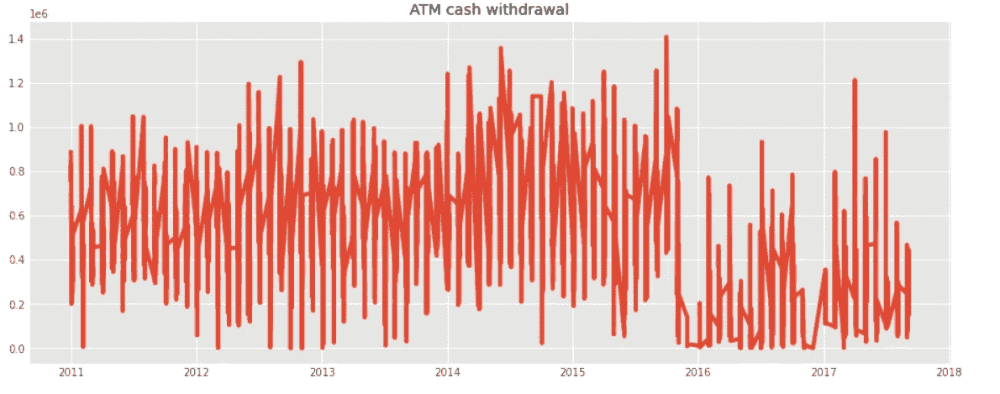

作者图片

自动取款机中的烟灰需求需要准确的预测，这与其他自动售货机没有什么不同。唯一的区别是现金产品需要在一段时间内补充。如果预测是错误的，它会导致大量的成本。在高预测和高未使用的情况下，ATM 中存储的现金会给银行带来成本。银行根据其与货币运输公司的政策支付不同的重新填充费用。银行通常为重新填充支付大量的固定费用，为安全运输安排支付额外的额外费用。

一些银行可能会在自动取款机中储存比实际需求多 40%的现金，而且银行可能在全国范围内拥有数千台自动取款机。因此，业务运营的小优化将有助于高收益。

# 业务用例

自动柜员机不应装满大量现金，这可能会带来低运输/物流成本，但高冷冻和高保险成本。另一方面，如果银行没有适当的机制来跟踪使用模式，那么频繁地重新填充 ATM 将降低冻结和保险成本，但会增加物流成本。

# 我们的目标

很明显，每天的现金提取量是时间序列。因此，在这个典型的现金需求预测模型中，我们将展示时间序列和回归机器学习模型，以解决上述用例的问题。我们将针对单个自动柜员机(也可以将一组自动柜员机作为单个自动柜员机处理)的需求，为给定的数据集开发一个模型。

我们必须记住，从 ATM 机提取现金不仅仅是时间相关的。可能存在季节性，例如:1)人们倾向于在周末的周五或 2)月底领工资时取款，或 3)在每个月的 7-10 日之间，一些人会领养老金。因此，开发 ATM 网络现金需求预测模型是一项具有挑战性的任务。此外，每台 ATM 的时序现金需求随时间波动，并且经常与用户的非平稳行为叠加。

# 数据加载

我们有 2011 年到 2017 年的每日交易数据。实际取款(total _ amount _ extracted)包括从自动柜员机提取实际金额的所有交易。这些交易实际上反映在 ATM 机的可用余额中。

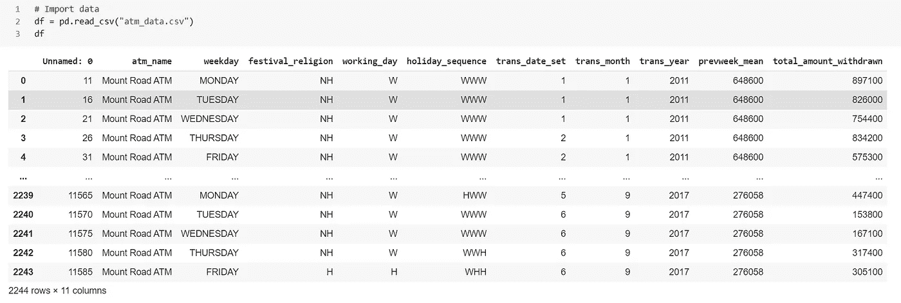

> 为了简单起见，我们在这里没有进行任何数据挖掘活动。建议进行广泛的挖掘工作，从数据中提取隐藏的信息。此外，建议消除可能导致多重共线性问题的不重要要素。

# 模拟每日现金需求

我们将尝试拟合几个时间序列模型，并为我们的数据找到最佳拟合模型，这将允许预测未来的需求。有很多机器学习模型可供选择，决定从哪里开始可能会令人生畏。一般来说，从简单的、可解释的模型(如线性回归)开始是一个好主意，如果性能不够好，就转向更复杂但通常更精确的方法。因此，受到塞尔维亚银行*的[***案例分析***](http://Broda, P., Levajković, T., Kresoja, M., Marčeta, M., Mena, H., Nikolić, M., & Stojančević, T. (2014). Optimization of ATM filling-in with cash.) 的启发，其中*时间序列分析和线性模型被用于获得每个 ATM* 的每日现金需求预测，我们选择从一个简单的线性模型开始我们的用例。*

*我们在这里的特征中既有数字变量也有分类变量。观察箱线图，我们没有观察到分类变量对现金提取的任何显著影响。*

*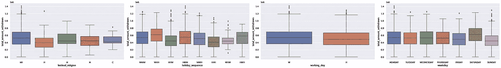*

```
*plt.figure(figsize=(14,6))
plt.subplot(1,2,1)
data['total_amount_withdrawn'].hist(bins=50)
plt.title('Total amount withdrawan')
plt.subplot(1,2,2)
stats.probplot(data['total_amount_withdrawn'], plot=plt);
data['total_amount_withdrawn'].describe().T.round()*
```

*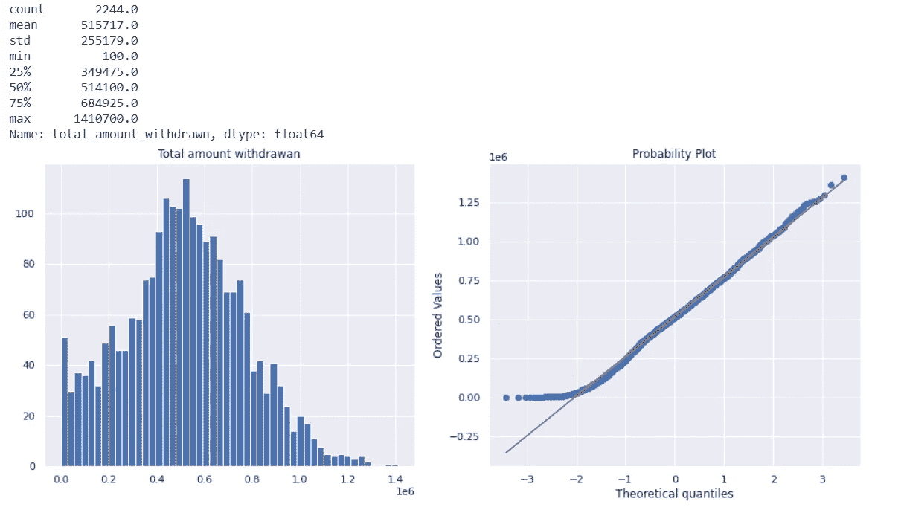*

*我们可以从直方图中看到，中心在 60 附近。数据集中的大多数值(提取的总金额)接近 60 万，而更远的值(14 万)很少，这也符合我们的心理模型。分布大致对称，提取的值落在大约 100 和 100，000 之间，这可以从图表上方所示的统计汇总中得到验证。*

*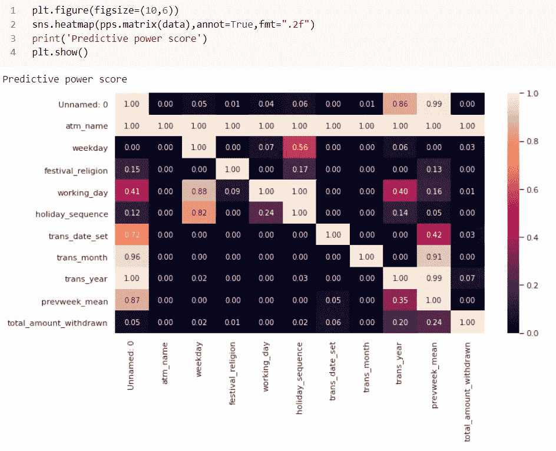*

## *OneHotEncoding*

*下面的代码片段将数字特征分开，选择分类特征并对这些特征使用一键编码，然后将两个集合连接在一起。这听起来像是复杂的工作，但却相对简单明了。*

```
*# Copy the original data
features = df.copy()# Select the numeric columns
numeric_subset = df[['trans_date_set','trans_month','trans_year','prevweek_mean', 'total_amount_withdrawn']]# Select the categorical columns
# dropped atm_name
categorical_subset = df[['weekday','festival_religion', working_day',  'holiday_sequence']]# One hot encoding
categorical_subset = pd.get_dummies(categorical_subset)# Join the two dataframes using concat
features = pd.concat([numeric_subset, categorical_subset], axis = 1)*
```

*在 *OHE* 之后，我们有 27 列(特征)的 2244 个观察值。*

*通常测试集的大小范围是数据的 25- 35 %,尽管没有关于大小的硬性规定。我们必须记住，随着训练数据集规模的缩小，训练模型的性能会下降。从训练集中提取太多数据可能会对最终性能造成不利影响。*

```
*X = features.copy().drop(columns = ['total_amount_withdrawn', 'trans_date_set', 'trans_month','trans_year', 'working_day_H', 'working_day_W'])
y = features['total_amount_withdrawn'].copy()Xtrain, Xtest, ytrain, ytest = train_test_split(X, y, shuffle= False, test_size = 0.2, random_state = 42)
print('length of Xtrain and Xtest: ', len(Xtrain), len(Xtest))
print('length of ytrain and ytest: ', len(ytrain), len(ytest))*
```

# *线性回归*

*我们考虑了一个线性模型的形式:*

*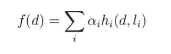*

*其中 *αi* 为数据中待估计模型的参数， *hi* 为现金需求历史的不同统计。该模型针对特定日期 *d* 进行评估。值 *li* 是元参数，控制统计 *hi* 的计算，如所考虑的历史长度。*

> *我们总是可以使用训练数据来拟合最小最大缩放器，然后在预测之前将该缩放器应用于测试数据。此外，可以测试线性模型附加正则化参数。*

```
*linear = LinearRegression()
linear.fit(Xtrain, ytrain)# make predictions
lin_pred = linear.predict(Xtest)# Prediction vs Actual
linpred = pd.DataFrame(lin_pred[-10:]) # predicting last 10 values
linpred.rename(columns = {0: 'lin_predicted'}, inplace=True) # renaming the column
linpred = linpred.round(decimals=0) # rounding the decimal values
d = pd.DataFrame(data['total_amount_withdrawn']).tail(10) # calling last 10 values of original amt wothdrawn
linpred.index = d.index # mapping the index of both dataframe
linok = pd.concat([linpred, d], axis=1)
linok['accuracy'] = round(linok.apply(lambda row: row.lin_predicted /row.total_amount_withdrawn *100, axis = 1),2)
linok['accuracy'] = pd.Series(["{0:.2f}%".format(val) for val in linok['accuracy']],index = linok.index)
linok = linok.assign(day_of_week = lambda x: x.index.day_name())*
```

*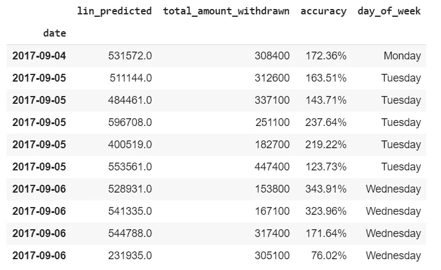***

*我们在这里看到，线性回归预测平均超过 100%。*

# *XGBoost 回归*

*虽然我在这里扩展了 ohe 的使用，但是在实践中应该小心谨慎。*

> *虽然基于回归的模型，我们通常使用 ohe 特征，但我们应该小心使用决策树算法。理论上，决策树能够处理分类数据。然而，它的 scikit-learn 实现仍然要求所有特征都是数字的。一种可能的解决方案是使用不同种类的编码(标签/目标编码)或处理分类特征的实现，如 h2o 库中的随机森林。*

***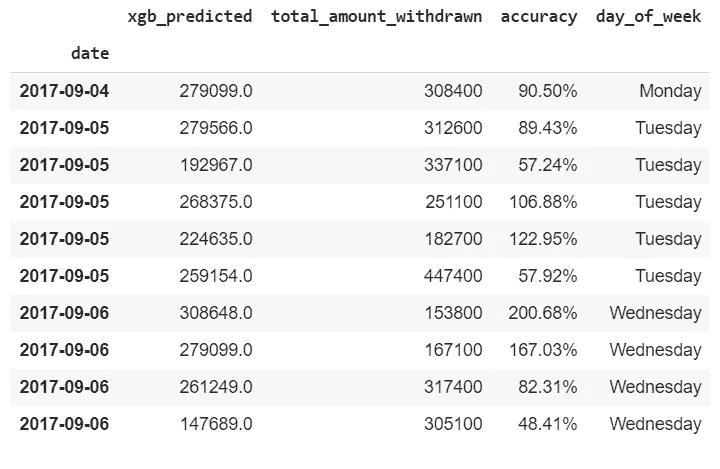*

*下面，我们绘制了预测值和实际值，以及这些值的组合，以获得更好的可视性。与 LinReg 相比，XGBoost 模型做得相当好，并且使用默认参数，与 LinReg 的大约 50%相比，平均应计率超过 90%。*

*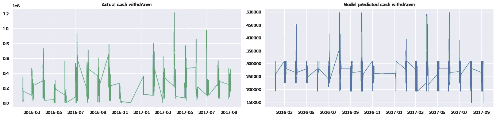**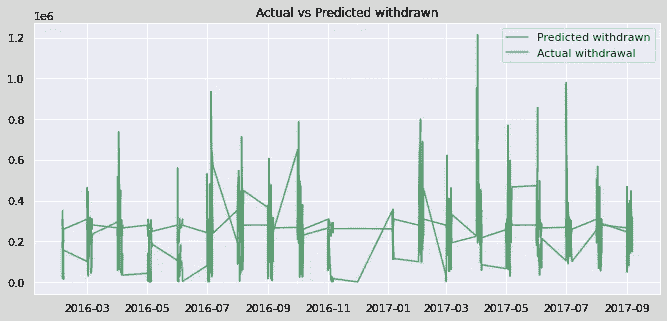**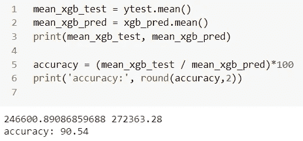*

*变量重要性图如下所示:*

```
*shap_values = shap.TreeExplainer(xgb).shap_values(Xtest)
shap.summary_plot(shap_values, Xtest, plot_type="bar")*
```

*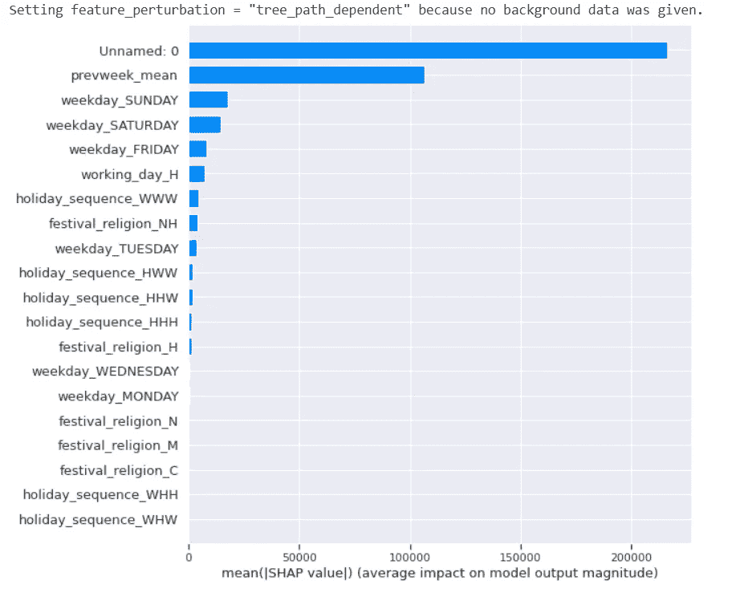*

# *轻型 GBM*

*LightGBM 通过整数编码的分类特征提供了良好的准确性。它通常比一位热编码执行得更好。*

```
*X = df.iloc[:, 2:10].copy()
y = df.iloc[:, 10].values# Transform categorical features into the appropriate type that is expected by LightGBM
for c in X.columns:
col_type = X[c].dtype
if col_type == 'object' or col_type.name == 'category':
X[c] = X[c].astype('category')# Splitting the dataset into the Training set and Test set
X_train, X_test, y_train, y_test = train_test_split(X, y, shuffle= False, test_size = 0.2, random_state = 42)
print('length of X_train and X_test: ', len(X_train), len(X_test))
print('length of y_train and y_test: ', len(y_train), len(y_test))*
```

*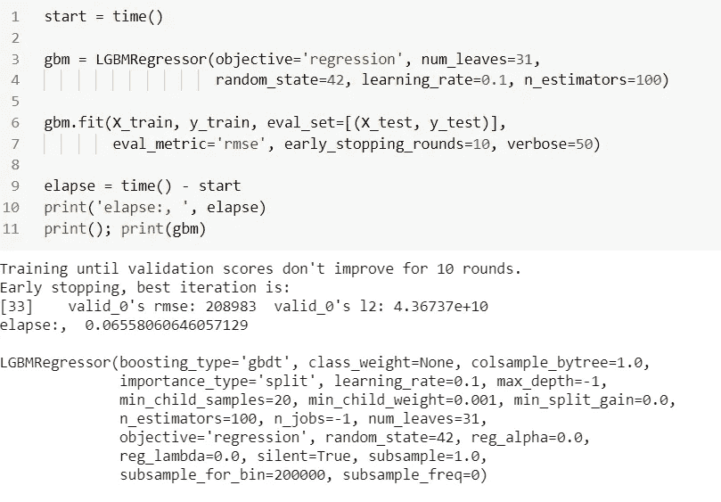**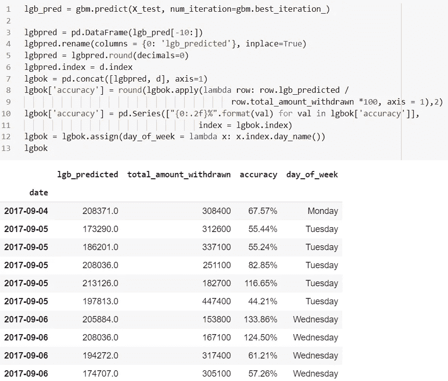**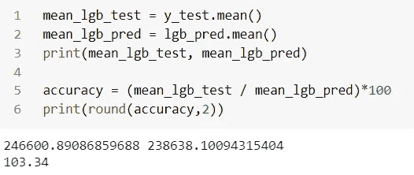*

*我们的平均预测在这里是相当准确的。虽然这个模型漏掉了一些日子，但是平均来说，这个预测比 XG 模型要好。*

*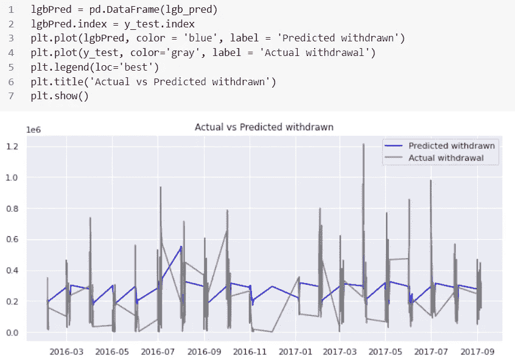**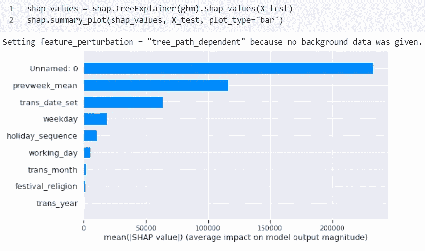*

# *CatBoost*

*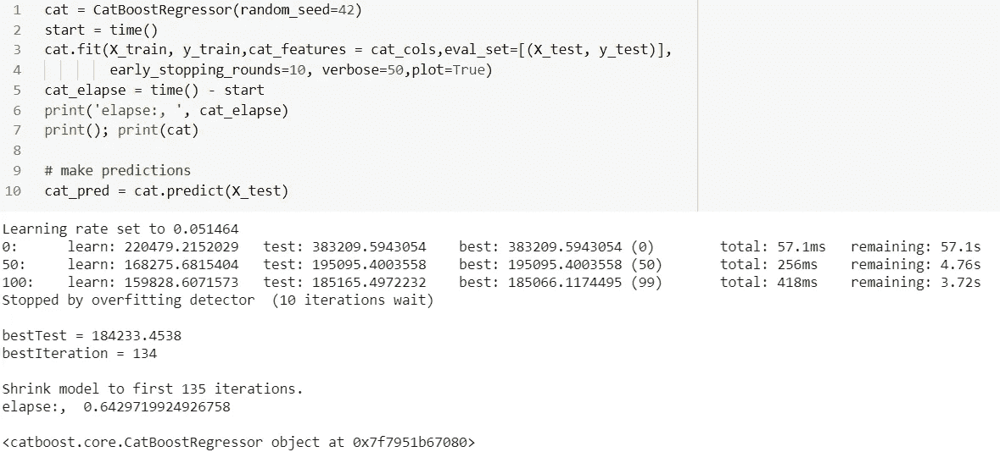**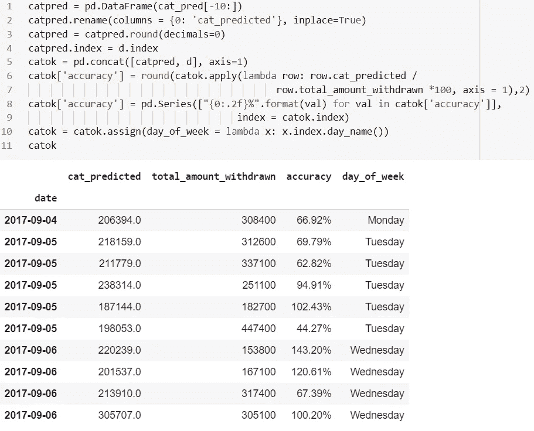**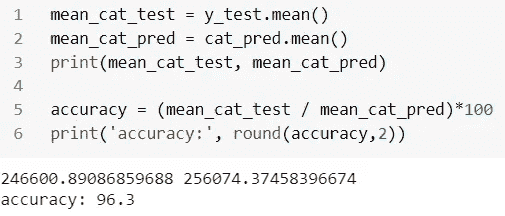*

*像 LGB 一样，CatBoost 也显示了几乎相似预测结果。*

*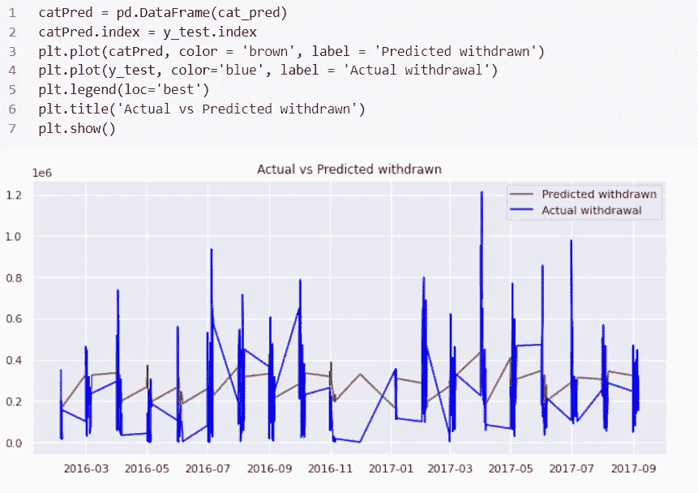**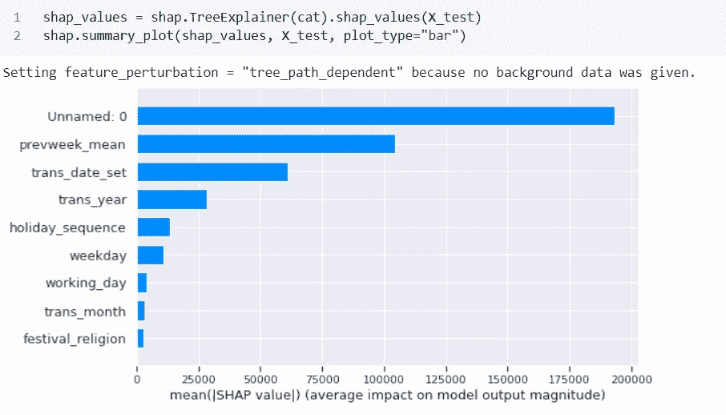*

*观察 LightGBM 和 CatBoost 如何从训练集中决定重要的特征总是很有趣的。但是，我将在另一篇文章中讨论这个问题。*

# *对比分析*

*企业可能会有兴趣看到最终的表格报告。根据这里观察到的结果，选择 Catboost 或 LightGBM 建模方法进行进一步优化是可行的。*

*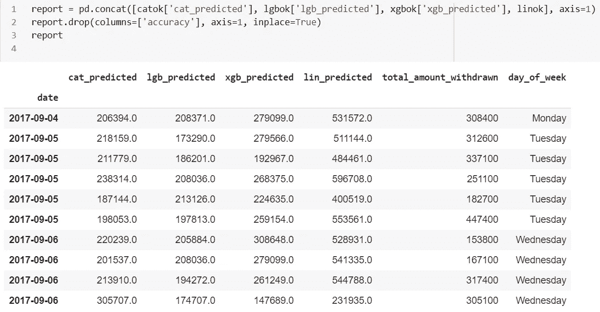*

*我们上面的练习是为了举例说明。在机器学习练习中，有三个更广泛的部分:(1)数据提取和挖掘，这有助于确定特征(这通常需要大约 60-70%)，(2)确定和拟合包括超参数优化的模型(这通常需要 10-15%)，(3)准确性度量和测试需要 10-15%的时间)。因此，我们看到第一阶段对于机器学习生命周期的成功至关重要。*

*这里，我们分析了一台特定的自动柜员机。对于多台柜员机，可以使用聚类方式进行现金需求预测，这带来了额外的优势:*

1.  *提高了现金需求预测的准确性，这是因为在预测具有类似的一周中现金提取季节性模式的 ATM 中心组的 ATM 每日现金需求时，计算复杂性降低了，*
2.  *运营成本的潜在巨大节约，因为类似的现金补充模式可用于属于同一集群的 ATM 中心。*

# *结论*

*LightGBM 和 CatBoost 在没有对给定数据集进行任何优化的情况下表现出了良好的预测能力。然而，有相当多的金融机构和使用案例可用于简单的线性回归或复杂的神经网络。作为一名分析顾问，当我们解决一个业务问题时，我们想到的第一个问题是我们能否使用线性规划(LP)来解决。考虑到 LP 更快的处理时间和清晰的可见性，它在商业中非常受欢迎。甚至 LP 也可以用来一次解决多个目标。*

*在这里，自动柜员机提款预测的关键是捕获和处理历史数据，以洞察未来。然而，现金需求天生具有高方差和非平稳的随机过程，这会影响许多方法的可靠性。此外，对现金的需求不仅受时间的影响，而且它遵循不同的趋势，这使得建模更加困难。比如节假日如何影响 ATM 的使用，取决于柜员所在的位置。根据取款金额和取款交易次数，可根据需求(如高、中、低)将多台 ATM 分为几大类。集群级别的补充计划可以为在类似地理区域运行的 ATM 节省大量运营成本。*

****我可以到达*** [***这里***](https://www.linkedin.com/in/saritmaitra/) 。*

**参考:**

1.  **加雷斯，詹姆斯；丹妮拉·威滕；哈斯蒂，特雷弗；罗伯特·蒂布拉尼(2015)。统计学习导论。纽约:施普林格**