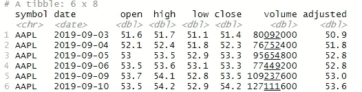
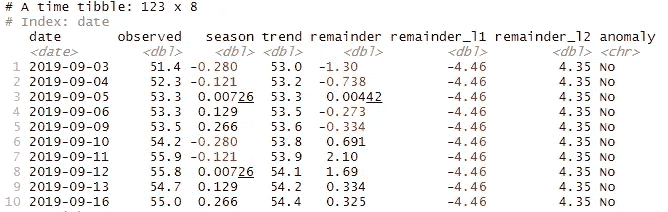
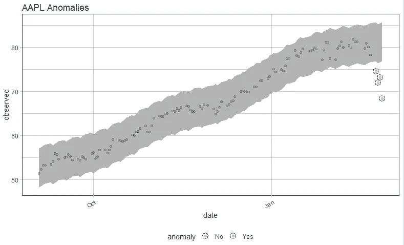

# 基于“异常化”库的时间序列异常检测

> 原文：<https://towardsdatascience.com/time-series-anomaly-detection-with-anomalize-library-67472003c003?source=collection_archive---------23----------------------->

## 时间序列异常检测的 3 个简单步骤


照片由 [Samantha Gades](https://unsplash.com/@srosinger3997?utm_source=medium&utm_medium=referral) 在 [Unsplash](https://unsplash.com?utm_source=medium&utm_medium=referral) 上拍摄

时间序列数据具有广泛的应用案例，从跟踪关键绩效指标(KPI)和了解业务趋势到高级建模和预测。异常检测就是这样一种有用的应用。信用卡欺诈检测等业务应用需要强大的技术，这些技术可以将时间序列数据作为输入，并实时识别异常情况。

异常检测是一个经过充分研究的领域，有许多可用的工具和技术。有很多用于异常检测的 R 包，例如`tsoutlier`和`AnomalyDetection.`,但是，我最近开始相信`[anomalize](https://cran.r-project.org/web/packages/anomalize/index.html)`是最直观、最易于使用的库——对于新手和高级数据科学家都是如此。

所以今天这篇文章的目的是用三个简单的步骤来演示`anomalize`异常检测库的实现。

让我们开始吧。

# 步骤 1:安装库并准备数据

就像任何其他机器学习算法一样，准备数据可能是异常检测中最重要的一步。但是从积极的方面来看，您可能一次只使用一列。因此，与其他机器学习技术中的数百个特征不同，您可以只关注用于建模的一列。

确保您完成了通常的数据清理和准备程序，例如处理丢失的值等。一个重要的步骤是确保数据集最终在一个*tible*或 *tbl_time* 对象中。

让我们首先安装我们将需要的库:

```
# install libraries
library(anomalize)
library(tidyverse)
library(tibbletime)
library(tidyquant)
```

对于这个演示，我们运气不错，不需要数据处理。我们将使用`tidyquant`库获取股票价格数据。

```
# fetch data
data <- tq_get('AAPL',
               from = "2019-09-01",
               to = "2020-02-28",
               get = "stock.prices")# take a peek
head(data)
```



# 第二步:执行`anomalize`

首先，让我们用刚刚获取的数据实现`anomalize`,然后讨论发生了什么。

```
# anomalize 
anomalized <- data %>% 
  time_decompose(close) %>%
  anomalize(remainder) %>%
  time_recompose()
```

这里很少发生什么事情，库接收输入数据并对其应用三个独立的函数。

首先，`time_decompose()`函数将时间序列数据的“收盘”列分解为“观察”、“季节”、“趋势”和“余数”分量。

其次，`anomalize()`函数对“余数”列执行异常检测，并在 3 列中给出输出:“余数 _l1”、“余数 _l2”和“异常”。这里的最后一列是我们想要的，如果观察结果是异常的，那么它是“是”,对于正常的数据点，它是“否”。



异常实现的输出

最后一个函数`time_recompose()`通过重新组合之前创建的“trend”和“season”列，将所有内容重新整理好。

# 步骤 3:绘制异常数据

实际上，我们的异常检测已经在前一步完成了。但是我们仍然需要将数据和异常现象可视化。让我们这样做，并直观地检查出异常值。

```
# plot data with anomalies
anomalized %>%
  plot_anomalies(time_recomposed = TRUE, ncol = 3, alpha_dots = 0.25) + labs(title = "AAPL Anomalies")
```



这个图非常直观。每个点是数据集中观察到的数据点，红色圆圈是模型识别的异常。阴影区域是余数的上限和下限。

# 下一步是什么？

如果到目前为止，您已经通过三个简单的步骤成功地实现了复杂的异常检测技术。这很简单，因为我们使用了默认参数，没有做任何改变。正如我们在上图中看到的，这个*开箱即用*模型在检测异常值方面表现得非常好。但是，您可能会遇到复杂的时间序列数据，这需要通过在步骤 2 中调整参数来提高模型性能。您可以阅读[模型文档](https://cran.r-project.org/web/packages/anomalize/index.html)和[快速入门指南](https://business-science.github.io/anomalize/articles/anomalize_quick_start_guide.html)来了解参数、它们的作用以及如何&何时改变它们。

如果你喜欢这篇文章，你可以在 Twitter 或 LinkedIn 上关注我。