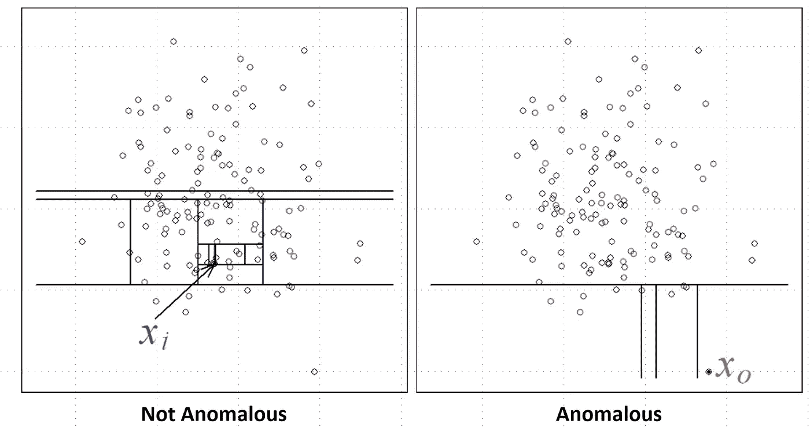

# 基于“真实世界”数据的时间序列异常检测

> 原文：<https://towardsdatascience.com/time-series-anomaly-detection-with-real-world-data-984c12a71acb?source=collection_archive---------22----------------------->

图片来自[这里](https://www.tatvic.com/blog/detecting-real-time-anomalies-using-r-google-analytics-360-data/)。

时间序列异常检测是一个非常困难的问题，尤其是在处理“真实世界”数据时。为了说明我所说的“真实世界”数据的含义，让我们假设你正在与多个客户合作，每个客户都在进行不同的纵向研究。客户希望您在研究进行过程中帮助他们检测数据中的异常，以便他们有可能修复这些异常并提高数据收集质量。你可能已经知道这是一个多么困难的问题。首先，不像你可能在 [Kaggle 竞赛](https://www.kaggle.com/mlg-ulb/creditcardfraud)中看到的那样，数据可能没有被标记(也就是说，你实际上不知道什么是异常，什么不是)，这实际上很常见！也许客户端没有资源来创建带标签的数据集。第二，在这种情况下，每个客户端都运行不同的研究，很可能每个客户端的数据集中都有不同的要素，不允许一个模型用于所有客户端。第三，纵向研究通常运行起来非常昂贵，因此，每个客户的数据集可能相对较小。最后，由于这些研究都还在进行中，可能会有很多“缺失数据”在这种情况下，我所说的缺失数据是指不同的受试者将处于研究的不同阶段，其中一些受试者可能只完成了两次随访，而另一些受试者可能已经完全完成了研究。

简而言之，在这个例子中，有很多东西对我们不利:我们有(1)未标记的数据，(2)具有不同特征的数据集，(3)小数据集，以及(4)具有大量缺失数据的数据集。对于许多数据科学家来说，这听起来像是一场噩梦！但是我们仍然有办法在数据中发现价值并发现异常。在这里，我简单介绍一下我最近使用的一种方法，我发现这种方法可以拾取合理的信号。不幸的是，目前，我不能公布这个项目的细节，但我希望你也尝试这个方法，让我知道它是如何工作的。

# 该方法

我最近成了[隔离森林](https://ieeexplore.ieee.org/stamp/stamp.jsp?arnumber=4781136)的忠实粉丝。隔离森林是一种集成学习方法，是随机森林的近亲。与随机林类似，隔离林使用决策树，您可以在其中对功能进行决策拆分。随机林和隔离林的最大区别在于，在隔离林中，拆分是随机的。通常所做的是隔离林选择随机特征并在特征中进行随机分割，直到所有数据点都被隔离；这个过程要用你想要的任意多的树进行几次。我们假设如果一个数据点需要很多分裂才能隔离，那么它不是异常的(下图左图)，但是如果一个数据点需要很少的分裂，那么它就是异常的(下图右图)。隔离林的输出是异常分数，它指示数据点被认为有多异常。从这个算法的描述中你可能可以看出，这是一种无监督的异常检测方法，这对于我们来说是必要的，因为我们没有标记的数据。这是一个非常简单的方法，但是效果相当好！此外，隔离林包含在 [scikit-learn](https://scikit-learn.org/stable/modules/generated/sklearn.ensemble.IsolationForest.html) 中，因此相对容易实现。

图来自原创[隔离林纸](https://ieeexplore.ieee.org/stamp/stamp.jsp?arnumber=4781136)。

好吧，听起来隔离森林解决了我们很多问题，对吧？没有。我们仍然有“缺失数据”的问题让我们回到目前仍在进行的纵向研究，我们在研究中的不同点有受试者。你可能知道，大多数机器学习算法都不能包含缺失数据，所以处理缺失数据的一个常用方法是用中位数来估算缺失值(或者为分类数据创建一个新的类别)。这在许多情况下可能很好，但是在我们的例子中，假设有许多受试者仍然处于研究的早期，那该怎么办呢？对于这些受试者，我们可以用他们尚未完成的访问的中值来估算缺失值，并在我们的数据集上运行隔离森林。然而，如果你这样做，你可能会注意到完成很少访问的受试者从未出现异常，这仅仅是因为我们通过用中位数来估算缺失值，使他们看起来更正常。这可不好！我们希望检测任何受试者中可能出现的异常，无论他们是在研究的早期还是已经完成了研究。

那么我们能做什么呢？这个问题有一个相对简单的解决方案。我们对完成每次访问的受试者运行单独的隔离森林。例如，假设一项研究有五个受试者。受试者 1、3 和 5 已经完成了六次就诊，而受试者 2 和 4 只完成了前三次就诊。我们要做的是使用受试者 1、3 和 5 的所有六次访问的数据运行隔离林，并输出异常分数。然后，对于受试者 2 和 4，我们仅使用前三次就诊的数据，并且也包括来自其他受试者的数据(仅来自前三次就诊的数据)，但是我们仅输出受试者 2 和 4 的异常分数。这种方法极大地减少了我们需要用中值估算缺失值的数据点的数量，因此，允许所有数据点潜在地被认为是异常的。太好了！

# 模型解释

如果你读过我的[前一篇博文](/machine-learning-algorithms-are-not-black-boxes-541ddaf760c3)，你就会知道我热衷于模型解释。理解驱动预测的特征对于解决业务问题通常至关重要。例如，回到纵向研究的例子，如果你发现一个受试者是异常的，你可能会想知道为什么他们是异常的，如果可能的话，试图解决导致他们异常的任何问题。那么我们如何解释一个隔离森林模型呢？这种方法非常类似于我在[之前的博文](/machine-learning-algorithms-are-not-black-boxes-541ddaf760c3)中讨论的特性重要性分析方法。首先，我们正常运行隔离林并输出异常分数——这些是基线异常分数。然后，我们选取一个特征，调整其值，在隔离林中重新运行数据集，并输出异常分数。我们对数据集中的每个要素执行此过程。然后，将每个混洗特征的异常分数与基线分数进行比较。我们可以推断，如果异常分数有很大的变化，那么这是检测异常的一个重要特征。这甚至可以在单个受试者的水平上进行检查，其中我们可以检查来自单个受试者的异常分数的变化。非常简单，我发现给出了一个合理的输出！

# 结论

好了，你知道了。我承认这种方法并不完美，而且有许多替代方法，但是我想分享一种我发现相当有效的方法。非常欢迎反馈和替代想法！