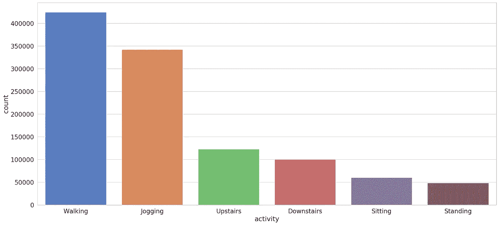
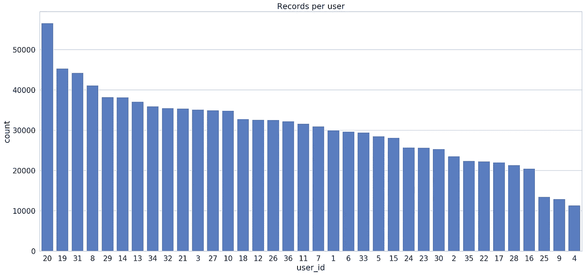
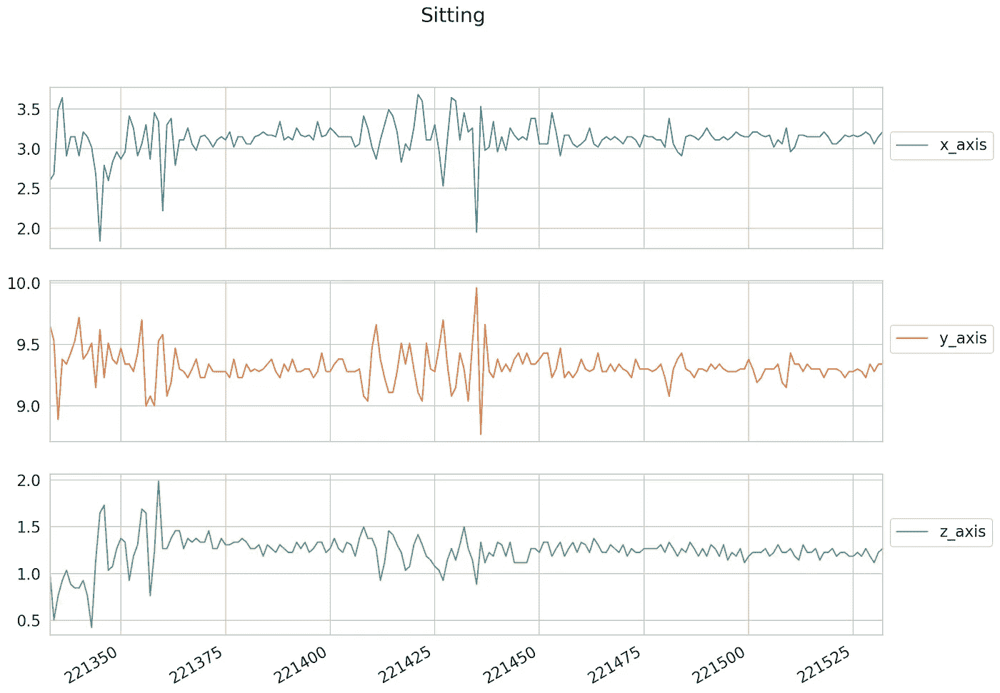
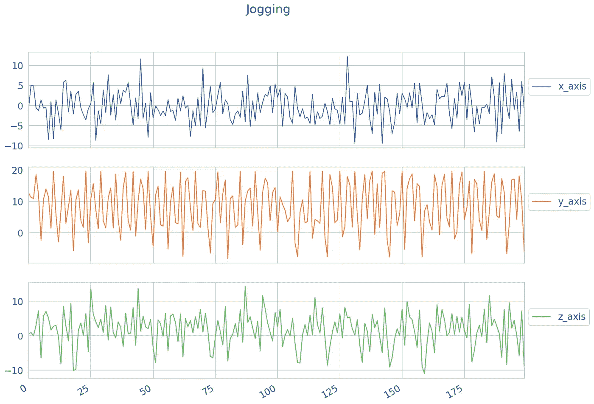
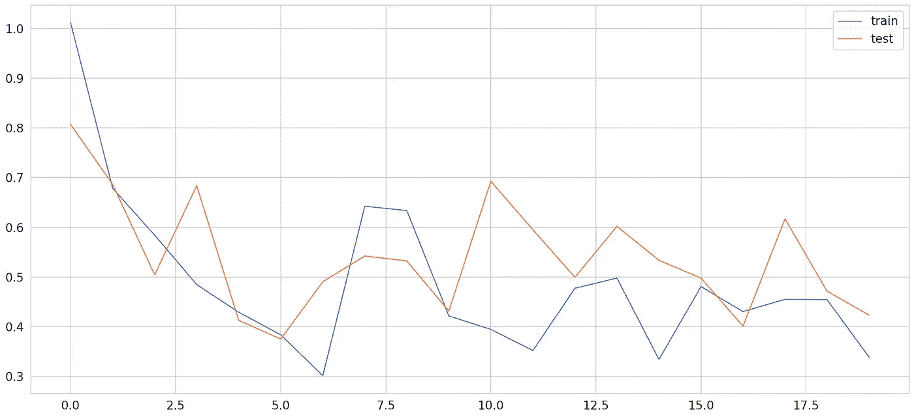
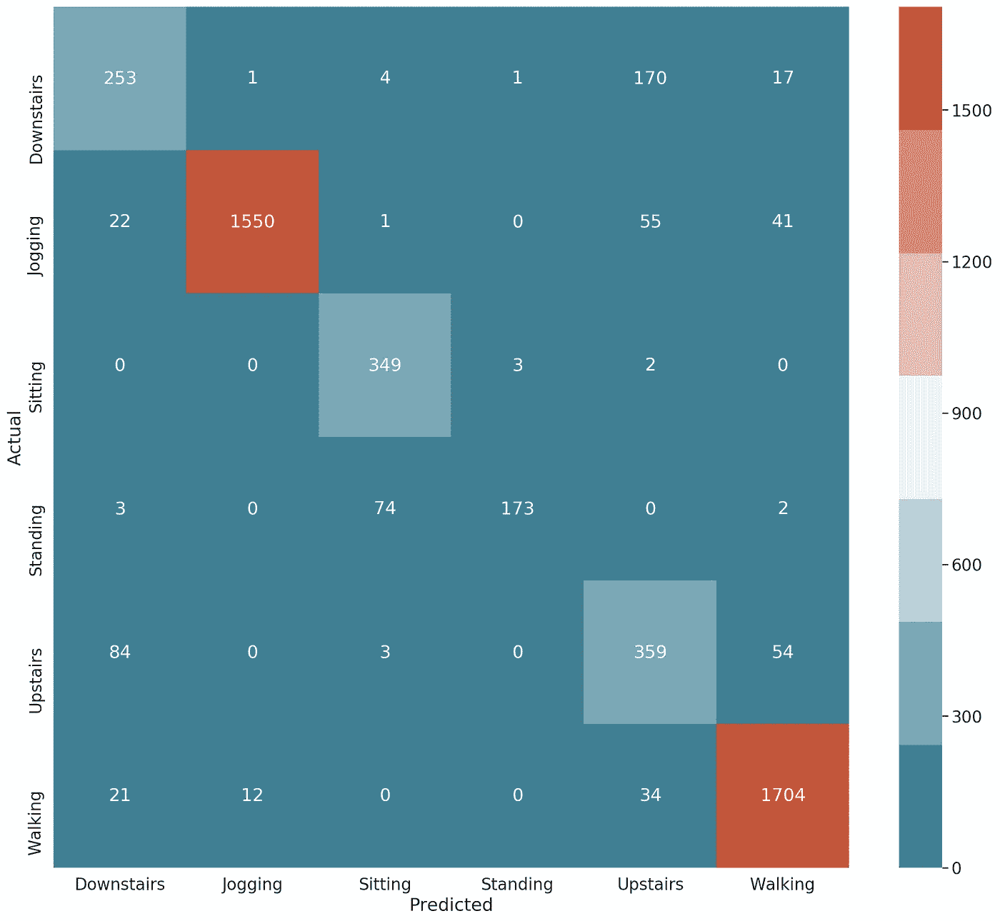

# 基于 TensorFlow 2 和 Keras 的人体活动识别时间序列分类

> 原文：<https://towardsdatascience.com/time-series-classification-for-human-activity-recognition-with-lstms-using-tensorflow-2-and-keras-b816431afdff?source=collection_archive---------7----------------------->

## 了解如何使用 Python 中的 Keras 和 TensorFlow 2 从加速度计数据中对人类活动进行分类


图片由 [Fitsum Admasu](https://unsplash.com/@fitmasu) 提供

> *TL；DR 了解如何使用 Keras 中的 LSTMs 对来自加速度计传感器的时间序列数据进行分类*

可以使用时间序列数据从加速度计数据中识别用户活动吗？你的手机/腕带/手表已经在做了。你能做得多好？

我们将使用从多个用户处收集的加速度计数据来构建一个双向 LSTM 模型，并尝试对用户活动进行分类。您可以在任何具有加速度计的设备(几乎是所有智能设备)上部署/重用经过训练的模型。

计划是这样的:

*   加载人员活动识别数据
*   为分类建立 LSTM 模型
*   评估模型

[**在浏览器中运行完整的笔记本**](https://colab.research.google.com/drive/1hxq4-A4SZYfKqmqfwP5Y0c01uElmnpq6)

[**GitHub 上的完整项目**](https://github.com/curiousily/Deep-Learning-For-Hackers)

[](https://leanpub.com/Hackers-Guide-to-Machine-Learning-with-Python) [## 用 Python 进行机器学习的黑客指南

### 这本书给你带来了机器学习的基础，使用工具和技术来解决现实世界…

leanpub.com](https://leanpub.com/Hackers-Guide-to-Machine-Learning-with-Python) 

# 人类活动数据

我们的数据是通过受控的实验室条件收集的。它是由无线传感器数据挖掘实验室提供的。

论文中使用的数据:[使用手机加速度计的活动识别](http://www.cis.fordham.edu/wisdm/includes/files/sensorKDD-2010.pdf)。看看这篇文章，感受一下一些基线模型的表现。

# 加载数据

让我们下载数据:

```
!gdown --id 152sWECukjvLerrVG2NUO8gtMFg83RKCF --output WISDM_ar_latest.tar.gz 
!tar -xvf WISDM_ar_latest.tar.gz
```

原始文件缺少列名。另外，其中一列有一个多余的“；”在每个值之后。让我们来解决这个问题:

```
(1098203, 6)
```

该数据具有以下特征:

*   `user_id` -执行活动的用户的唯一标识符
*   `activity` -当前活动的类别
*   `x_axis`、`y_axis`、`z_axis` -每个轴的加速度计数据

我们能从数据中学到什么？

# 探测

我们有六个不同的类别。让我们看看他们的分布:



散步和慢跑严重过剩。您可以应用一些技术来平衡数据集。

我们有多个用户。每个用户有多少数据？



大多数用户(除了最后 3 个)都有相当多的记录。

不同类型的活动是什么样子的？让我们看看前 200 条记录:



坐着很好，很放松。慢跑怎么样？



这看起来更有弹性。很好，可以通过观察数据对活动类型进行分离/分类(至少对于这两种活动的样本)。

我们需要找出一种方法，将数据转换成序列，以及每个序列的类别。

# 预处理

我们需要做的第一件事是将数据分成训练数据集和测试数据集。我们将使用来自 id 低于或等于 30 的用户的数据。其余的将用于培训:

接下来，我们将缩放加速度计数据值:

请注意，我们仅在训练数据上拟合缩放器。我们如何创建序列？我们将稍微修改一下`create_dataset`函数:

我们通过使用序列中所有类别的[模式](https://docs.scipy.org/doc/scipy/reference/generated/scipy.stats.mode.html)来选择标签(类别)。也就是说，给定一个长度为`time_steps`的序列，我们将它归类为最常出现的类别。

以下是创建序列的方法:

让我们看看新序列的形状:

```
(22454, 200, 3) (22454, 1)
```

我们已经大大减少了训练和测试数据的数量。让我们希望我们的模型仍然能够学到一些有用的东西。

最后一个预处理步骤是类别编码:

完成预处理！我们的模型在识别用户活动方面会有多好？

# 人类活动分类

我们将从一个简单的双向 LSTM 模型开始。你可以试着增加复杂度。请注意，该模型的训练速度相对较慢:

实际的训练过程很简单(记住不要乱来):

我们的模型有多好？

# 估价

培训过程如下:



你当然可以提出一个更好的模型/超参数并加以改进。它能多好地预测测试数据？

```
[0.3619675412960649, 0.8790064]
```

*~88%* 准确率。对于一个又快又脏的模特来说还不错。让我们来看看混淆矩阵:



我们的模型混淆了楼上和楼下的活动。这是意料之中的。此外，在开发真实世界的应用程序时，您可能会将这两者合并，并将其视为一个类/类别。回想一下，我们的数据集中也存在着严重的不平衡。

# 结论

你做到了！您已经建立了一个模型，它可以从 200 条加速度计数据记录中识别活动。你的模型在测试数据上达到了 *~88%* 的准确率。以下是您采取的步骤:

*   加载人员活动识别数据
*   为分类建立 LSTM 模型
*   评估模型

您学习了如何构建双向 LSTM 模型并对时间序列数据进行分类。接下来还有更多关于 LSTMs 和时间序列的有趣内容:)

[**在浏览器中运行完整的笔记本**](https://colab.research.google.com/drive/1hxq4-A4SZYfKqmqfwP5Y0c01uElmnpq6)

[**GitHub 上的完整项目**](https://github.com/curiousily/Deep-Learning-For-Hackers)

# 参考

*   [张量流—时间序列预测](https://www.tensorflow.org/tutorials/structured_data/time_series)
*   [了解 LSTM 网络](https://colah.github.io/posts/2015-08-Understanding-LSTMs/)
*   [WISDM:无线传感器数据挖掘](http://www.cis.fordham.edu/wisdm/dataset.php)

[](https://leanpub.com/Hackers-Guide-to-Machine-Learning-with-Python) [## 用 Python 进行机器学习的黑客指南

### 这本书给你带来了机器学习的基础，使用工具和技术来解决现实世界…

leanpub.com](https://leanpub.com/Hackers-Guide-to-Machine-Learning-with-Python) 

*原载于*[*https://www.curiousily.com*](https://www.curiousily.com/posts/time-series-classification-for-human-activity-recognition-with-lstms-in-keras/)*。*