# 基于深度学习的时间序列分类

> 原文：<https://towardsdatascience.com/time-series-classification-with-deep-learning-d238f0147d6f?source=collection_archive---------2----------------------->

## 用于时间序列分类的最重要的深度学习算法的架构和实现细节的概述

图片来自[https://www . pexels . com/it-it/foto/borsa-commercio-cres cita-dati-159888/](https://www.pexels.com/it-it/foto/borsa-commercio-crescita-dati-159888/)

# **为什么要进行时间序列分类？**

首先，重要的是要强调为什么这个问题在今天如此重要，以及为什么理解深度学习在这个领域的作用和潜力是非常有趣的。

近年来，时间序列分类已经成为数据科学中最具挑战性的问题之一。这是因为任何使用数据的分类问题，只要考虑到某种排序的概念，都可以被视为时间序列分类问题。

时间序列存在于许多现实世界的应用中，包括医疗保健、人类活动识别、网络安全、金融、营销、自动疾病检测、异常检测等。近年来，随着时态数据可用性的显著提高，许多领域对基于时间序列的应用产生了浓厚的兴趣，并提出了许多新的算法。

除了基于深度学习的算法之外，所有这些算法在执行分类之前都需要某种特征工程作为单独的任务，这可能意味着一些信息的丢失和开发时间的增加。相反，深度学习模型已经在内部纳入了这种特征工程，对其进行了优化，并消除了手动操作的需要。因此，他们能够以更快、更直接、更完整的方式从时间序列中提取信息。

# 应用程序

我们来看看时间序列分类的一些重要应用。

心电图记录可用于发现各种心脏问题，并以时间序列形式保存。区分正常心脏的心电图和患有疾病的心脏的心电图，并识别疾病，是一个时间序列分类问题。

如今，许多设备都可以通过简单的手势来控制，而无需物理接触。为此，这些设备记录一系列图像，用于解释用户的手势。从这个图像序列中识别正确的手势是一个时间序列
分类问题。异常检测是对与大多数数据明显不同的异常事件或观察结果的识别。

通常，异常检测中的数据是时间序列，例如与电子设备相关的量值的时间趋势，被监控以检查设备是否正常工作。区分正常操作的时间序列和有一些异常的设备的时间序列，并识别异常，是一个时间序列分类问题。

# **问题定义**

现在我们给出一个时间序列分类问题的正式定义。假设有一组具有相同结构的对象(例如相同大小的实数值、向量或矩阵等)。)，以及不同类的固定集合。我们将数据集定义为一组对*(对象，类)*，这意味着每个对象都与一个确定的类相关联。给定一个数据集，分类问题是建立一个与新对象相关联的模型，该新对象具有与其他对象相同的结构，根据与每个类相关联的对象的特征，建立属于可能的类的概率。

单变量时间序列是实值的有序集合，而 *M* 维多元时间序列是由 *M* 个长度相同的不同单变量时间序列组成。时间序列分类问题是数据集的对象是单变量或多变量时间序列的分类问题。

# **感知器(神经元)**

在介绍不同类型的深度学习架构之前，我们回忆一下它们使用的一些基本结构。首先，我们介绍感知器，这是许多机器学习算法的基本元素。它受到生物神经回路功能的启发，因此也被称为神经元。

此图显示了感知器的架构。感知器有一个或多个输入值，每个输入值都与一个权重相关联。

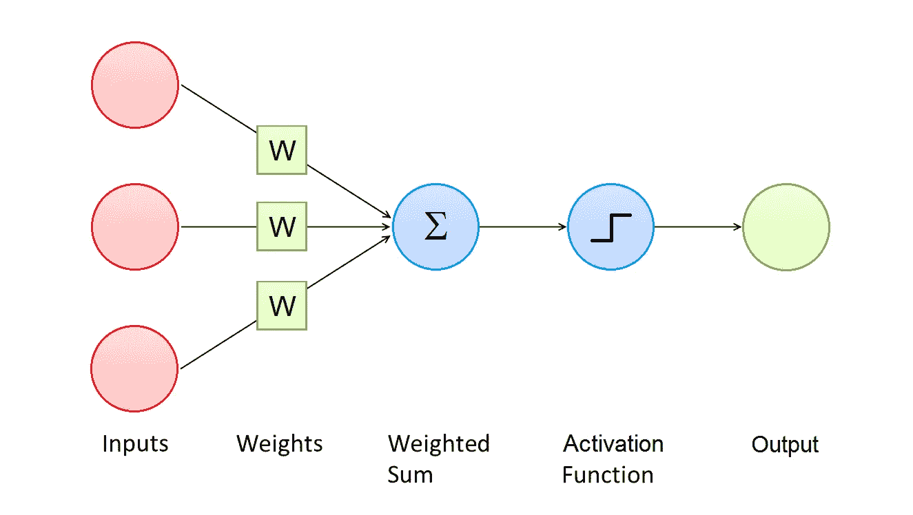

作者图片

感知器的目标是计算输入值的加权和，然后对结果应用激活函数。最常见的激活函数是 sigmoid、双曲线正切和 rectifier:

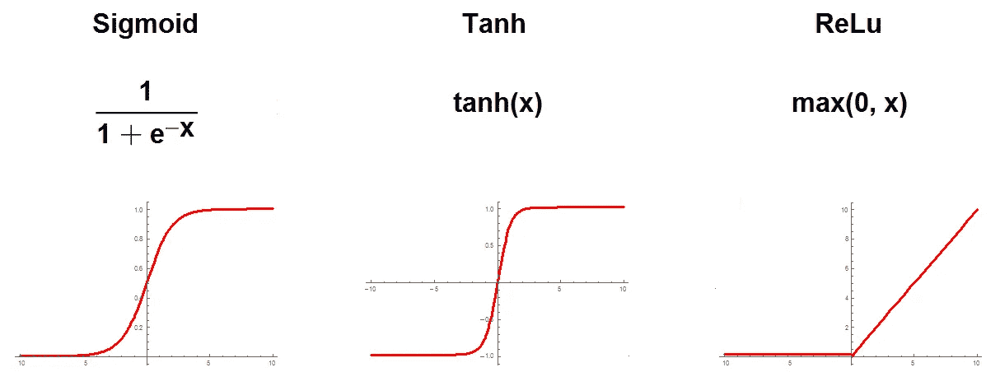

作者图片

激活函数的结果被称为感知器的激活，并代表其输出值。

# 多层感知器

现在我们介绍多层感知器(MLP)，它是许多深度学习架构中用于时间序列分类的构建模块。它是一类前馈神经网络，由几层节点组成:一个输入层、一个或多个隐藏层和一个输出层。每个节点都连接到其所在层、前一层和下一层的所有节点。为此，我们说多层感知器是完全连接的。隐藏层和输出层的每个节点都是一个感知器。

作者图片

多层感知器的输出是通过依次计算其感知器的激活而获得的，连接输入和输出的函数取决于权值。

# 多层感知器分类

多层感知器通常用于分类问题:给定一个数据集(我们记得它是对*(对象，类别)*的集合)，它可以计算任何新对象属于每个可能类别的概率。为此，首先我们需要以更合适的方式表示数据集中的对(对象、类):

*   每个对象必须被展平，然后用一个向量表示，这将是训练的输入向量。
*   数据集中的每个类都必须用其独热标签向量来表示。独热标签向量是大小等于数据集中不同类的数量的向量。数组的每个元素对应一个可能的类，除了与所代表的类相关的值外，每个值都是 *0* ，即 *1* 。独热标签向量将是训练的目标。在此图中，我们可以看到一个简单的热标签向量示例:在原始数据集中，列类有三个不同的值，具有一个热标签向量的数据集有三列，每个类一列。

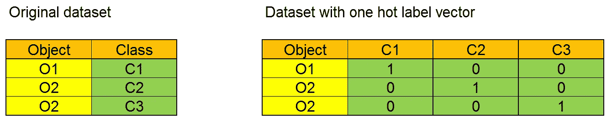

作者图片

这样，我们获得了一个新的数据集对(输入向量，目标)，我们为训练做好了准备。在这个过程中，MLP 使用了一种称为反向传播的监督学习技术，它对数据集的输入向量进行迭代:

*   在每次迭代中，使用当前输入向量计算 Mlp 的输出。
*   输出是一个向量，其分量是属于每个类别的估计概率。
*   使用成本函数计算模型的预测误差。
*   然后，使用梯度下降，在反向传递中更新权重以传播误差。

因此，通过迭代地向前传递，然后反向传播，以最小化训练数据损失的方式更新模型的权重。在训练之后，当多层感知器的输入是对应于具有给定结构的对象的向量(也不存在于数据集中)时，输出是其分量是属于每个类别的估计概率的向量。

现在，自然的问题是:为什么不使用多层感知器进行时间序列分类，把整个多元时间序列作为输入？答案是，多层感知器和许多其他机器学习算法一样，对于时间序列分类来说效果不佳，因为时间序列的长度确实会影响计算速度。因此，为了获得时间序列分类的良好结果，有必要提取输入时间序列的相关特征，并将它们用作分类算法的输入，以便在非常低的计算时间内获得更好的结果。

深度学习算法相对于其他算法的一大优势是，这些相关特征是在训练期间学习的，而不是手工制作的。这极大地提高了结果的准确性，并大大缩短了数据准备时间。然后，在许多层用于提取这些相关特征之后，许多深度学习架构可以使用像 MLP 这样的算法来获得所需的分类。

# 时间序列分类的深度学习

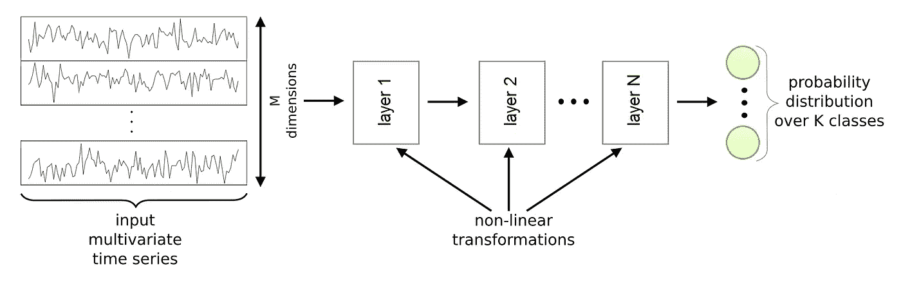

作者图片

该图显示了用于时间序列分类的通用深度学习框架。它是实现非线性功能的几个层的组合。输入是一个多元时间序列。每一层都将前一层的输出作为输入，并应用其非线性变换来计算自己的输出。

这些非线性变换的行为由每层的一组参数控制。这些参数将层的输入链接到其输出，并且是可训练的(像多层感知器的权重)。通常，最后一层是多层感知器或岭回归器。

本文提出了 3 种不同的时间序列分类深度学习架构:

*   *卷积神经网络*，这是用于时间序列分类问题的最经典和最常用的架构
*   *初始时间*，这是一种基于卷积神经网络的新架构
*   *回声状态网络*，这是另一种基于递归神经网络的最新架构

# 卷积神经网络

卷积神经网络是一种深度学习算法，它将图像或多变量时间序列作为输入，能够通过应用程序可训练的过滤器成功捕获空间和时间模式，并使用可训练的权重为这些模式分配重要性。与其他分类算法相比，卷积神经网络中所需的预处理要低得多。虽然在许多方法中滤波器是手工设计的，但是卷积神经网络具有学习这些滤波器的能力。

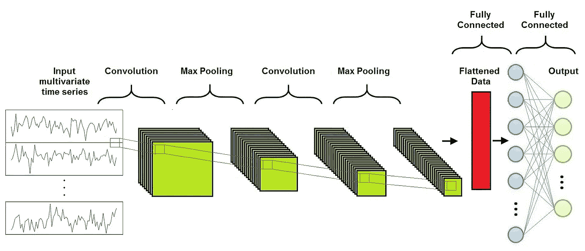

作者图片

如图所示，卷积神经网络由三个不同的层组成:

*   卷积层
*   汇集层
*   全连接层

通常，在完全连接层之前交替几个卷积层和池层。

## ***回旋层***

卷积运算之所以得名于回旋神经网络，是因为它是这类网络的基本构造块。它对输入的一系列特征映射与一个滤波器矩阵执行一次卷积，以获得一系列不同的特征映射作为输出，目的是提取高级特征。

卷积由一组滤波器定义，它们是固定大小的矩阵。当对具有相同大小的输入要素图的子矩阵应用过滤器时，结果由过滤器的每个元素与子矩阵的相同位置的元素的乘积之和给出(我们可以在此图中看到这一点)。

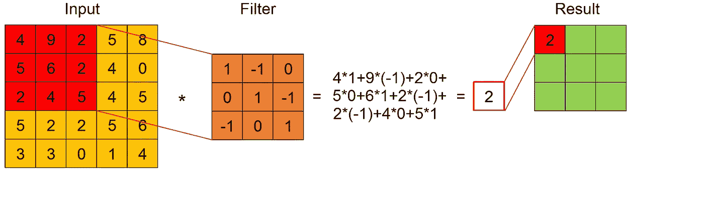

作者形象

一个输入要素图和一个过滤器之间的卷积结果是在输入要素图的宽度和高度上应用过滤器获得的有序要素图，如图所示。

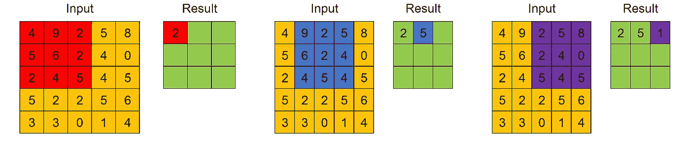

作者形象

卷积层执行每个滤波器和每个输入特征映射之间的卷积，获得一系列特征映射作为输出。如已经强调的，过滤器的值被认为是可训练权重，然后在训练期间被学习。

必须为卷积层选择的两个重要参数是*步长*和*填充*。

## ***跨步***

Stride 控制过滤器如何围绕一个输入要素图进行卷积。特别是，stride 的值表示一次必须移动多少个单位，如图所示。

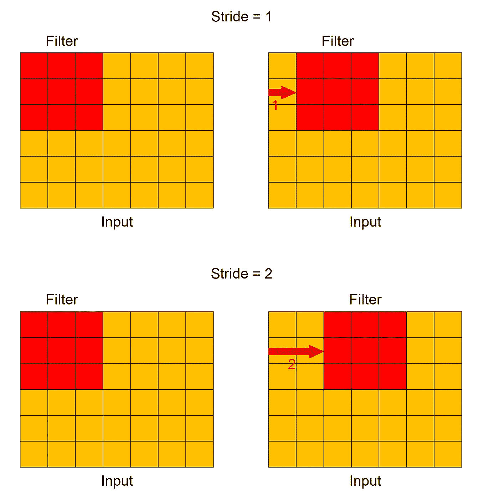

作者形象

## ***填充***

填充指示在应用卷积过滤器之前，要在输入要素图外部添加多少额外的列和行，如图所示。新列和新行的所有单元都有一个伪值，通常为 0。

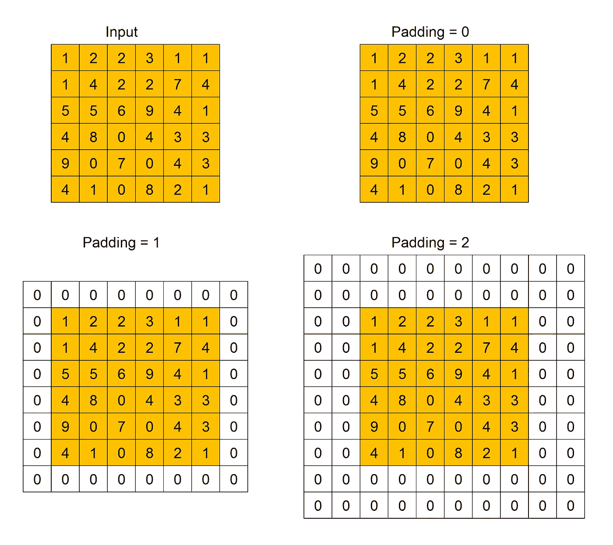

作者形象

之所以使用填充，是因为当对输入要素图应用卷积滤波器时，其大小会减小。然后，经过应用许多过滤器的大小可以变得太小。增加额外的行和列，我们可以保留原来的大小，或使其减少较慢。

当在应用卷积滤波器之后获得的特征图的大小小于输入特征图的大小时，我们将该操作称为有效填充(Valid Padding)。当输出大小等于或大于输入大小时，我们将此操作称为“相同填充”。

## ***汇集层***

池操作的目的是实现要素地图的降维，尽可能多地保留信息。这对于提取旋转和位置不变的主要特征也是有用的。其输入是一系列特征地图，其输出是具有较低维度的一系列不同的特征地图。

池化应用于每个输入要素地图的宽度和高度上固定大小的滑动窗口。有两种类型的池:最大池和平均池。正如我们在图中看到的，对于每个滑动窗口，池操作的结果是其最大值或平均值，分别用于最大池或平均池。

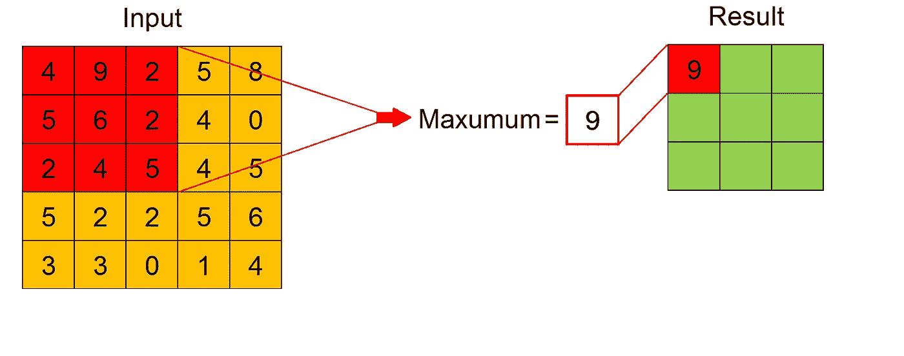

作者图片

最大池也作为噪音抑制剂，完全丢弃嘈杂的激活。因此，它的性能通常比平均池要好。对于混合层，还必须指定步幅和填充。

池操作的优点是对卷积输出频带进行下采样，从而减少隐藏激活的可变性。

## ***全连通层***

全连接层的目标是学习卷积层和汇集层的输出所表示的高级特征的非线性组合。通常全连接层是用多层感知器实现的。

经过几次卷积和合并操作后，原始时间序列由一系列特征图表示。所有这些特征图被展平成列向量，这是原始输入多元时间序列的最终表示。扁平列连接到多层感知器，其输出具有与时间序列的可能类别数量相等的神经元数量。

反向传播应用于训练的每次迭代。在一系列时期内，由于其主要的高级特征，该模型能够区分输入时间序列并对其进行分类。

## ***超参数***

对于卷积神经网络，神经网络有许多超参数要指定。最重要的如下:

*   *卷积滤波器数量-* 显然太少的滤波器无法提取足够的特征来实现分类。然而，当滤波器已经足以表示相关特征时，更多的滤波器是无能为力的，并且使得训练在计算上更加昂贵。
*   *卷积滤波器大小和初始值* -较小的滤波器收集尽可能多的局部信息，较大的滤波器代表更多的全局、高级和代表性信息。过滤器通常用随机值初始化。
*   *池化方法和大小* -如前所述，有两种类型的池化:最大池化和平均池化，最大池化通常表现更好，因为它也可以作为噪声抑制。汇集大小也是要优化的一个重要参数，因为如果汇集大小增加，维度减少得更多，但丢失的信息更多。
*   *权重初始化* -权重通常用小随机数初始化，以防止死神经元，但也不能太小，以避免零梯度。均匀分布通常效果很好。
*   *激活函数* -激活函数将非线性引入模型。通常选择整流器、sigmoid 或双曲线正切。
*   *时期数* -时期数是整个训练集通过模型的次数。如果计算性能允许，这个数字应该增加，直到测试误差和训练误差之间有一个小的间隙。

## 履行

使用 Keras 构建卷积神经网络非常容易。Keras 是一个简单易用但功能强大的 Python 深度学习库。在 Keras 中构建卷积神经网络只需几个步骤:

*   首先声明一个顺序类；每个 Keras 模型都是使用 Sequential 类构建的，它表示层的线性堆栈，或者使用 model 类，它更灵活。由于 CNN 是层的线性堆栈，我们可以使用更简单的顺序类；
*   在顺序类中添加所需的卷积、最大池和密集 Keras 层；
*   指定卷积层的过滤器数量和过滤器大小；
*   指定池层的池大小。

为了编制模型，Keras 需要更多信息，即:

*   *输入形状*(一旦输入形状被指定，Keras 自动推断后面层的输入形状)；
*   *优化器*(例如随机梯度下降或 Adagrad)；
*   *损失函数*(例如均方误差或平均绝对百分比误差)；
*   *指标列表*(例如准确度)。

在 Keras 中训练模型实际上只包括调用函数 *fit()* 指定所需的参数，即:

*   *训练数据*(输入数据和标签)，
*   *要训练的时期数*(整个数据集的迭代次数)，
*   *验证数据*，在训练过程中使用它来定期测量网络相对于以前未见过的数据的性能。

使用训练好的模型进行预测很容易:我们将一个输入数组传递给函数 *predict()* ，它返回一个输出数组。

# 初始时间

最近推出了一种叫做初始时间的深度卷积神经网络。这种网络具有很高的精度和很好的可扩展性。

## 初始网络架构

初始网络的架构类似于卷积神经网络的架构，不同之处在于卷积层和汇集层被初始模块取代。

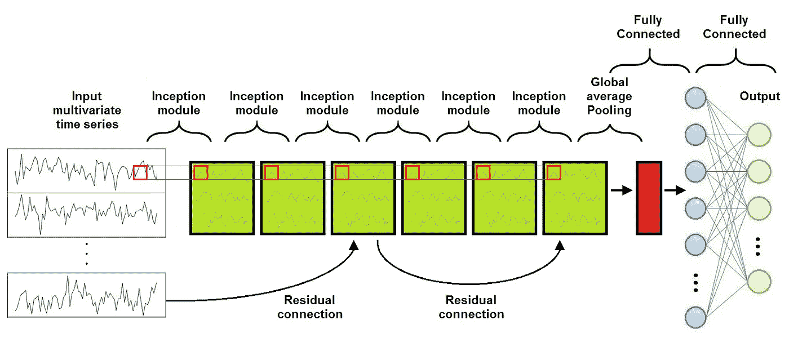

作者图片

如图所示，初始网络由一系列初始模块组成，之后是一个全局平均池层和一个全连接层(通常是一个多层感知器)。此外，每三个初始模块添加一个剩余连接。每个残差块的输入通过快捷的线性连接进行传输，以添加到下一个块的输入，从而通过允许梯度的直接流动来缓解消失梯度问题。

## 初始模块

初始网络的主要构件是初始模块，如图所示。

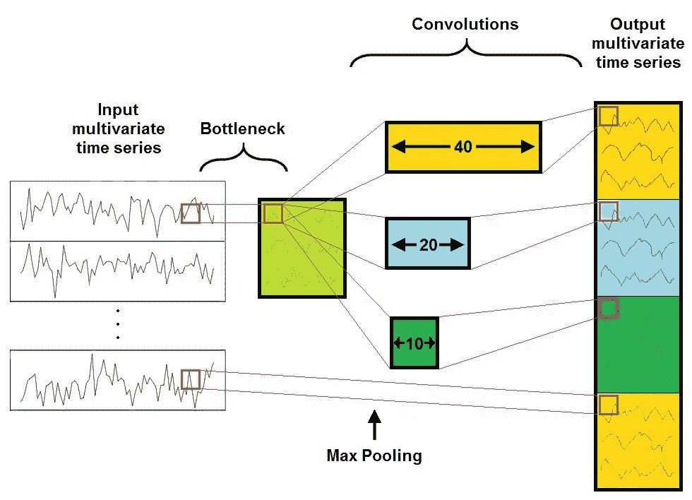

作者图片

它由 4 层组成:

*   第一层是瓶颈层，它降低了输入的维度。这也减少了计算成本和参数数量，加快了训练速度，提高了泛化能力。
*   Inception 模块的第二个主要组件是一组不同大小的并行卷积层，作用于相同的输入特征映射。例如，在该图中，有三种不同的卷积，过滤器尺寸为 10、20 和 40。
*   第三层是最大池，它引入了对小扰动不变的模型的能力。
*   第四和最后一层是深度级联层，其中每个独立并行卷积和最大池的输出被级联以形成当前初始模块的输出多元时间序列。

通过堆叠多个初始模块并经由反向传播训练滤波器的值，由于使用不同大小的滤波器，网络能够提取多个分辨率的潜在分层特征。这是 Inception 模块的巨大优势，因为它允许内部层挑选和选择与学习所需信息相关的过滤器大小。这对于识别在不同输入要素地图上可能具有不同大小的高级要素非常有帮助。

## 感受野

理解初始网络的关键参数是它的感受野。与全连接网络不同，初始网络中的神经元仅依赖于输入特征图的一个区域。这个区域被称为神经元的感受野。显然，底层神经元所依赖的区域比顶层神经元要小。然后，底层神经元被期望捕捉时间序列的局部结构，而顶层神经元被期望识别更复杂的模式。

对于时间序列数据，初始网络的总感受野由该公式定义，其仅取决于滤波器的长度 *k_i* 和网络的深度 *d* (即初始模块的数量):

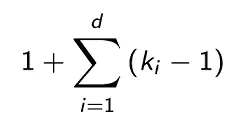

研究初始网络的准确性如何随着感受野的变化而变化是非常有趣的。为了改变感受野，我们可以改变过滤器的长度或网络的深度。

大多数情况下，需要更长的过滤器来产生更精确的结果。这是因为较长的过滤器比较短的过滤器能够以更高的概率捕获较长的模式。相反，通过增加更多层来增加感受野并不一定会提高网络的性能，尤其是对于训练集较小的数据集。因此，为了提高精度，通常最好增加过滤器的长度，而不是增加更多的层。

## 初始时间架构

许多实验已经表明，单个初始网络有时在准确性上表现出很大的差异。这可能是因为随机权重初始化所带来的可变性。

为了克服这种不稳定性，通常初始时间被实现为许多初始网络的集合，并且每个预测具有相同的权重。以这种方式，该算法提高了他的稳定性，并且显示出已经提到的高准确性和非常好的可扩展性。

特别地，不同的实验表明，它的时间复杂度随着训练集大小和时间序列长度线性增长，这是一个非常好的结果，因为许多其他算法相对于相同的幅度平方增长。

## 履行

《盗梦空间》的完整实现可以在 GitHub([https://github.com/hfawaz/InceptionTime](https://github.com/hfawaz/InceptionTime))上找到。实现是用 Python 写的，使用 Keras。该实现基于 3 个主要文件:

*   文件 *main.py* 包含运行实验所需的代码；
*   文件 *inception.py* 包含了 inception 网络实现；
*   文件 *nne.py* 包含了集合一组初始网络的代码。

特别是，实现使用已经提到的 Keras 模块类，因为 InceptionTime 的一些层并行工作，不像卷积神经网络使用顺序类，因为它们的层都是串行的。

实现初始模块构建块的代码与针对卷积神经网络描述的代码非常相似，因为它使用 Keras 层进行卷积和最大池化，因此它可以很容易地用于或包含在基于 Keras 的代码中，以便实现定制的架构。

# 递归神经网络

回声状态网络是一种递归神经网络，因此对它们做一个小的介绍可能是有用的。递归神经网络是组织成连续层的神经元样节点的网络，具有类似于标准神经网络的架构。事实上，像在标准神经网络中一样，神经元被分为输入层、隐藏层和输出层。神经元之间的每个连接都有相应的可训练权重。

不同之处在于，在这种情况下，每个神经元都被分配到一个固定的时间步长。隐藏层中的神经元也在依赖于时间的方向上被转发，这意味着它们中的每一个都仅与具有相同分配时间步长的隐藏层中的神经元完全连接，并且与分配给下一个时间步长的每一个神经元单向连接。输入和输出神经元仅连接到具有相同指定时间步长的隐藏层。

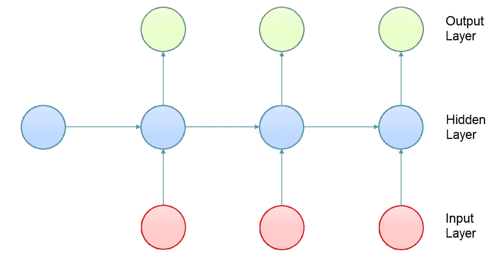

作者图片

由于一个时间步长的隐藏层的输出是下一个时间步长的输入的一部分，神经元的激活是按时间顺序计算的:在任何给定的时间步长，只有分配给该时间步长的神经元计算它们的激活。

递归神经网络很少用于时间序列分类，主要是由于三个因素:

*   这种体系结构的类型主要设计用于预测时间序列中每个元素的输出。
*   当在长时间序列上训练时，递归神经网络通常会遇到消失梯度问题，这意味着隐藏层中的参数要么不会改变太多，要么会导致数值不稳定和混沌行为。
*   递归神经网络的训练很难并行化，并且计算量也很大。

回声状态网络被设计成通过消除计算隐藏层的梯度的需要、减少训练时间和避免消失梯度问题来减轻递归神经网络的问题。事实上，许多结果表明回声状态网络确实有助于处理混沌时间序列。

# 回声状态网络

如图所示，回声状态网络的架构由输入层、称为储层的隐藏层、降维层、称为读出的全连通层和输出层组成。

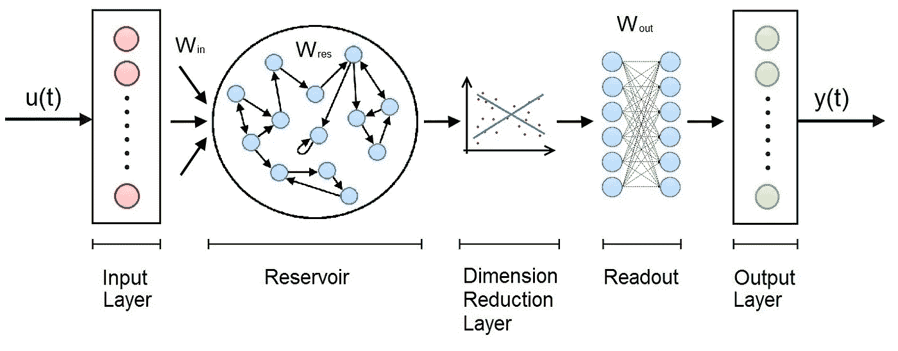

作者图片

*   贮存器是回声状态网络的主要构件，并且像稀疏连接的随机递归神经网络一样组织。
*   降维算法通常用主成分分析来实现。
*   读出通常实现为多层感知器或岭回归器。

输入层和储层之间的权重以及储层中的权重是随机分配的，不可训练。读数中的权重是可训练的，因此网络可以学习和复制特定的模式。

## 蓄水池

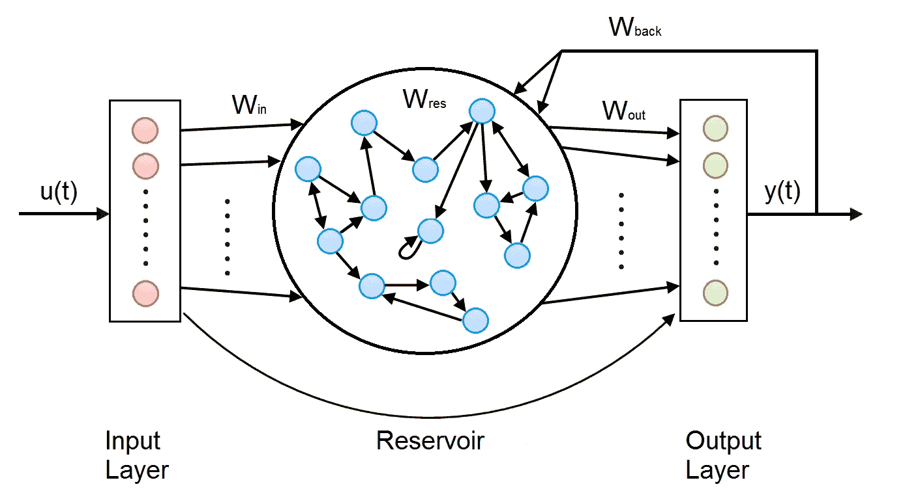

作者图片

如前所述，储层的组织类似于稀疏连接的随机递归神经网络。储层连接到输入层，由一组内部稀疏连接的神经元和自己的输出神经元组成。在储罐中有 4 种类型的砝码:

*   *输入层和内部神经元之间的输入权重*；
*   *内部权重，*将内部神经元相互连接；
*   *内部神经元和输出之间的输出权重*；
*   *反向传播权重*，将输出连接回内部神经元。所有这些权重都是随机初始化的，对于每个时间步长都是相等的，并且是不可训练的。

与 RNNs 一样，由于一个时间步长的输出是下一个时间步长输入的一部分，因此每个时间步长都单独计算水库的输出。在每个时间步长，计算每个内部和输出神经元的激活，并获得当前时间步长的输出。

ESNs 的最大优点是库创建了输入到更高维表示中的递归非线性嵌入，但是因为只有读出中的权重是可训练的，所以训练计算时间保持很低。

## 降维

许多实验表明，选择正确的降维方法可以在不降低精度的情况下减少执行时间。此外，降维提供了正则化，提高了模型的整体泛化能力和鲁棒性。

在大多数情况下，训练时间随着子空间维度几乎线性地增加，而只要子空间维度低于某个阈值，准确度就快速增加，然后在该阈值之后，准确度显著减慢并保持几乎恒定。因此，该阈值是子空间维度的最佳选择，因为使用更高的值，我们将具有更长的执行时间，而精度没有相应的提高。

## 履行

在 GitHub([https://GitHub . com/FilippoMB/Reservoir-Computing-framework-for-multivariate-time-series-class ification](https://github.com/FilippoMB/Reservoir-Computing-framework-for-multivariate-time-series-classification))上可以获得回声状态网络的 Python 完整实现。代码使用了 Scikit-learn 和 SciPy 库。包含在文件模块中的主类 RC_classifier。py 允许建立、训练和测试储层计算分类器，即回声状态网络所属的算法家族。

储层所需的超参数必须进行优化，以获得执行时间所需的精度和性能；最重要的是:

*   水库中神经元的数量；
*   非零连接权重的百分比(通常小于 10%)；
*   连接权重的水库矩阵的最大特征值。

其他层中最重要的超参数是:

*   降维层算法(对于多元时间序列数据可以是零或张量 PCA
*   降维层后的子空间维度；
*   用于分类的读出类型(多层感知器、岭回归或 SVM)；
*   时期数，即优化过程中的迭代次数。

实现模型的训练和使用的代码结构非常类似于为卷积神经网络描述的结构。

# 结论

卷积神经网络是时间序列分类中最受欢迎的深度学习技术，因为它们能够通过使用可训练的过滤器成功捕捉空间和时间模式，并使用可训练的权重为这些模式分配重要性。

使用 CNN 的主要困难是它们非常依赖于训练数据的大小和质量。特别是，时间序列的长度会降低训练速度，对于混乱的输入时间序列或相同相关特征可能具有不同大小的输入时间序列，结果可能不像预期的那样准确。为了解决这个问题，最近提出了许多新的算法，在这些算法中，初始时间和回声状态网络的性能优于其他算法。

InceptionTime 源自卷积神经网络，并在最重要的构建模块(初始模块)中使用有效的降维来加速训练过程。此外，它在处理输入时间序列方面表现得非常好，在输入时间序列中，相同的相关特征可能具有不同的大小。

回声状态网络基于递归神经网络，并且由于它们非常稀疏地连接，并且它们的大部分权重先验地固定于随机选择的值，因此加快了训练过程。由于这一点，他们在快速训练后表现出色。此外，它们对处理混沌时间序列非常有帮助。

因此，总之，高精度和高可扩展性使这些新架构成为产品开发的完美候选。

# 作者

我关于走向数据科学的文章:[https://medium.com/@marcodelpra](https://medium.com/@marcodelpra)

我的 LinkedIn 个人资料:【https://www.linkedin.com/in/marco-del-pra-7179516/ 

领英集团 *AI 学习:*[https://www.linkedin.com/groups/8974511/](https://www.linkedin.com/groups/8974511/)

# 参考

1.  Hassan Ismail Fawaz、Benjamin Lucas、Germain Forestier、Charlotte Pelletier、Daniel F. Schmidt、Jonathan Weber、Geoffrey I. Webb、Lhassane Idoumghar、Pierre-Alain Muller、Franç ois Petitjean。 *InceptionTime:寻找 AlexNet 进行时间序列分类*。
2.  菲利普·玛利亚·比安奇、西蒙·斯卡达潘、齐格鲁德·洛克斯、罗伯特·杰森。*多变量时间序列表示和分类的油藏计算方法*。