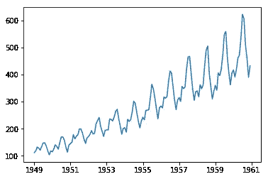
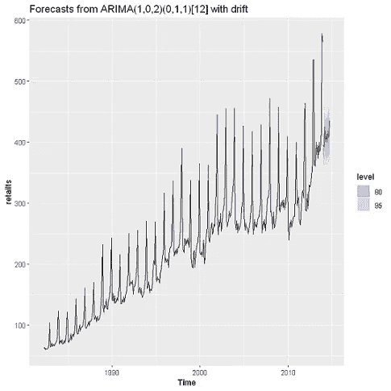
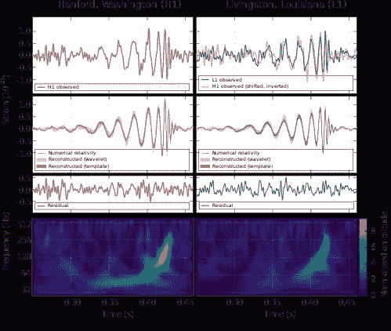
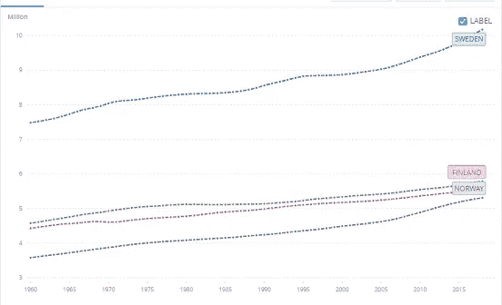

# 时间序列数据挖掘技术及其应用

> 原文：<https://towardsdatascience.com/time-series-data-mining-techniques-and-applications-5159b8ad26ec?source=collection_archive---------24----------------------->

## 预测、异常检测、预测分析、计量经济学等等

在 [Unsplash](https://unsplash.com?utm_source=medium&utm_medium=referral) 上 [NeONBRAND](https://unsplash.com/@neonbrand?utm_source=medium&utm_medium=referral) 拍摄的照片

所有行业都生成并使用时间序列数据来做出重要的商业决策。

使用过去的数据，杂货连锁店想知道一年中的哪个时间对特定产品的市场需求最大；呼叫中心需要预测未来的呼叫量，以便保持足够的人员配备；信用卡公司密切关注欺诈交易，所有这些商业决策都受益于时间序列数据的使用。

因此，本文的目的是讨论一些关键的应用案例，以及在不同行业的时间序列数据分析中使用的技术类型。

# **1。了解过去**

时间序列数据点是过去的快照。了解历史事件、模式和趋势是所有企业追踪的一些基本指标。他们希望了解自己过去的表现有多好，以及未来的发展方向。如今，随着“大数据”数量的不断增长以及对近实时洞察的需求，时间序列分析正成为商业决策的重要组成部分。以下是历史数据帮助决策的几种方式:

*   衡量和跟踪关键绩效指标(KPI)
*   识别影响产品需求的特殊事件
*   跨产品类别和位置比较 KPI
*   了解趋势并获得业务方向的早期指示
*   识别季节性和长期商业周期
*   影响企业绩效的假设因素
*   审查政策变化的影响

通过时间序列数据对历史事件的基本理解不需要花哨的建模，只需绘制数据与时间的关系就可以产生非常强大的洞察力。在过去，电子表格足以创造强大的视觉故事和洞察力。如今，大多数统计和数据分析工具(例如 Python、Tableau、PowerBI)可以很好地处理时间序列数据，以创建时间序列图表、仪表板等。

历史数据揭示了重要的见解——趋势、季节性、商业周期等等

# 2.预测未来

时间序列数据的另一个引人注目的用途是预测——对短期、中期和长期的未来进行预测。企业每天通常面临的许多预测问题都有时间维度，这也是时间序列数据对于预测如此重要的原因。以下是不同领域的一些预测应用:

*   政府对人口增长进行预测，以发展足够的公共基础设施
*   气候科学家重建历史数据，并用它们来预测未来的气候
*   公用事业公司预测未来需求以进行必要的业务扩张
*   企业预测其产品的未来需求，以确保充足的产品库存

时间序列预测是数据科学和机器学习技术的重要组成部分，涉及拟合统计/机器学习模型来进行预测。这些工具很简单，从历史趋势向未来的外推，到复杂的随机自回归模型，如 ARIMA[阅读:[时间序列预测:从天真到 ARIMA 和超越](/time-series-forecasting-from-naive-to-arima-and-beyond-ef133c485f94) ]。长期短期记忆([【LSTM】](https://machinelearningmastery.com/how-to-develop-lstm-models-for-time-series-forecasting/))和[计量经济学](/econometrics-101-for-data-scientists-584f4f879c4f)等深度学习模型正日益增加预测实践的复杂性。

使用 ARIMA 根据历史数据预测零售额([来源](/time-series-forecasting-from-naive-to-arima-and-beyond-ef133c485f94))

# 3.专业业务应用

## 3.1 异常检测

异常(或异常值)是数据中任何不寻常的观察结果。鉴于客户的历史交易行为，如果信用卡交易的突然激增是意料之外的，则可能被视为异常。类似地，如果在任何交易/数据点的时间序列图中有尖峰和下降，这些也可以被视为异常值。

异常检测是一个经过充分研究的领域，有许多可用的工具和技术。有几个 R 包专门用于异常检测，如`[tsoutlier](https://cran.r-project.org/web/packages/tsoutliers/tsoutliers.pdf)`和`[AnomalyDetection](https://github.com/twitter/AnomalyDetection).`下面是一些商业应用:

*   金融:信用卡和金融交易中的欺诈检测
*   网络安全:根据计算机网络中的异常流量检测网络入侵
*   医疗保健:基于读取心跳脉冲的心电图(ECG)记录的异常患者状况
*   天文学:在对恒星和星系的特征和特性的观察中发现异常值。最著名的可能是[引力波探测](https://en.wikipedia.org/wiki/First_observation_of_gravitational_waves)。

LIGO 的引力波探测:异常探测的一个例子(来源:[维基百科](https://en.wikipedia.org/wiki/First_observation_of_gravitational_waves)

## 3.2 比较分析

比较分析是一种显示与时间相关的观察结果之间的相似性和差异的方法。它还可以用来比较多个实体的性能。例如，绘制不同国家的人口增长时间序列数据可以揭示一个国家与另一个国家相比的重要信息。

显示北欧国家人口增长的比较时间序列图(资料来源:[世界银行](https://data.worldbank.org/indicator/SP.POP.TOTL?end=2018&locations=SE-DK-NO-FI&start=1977&view=chart))

## 3.3 相关性分析

相关性通常被理解为两个随机变量之间的关系，并且通常在双变量散点图中可视化。两个随机时间序列变量同样可以揭示相关性/关联性。通过绘制多元时态数据，很容易识别两个特征之间的关联(例如，销售额与利润)。这种关联可能意味着因果关系，也可能不意味着因果关系，但这是寻找与输出变量相关的特征并在统计分析中使用它们的良好起点。

除了可视化时间序列图之外，还有用于测量时间序列相关性的定量指标— [皮尔逊系数](https://en.wikipedia.org/wiki/Pearson_correlation_coefficient)就是这样一种指标。

## 3.4 经济计量分析

预测分析是一个成熟的技术领域，它大量利用统计学和机器学习来预测未来的结果。该领域还从一个专门的经济学子学科— [计量经济学](/econometrics-101-for-data-scientists-584f4f879c4f)中汲取方法。高级统计分析，如[面板数据模型](/panel-data-regression-a-powerful-time-series-modeling-technique-7509ce043fa8)(如固定和随机效应模型)严重依赖多元纵向(时间序列)数据集。下面是一些计量经济学的应用:

*   测量气候变化对 [GDP](https://agupubs.onlinelibrary.wiley.com/doi/full/10.1029/2018EF000922) 、[农业](https://www.tandfonline.com/doi/abs/10.1080/17565529.2014.989189?journalCode=tcld20)和[热带气旋破坏](https://www.nature.com/articles/nclimate1357)的影响
*   使用时间序列数据预测[商业和住宅抵押贷款违约之间的空间相关性](https://www.sciencedirect.com/science/article/abs/pii/S0304407619300752)
*   在时间序列预测问题中使用[贝叶斯观点](https://www.sciencedirect.com/science/article/abs/pii/S0304407618302112)
*   确定农场销售和出口的决定因素

# *结论*

时间序列数据在所有应用领域提供了丰富的分析和应用可能性。历史分析、预测、异常检测和预测分析只是这些可能性中的一部分。随着新工具和技术的发展，新的分析领域也在出现。人工神经网络(如 LSTM)和计量经济学是时间序列数据分析的前沿领域。有经验和有抱负的数据科学家可以通过利用这些工具，或者开发新的工具，为他们的领域做出巨大贡献。