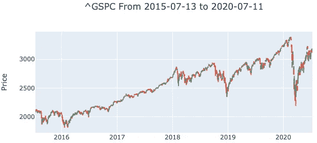
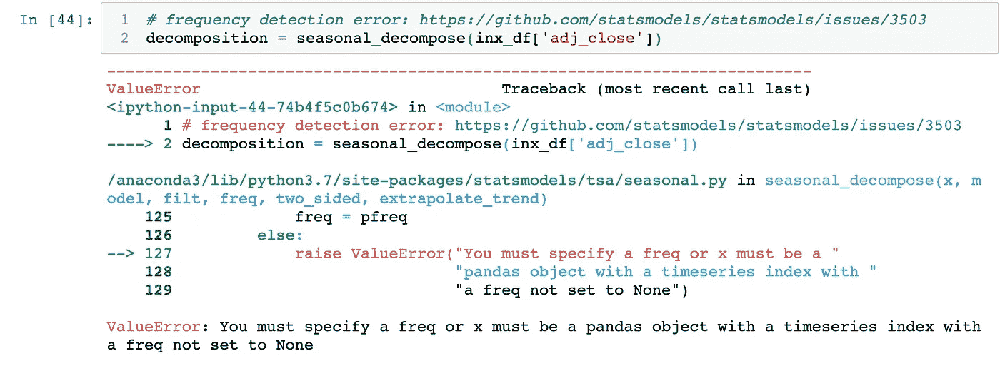
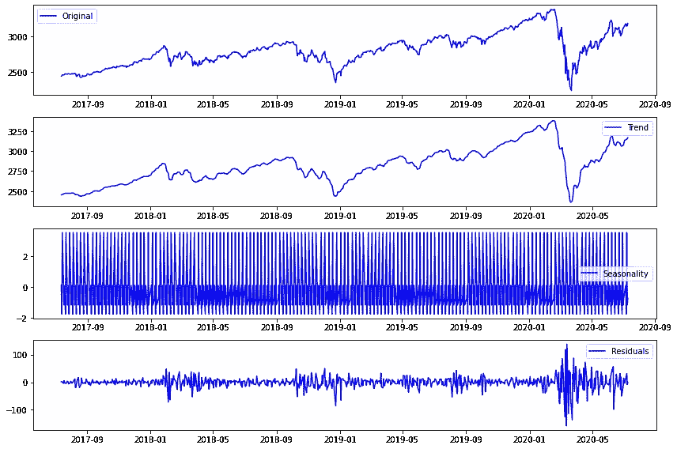
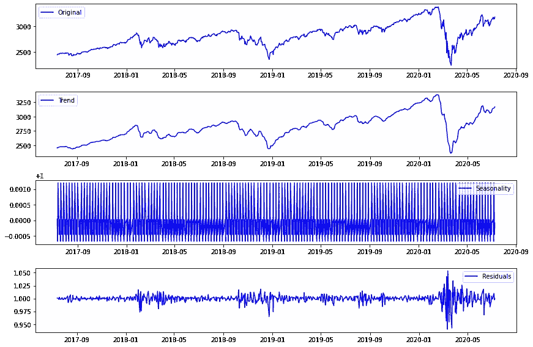
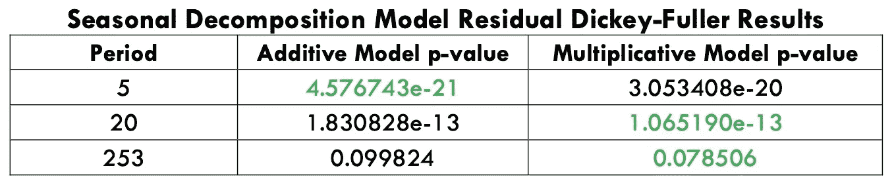

# 时序分解和 Statsmodels 参数

> 原文：<https://towardsdatascience.com/time-series-decomposition-and-statsmodels-parameters-69e54d035453?source=collection_archive---------5----------------------->

*注:本文于 2020 年 7 月 11 日更新，以反映对*[***stats models***](https://www.statsmodels.org/stable/index.html)*Python 模块的新更改，并包括乘法模型的结果。*

时间序列分解是将时间序列数据分离成其核心部分的过程。这些组成部分包括潜在趋势(平均值的总体上升或下降)、季节性(循环周期)和剩余的随机残差。几乎所有你会遇到的时间序列都不是自然平稳的，这意味着均值、方差或协方差将依赖于时间。这就是为什么数据科学家在应用模型之前必须从时间序列数据中识别和分离趋势和季节性。

您可以通过应用变换、减去滚动平均值和差分来手动移除趋势，以使您的数据保持平稳，或者您可以使用 Python 的 [statsmodels](https://www.statsmodels.org/stable/index.html) 库来识别趋势和季节性。

在过去的几周里，我已经讨论了一些时间序列主题，我将在这里建立这些主题，包括 [OHLC 可视化](/ohlc-charts-with-python-libraries-c58c1ff080b0)、[时间序列数据 EDA](/working-with-time-series-data-a8872ebcac3) 、[趋势分析](https://medium.com/datadriveninvestor/time-series-and-trend-analysis-6a4f255f3d6e)和[平稳性](/achieving-stationarity-with-time-series-data-abd59fd8d5a0)。

## 分解

所有的时间序列数据都可以[分解成四个核心部分](https://machinelearningmastery.com/decompose-time-series-data-trend-seasonality/):平均值、趋势(即增加的平均值)、季节性(即重复的循环模式)和残差(随机噪声)。趋势和季节性并不总是出现在与时间相关的数据中。残差是除去趋势和季节性之后剩下的东西。时间序列模型假设[数据是](https://blogs.wsj.com/economics/2012/07/05/is-data-is-or-is-data-aint-a-plural/)平稳的，只有剩余分量满足平稳性条件。

Python 的 statsmodels 库有一个用于[时间序列分解](http://www.statsmodels.org/dev/generated/statsmodels.tsa.seasonal.seasonal_decompose.html)的方法叫做`seasonal_decompose()`。我利用过去五年标准普尔 500 指数的历史日平均收盘价来说明时间序列分解。数据来自于 [UniBit API](https://unibit.ai/) *(注意:由于 API 的限制，在后面的部分我只使用三年的价格)*。

过去五年的标准普尔 500 指数历史价格——由 UniBit API 提供

我将数据存储在 pandas dataframe 中，并使用`.set_index()`方法将索引设置为 date 列。然后，我确保日期索引列的数据类型是 pandas datetime 对象。您需要确保您的数据是正确的格式，UniBit API 以年-月-日(*即 2015–01–20*)的格式提供日期。

`seasonal_decompose()`方法最多可以接受[六个参数](http://www.statsmodels.org/dev/generated/statsmodels.tsa.seasonal.seasonal_decompose.html)。我关注数据本身、模型类型和频率(文档中的*周期*)。我使用了 pandas 数据框架的调整后收盘价列，其中的索引是一个 datetime 对象。模型类型参数可以是**加法**或**乘法**，这取决于数据的季节性幅度是否与水平(平均值)相关。如果季节性的振幅独立于水平，那么你应该使用加法模型，如果季节性的振幅依赖于水平，那么你应该使用乘法模型。

加法与乘法时间序列数据。请注意右边乘法数列中季节性变化的扩大。Source“加法和乘法季节性——你能正确识别它们吗？”由[尼古拉·考伦茨](https://kourentzes.com/forecasting/2014/11/09/additive-and-multiplicative-seasonality/)

您可以对数据的图形可视化进行初步的视觉浏览，以确定哪种模型类型与您的数据相匹配，在本文中，我将测试这两种模型。

## 频率参数

我处理的最后一个参数是频率参数。*(注:statsmodels 的* `*seasonal_decompose()*` *方法的* `*frequency*` *参数已被弃用，替换为* `*period*` *参数)*。我没有想到必须选择这个参数，因为它是可选的，季节分解方法与教程中的数据配合得非常好，我最初使用时没有指定这个参数。当我将该方法应用于 S & P 500 数据帧时，我收到了以下错误:

当我对标准普尔 500 数据应用季节分解方法时，出现了错误

我搜索了一些为什么会出现这个错误的原因，一个 [GitHub 对话](https://github.com/pandas-dev/pandas/issues/5082)讨论了一个熊猫系列的`[inferred_freq](https://pandas.pydata.org/pandas-docs/stable/reference/api/pandas.DatetimeIndex.inferred_freq.html)`属性，另一个讨论了[一个最近用`seasonal_decompose()`方法出现的 bug](https://github.com/statsmodels/statsmodels/issues/3503) 。这个错误也出现在我正在关注的 Jason Brownlee 的教程[的评论部分。对于观察值不一致的时间序列数据，可能会出现问题，*即*周末在日常数据中缺失。这是我最初使用的教程数据和标准普尔 500 指数调整后的每日收盘价之间的唯一区别。](https://machinelearningmastery.com/decompose-time-series-data-trend-seasonality/)

那么，如何为频率参数选择合适的值呢？在这些 GitHub 对话的评论部分，几个用户指定了一个他们可以合理解释的频率。Brownlee 的指导链接到 Rob J. Hyndman 和 George Athanasopoulos 的书《预测:原理和实践》。作者在他们关于经典分解的文章中也给出了选择这个参数的相似的逻辑理由。我对我的时间序列数据测试了三个频率:5、20 和 253。五个因为那是一周有多少个交易日，一个月有 20 个交易日，一年有 253 个*(注意:你的数据中必须有至少两倍于你想要测试的频率的观察值；即如果你想将频率设置为* ***253*** *那么你至少需要* ***506*** *观测值)*。

## 加性模型

我比较了具有三个频率值的加性模型的 Dickey-Fuller 检验结果，周期为 5 天的模型具有最小的 p 值:

标准普尔 500 数据的季节分解，采用加法模型，周期设置为 5。

季节性分解方法将数据分解为三部分，趋势、季节性和随机残差分量。周期设置为 5 的序列的剩余分量是稳定的，因为 **4.576743e-21** 的 p 值远小于 **0.05** 。

## 乘法模型

然后，我比较了具有三个相同频率值的乘法模型的 Dickey-Fuller 测试结果，周期为 5 天的模型再次具有最小的 p 值:

使用乘法模型对标准普尔 500 数据进行季节性分解，周期设置为 5。

周期设置为 5 的序列的剩余分量是稳定的，因为 **3.053408e-20** 的 p 值远小于 **0.05** 。

## 结果比较

在三个测试周期中的两个周期，Dickey-Fuller 测试的 p 值对于乘法模型是最小的；20 和 253 天。表现最好的模型是周期设置为 5 天的加性模型。只有 253 天的 p 值高于 0.05，结果如下:

不同时期标准普尔 500 指数数据的 Dickey-Fuller 检验结果比较

## 摘要

Statsmodels 的季节性分解方法巧妙地将时间序列数据分解成多个部分。数据科学家和统计学家必须使用逻辑来证明为加法和乘法季节分解模型选择的周期，因为自动推断序列频率的方法并不总是可靠的。然而，statsmodels 包含的包大大减少了猜测的需要。

*我的这个项目的资源库可以在这里找到***，这个具体文章使用的文件是****time _ series _ removaling _ trends _ and _ decomposition . ipynb****。**