# 初学者的时间序列预测

> 原文：<https://towardsdatascience.com/time-series-essentials-fe6727ab6a94?source=collection_archive---------15----------------------->

## 关键概念、民间智慧和常见错误


乔治·霍丹在 [Needpix](https://www.needpix.com/photo/1487472/ball-crystal-psychic-glass-magic-teller-magical-medium-foresight) 上的图片

不幸的是，数据科学导论经常被分成回归/分类/聚类。应该有第四大类:时间序列。

时间序列很难建模。它们与典型的平面表格数据完全不同。当我们不把时间序列作为一个独特的问题来讨论时，数据科学的新人会在不了解模型如何完全失败的情况下，不经意地应用标准的回归算法。

这篇文章主要是针对新手的，但是有经验的建模者可能会得到一些有用的信息。这是解决常见基本错误的系列文章的一部分，例如[误解了 t 检验](/the-worst-misconception-in-statistics-488cf73d734e)和[从 pairs 图中得出不必要的结论](/youre-plotting-the-wrong-things-3914402a3653)。

重点将放在 ARIMA，它的表现非常好，因为它很容易调整，非常适合初学者。虽然许多其他文章提供了时间序列的介绍，但本文通过讨论 1)民间智慧和 2)要避免的常见错误增加了价值，奇怪的是，许多指南中都没有这些内容。

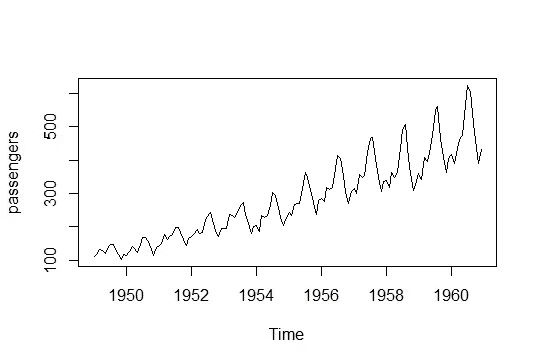

为了简单起见，我们将使用经典的航空乘客数据。这篇文章的目标是交流思想；复杂的数据会模糊概念。

# 自相关

自相关是时间序列中最重要的概念。正是这一点让建模变得如此困难。

许多模型假设误差是不相关的，并且是独立的。例如，你点击一个广告不应该影响你的邻居是否点击同样的广告。

在时间序列中，当前值取决于过去的值。如果今天的温度是华氏 80 度，明天的温度很可能是华氏 80 度左右，而不是华氏 40 度。

如果您交换表格数据中的第一个和第十个观察值，数据一点也没有改变。如果你交换一个时间序列中的第一个和第十个观察值，你会得到一个不同的时间序列。秩序很重要。不考虑自相关几乎和这个[永恒经典](https://stats.stackexchange.com/questions/185507/what-happens-if-the-explanatory-and-response-variables-are-sorted-independently)一样傻。

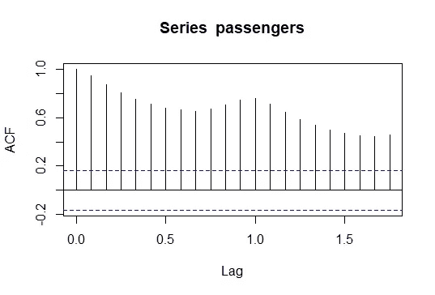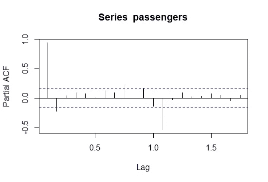

我们经常使用自相关函数(ACF)图和部分 ACF 图来检查自相关。x 轴具有分数滞后，因为我们的时间序列包含月数据，这里的滞后 1 表示前一年的同一个月。滞后 k 处的 ACF 只是时间 t 和时间 t-k 处的值之间的相关性，例如，滞后 1 和 2 处的 ACF:

```
cor(
  passengers, 
  shift(passengers, n = 1L), 
  use = 'complete.obs'
)
cor(
  passengers, 
  shift(passengers, n = 2L), 
  use = 'complete.obs'
)
```

我用的是 data.table 的 shift()函数。PACF 是在控制了所有以前的滞后之后剩下的相关性。例如，如果您想要获得滞后 3 的 PACF，您可以使用第一个和第二个滞后进行回归拟合，然后计算残差的相关性:

```
adjustment <- lm(
  passengers~shift(passengers, n = 1L)+
    shift(passengers, n = 2L)
)
cor(
  residuals(adjustment), 
  shift(passengers, n = 3L)[-(1:2)], 
  use = 'complete.obs'
)
```

从频率主义者的角度来看，时间序列建模的一个主要目标是**从残差**中移除自相关，以便残差是合理的 iid 白噪声。

**你不能只看 RMSE 或者任何你喜欢的指标来选择时间序列模型。**这是分析师犯下的最大罪过。始终绘制残差的时间序列，并检查残差的 ACF/PACF。我们稍后再讨论这个。

有些人错误地认为，你可以只根据 ACF 和 PACF 来选择最佳的时间序列模型。这是真的*只有*对于纯 AR 或纯 MA 工艺，但那些是罕见的。这些主要是诊断图。

# 平稳性

[平稳性](https://en.wikipedia.org/wiki/Stationary_process)是第二个关键概念，通常用来表示时间序列具有恒定的均值和方差。回想一下飞机乘客时间序列:


这显然不具有恒定的意义。一个常见的技巧是求一阶差，从时间 t 的观测值中减去时间 t-1 的观测值:

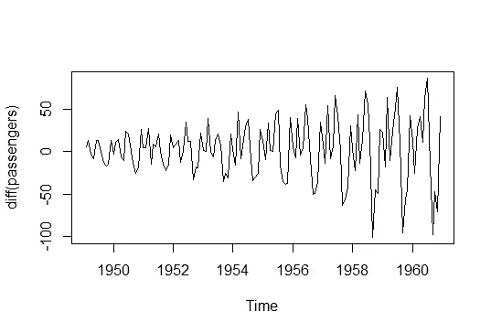

这个数列有常数均值，但不是常数方差。如果我们认为时间序列遵循指数增长，我们可以取 log(Y)和 difference:

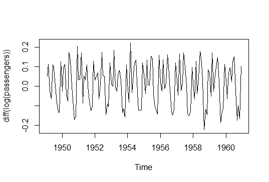

这个系列现在表现得更好了。在使用经典时间序列预测方法时，将此过程作为 EDA 的一部分。当序列呈指数(倍增)增长时，对数变换有意义。

很多时间序列模型都需要平稳性，尤其是关于常数均值的部分。这么想吧。只要平均值是恒定的，我们可以预测接近平均值的某个地方，我们将大致正确；否则，我们不知道这个系列在未来会有什么结局。

# 季节性趋势分解

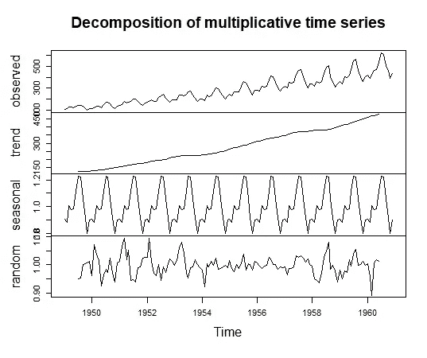

[季节性趋势分解](https://otexts.com/fpp2/classical-decomposition.html)对于可视化很有用，但通常不能用于预测。这个方法很容易理解。对于周-季数据，我们可以:

1.  计算 7 日移动平均线(从 t-3 到 t+3)。这是你的趋势。
2.  从你的数据中减去趋势。然后取一周中每一天的平均值(星期一、星期二……)。这是你的季节性成分。
3.  从原始观测值中减去趋势和季节性之后，剩下的就是残差。

第一步要非常仔细地看。趋势是一个移动平均线，你实际上需要*未来*的观察来估计趋势。

我见过一些人执行分解，然后训练一个模型来预测趋势，因为这样“更容易”。呃，不。首先，这是“作弊”，因为它人为地降低了 RMSE。其次，趋势是吸收了未来值的移动平均线——大量数据泄露。

# ARIMA

ARIMA(p，d，q)有三个分量:

1.  **AR(p)自回归**。这使用滞后值。例如，AR(2)使用时间 t-1 和 t-2 的观测值来预测时间 t 的值。这可以被视为时间序列的持久结构部分。
2.  **I(d)集成**。这是你需要使数列变得稳定的次数。如果完成，AR 和 MA 组件使用差异系列。
3.  **MA(q)均线**。这使用残差的滞后值。例如，MA(2)使用时间 t-1 和 t-2 的残差来预测时间 t 的值。这可以视为时间序列的局部趋势。

我们经常用(2，1，2)来表示一个 ARIMA 模型，它有 AR(2)，I(1)和 MA(2)三个分量。根据经验，任何超过(2，1，2)的都可能是过度拟合。(超级重要！)如果你要拟合一个(1，1，6)模型，你最好添加一个季节性因素(下一节)。

ARIMA 很容易调整，因为我们只需要尝试 3 x 2 x 3 = 18 个可能的模型，然后选择最好的一个。I(2)可能发生在一些科学过程中，但大多数业务数据只需要 I(1)。

参数不直观，但模型具有[某些含义](https://people.duke.edu/~rnau/411arim.htm)。值得注意的是(1，1，2)，阻尼趋势模型。你可以把这个模型看作是对观察到的趋势进行外推，但是进行了一些正则化(我们知道正则化在实践中效果很好)。有人认为,( 1，1，2)应该是 ARIMA 的默认设置，因为它在很多情况下都能很好地工作。**当您拥有非常少的数据**时，例如新推出的产品，衰减趋势尤其明显。

**ARIMA 在短期预测方面确实很难被击败，但在长期预测方面却失败了**,因为许多时间序列需要 MA 成分。假设你有马①。你可以用 t 时刻的观测残差来预测 t+1，但是你没有 t+1 时刻的残差来预测 t+2。如果你需要做长期预测，看看脸书的[先知](https://facebook.github.io/prophet/)之类的东西。

我不喜欢 r 中的 auto.arima()函数，前面我提到过时间序列模型不应该只在单一指标上进行评估。具有最低 AIC 或 BIC 的模型可能具有表现不佳的残差；我们希望从具有良好残差的模型中挑选出具有最佳度量**的模型。**

此外，auto.arima()默认情况下在(2，1，2)之外搜索，因此它可以挑选不必要的复杂模型——并且由于搜索空间更大，它使用试探法，因此您可以陷入局部最优。

我们之前看到，记录的值与一阶差分相结合会产生一个稳定的分布，所以让我们应用对数变换并搜索参数，排除过去 14 个月(应该是 12 个月，但我没有重新运行整个测试集)的数据:

```
library(forecast)log_passengers <- ts(log(passengers), frequency = 12)
train <- ts(
  log_passengers[1:(length(log_passengers) - 14)], 
  frequency = 12
)placeholder <- list()
i <- 1
for(p in 0:2){
  for(d in 0:1){
    for(q in 0:2){
      model <- Arima(train, order = c(p, d, q))
      placeholder[[i]] <- c(p, d, q, AIC(model))
      i <- i + 1
    }
  }
}
performance <- do.call('rbind', placeholder)
colnames(performance) <- c('p', 'd', 'q', 'AIC')
```

最低的 AIC 来自(2，1，1)。这里我们检查残差的 ACF 和 PACF:

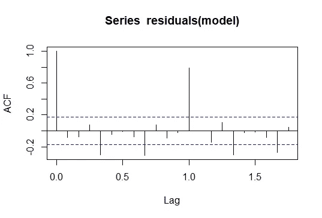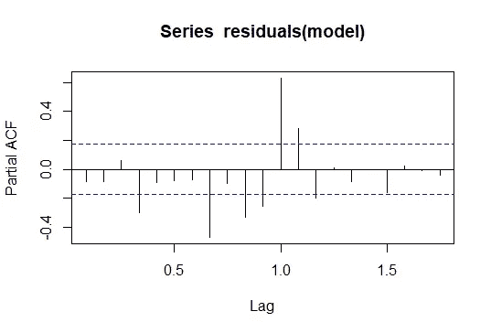

这些都不令人满意，尤其是滞后 1 时的峰值。下一个最好的 AIC 来自(1，1，2):

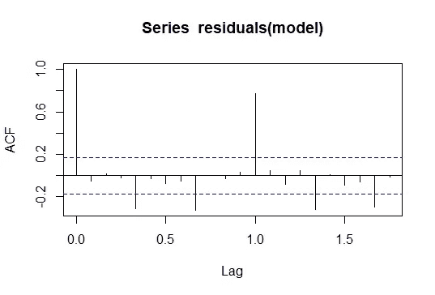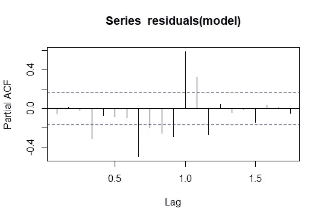

由于滞后 1 处的尖峰，这些也不令人满意。看看原始的时间序列，我们显然需要一个季节性的组成部分。我们有月度数据；峰值对应于年度(12 个月)季节性。

# 萨里玛

SARIMA(p，D，q)×(P，D，Q)m 的工作方式与 ARIMA 类似，但有季节性成分。你可以把它想成是两个模型的组合:一个滞后步长为 1 (t-1，t-2，…)，一个滞后步长为 m (t-m，t-2m，…)。但是为了获得更精确的理解，你应该学习[后移符号](https://otexts.com/fpp2/seasonal-arima.html)，因为 D 和 D 部分有一些相互作用。

就像 ARIMA 一样，我们可以测试所有可能的参数值，将它们保持在(2，1，2)以内。m 取决于你的时间序列的粒度。对于每小时的数据，尝试一天 24 小时中 m = 24 对于每日数据，尝试 m = 7，一周 7 天；而对于月度数据，尝试 m = 12。SARIMA 的最大限制是它只允许一个季节性项。当你有每日数据时，有理由相信有每周和每年的季节性，但遗憾的是，我们只能将其中一个纳入模型。一种变通方法是加入傅立叶项，如果时间序列不是大致稳定的，这在 SARIMA 框架中可能是一个难题。

总之，找到合适的环境。让我们冒险进入末日金字塔:

```
placeholder <- list()
i <- 1
for(p in 0:2){
  for(d in 0:1){
    for(q in 0:2){
      for(P in 0:2){
        for(D in 0:1){
          for(Q in 0:2){
            model <- tryCatch({
              Arima(train,
                    order = c(p, d, q),
                    seasonal = c(P, D, Q)
                    )
            }, error = function(err){
              Arima(train,
                    order = c(p, d, q),
                    seasonal = c(P, D, Q),
                    method = 'CSS'
                    )
            })
            placeholder[[i]] <- c(p, d, q, P, D, Q, AIC(model))
            i <- i + 1
          }
        }
      }
    }
  }
}
performance <- do.call('rbind', placeholder)
colnames(performance) <- c('p', 'd', 'q', 'P', 'D', 'Q', 'AIC')
```

这比以前运行得慢多了，因为我们必须考虑 18 x 18 = 324 个参数组合。这里我们必须使用 tryCatch，因为有时默认的优化算法不起作用。我们最终以(2，1，2) × (1，0，1)12 作为最佳模型。

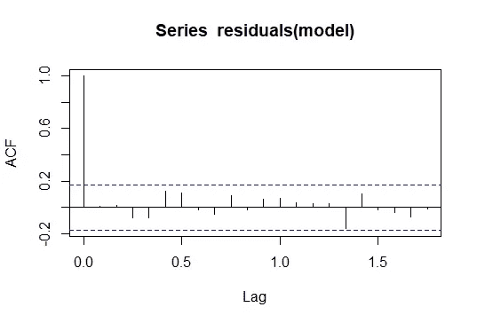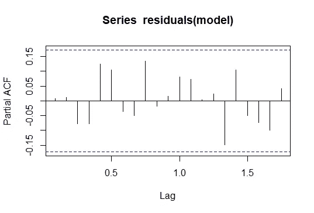

这些诊断图看起来很好。但是我们仍然需要检查残差。这里有一个比较，显示了增加季节性带来的改善:

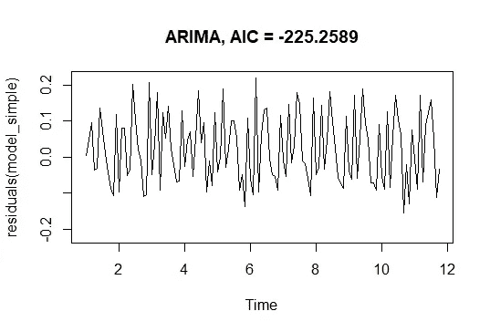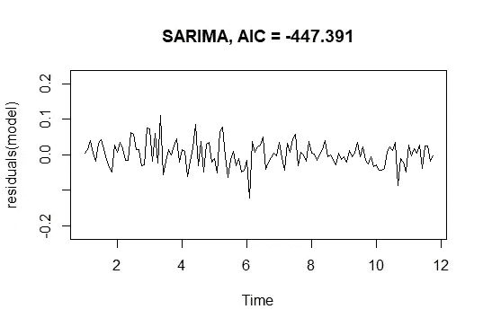

ACF 和 PACF 图看起来很好，残差看起来很像白噪声。还有一件事我们不能忘记检查:预测的合理性:

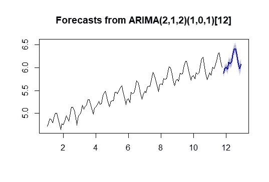

有时其他诊断看起来不错，但预测看起来真的很差。这看起来不错。

其他人可能会选择不同的模型。只要所有的诊断看起来都没问题，那就没问题。记住所有的模型都是错的，但有些是有用的。不要纠结于“真实”的模型，要确保模型是有用的。

# 消除预测偏差

这部分是很常见的错误。我们取了时间序列的对数，所以要创建预测，我们只需要取指数，对吗？**未必。**选择归结为我们是想要中值(最小化 MAE)还是平均值(最小化 MSE)。在这里，预测中位数也可以解释为最小化%误差(kinda)。有时，业务环境希望最小化 MSE，而分析师忘记了让模型预测平均值。

在模型假设下，时间序列的对数具有正态分布的残差。换言之，残差遵循[对数正态分布](https://en.wikipedia.org/wiki/Log-normal_distribution)。分布的平均值是 exp(μ + 0.5 σ)，而不是 exp(μ)，后者是中位数。σ项可以通过计算残差的方差来估计。

您可以保留原始时间序列并在 Arima()中转换它，而不是手动获取时间序列的日志:

```
Arima(..., lambda = 0, biasadj = TRUE)
```

预测会自动计算 exp(μ + 0.5 σ)。

这是我们带有偏差调整的 SARIMA 模型:

```
model <- Arima(
  subset(passengers, start = 1, end = 132),
  order = c(2, 1, 2),
  seasonal = c(1, 0, 1),
  lambda = 0,
  biasadj = TRUE
)
plot(forecast(model, 12, biasadj = TRUE), 
     ylim = c(300, 700), xlim = c(1959, 1961))
par(new = TRUE)
plot(passengers, add = TRUE, 
     ylim = c(300, 700), xlim = c(1959, 1961))
```

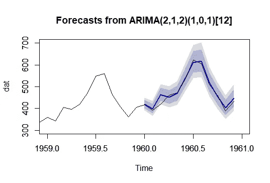

如果你问我的话，我会说，这个预测看起来真的很不错。

# 时间序列回归

有时称为(S)ARIMAX，其中 X 代表外部回归量。程序很简单:

1.  拟合 y~x1+x2+…
2.  对残差进行 ARIMA 拟合

就是这样。

第一步其实超级棘手。不幸的是，就其本质而言，时间序列有一个共同的混淆因素:时间。你可以得到在训练数据上表现良好的模型，但是由于[虚假相关性](https://www.tylervigen.com/spurious-correlations)，该模型是无意义的。独立随机漫步通常是强相关的！

```
rw1 <- cumsum(rnorm(100, 0, 1))
rw2 <- cumsum(rnorm(100, 0, 1))
plot(
  rw1, 
  type = 'l',
  main = paste0(
    'Correlation = ', round(cor(rw1, rw2), 2), 
    ', p approx. ', round(cor.test(rw1, rw2)$p.value, 2)),
  ylim = c(min(c(rw1, rw2)), max(c(rw1, rw2))))
lines(rw2)
```

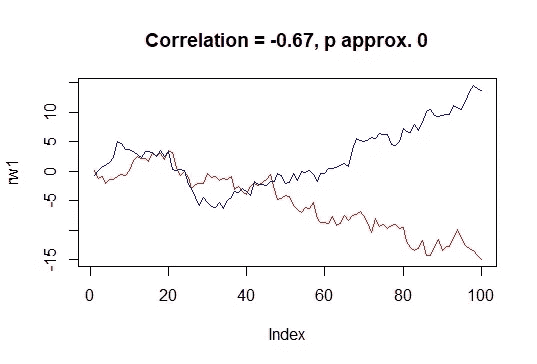

一些计量经济学模型要求[趋势平稳性](https://en.wikipedia.org/wiki/Trend-stationary_process)，即每个时间序列在去除(线性)趋势后变得平稳。这是一个相对简单的检查，但我除了大多数序列不是趋势平稳的。

我们将这一概念概括为[协整](https://en.wikipedia.org/wiki/Cointegration)。简单地说，如果所有的时间序列(Y 和 X)都是 I(1)，那么步骤 1 中的回归必然会产生 I(0)残差。或者，如果所有时间序列都是 I(2)，那么步骤 1 中的回归必然会产生 I(1)或 I(0)残差。不，你不能欺骗说“这个 I(1)序列在再求一次差后仍然是静止的。”那还是我①。

如果时间序列不是协整的，那么就不能进行时间序列回归。思考一下协整在概念上意味着什么。假设 Y 是一只狗，X 是它们的主人。

如果 Y 和 X 是协整的，那么这条狗就被拴住了。狗可以在皮带半径范围内的任何地方行走，但它是依附于它的主人的。如果我们知道主人在哪里，我们就知道狗在哪里。

如果 Y 和 X 不是协整的，那么这条狗就没有被拴住。它可以逃跑，探索整个城市。知道了主人的位置并不能告诉我们狗的大概位置。时间差越大，不确定性越大。可能狗刚跑了，未来五分钟还在街区内；但是一个小时后，我们不知道它在哪里。

在商业环境中，大多数时间序列是 I(1)。检查回归残差是否平稳。如果不是，那么你需要一个比 ARIMA 更先进的模型(脸书先知是可能的候选人)。

## 关于通用机器学习的注记

如果时间序列是稳定的，随机森林和其他树算法可以工作。他们使用外部回归来捕捉季节性，而不对残差应用(S)ARIMA。

然而，当时间序列有趋势时会发生什么呢？理解机器学习算法如何在引擎盖下工作绝对至关重要。

考虑一棵有一个裂口的树，X 和 Y 都有向上的趋势。拆分说“如果 X > x，预测 Y = yhigh 否则预测 Y = ylow”。它预测一条平坦的线。即使你的 X 提供了一个趋势，一个预测只是看到 X > x，并预测在 Y = yhigh 处是一条平线。树木无法学习趋势。

改善这种情况的一种方法是，如果可能的话，对原始时间序列进行差分，使其变得平稳。然后，您可以通过采用最近的观察点并添加预测的累积和来进行预测。然而，由于该算法不理解序列相关性，预计会看到长串的预测不足/预测过度。

## 关于季节性的说明

如果你的时间序列看起来“大致平稳”——具有细微周期的平坦——那么你可以添加傅立叶项来表示季节性。例如，我们不期望转换率有一个大的恒定趋势，但它可能有很强的每日和每周季节性。你可以在这上面训练一个逻辑回归。

如果您有每小时的数据，请尝试添加:

*   使用预测因子 sin(2πkt/24)和 cos(2πkt/24)的每日季节性
*   使用预测值 sin(2πkt/(24*7))和 cos(2πkt/(24*7))的每周季节性

其中 t 是时间，k = 1，2，3，…您可以使用正则化来选择 k。

## 实际制约因素

有时人们会犯一个可爱的错误，忘记了模型的最终目的是预测。如果业务要求你预测未来 7 天，你最好确保你使用的任何回归变量都可以提前 7 天获得。如果使用任何外部回归变量，请确保将其滞后。

# 模型验证

交叉验证对于获得样本外误差的感觉是惊人的。当然，CV 因其在超参数调整中的作用而受到关注，但对于我们许多人(咳嗽 Bayesians 咳嗽)来说，我们使用 CV 来评估模型的泛化能力，而不是选择超参数。

我见过有人在时间序列上使用常规 CV。 **CV 完全无效，因为自相关是一个东西。**

对时间序列进行交叉验证有两种主要方法，每种方法都有不同的假设。

第一个是**留在未来之外交叉验证** (LFOCV)。例如，我们可以使用 t = 1:36 来训练模型，并预测未来的 12 个步骤并记录误差。然后使用 t = 1:48 进行训练，并预测未来的 12 步。那么 t = 1:60。诸如此类。

理想情况下，我们预测未来的 1 步，并用 t = 1:36、1:37、1:38 等重新调整模型。然而，这实际上是 LOOCV 且计算非常昂贵。使用 12 的增量是出于方便，比如选择 k = 5 或 10。

二是使用**推拉窗**。这里我们固定了训练数据和幻灯片的长度，所以 t = 1:36，13:48，25:60 等等。[这篇文章](https://stats.stackexchange.com/questions/326228/cross-validation-with-time-series)对这两种方法进行了很好的可视化。

哪个更好？这取决于时间序列的行为有多“粘”。如果行为看起来一致，那么 LFOCV 工作得更好，因为您将使用所有的数据来训练最终的模型。如果行为更加不稳定，并且会随时间变化，那么滑动窗口会更好，因为每次您做出预测时，模型都会根据您最近的数据子集进行训练。

(啊，之前忘了提了。与表格数据不同，更多的数据不一定意味着更好的预测。如果您的时间序列不断改变行为，只使用最近的子集是更明智的。还有动态 AR 模型，但这些超出了本文的范围。)

请记住，我们的目标是评估模型在野外漫游时的表现，因此我们希望尽可能接近模型部署时的情况。

## 评估指标

我们还没有讨论评估指标。就我个人而言，我真的不喜欢 MAPE 和梅。根据你的时间序列，优化这两个中的任何一个都会引入系统偏差——预测值太低。

在 MAPE 的例子中，预测不足的误差最多是 100%，而预测过度的误差是无限的。

在 MAE 的例子中，如果你有指数增长，中间值会比平均值低很多。

如果企业关心百分比误差，尝试使用 log(预测/实际)代替。换句话说，预测日志时间序列的残差。当取指数时，其平均值会产生一个“更合理”的百分比误差。

如果企业关心平方误差，那么你应该在偏差调整预测的基础上计算 RMSE。

# 超越

如果你是时间序列的新手，想了解更多，我建议浏览一下《预测:原则与实践》这本书，这是一本免费的在线教材，作者是 Rob Hyndman，他是 R's forecast package 的作者。它更侧重于理解和应用，而不是数学，这对新手来说是完美的。

像 ARIMA 这样的模型的一个主要缺点是缺乏可解释性。滞后值的系数很难解释。此外，尽管 ARIMA 能做出很好的短期预测，但它无法预测更长期的情况。[脸书的先知包](https://facebook.github.io/prophet/)通过提供[季节性趋势分解式方法](https://facebook.github.io/prophet/docs/quick_start.html#r-api)解决了这两个问题。他们线性推断趋势进行预测。

如果你正在寻找高级的时间序列方法，我建议学习一下[贝叶斯结构时间序列](https://en.wikipedia.org/wiki/Bayesian_structural_time_series) (bsts)模型。它们是状态空间模型——把它们想象成[隐马尔可夫模型](https://en.wikipedia.org/wiki/Hidden_Markov_model),更加灵活，能够处理连续的潜在状态。这类模型非常有前途，原因如下:

*   它明确说明了测量误差。像 ARIMA 这样的频率主义方法假设测量是完美的，所以在做预测时，模型会传播测量误差。如果你那么喜欢 ARIMA，它可以被公式化为一个状态空间模型。
*   可以应用于因果推断。我相信谷歌的 [CausalImpact](https://google.github.io/CausalImpact/CausalImpact.html) 是准实验最有用的软件包。这对于衡量营销活动的影响非常有用。
*   它允许动态回归。许多模型用一组系数来拟合训练数据，并假设这些系数是静态的。当我们建模的内容不断变化时，我们可能希望让系数随时间变化。
*   它以一种巧妙的方式结合了正规化。它使用尖峰和厚片先验，一个质量为 0 的点加上一个高斯。它类似于 elasticnet，但允许 0 的后拉伸。