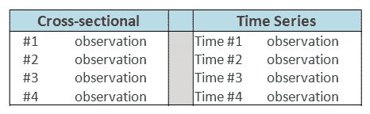
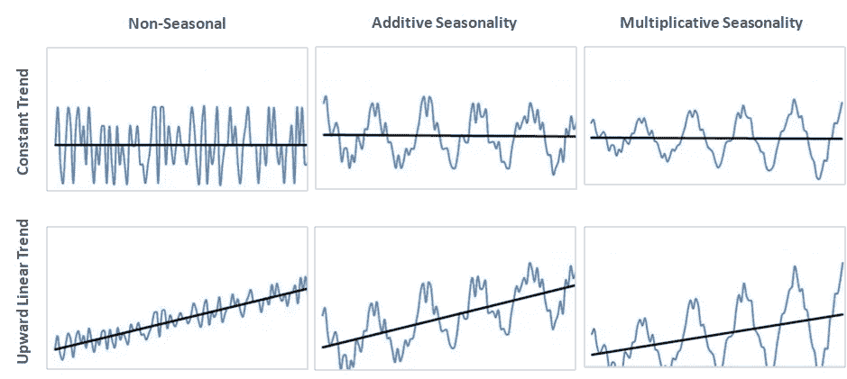
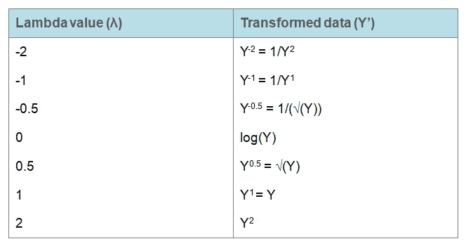
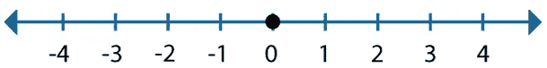
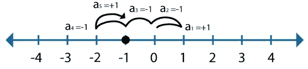

# 为时间序列预测奠定基础

> 原文：<https://towardsdatascience.com/time-series-forecasting-968192b3781a?source=collection_archive---------11----------------------->

## 时间数列预测法

## 关于时间序列 EDA 和使用 Python 进行数据准备的教程

# 背景

时间序列预测是机器学习的一个重要领域，各行各业都有很多涉及时间成分的用例，如零售商下周的需求预测、解决劳动力优化问题的呼叫量预测、预测能源消耗、用于主动灾难管理的天气预报等等。时间序列分析和预测也可以用于异常检测。

# 什么是时间序列预测，它与其他机器学习问题有何不同？

在这两种类型的问题中，时间都扮演着重要的角色，历史数据被用来训练预测未来的模型。两个机器学习数据集都是观察值的集合。那么，有什么区别呢？

在正常的机器学习数据集中，所有的历史观测值都被同等对待，而时间序列是一系列观测值，它们是按时间顺序捕获的，因此时间序列增加了观测值之间的顺序依赖性。

让我们了解一些常见的符号。

*   *t-n:之前的时间或滞后，如 t-1 是之前的时间，也称为 1 的滞后*
*   *t:当前时间*
*   *t+n:未来的时间，例如 t+1 是要预测的下一个时间*

## 时间序列组件

在任何机器学习问题中，我们都从探索性分析开始，以更好地理解数据，这有助于选择适当的算法。同样，在时间序列中，我们将序列分解为 4 个组成部分:水平、趋势、季节性和噪声，以便更好地理解数据。

水平、趋势和季节性被进一步归类为系统成分，因为它们以一致的模式表征基础数据，并且可以建模，而噪声是一种非系统成分，因为它具有随机变化，不能直接建模。

让我们来看看这 4 个组件。

1.  ***级别*** *:级别描述系列*的平均值
2.  ***趋势*** *:趋势是序列在两个相邻期间之间的变化，这是可选成分，不一定出现在所有序列中*
3.  **:季节性描述了一段时间内的短期循环行为，这也是一个可选的组成部分，不一定出现在所有序列中**
4.  ****噪声*** *:模型无法解释的随机变化，在所有系列中都有所体现**

*一个系列被认为是这四个部分的组合，它们可以相加或相乘地组合，让我们通过下面的例子来理解这一点。*

**

*共同趋势和季节性的例子*

*   *加法模型:yₜ =水平+趋势+季节性+噪声*
*   *乘法模型:yₜ =水平 x 趋势 x 季节性 x 噪音*

## *预测方法是如何工作的？*

*这些方法试图隔离系统部分并量化非系统部分，即噪声。系统部分有助于生成点预测，而噪声水平有助于估计相关的不确定性。*

*我们已经简要介绍了时间序列。在接下来的章节中，我们将讨论将时间序列分解为系统和非系统部分并检测初始模式的各种技术。*

# *时间序列数据准备和分析*

*预测的第一步也是最重要的一步是描述时间序列的性质，并调查潜在的问题，这些问题必须在应用任何预测方法以获得有效结果之前加以注意。*

*我们将通过一些开源数据集和一些随机生成的数据集来逐一讨论所有这些步骤。我们将在 Google Colab 中使用 Jupyter 笔记本。*

1.  *加载和浏览时间序列数据*
2.  *特征工程*
3.  *数据可视化*
4.  *重采样*
5.  *电力转换*
6.  *探索时间结构*

*首先，让我们下载以下数据集，打开 Jupyter 笔记本，并导入这些 python 函数。*

*   *[airline-passengers.csv](https://jovian.ml/ajaytiwari-isb/time-series-data-preparation-eda-83db3/v/1/files/airline-passengers.csv)*
*   *[champagne.csv](https://jovian.ml/ajaytiwari-isb/time-series-data-preparation-eda-83db3/v/1/files/champagne.csv)*
*   *[每日最低气温. csv](https://jovian.ml/ajaytiwari-isb/time-series-data-preparation-eda-83db3/v/1/files/daily-minimum-temperatures.csv)*
*   *[洗发水-销售. csv](https://jovian.ml/ajaytiwari-isb/time-series-data-preparation-eda-83db3/v/1/files/shampoo-sales.csv)*

# *1.加载和浏览时间序列数据*

## *加载时间序列数据*

*我们通常将数据集作为 pandas 数据帧来加载，这里我们可以使用 read_csv()函数将时间序列数据作为一个 series 对象来加载，这是一个一维数组，每行都有时间标签。*

*我们不应该忘记指定一些参数，以确保数据作为一个系列正确加载。下面我们来看看这些参数。*

*   *标头:“0”指定标头信息可供使用。*
*   *parse_dates: 'True '帮助 pandas 识别第一列中的数据包含需要解析的日期。但是总有一些奇怪的格式需要手动定义，在这种情况下，添加 date_parser()函数是更好的方法。*
*   *index_col: '0 '暗示我们的第一列，即时间序列列包含我们的索引信息*
*   *挤压:“真”暗示熊猫，我们只有一个专栏，我们想用这个作为系列*

## *探索时间序列数据*

*加载后，建议浏览一下数据，我们可以使用 head()函数来查看前五条记录，也可以指定前 n 条记录来查看。*

*验证给定系列中的观察值的数量以避免任何错误总是一个好主意。*

*我们可以通过查询不同的时间间隔来分割时间序列。例如，让我们看看 1981 年 1 月以来的所有观测数据。*

*与其他机器学习问题一样，计算和查看汇总统计数据也是时间序列数据探索中的一个重要步骤，它让我们了解值的分布和传播。describe()函数将帮助我们计算这些统计数据。*

# *2.特征工程*

*时间序列数据必须转换为监督学习数据集，才能用任何机器学习算法建模。正如我们在上面看到的，时间序列没有任何因变量和自变量。我们必须构建一个数据集，其中包含要预测的目标变量和用于预测的输入变量。*

## *创建滞后要素*

*这是将时间序列预测问题转化为监督学习问题的经典方法。在这种方法中，一个时间(t)的值被用来预测下一个时间(t+1)的值。*

*在 Pandas 中，可以通过 shift()函数创建滞后要素，这通过将数据集移位 1 来创建列 t，并且没有移位的原始序列表示 t+1。*

*我们可以看到，在我们的监督学习问题中，前一个时间步长(t+1)是输入(X)，下一个时间步长(t)是输出(y)。这个概念被称为滑动窗口方法。我们可以看到，第一个观察值没有可用于预测序列的输入，最后一个观察值没有已知的输出(y)。因此，我们必须丢弃这些行。*

*类似地，我们可以如下创建多个滞后特征。*

## *使用汇总统计数据作为特征*

*此外，我们可以使用一些滞后值的汇总统计数据作为特征，例如前面几个值的平均值。这可以通过 rolling()函数来实现。*

*或者，我们可以使用每个时间戳的所有先前值的汇总统计数据作为我们预测模型的特征。这些特性可以通过扩展()函数来创建。*

## *日期和时间作为特征*

*与任何其他监督学习数据集类似，许多日期相关的特征可以从时间戳中导出，例如一天中的小时、一周中的天、月、季度、工作日和周末、公共假日等。我们经常发现它非常有用。*

# *3.数据可视化*

*时间序列自然会产生相当流行的可视化效果，甚至在我们引入数据科学之前，我们都见过股票市场运动的折线图。除了线形图之外，还有很多可视化的东西。我们将在本节中学习这些工具。*

## *线形图*

*线形图可能是时间序列最流行的可视化方式。在该图中，x 轴表示时间，y 轴表示观察值。*

*比较不同时间间隔的相同时间间隔的折线图通常很有帮助，例如每天、每月和每年。在下面的例子中，我们比较了 10 年中 365 天的最低日温度。让我们按年份将数据分组，并为每一年创建一个线图。*

## *直方图和密度图*

*另一个重要的可视化是观察值的分布。一些线性时间序列预测方法假设正态分布的观测值。我们可以通过绘制原始观察值的直方图和密度图来检查这一点，如果需要，可以对原始值的记录等转换变量重复这一检查。*

## *盒须图*

*另一种有助于总结观察值分布的图是盒须图。此图有助于检测系列中的任何异常值。*

*我们可以在每年的水平上使用这些并排的箱线图来比较时间序列中的每个时间间隔。*

## *热图*

*热图是一个神奇的可视化工具，我们可以用它来可视化不同颜色的温度分布。它不言自明，较大的值用暖色(黄色)显示，较小的值用冷色(绿色)显示。*

## *滞后散点图*

*时间序列建模假设当前观察值和先前观察值之间存在关系，这也称为滞后 1。我们可以在散点图上显示这种关系。*

*通常，分析多个滞后值之间的关系很有帮助。我们可以在一个循环中运行相同的代码来绘制多个滞后。*

## *自相关图*

*观察值和它们的滞后之间的相关性强度可以用自相关图来量化。在时间序列中，它也被称为自相关，因为我们计算的是同一序列的滞后值的相关性。*

# *4.重采样时间序列*

*有时我们的观测频率不对，观测频率可能高于或低于我们期望的预报频率。例如，一个企业需要一个每日预测，但它有每小时或每月的观察。在这种情况下，以下两种技术可以帮助我们根据业务目标修正频率。*

## *上采样*

*这是增加采样频率的过程，例如从每周一次增加到每天一次。在下面的例子中，我们将从每月到每天对数据进行插值。Pandas 系列对象提供了一个 interpolate()函数，该函数提供了一系列简单和复杂的方法。这里我们使用线性方法。*

*让我们将线性插值数据可视化。*

*我们可以尝试另一种流行的插值方法，即多项式或样条来连接值。我们必须指定多项式中的项数。*

*我们可以想象新的情节，这创造了更多的曲线，看起来更自然。*

## *向下采样*

*降低采样频率，例如从每天一次降低到每周一次。销售数据是月度的，但业务需要季度预测。让我们根据业务需求对数据进行重新采样。*

*可视化重新采样的数据。*

# *5.电力转换*

*数据转换是机器学习问题中一种常用的方法，用于提炼原始特征以提高它们的重要性。类似地，在时间序列预测中，我们使用各种数学变换去除噪声并改善信号。*

*在这一节中，我们将首先使用随机生成的数据讨论这些技术，然后将该技术应用于开源数据。*

## *多项式变换*

*具有二次或三次增长趋势的时间序列可以通过将原始数据转换为平方根或立方根来实现线性。*

*我们用三次函数随机生成一个数列，检查一下变换效果。*

*现在，将这些数据转换成立方根，我们可以观察到这个系列看起来是正态分布的。*

## *对数变换*

*有时我们会遇到具有更极端趋势的数据，更好的说法是指数趋势，这样的时间序列数据可以通过取原始值的对数而变成线性。这称为对数变换。*

*让我们使用下面的代码从指数分布中生成数据。*

*同样，我们可以通过取原始值的自然对数将这些数据转换回线性。*

## *博克斯-考克斯*

*在现实生活中，我们经常会遇到没有明确趋势的观察结果，在得出适当的转换方法之前，必须测试不同的转换。幸运的是，我们有这种统计技术来分析给定的序列，并根据下面的 lambda 值自动执行最合适的转换。这些是 lambda 和相应变换的一些常见值。*

**

*常见的 Box-Cox 变换*

*首先，我们将根据我们的直觉手动转换，接下来，我们将使用 box-cox 转换并查看差异。*

***手动转换***

*在可视化原始线图后，我们假设取一个对数将是一个理想的变换，并指定λ= 0。我们可以看看对数转换的时间序列图。*

***Box-Cox 变换***

*现在，我们将依靠 Box-Cox 来选择一个理想的 lambda 并对其进行相应的转换。*

*我们可以看到 lambda 值接近 0，该图看起来也类似于手动转换，但仔细观察直方图，我们可以看到新的直方图看起来更正常。*

# *6.探索时间结构*

*我们已经探索并准备了时间序列数据，进行了必要的转换，现在是时候研究时间结构了，包括数据的预测能力。*

## *白噪声*

*这是时间序列预测中的一个重要概念。如果序列是白噪声，这只是一系列随机数，无法预测。*

*要检测白噪声，必须调查以下条件。*

*   *检查序列是否有零均值*
*   *检查方差是否随时间保持不变*
*   *检查滞后值的相关性是否为 0*

*让我们探索一下可以帮助我们检测白噪声的统计工具。*

1.  *汇总统计:检查和比较不同时间间隔的整个时间序列的平均值和方差。*
2.  *折线图:折线图会给我们一个关于不一致均值和方差随时间变化的基本概念。*
3.  *自相关图:检查滞后观测值之间的相关性强度。*

*我们将使用合成创建的白噪声时间序列数据来讨论上述工具。我们将使用均值为 0、标准差为 1 的高斯分布来创建这个变量。*

*现在，查看汇总统计数据，均值接近 0，标准差为 1，这在本例中是意料之中的。在现实生活中，查看该摘要后，系列可以分布在多个子系列中，并且可以比较各自的统计数据，以发现一段时间内均值和方差的任何不一致性。*

*接下来我们来看这个数据的折线图，它看起来不像任何时间序列，这只是随机数的集合。*

*带有钟形曲线的直方图证实了均值为 0、方差为 1 的高斯分布。同样，我们可以验证不同时间间隔的分布。*

*最后，我们可以使用自相关图来研究滞后观测值之间的相关性强度。*

*我们可以看到滞后观测值之间没有关联。因此，我们可以得出结论，这个序列是白噪声，不能很好地预测。*

## *随机游动*

*让我们讨论另一个概念，它可以帮助我们理解时间序列预测的可预测性。随机游走是一系列从一个时间段(t)到下一个时间段(t+1)的变化是随机的。有一种误解认为随机漫步是一个类似白噪声的随机数序列。让我们看看这有什么不同。*

*用于生成随机游走的过程强制从一个时间步长到下一个时间步长的相关性，我们可以通过以下等式来理解这种相关性，其中 X(t)是序列中的下一个值，X(t-1)是前一个时间步长的值，e(t)是下一个时间步长的白噪声。*

**X(t) = X(t-1) + e(t)**

*让我们通过麻省理工学院的网站来理解这一点。*

*要理解最简单的随机行走是一维行走。假设下面的黑点位于一条数字线上。黑点从中心开始。*

**

*[https://www . MIT . edu/~ kardar/teaching/projects/chemotization(Andrea Schmidt)/random . htm](https://www.mit.edu/~kardar/teaching/projects/chemotaxis(AndreaSchmidt)/random.htm)*

*然后，它以相等的概率向前或向后迈一步。它每次都向前或向后迈进一步。让我们称第一步为 a₁，第二步为 a₂，第三步为 a₃，依此类推。每个“a”要么等于+1(如果向前一步)，要么等于-1(如果向后一步)。下图是一个黑点，走了 5 步，最后在数轴上-1 结束。*

**

*[https://www . MIT . edu/~ kardar/teaching/projects/chemotization(Andrea Schmidt)/random . htm](https://www.mit.edu/~kardar/teaching/projects/chemotaxis(AndreaSchmidt)/random.htm)*

*现在，我们将使用相同的方法模拟随机行走，并将这些观察结果绘制在一条线上。*

*我们可以看到这个形状看起来像真实股票指数的运动。*

*现在，让我们探索可以帮助我们识别任何时间序列中的随机游走的工具*

***自相关图***

*我们知道随机游走是如何产生的，因此通过它的设计，我们期望与先前的观察有非常高的相关性，并且这种相关性将逐渐降低。*

***增强的 Dickey-Fuller 检验，以确认序列的非平稳性***

*随机游走被创建的方式，期望序列是不稳定的，即，均值和方差随时间的不一致性。*

*该检验的无效假设是时间序列是非平稳的。检验统计量是正的，远远高于临界值，这意味着我们将不得不拒绝时间序列是非平稳结构的零假设。*

*我们可以通过一阶差分使时间序列平稳，然后再分析其特征。*

*这种差异线图还表明，除了一系列随机数之外，没有其他信息可供使用。*

*最后，我们可以通过自相关图看到模式，并确认滞后观测值之间没有关系。*

*我们已经看到随机漫步也像白噪声一样不可预测；我们可以做出的最佳预测是使用前一个时间步长的值来预测下一个时间步长，因为我们知道下一个时间步长是前一个时间步长的函数。这种预测方法也被称为天真预测，*

## *分解时间序列*

*我们在本文开始时讨论了时间序列的四个组成部分(水平、趋势、季节性和噪声),在这一部分，我们将探索自动分解工具。*

*我们知道时间序列是这四个部分的组合，通过分解，我们将时间序列分解成这些单独的部分，以便更好地理解数据并选择正确的预测方法。*

*Statsmodels 库在一个名为 seasonal_decompose()的函数中提供了简单的或者经典的分解方法的实现。它要求我们指定模型是加法模型还是乘法模型。我们应该在仔细检查了线图之后指定这个信息。*

*加法分解*

*我们可以随机生成一个具有线性增长趋势的时间序列，并将其分解为一个可加模型。让我们看看下面的例子，我们可以看到趋势成分是序列中最主要的成分，没有季节性。残差图显示零噪声，我们的简单方法可能没有分离噪声，我们可以测试一些高级方法，如 [STL](/stl-decomposition-how-to-do-it-from-scratch-b686711986ec) 分解。*

*乘法分解*

*以下示例将航班乘客数据集分解为一个乘法模型。*

*我们可以看到，从序列中提取的趋势和季节性信息似乎是合理的，数据中也有噪声，从图中可以观察到序列早期和后期的高可变性时期。*

# *摘要*

*我们试图为时间序列预测问题建立一个坚实的基础。我们学习了时间序列的基础知识，并通过可视化发现见解和差异，如何纠正一些数据差异，以及通过特征工程和功率转换优化时间序列数据以实现准确预测。*

*虽然我们使用单变量时间序列讨论了所有的技术，但是这些技术可以容易地应用于多变量时间序列预测问题。*

*感谢您的阅读，希望您发现这篇文章内容丰富。在接下来的几篇文章中，我将讨论不同的预测技术，我将从经典技术开始。*

# *参考*

*[1] Galit Shmueli 和 Kenneth Lichtendahl，实用时间序列预测与 R:实践指南，2016 年。*

*[2]杰森·布朗利，【https://machinelearningmastery.com/ *

* [## 随机漫步

### 随机漫步一维数学什么是随机漫步？随机漫步是这样一个过程…

www.mit.edu](https://www.mit.edu/~kardar/teaching/projects/chemotaxis%28AndreaSchmidt%29/random.htm)*