# 时间序列预测和因果分析与脸书先知和谷歌因果影响

> 原文：<https://towardsdatascience.com/time-series-forecasting-and-causal-analysis-in-r-with-facebook-prophet-and-google-causalimpact-22046fbcb49a?source=collection_archive---------38----------------------->

## 蒙特利尔犯罪预测与 COVID 锁定影响的联合研究

这篇文章将是我每年 R 潜水的一部分；想法将是在时间序列预测和因果推断中使用两个 R 库。

我想写一篇文章已经很久了，但是我从来没有找到时间/资源来写它，主要是因为我缺少一个真正的数据集来写它，但是猜猜 2020 年是哪一年来拯救我。从经济死亡率的角度来看，在此次 COVID /封锁期间，该事件对我们社会的大部分影响是负面的。不过，我在想蒙特利尔封锁期间。在人群中可能有一些与病毒传播无关的积极影响(例如，比人们烘烤更多)。我的研究引导我找到了多个数据集，但最吸引我眼球的是蒙特利尔的犯罪活动。

这篇文章的观点是:

*   深入数据集
*   使用脸书先知构建 2019 年的犯罪预测器
*   评估锁定对有因果影响的犯罪的影响

**这篇文章的所有代码都可以在这个** [**资源库 Github**](https://github.com/jeanmidevacc/crimes_montreal) **中找到。**

# 数据探索

这个实验用的数据集是[这里](http://donnees.ville.montreal.qc.ca/dataset/actes-criminels)(不好意思说英语的，数据挺公开的从网站上的[描述，在](https://donnees.montreal.ca/notre-demarche)[**license Creative Commons CC-BY 4.0**](https://donnees.montreal.ca/licence-d-utilisation)下)；这是 2015 年至 2020 年 8 月间所有犯罪的清单。每起犯罪都与大的类别相关联，并且有关于地点、一天中的时刻等信息。

很快就有了蒙特利尔每天犯罪数量的图表。

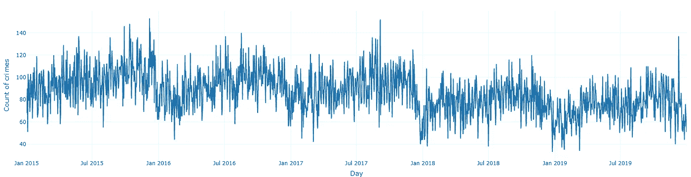

图来自作者

时间序列有点嘈杂，但我们可以注意到信号的某种趋势，随着时间的推移，信号逐渐减弱，这在周线视觉中更加明显。

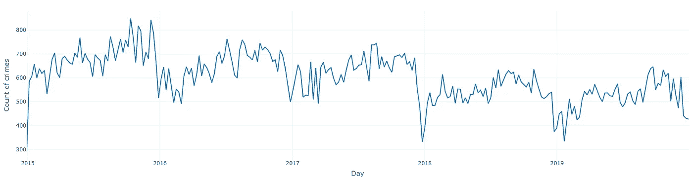

图来自作者

从这个角度来看，蒙特利尔的犯罪似乎没有季节性(比如夏天的犯罪比冬天多)。

数据集上的犯罪类别有:

*   车辆盗窃
*   恶作剧
*   抢劫
*   车内/车上盗窃
*   闯入
*   谋杀

有一个关于不同种类的犯罪随时间演变的次要情节。

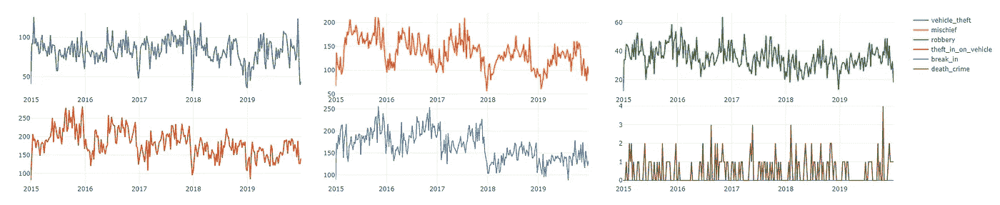

图来自作者

对不同类别没有真正的季节性影响，但值得注意的是，每年的下降似乎是由车内/车上盗窃、恶作剧和闯入造成的。

对于本文的下一步，我们将关注每周犯罪，以便于分析。

# 脸书先知图书馆的时间序列预测

项目《脸书先知》由脸书开发，2017 年出版；[文章](https://peerj.com/preprints/3190/)包含模型设计的所有细节，但主要是它应该知道的内容:

*   建立在线性回归的基础上；这是 [GAM](https://en.wikipedia.org/wiki/Generalized_additive_model) 型号的变体。
*   这种模型预测的输出由趋势、季节和假日分量组成，以处理信号随时间的演变。

你可以用 python 或者 R 来使用这个库，[快速入门文档](https://facebook.github.io/prophet/docs/quick_start.html)很好用。就设置而言，您需要对输入数据进行一点格式化(列名、格式)，但这很简单。提醒一下，目标是根据 2015 年到 2018 年的数据，建立 2019 年蒙特利尔每周犯罪的预测系统。

这是建立在 Prophet 上的模型提出的预测。

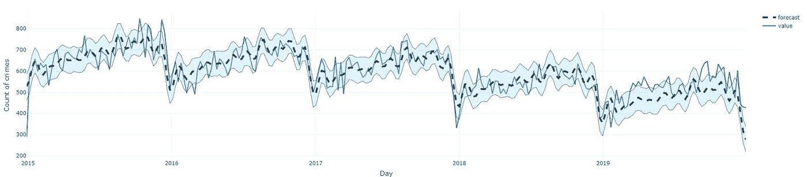

图来自作者

预测看起来没那么糟糕，而且它抓住了长期下降的趋势。该模型提供了信号的高低投影。从模型中，前面提到的每个组件都是可访问的；例如，有趋势成分或季节性。

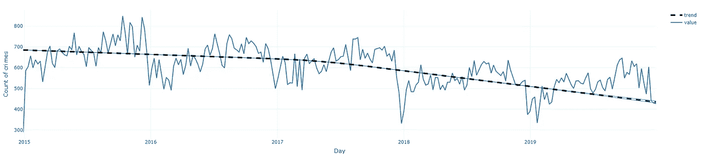

图来自作者

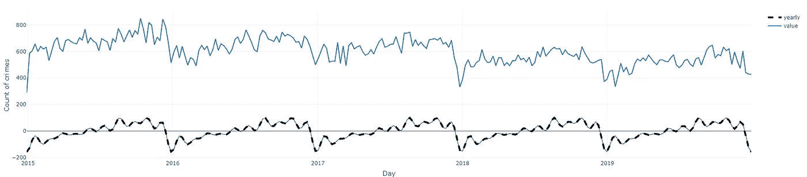

图来自作者

使用 Prophet，可以添加外部因素，如可能影响信号的特定事件的节日，这相对容易做到。

在 Prophet 的论文中，该模型被描述为分析师的预测系统，该系统可能没有时间浏览所设计的模型，并且可以快速构建预测系统并添加外部特征，而无需考虑模型的参数。

是时候用 Google 的因果影响包走得更远了。

# 谷歌影响下的因果分析

这是谷歌开发的 2015 年的一个项目；第[篇文章](https://storage.googleapis.com/pub-tools-public-publication-data/pdf/41854.pdf)给出了关于这个库的更多细节，但是我强烈推荐看看 Kay Brodersen(这个包的作者之一)的这篇演讲，它是如此清晰，以至于在它的基础上建立一个解释将是浪费时间。

需要记住的重要一点是，该软件包提供了以下功能

*   通过快速添加一些特征来建立模型，从而预测时间序列
*   评估预测和现实之间的差异；这是一个因果推断，用来估计一个事件的影响

正如在介绍中提到的，让我们用这个包来评估蒙特利尔的封锁对犯罪的影响。这个分析的协议非常简单；首先，我用数据训练了一个模型。为了进行训练，我们需要拥有与犯罪无关的特征(例如，拥有被捕人数听起来是个坏主意)。

我决定使用蒙特利尔的天气(由每周平均温度/降水量及其周方差设计)，因为它似乎与犯罪无关。作为参考，NASA 有一个令人兴奋的资源叫做 [NASA power](https://power.larc.nasa.gov/) ( **这些数据来自 NASA 兰利研究中心的 power 项目，该项目由 NASA 地球科学理事会应用科学计划资助，**数据似乎非常开放)存储每日天气信息(感谢@juliettetroadec 的帮助)。这是一张温度和降水量平均值随时间变化的曲线图。

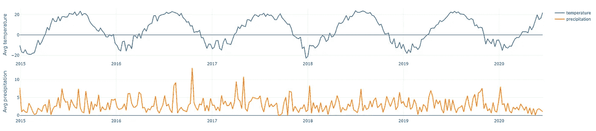

图来自作者

这是锁定期预测系统的一个可视化视图(从黑色垂直线开始)。

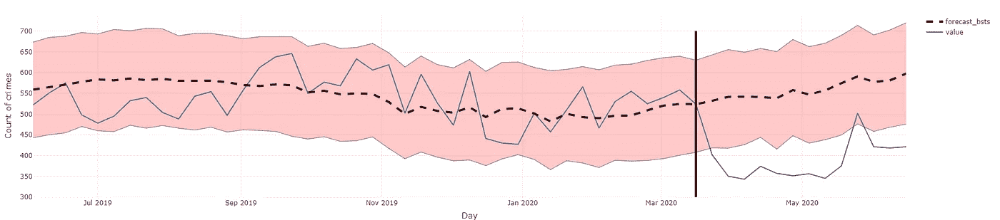

图来自作者

该软件包提供了分析预测结果与现实结果的能力，在本例中，在 2020 年 3 月 15 日到 2020 年 6 月 15 日之间，并在报告中总结比较结果。

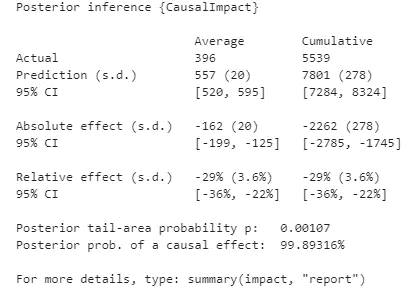

图来自作者

从这份报告中，有意思的摘录如下:

*   在这种情况下，相对效果是减少 29%(在 22-36%之间)
*   测量的显著性，在这种情况下，我们可以说有 99.89%置信度的影响

我决定把分析扩展到所有的犯罪，结果就有了。

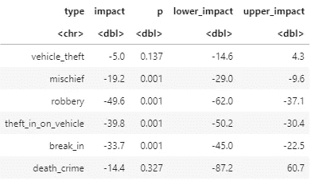

图来自作者

封锁似乎对减少恶作剧、抢劫、闯入和车辆盗窃产生了积极影响，但封锁对车辆盗窃和死亡犯罪没有影响，因此这种封锁至少有一些好处。
最后，我决定比较先知模型和因果模型的预测。

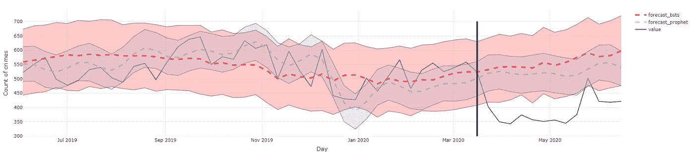

图来自作者

与预言者相比，因果影响提供了更广泛的预测范围。

# 结论

本文的一些要点:

*   这是一个潜水休息极好机会；我对这种语言有某种斯德哥尔摩综合症，一开始我很讨厌，但后来开始喜欢上了
*   禁闭也有一些好处

更严重的是，我认为应该保留的是

*   Prophet 可以直接用于建立一个简单的基线模型来预测时间序列
*   CausalImpact 包提供了快速进行影响分析的能力(对于 Pythonista，有一个 [python 实现](https://github.com/dafiti/causalimpact)，但是它没有使用相同的模型)。
*   有替代因果影响的方法，比如微软的[Dow why](https://github.com/microsoft/dowhy)软件包

我对做这个项目很感兴趣，我想我会在未来写另一篇关于时间序列预测的文章，但更多的是从各种模型的评估角度(比如 ARIMA 或 LSTM)。

**这篇文章的所有代码都可以在这个** [**资源库 Github**](https://github.com/jeanmidevacc/crimes_montreal) **中找到。**

*原载于 2020 年 9 月 9 日 https://www.the-odd-dataguy.com***。**