# 现实生活中的时间序列预测:用 ARIMA 进行预算预测

> 原文：<https://towardsdatascience.com/time-series-forecasting-in-real-life-budget-forecasting-with-arima-d5ec57e634cb?source=collection_archive---------3----------------------->

## 关于如何使用 ARIMA 进行预测的深入示例


我们被可以用时间序列来描述的现象所包围。这是一种奇特的说法，许多事情或事件可以被描述为在某个时期发生的一系列观察结果。

这听起来仍然很复杂，所以这里有几个可以用时间序列表示的“事物”的例子

*   股票价格
*   特定地区的天气状况
*   家庭用电量
*   心率监测
*   商店的总销售额

但是时间序列不仅仅是随着时间推移而发生的事情。有几个因素造就了它们的现状:

1.  **趋势**时间序列中的值是越来越高还是越来越低？
2.  **季节性**数据集中是否存在受季节影响的模式？例如，在线销售是在假期增加还是冰淇淋销售在夏天增加而在冬天减少？
3.  **周期**我们能看到独立于时间框架的某种变化模式吗？意义并不依附于某个季节。
4.  **不规则性**还有哪些可能影响数据的随机因素？

如果我们了解这些组成部分，并有足够大的数据集，我们可以使用过去的观察，即历史数据，以及我们知道的关于时间序列的其他信息来预测它在未来的行为。比如天气预报，或者下个月的销量预测。

新年决心是件大事，因为今年才刚刚开始，这是设定目标的最佳时机。

你的新年计划是更有理财意识，所以你决定制定一个月度预算。问题是，你不知道该在哪里划线。

当然，每月的开销并不总是恒定的，但有些模式可能会在一年中出现，比如在圣诞节期间和休假时花更多的钱。

我们可以把我们的月支出想象成一个时间序列，可以用时间来衡量。

所以你开始挖掘旧的银行对账单来创建你的支出数据集。

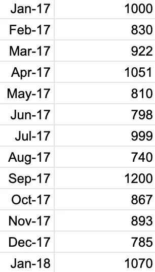

美丽的虚拟数据

厉害！一段时间内✅的每月费用✅值

让我们预测一下！嗯…没那么快😁

# 慢下来，直到它停下来

为了建立一个时间序列模型，一个可以用来预测未来值的模型，数据集需要是[稳定的](https://en.wikipedia.org/wiki/Stationary_process)。

这意味着首先我们需要删除序列可能具有的任何趋势，这样数据集就具有以下属性:

1.  **平均值为常数**
2.  **方差为常数**，即时间序列中不同点的方差相同。这个性质通常被称为[同质性](https://en.wikipedia.org/wiki/Homoscedasticity)
3.  **两个数据点**之间的自协方差**不依赖于时间**，一个在时间 t1，另一个在时间 t2。这些数据点之间的自协方差仅取决于 t1 和 t2 之间的差异

# 我的时间序列是平稳的吗？

和许多数据问题一样，这个问题的答案是一个两步过程:1)绘制数据，2)测试你的假设

## **绘制数据**

在开始任何分析之前，抽查数据并更加熟悉它是非常重要和有价值的。如果您花一些时间查看数据，您会发现更容易发现应该删除或单独分析的数据质量问题或异常值。

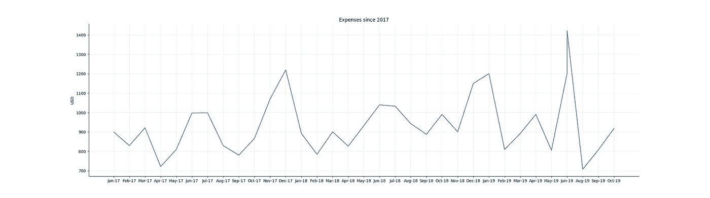

每月费用数据集的图表

## **测试你的假设**

您可能无法通过简单地查看数据集来判断它是否是静止的。这种情况下，真的不好说！

这就是迪基-富勒测试可以帮助我们的地方。这是一个统计检验，其中零假设表明*对于给定的序列*有一个单位根，而替代假设表明*序列是平稳的*。

像在任何其他统计测试中一样，如果 p 值小于或等于显著性水平(通常为 1%、5%或 10%)，我们将拒绝*零假设*。让我们将显著性水平设为 1%，这样我们就可以 99%的置信度拒绝零假设。

为了使我们的时间序列稳定，p 值必须≤ 0.01。

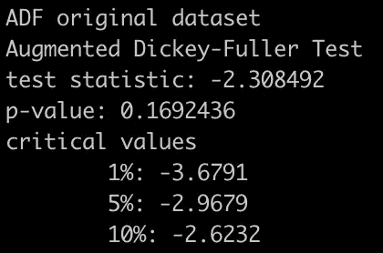

测试时间序列是否平稳

☹️却不是这样

因此，我们必须转换数据集，并再次执行 Dickey-Fuller 测试。数学中常用的一种变换是对数变换，因为它不会影响数据的属性。这意味着我们将计算时间序列中每个数据点的对数。

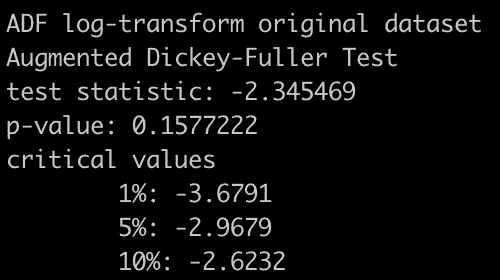

对数变换后测试时间序列是否平稳

我们还没有到达那里，我们的时间序列不是静止的。

下面是我用来运行 Dickey-Fuller 测试的代码，带有进行对数变换的选项。

```
# log_dataset: boolean indicating if we want to log-transform the dataset before running Augmented Dickey-Fuller testdef adf_test(dataset, log_dataset):
  ds = datasetif log_dataset:
    ds = dataset.apply(lambda x: log(x))
    ds.dropna(inplace=True) result = adfuller(ds) print('Augmented Dickey-Fuller Test')
  print('test statistic: %.10f' % result[0])
  print('p-value: %.10f' % result[1])
  print('critical values') for key, value in result[4].items():
    print('\t%s: %.10f' % (key, value))
```

# 我们的时间序列仍然不是稳定的

我们已经测试了原始数据集和经过对数变换的数据集，但是我们的时间序列仍然不是静态的。

我们还有其他选择吗？我们可以应用其他技术来转换数据，而不改变其属性:

1.  **差分**将每个数据点减去序列中特定时间点的值，例如，总是减去下一个周期的值
2.  [**分解**](https://en.wikipedia.org/wiki/Decomposition_of_time_series) 这种技术将分离出开始时提到的时间序列的每个组成部分(趋势、季节性、周期、不规则性)并提供残差

在我们的例子中，我们将尝试区分数据集。

# 区别

因为求差是减法，所以让我们保持简单，从求每个数据点与它之前的数据点的差开始，即求连续值的差。

```
# data: our dataset
# column_name: column to differencepd.DataFrame(data=np.diff(np.array(data[column_name])))
n_diff_dataset.columns = [column_name]

# dropping NAN values
n_diff_dataset.dropna(inplace=True)
```

再次运行 Dickey-Fuller 检验，我们看到我们仍然不能以 1%的显著性水平拒绝零假设。

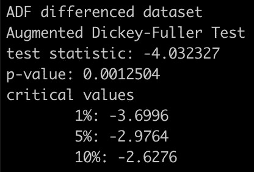

连续值差分后的 Dickey-Fuller 检验结果

p 值≤ 0.01。**数据集是固定的**🎉🎉🎉

让我们来看看平稳的时间序列。

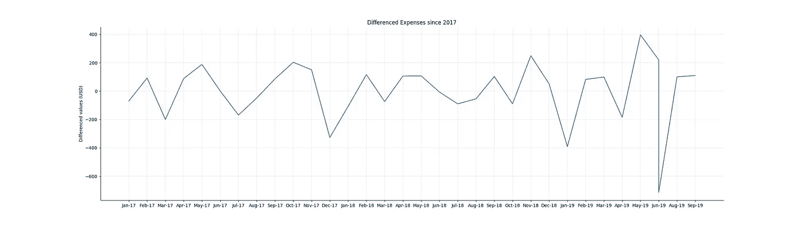

二阶差分后的时间序列——终于平稳了！

# n 阶差分和季节差分

差分后，我们的时间序列最终是平稳的。但是如果情况不是这样，我们可以继续对时间序列进行差分。

> 差异并不意味着你要减去 n 个前期的值，或者减去滞后值。这就是季节差异。

## 季节性差异

这个名字透露了一点。如果您对数据集应用季节差异，您将减去同一季节的前一个数据点。

在我们的示例中，我们处理的是月度数据，因此每年都对应于包含 12 个月的季节。因此，计算任何给定年份的一月份的季节性差异，意味着用当前值减去上一年一月份的值。

概括地说，它看起来像这样

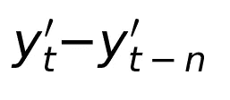

季节性差异

在每月费用的例子中，一个季节是一年，所以 *n=12* 。

## n 阶差分

这就是我们对数据集所做的，我们应用了一阶差分。这实际上意味着将时间序列中的每个数据点减去它之前的时间段中的数据点，如 lag=1。

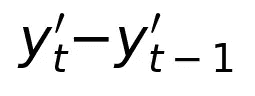

一阶差分

但是如果我们继续保持差异呢？嗯，我们实际上只是不断区分不同之处🤯🤯🤯

在这种情况下，看数学实际上有帮助！让我们以二阶差分为例，这里我们差分两次。

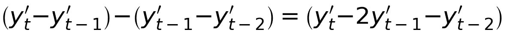

二阶差分

通过查看该公式，现在更有意义，并且更容易看出*n*-阶差分*并不意味着*n 周期的滞后，而是实际执行差分运算 *n* 次

如果需要对数据集进行任意次数的微分，可以使用 numpy 中的 [diff 方法](https://docs.scipy.org/doc/numpy-1.10.0/reference/generated/numpy.diff.html)并设置参数 *n.*

现在，回到预测📈

# 时间序列建模

有几种方法可以对时间序列进行建模，最常用的有:

## 简单移动平均线

使用这种方法，你是说预测是基于 *n* 个先前数据点的平均值。

## 指数平滑法

它以指数方式降低了先前观测的权重，因此越来越老的数据点对预测的影响越来越小。

## ARIMA:自回归综合移动平均数

这是我们将要使用的方法。

ARIMA 模型可以分解成三个不同的部分，每个部分都有一个代表时间序列特征的参数。

## **1。自回归:AR(p)**

[自回归模型](https://en.wikipedia.org/wiki/Autoregressive_model)将随机过程解释为线性组合，因此输出变量线性依赖于其先前值和随机变量。

简而言之，这是一个基于先验值或*滞后*的模型。

如果你在预测一只股票的未来价格，AR 模型将会根据这只股票以前的价格做出预测。

如果我们看看数学，我们可以用参数 *p* 来描述 AR(p)模型:

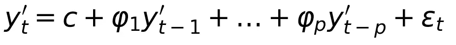

参数 *p* 表示自回归项的数量，即线性组合中的项数。

## **2。综合:I(d)**

这个名字具有误导性，但这实际上与数据集被差分的次数有关，这由参数 *d* 的值表示。

## **3。移动平均线:MA (q)**

与自回归模型相似，在[移动平均模型](https://en.wikipedia.org/wiki/Moving-average_model)中，输出变量被解释为线性，但这次是过去误差的平均值。

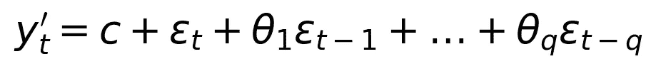

综上所述， **ARIMA(p，d，q)** 的公式如下。

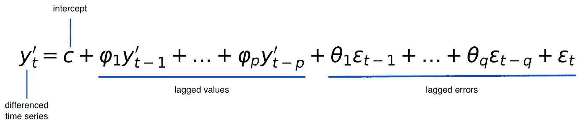

但是现在的问题是*我们如何确定使用哪些参数？*

# ARIMA(p，d，q)的提货参数

我们已经知道需要对数据集进行多少次差分，所以参数 *d* 的值是 1。

但是我们还是要搞清楚 *p* 和 *q* 的值。为此，我们将寻找自相关、AR(p)和移动平均、MA(q)曲线。

## **自相关(AR)曲线**

这是通过测试时间序列中的数据点在不同滞后(即，在时间上的*点*处)与其自身之间的相关性来完成的。

为此，我们将使用[自相关函数图](https://www.statsmodels.org/stable/generated/statsmodels.graphics.tsaplots.plot_acf.html)，简称 ACF 图。

利用 ACF 图，我们可以发现自相关(AR)曲线

*   ACF 数据点是正弦或指数衰减的
*   PACF 有一个尖峰信号，或几个连续的尖峰信号，然后突然切断

## 移动平均(MA)曲线

为了确定移动平均曲线，我们将使用 ACF 的子集，[部分自相关函数图](https://www.statsmodels.org/stable/generated/statsmodels.graphics.tsaplots.plot_pacf.html)，通常称为 PACF 图。

PACF 表示不同滞后的自相关，但它移除了*低阶相关*，即 1 和滞后-1 之间的所有相关，因为它们之间的一切都将是内在相关的。

使用 ACF 图，我们可以发现自相关(AR)曲线，当我们看到 AR 曲线描述的*反转*时:

*   PACF 数据点是正弦或指数衰减的
*   ACF 有一个尖峰，或几个连续的尖峰，然后突然切断

最重要的是，图中的尖峰必须具有统计显著性，这意味着它们在置信区间的区域之外。这个*置信区间*要么用水平线表示，要么用面积图中的面积表示，这取决于您使用的软件。

让我们一起来看看 ACF 和 PACF 的情节。

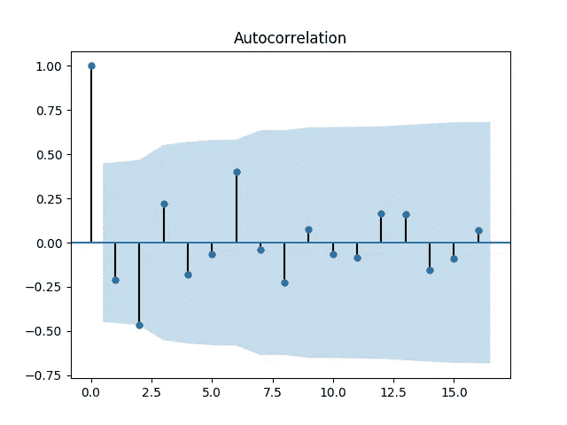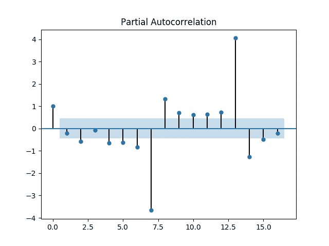

数据集的自相关和偏自相关图

滞后= 0 时的 ACF 和 PACF 通常为 1，因为每个数据点总是与其自身相关。

分析 ACF 图，我们可以看到任何稍微超出置信带的尖峰，因此我们假设 AR(2)。

至于图，我们可以在*滞后=2* 处看到第一个尖峰，因此我们将选择 MA(2)。

我们有自己的模型，ARIMA(2，1，2)🙌

为了适应模型，我决定将数据集分为训练和测试子集，使用最后 30%的观察值作为测试数据。

```
# split dataset between training and testing
cutoff_30pct = len(y) — int(len(y)*0.3)
y_train = diff_dataset[y_col][:cutoff_30pct]
y_test = diff_dataset[y_col][cutoff_30pct:] # building the model with the parameters we've discovered and fitting it to the training set
model = arima_model.ARIMA(y_train, order=(2,1,2)) 
arima_model_fit = model.fit(disp=-1)
print(arima_model_fit.summary())
```

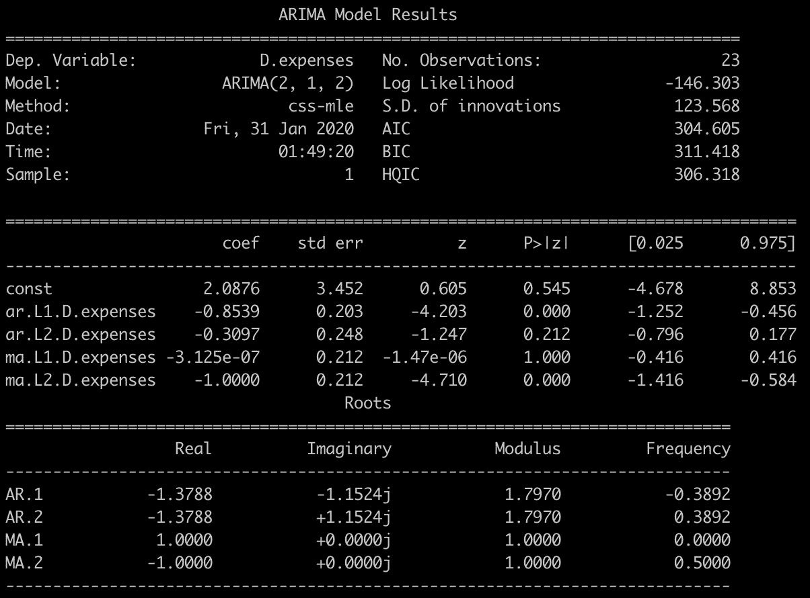

ARIMA 的结果(2，1，2)

[AIC](https://en.wikipedia.org/wiki/Akaike_information_criterion) 和 [BIC](https://en.wikipedia.org/wiki/Bayesian_information_criterion) 值用于比较不同模型应用于同一数据集时的拟合质量。在我们的例子中，我们没有比较多个模型，所以我们不会过多关注这些值。

为了理解这个特定模型的质量，我们需要使用工具箱中的其他指标。

## 这个模型对我们的数据集有好处吗？

为了评估模型的质量，我们首先将预测值与测试子集中的实际值进行比较。

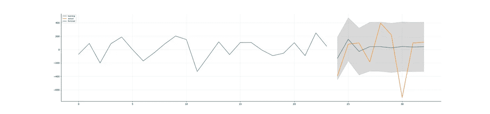

将实际值与预测值进行比较

从这里我们可以看到，绿色的预测值与橙色的实际值相比有些偏差。

根据整个数据集进行预测时，这一点变得更加清晰。

```
fig, ax = plt.subplots(figsize=(15,7))
model = arima_model.ARIMA(differenced_dataset, order=(2,1,2)) 
arima_model_fit = model_all.fit(disp=0)
# dynamic=False meaning in-sample lagged values are used for prediction
arima_all_fit.plot_predict(dynamic=False)
```

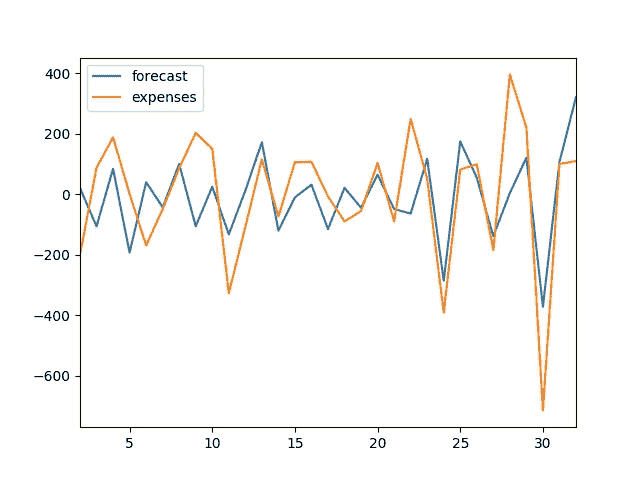

针对整个数据集进行预测

好吧，我们知道我们的预测有点偏差，但是偏差有多大呢？

为了了解实际值和预测值之间的差异，我们可以使用平均绝对误差。

```
arima_mae = mean_absolute_error(y_test.values, forecast)
print('Mean absolute error %.2f' % arima_mae)
```

我们的 ARIMA(2，1，2)的平均绝对误差为 235.89，这意味着这些值平均相差 235.89 个单位。

这可能意味着:

*   没有足够的数据来做出准确的预测
*   ARIMA 参数可以进一步调整
*   ARIMA 可能不是这个问题的最佳模型，一个想法是尝试简单的线性回归或指数平滑，并比较 AIC 和 BIC

# 结论

在我们一直在做的例子中，数据是随机生成的，并做了一些调整来创建一个趋势，所以这个结果可能会稍微有些偏差。本文的主要目标是通过不同的步骤来拟合 ARIMA 模型。

有了*真实数据*，你需要在你的问题的特定背景下观察平均绝对误差和残差。

这听起来可能有点模糊，但在数据科学中，上下文和您对该问题的了解非常重要。如果你预测一家价值数百万美元的公司的月收入，相差 235 美元可能并不重要。另一方面，如果你预测一个家庭的月预算是 235 美元，那就更令人担忧了。

希望你喜欢阅读这个例子，并愉快的预测📈

*感谢阅读！*