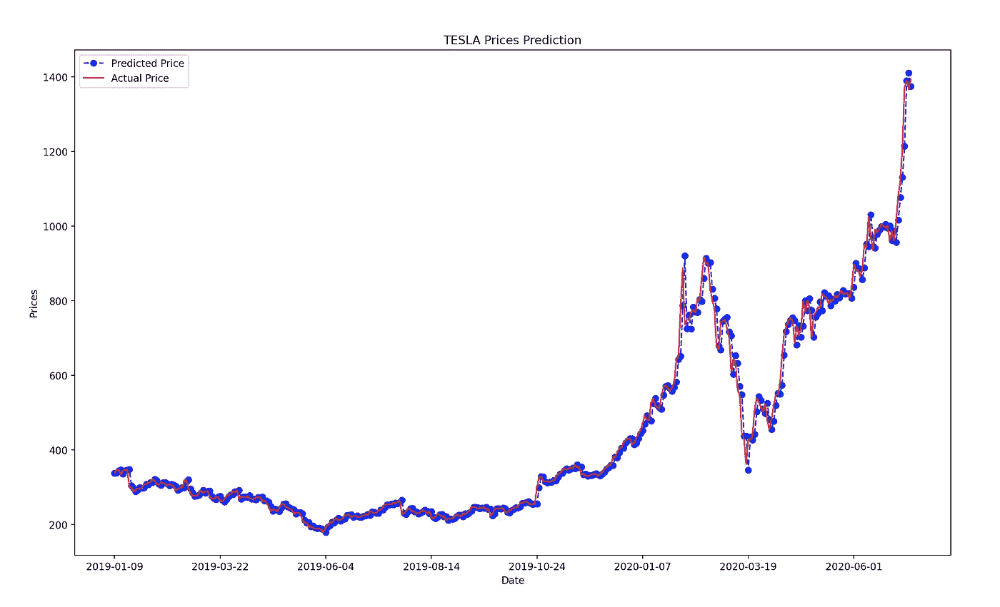
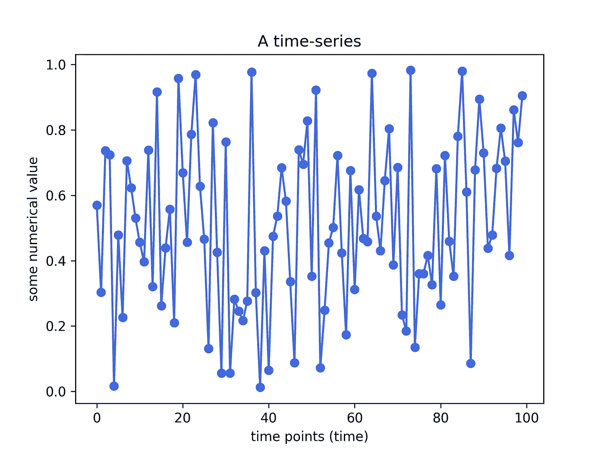
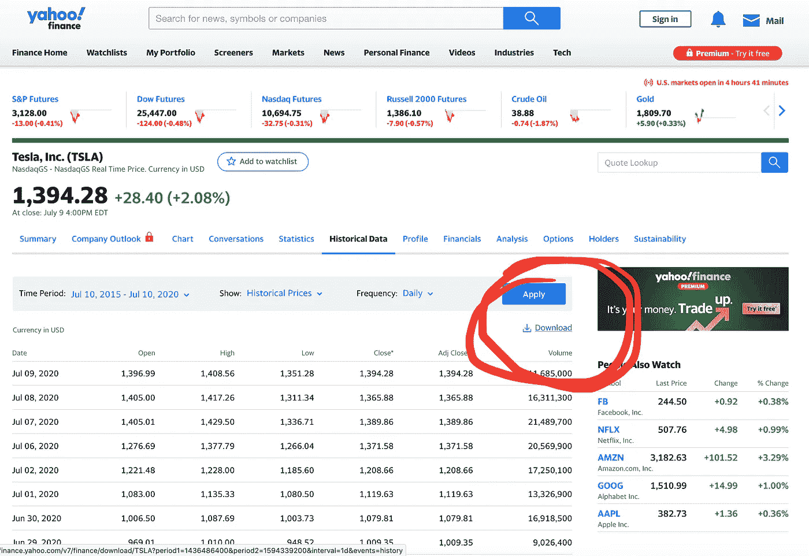
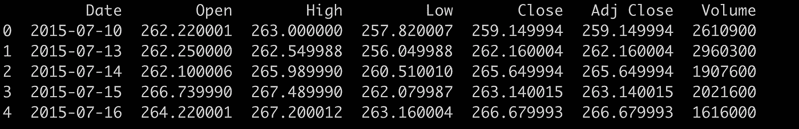
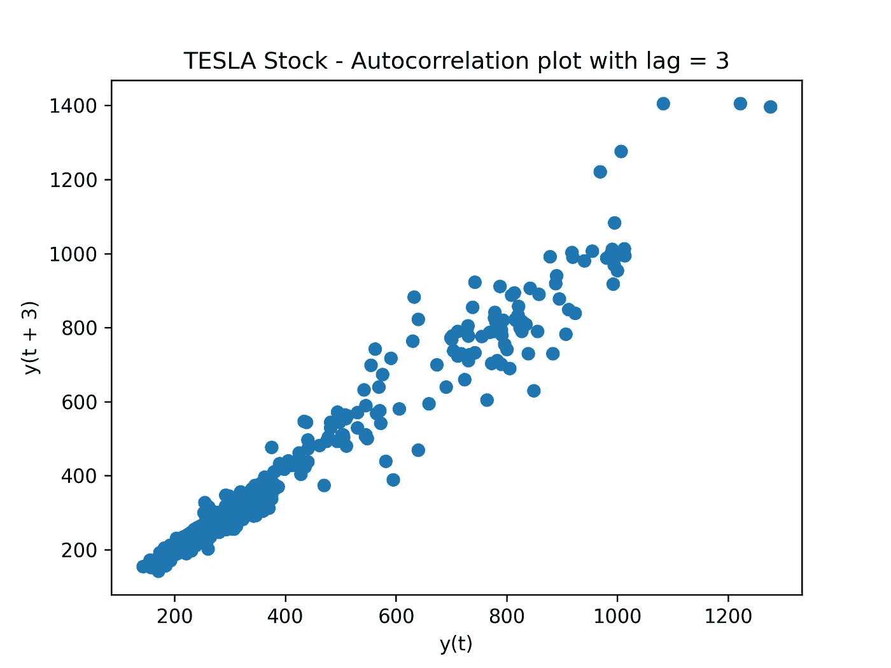
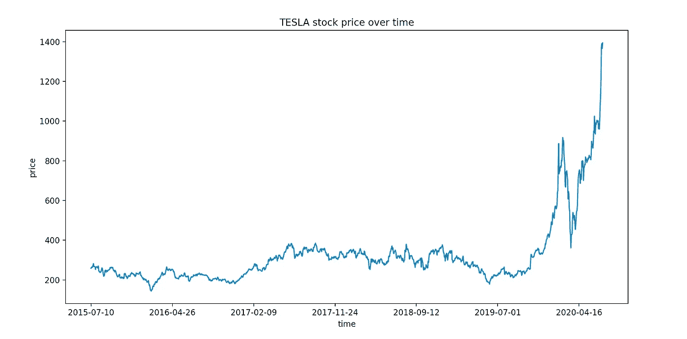
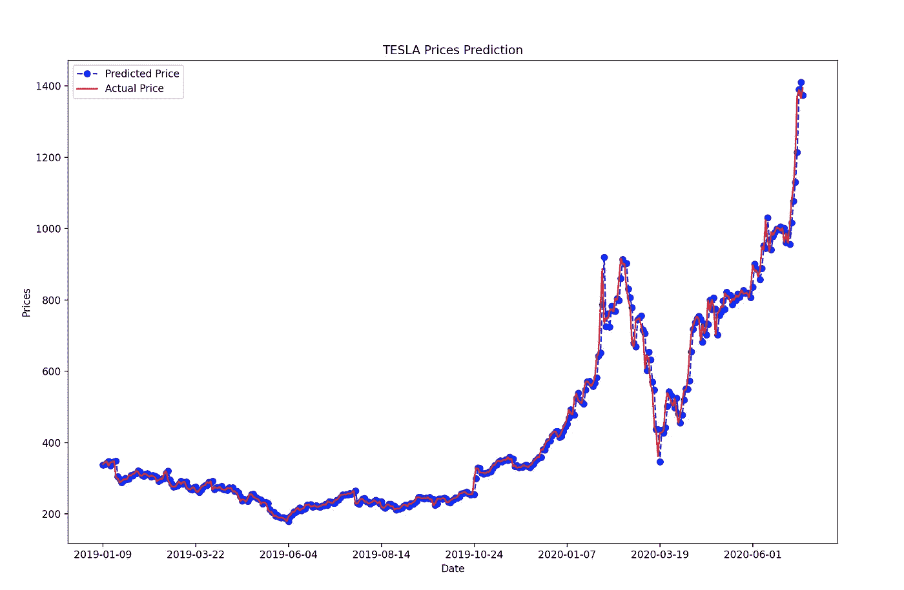

# 时间序列预测:使用 ARIMA 模型预测股票价格

> 原文：<https://towardsdatascience.com/time-series-forecasting-predicting-stock-prices-using-an-arima-model-2e3b3080bd70?source=collection_archive---------0----------------------->

## 在这篇文章中，我将向你展示如何使用预测 ARIMA 模型来预测特斯拉的股票价格



ARIMA 模型在测试集上的性能

# 1.介绍

## 1.1.时间序列和预测模型

**时间序列预测**模型是能够根据**以前的** **观测值****来**预测** **未来值**的模型。时间序列预测广泛用于**非平稳数据**。**非平稳数据**被称为其统计属性(如平均值和标准偏差)不随时间保持不变，而是随时间变化的数据。**

**这些非平稳输入数据(用作这些模型的输入)通常被称为**时间序列。**时间序列的一些例子包括随时间变化的温度值、随时间变化的股票价格、随时间变化的房屋价格等。因此，输入是一个**信号**(时间序列),它是由在时间上连续进行的观察所定义的**。****

> **时间序列是按时间顺序进行的一系列观察。**

****

**时间序列的一个例子。作者用 Python 创作的情节。**

****观察:时序**数据记录在**离散**时间**刻度**时间**刻度**上。**

****免责声明**:已经有人尝试使用时间序列分析算法来预测股票价格，尽管它们仍然不能用于在真实市场中下注。这只是一篇教程文章，并不打算以任何方式“指导”人们购买股票。**

# **2.自回归综合移动平均(ARIMA)模型**

**用于时间序列预测的一种著名且广泛使用的预测方法是**自回归综合移动平均(ARIMA)** 模型。 **ARIMA** 模型能够捕捉时间序列数据中一套不同的标准时间结构。**

## **术语**

**让我们来分解这些术语:**

*   ****AR:<>**表示模型**使用一个观测值和一些预定义数量的滞后观测值**(也称为“时间滞后”或“滞后”)之间的依赖关系。**
*   ****I: < Integrated >** 是指该模型采用原始观测值的**差分(例如，它从前一时间步的一个观测值中减去一个观测值)，以使时间序列**平稳。马**:****
*   *****MA:<>***表示模型利用了残差与观测值之间的**关系。****

## **模型参数**

**标准 ARIMA 模型期望 3 个自变量作为输入参数，即 p、d、q**

*   ****p** 是滞后观测值的**个数。****
*   ****d** 是差分的**度。****
*   ****q** 是移动平均线窗口的**大小/宽度。****

**如果你想在交互式路线图和活跃的学习社区的支持下自学数据科学，看看这个资源:[https://aigents.co/learn](https://aigents.co/learn)**

# **3.获取股票价格历史数据**

**感谢雅虎财经 T21，我们可以免费得到数据。使用以下链接获取**特斯拉**:[https://finance.yahoo.com/quote/TSLA/history?的股价历史周期 1=1436486400 &周期 2=1594339200 &间隔=1d &过滤器=历史&频率=1d](https://finance.yahoo.com/quote/TSLA/history?period1=1436486400&period2=1594339200&interval=1d&filter=history&frequency=1d)**

**您应该看到以下内容:**

****

**点击**下载**并保存**。csv** 文件本地保存在您的计算机上。**

**数据是从 **2015** 到现在( **2020** )！**

# **4.Python 工作示例**

***所需模块:Numpy，Pandas，* Statsmodels *，Scikit-Learn***

****4.1。加载&检查数据****

**我们的**进口**:**

```
import numpy as np 
import pandas as pd 
import matplotlib.pyplot as plt
from pandas.plotting import lag_plot
from pandas import datetime
from statsmodels.tsa.arima_model import ARIMA
from sklearn.metrics import mean_squared_error
```

**现在让我们**加载**特斯拉股票历史**数据**:**

```
df = pd.read_csv("TSLA.csv")
df.head(5)
```

****

*   **我们的目标变量将是**关闭**值。**

## **在建立 ARIMA 模型之前，让我们看看我们的数据中是否有一些交叉相关。**

```
plt.figure()
lag_plot(df['Open'], lag=3)
plt.title('TESLA Stock - Autocorrelation plot with lag = 3')
plt.show()
```

****

**特斯拉股票-滞后= 3 的自相关图**

**我们现在可以确认 **ARIMA** 将是一个适用于这种类型数据的好模型(数据中存在自相关)。**

**最后，让我们用**来描绘股价随时间的演变。****

```
plt.plot(df["Date"], df["Close"])
plt.xticks(np.arange(0,1259, 200), df['Date'][0:1259:200])
plt.title("TESLA stock price over time")
plt.xlabel("time")
plt.ylabel("price")
plt.show()
```

****

****4.2。建立预测 ARIMA 模型****

**接下来，让我们**把**的数据分成一个**训练** (70 %)和**测试** (30%)的集合。对于本教程，我们选择以下 **ARIMA 参数:p=4，d=1，q=0。****

```
train_data, test_data = df[0:int(len(df)*0.7)], df[int(len(df)*0.7):]training_data = train_data['Close'].values
test_data = test_data['Close'].valueshistory = [x for x **in** training_data]
model_predictions = []
N_test_observations = len(test_data)for time_pointin range(N_test_observations):
    model = ARIMA(history, order=(4,1,0))
    model_fit = model.fit(disp=0)
    output = model_fit.forecast()
    yhat = output[0]
    model_predictions.append(yhat)
    true_test_value = test_data[time_point]
    history.append(true_test_value)MSE_error = mean_squared_error(test_data, model_predictions)
print('Testing Mean Squared Error is {}'.format(MSE_error))
```

## **守则摘要**

*   **我们将训练数据集分为训练集和测试集，并使用训练集来拟合模型，并为测试集上的每个元素生成预测**。****
*   ****考虑到差分和 AR 模型对先前时间步观测值的依赖性，需要一个滚动预测程序。为此，我们在收到每个新的观察结果后重新创建 ARIMA 模型。****
*   **最后，我们在一个名为**历史**的列表中手动跟踪所有的观察值，该列表以训练数据为种子，并且在每次迭代中向其追加新的观察值。**

**检验的均方误差为 7。38860 . 68686886861**

> **测试集的 MSE 相当大，表明精确预测是一个困难的问题。但是，这是所有测试集预测的平均平方值。让我们**可视化**预测，以更好地理解模型的性能。**

```
test_set_range = df[int(len(df)*0.7):].indexplt.plot(test_set_range, model_predictions, color='blue', marker='o', linestyle='dashed',label='Predicted Price')plt.plot(test_set_range, test_data, color='red', label='Actual Price')plt.title('TESLA Prices Prediction')
plt.xlabel('Date')
plt.ylabel('Prices')
plt.xticks(np.arange(881,1259,50), df.Date[881:1259:50])
plt.legend()
plt.show()
```

****

**ARIMA 模型在测试集上的性能**

## **没那么糟吧？**

**我们的 ARIMA 模型产生了可观的结果。就训练/拟合时间和复杂性而言，该模型提供了良好的预测准确性，并且与其他替代方案相比相对较快。**

**那都是乡亲们！希望你喜欢这篇文章！**

# **敬请关注并支持这一努力**

**如果你喜欢这篇文章，并且觉得它有用，那么**关注**我就可以看到我所有的新帖子。**

**有问题吗？把它们作为评论贴出来，我会尽快回复。**

# **您可能也会喜欢我以前的文章:**

**[**LSTM 时间序列预测:利用 LSTM 模型预测股票价格**](/lstm-time-series-forecasting-predicting-stock-prices-using-an-lstm-model-6223e9644a2f)**

**[](/lstm-time-series-forecasting-predicting-stock-prices-using-an-lstm-model-6223e9644a2f) [## LSTM 时间序列预测:使用 LSTM 模型预测股票价格

### 在这篇文章中，我将向你展示如何使用预测 LSTM 模型来预测股票价格

towardsdatascience.com](/lstm-time-series-forecasting-predicting-stock-prices-using-an-lstm-model-6223e9644a2f) 

[**时间序列预测:利用脸书先知模型预测股票价格**](/time-series-forecasting-predicting-stock-prices-using-facebooks-prophet-model-9ee1657132b5)

[](/time-series-forecasting-predicting-stock-prices-using-facebooks-prophet-model-9ee1657132b5) [## 时间序列预测:用脸书的先知模型预测股票价格

### 使用可从《先知脸书》公开获得的预测模型预测股票价格

towardsdatascience.com](/time-series-forecasting-predicting-stock-prices-using-facebooks-prophet-model-9ee1657132b5) 

# 参考

[1][https://en . Wikipedia . org/wiki/auto regressive _ integrated _ moving _ average](https://en.wikipedia.org/wiki/Autoregressive_integrated_moving_average)

# 其他员额

[](https://medium.com/@seralouk/the-best-free-data-science-resources-free-books-online-courses-9c4a2df194e5) [## 最佳免费数据科学资源:免费书籍和在线课程

### 最有用的免费书籍和在线课程，适合想了解更多数据科学知识的人。

medium.com](https://medium.com/@seralouk/the-best-free-data-science-resources-free-books-online-courses-9c4a2df194e5) [](/roc-curve-explained-using-a-covid-19-hypothetical-example-binary-multi-class-classification-bab188ea869c) [## 用新冠肺炎假设的例子解释 ROC 曲线:二分类和多分类…

### 在这篇文章中，我清楚地解释了什么是 ROC 曲线以及如何阅读它。我用一个新冠肺炎的例子来说明我的观点，我…

towardsdatascience.com](/roc-curve-explained-using-a-covid-19-hypothetical-example-binary-multi-class-classification-bab188ea869c) [](/support-vector-machines-svm-clearly-explained-a-python-tutorial-for-classification-problems-29c539f3ad8) [## 支持向量机(SVM)解释清楚:分类问题的 python 教程…

### 在这篇文章中，我解释了支持向量机的核心，为什么以及如何使用它们。此外，我还展示了如何绘制支持…

towardsdatascience.com](/support-vector-machines-svm-clearly-explained-a-python-tutorial-for-classification-problems-29c539f3ad8) [](/pca-clearly-explained-how-when-why-to-use-it-and-feature-importance-a-guide-in-python-7c274582c37e) [## PCA 清楚地解释了——如何、何时、为什么使用它以及特性的重要性:Python 指南

### 在这篇文章中，我解释了什么是 PCA，何时以及为什么使用它，以及如何使用 scikit-learn 在 Python 中实现它。还有…

towardsdatascience.com](/pca-clearly-explained-how-when-why-to-use-it-and-feature-importance-a-guide-in-python-7c274582c37e) [](/everything-you-need-to-know-about-min-max-normalization-in-python-b79592732b79) [## 关于 Python 中的最小-最大规范化，您需要知道的一切

### 在这篇文章中，我将解释什么是最小-最大缩放，什么时候使用它，以及如何使用 scikit 在 Python 中实现它

towardsdatascience.com](/everything-you-need-to-know-about-min-max-normalization-in-python-b79592732b79) [](/how-and-why-to-standardize-your-data-996926c2c832) [## Scikit-Learn 的标准定标器如何工作

### 在这篇文章中，我将解释为什么以及如何使用 scikit-learn 应用标准化

towardsdatascience.com](/how-and-why-to-standardize-your-data-996926c2c832)**