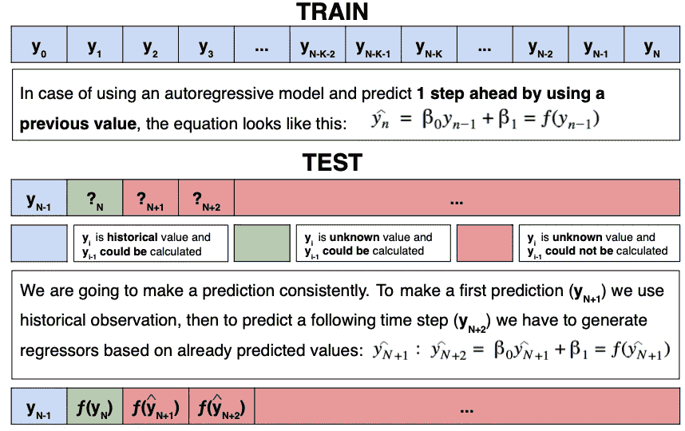
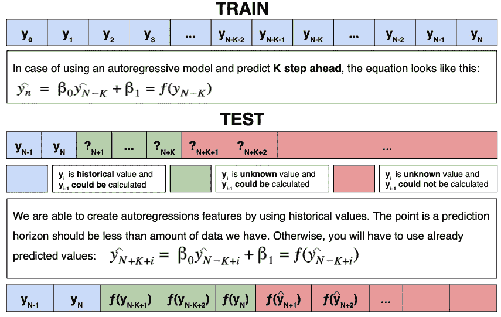

# 时间序列预测策略

> 原文：<https://towardsdatascience.com/time-series-forecasting-strategies-c9bafaf5d1a6?source=collection_archive---------59----------------------->

由 [Unsplash](https://unsplash.com/s/photos/strategy?utm_source=unsplash&utm_medium=referral&utm_content=creditCopyText) 上的 [Tabea Damm](https://unsplash.com/@tabeadamm?utm_source=unsplash&utm_medium=referral&utm_content=creditCopyText) 拍摄的照片

有大量的文章详细描述了各种数据预处理技术，并解释了如何使用机器学习算法，甚至是关于模型性能估计和选择。在我之前的 [**帖子**](/yet-another-an-end-to-end-time-series-project-tutorial-37390bcea38e) 中，我谈到了从头开发一个预测模型，并为参与该主题的项目经理提供了一些提示。然而，当使用测试实例时，我面临着关于什么策略可以预测未来的信息的缺乏。为了填补这个空白，我提供了三种常见方法的解释。希望有用。

因此，在本文中，我们打算跳过数据准备的一部分，直接进入特征生成，因为时间序列分析的前面步骤不依赖于已经选择的策略。

让我们回顾一下他们的拳头。

**整个项目的代码可以在 GitHub** [**资源库**](https://github.com/VinGeorge/Time-series-projects/blob/master/ts-forecasting-strategies.ipynb) 中找到

# **第一种策略—“基于先前预测值创建新特征”**

在那里，我们提前 1 个时间步长进行预测，并根据之前的预测值生成未来的模型特征。只有在前几个预测中，我们使用实际的例子。这种方式使我们能够预测未来的价值，无论我们想要什么。在这种情况下，预测范围变得无限。然而，另一方面，这也有一个缺点，因为每次下一次预测观测都会累积以前观测的误差。因此，进一步的预测值远离历史值，那么模型精度就变得更差。

我们预测一个步骤，然后将预测值添加到数据集中，并重用它来生成新的步骤，就像下图所示。

正如我上面提到的，我们将在数据集的顶部添加每个新的预测值，因此我们必须调整将生成要素的函数以遵循这种方法。

# **第二种策略—“预测未来 K 个分笔成交点”**

我们可以预测向前 K 步。只有当预测范围小于我们拥有的数据时，这才是可能的。这很重要，因为我们将只使用历史观察值来生成未来值。

但是，在我们开始进行预测之前，我们必须定义要预测多少步，并意识到我们拥有为未来值生成特征所需的历史点数量。

这种策略的主要好处是仅使用真实数据来生成预测。与此同时，可以预测的时间步长数量有限。此外，我想你已经猜到，我们越是走向未来，我们的历史观察就变得越没用，这就是这种方法的局限性。

# **第三个策略——“有创意”**

您可以通过结合第一种和第二种策略来创建任何单独的模型。

例如，使用一个模型预测一个步骤，使用另一个模型预测两个时间步骤，依此类推。

在下面的例子中，我们通过重用在第二个策略中训练过的模型来预测 K 步，然后从第一个策略中启动模型。

# **结论**

我认为，首先也是最重要的是，策略选择的偏好应该取决于您想要预测的步骤数量和要达到的预测准确度水平。选择适合你的或者创造你自己的。感谢您的时间，请分享您的想法或任何反馈。