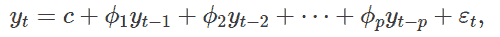
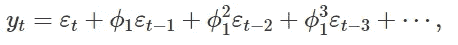
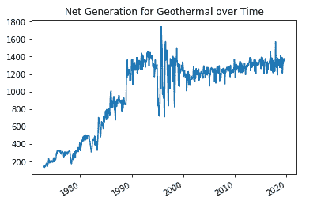
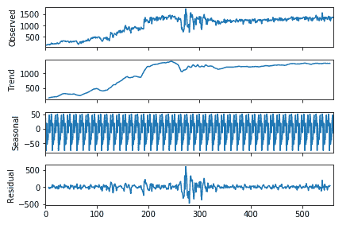
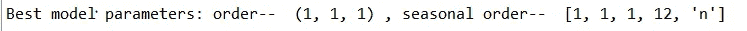
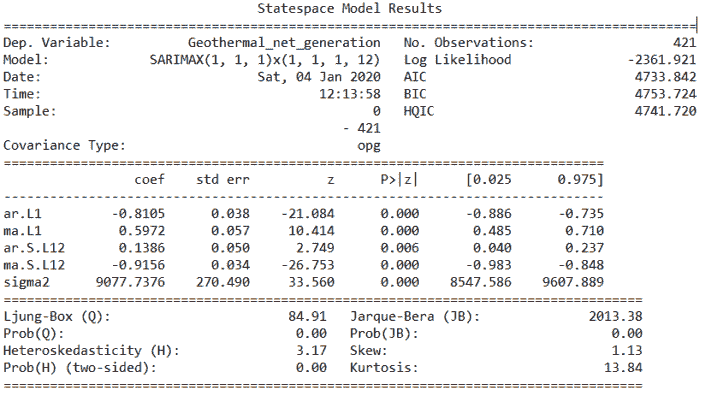
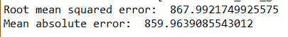
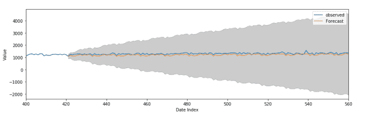

# 利用季节性 ARIMA 模型进行时间序列预测

> 原文：<https://towardsdatascience.com/time-series-forecasting-using-a-seasonal-arima-model-57127cb8b655?source=collection_archive---------20----------------------->

## Python 教程

时间序列预测中最广泛研究的模型之一是 ARIMA(自回归综合移动平均)模型。ARIMA 模型有许多变体，它们采用相似的概念，但稍有改动。一个特别的例子是季节性 ARIMA (SARIMA)模型。SARIMA 模型在生成时间序列预测时考虑了季节性。本教程涵盖了使用 Python 生成和调整 SARIMA 模型的基础知识，旨在预测具有季节性的时间序列。

# 算法背景

首先，简单介绍一下 SARIMA 模型的工作原理。由于 ARIMA 模型构成了萨里玛模型的主干，因此理解 ARIMA 模型的工作原理是有益的。它包括以下步骤:

1.  差分时间序列中的滞后读数，从而使时间序列平稳。
2.  使用时间序列中指定数量的滞后观测值来预测时间序列的未来行为。这一步包括两个模型的组合:自回归(AR)模型和移动平均(MA)模型。每个主题的一些背景:

***AR 模型。***AR 模型使用变量以前值的线性组合来预测变量( [1](https://otexts.com/fpp2/AR.html) )。我们将订单为 *p* 的 AR 模型描述如下:

*自回归(AR)模型。图片由(*[*1*](https://otexts.com/fpp2/AR.html)*)*提供

在上式中，ε项代表随机误差项。 *y(t-p)* 项表示时间序列中前一个 *p* 值。phi 值在每个时间步长都是常数。phi 值随着远离点 t(序列中的最新值)而减小。因此，滞后值越接近预测值(在序号 t 处)，phi 值越大，时间步长对预测的影响越大。

**【马】马典范。** 移动平均模型类似于 AR 模型，只是它是前面误差项的线性组合( [2](https://newonlinecourses.science.psu.edu/stat510/lesson/2/2.1) )。我们描述如下:

*移动平均线(MA)模型，承蒙(*[*3*](https://otexts.com/fpp2/MA.html)*)*

在上面的等式中，ε项是误差项，ε(t)是时间步长 t 处的误差项，以此类推。像上面的 AR 方程一样，phi 参数在每个时间步长都是一个常量值。类似地，phi 值随着远离时间 t 移动更多的时间步长而减小。

## ARIMA 模型参数

ARIMA 模型包括三个主要参数——*p*、 *q* 和 *d* 。这些参数代表以下内容( [4](https://people.duke.edu/~rnau/411arim.htm) ):

*   *p* :自回归模型的阶数(滞后项的个数)，在上面的 AR 方程中描述。
*   *q* :移动平均线模型的阶数(滞后项的个数)，在上面的 MA 方程中描述。
*   *d* :使时间序列平稳所需的差值数。

## SARIMA 模型参数

萨里玛模式建立在 ARIMA 模式的基础上。它包括 *p* 、 *q* 和 *d* 参数，还包括一组额外的参数来说明时间序列的季节性。该参数集— *P* 、 *Q* 、 *D* 和附加参数 *m —* 定义如下( [5](https://newonlinecourses.science.psu.edu/stat510/lesson/4/4.1) ):

*m* :模型的季节性。例如，如果时间序列的季节性每年重复一次，那么 *m* = 12。如果季节性是每季度一次，那么 *m* = 4(意味着季节性模式每四个月重复一次)。

*P* :季节性自回归模型的阶。

*Q* :季节移动平均线模型的阶。

*D* :应用于时间序列的季节差异数。

# 时间序列

在本教程中，我们将使用美国地热能发电的月度时间序列。数据可以通过能源信息管理局(EIA)的 API 直接拉入 Python 中(*参见* [*本教程*](https://techrando.com/2019/06/26/how-to-use-the-eia-api-to-pull-live-data-directly-into-python/) *了解更多关于使用 EIA 的 API* 的背景)。时间序列的快照如下所示，单位为百万千瓦时:

*月时间序列，地热能发电净发电量。单位为百万千瓦小时。*

我们使用下面的代码来检索和可视化我们的时间序列:

在我们生成 SARIMA 模型之前，让我们分解时间序列以确保它显示季节性。我们使用*季节性分解*函数，可通过 statsmodels.tsa 包获得。此函数允许我们将时间序列分解为趋势、季节和残差部分:

*分解地热能净发电量时间序列*

如上图所示，时间序列明确显示了季节性，每 12 个月(每年)重复一次。

# 构建萨里玛模型

既然我们已经执行了一些初步的数据探索，让我们构建和调整一个 SARIMA 模型来预测时间序列。

## 超参数选择

我们通过强力选择最适合萨里玛模型的 *p* 、 *d* 、 *q* 、 *P* 、 *D* 和 *Q* 超参数——我们对不同的模型超参数变量进行采样，直到找到最佳的模型组合。在生成每个模型后，我们使用其 AIC 和 BIC 分数来衡量其性能。AIC 或 Akaike 信息标准是一种将一组统计模型的质量相互比较的度量标准( [6](https://www.statisticshowto.datasciencecentral.com/akaikes-information-criterion/) )。类似地，BIC 或贝叶斯信息标准是一种用于比较不同模型的贝叶斯统计。当使用 AIC 或 BIC 指标比较模型时，我们将 AIC 和 BIC 得分最低的模型作为最佳选择。

在下面的代码片段中，我们生成不同的超参数变量来运行 SARIMA 模型，并返回一个列表进行循环:

在上面的代码片段中，我们使用*sarima _ parameter _ search()*函数生成不同超参数组合的列表，作为 s*easonal _ pqd _ combinations*和 *pdq* 变量返回。*季节性*变量的默认值为 12，表示季节性模式每 12 个月(每年)重复一次。

*趋势*变量有 4 个可能选项——“n”、“c”、“t”和“ct”。该变量控制时间序列的多项式趋势；' n '表示没有趋势(默认)，' c '表示趋势是恒定的，' t '表示随时间的线性趋势，' ct '既恒定又线性( [8](https://www.statsmodels.org/dev/generated/statsmodels.tsa.statespace.sarimax.SARIMAX.html) )。

*p* 、 *d* 和 *q* 变量可以在 0 和 *search_range* 限制(不含)之间变化。在上面的代码中，我将 *search_range* 设置为 2，因此参数范围在 0 和 1(含)之间变化。这意味着相关 AR 和 MA 模型的滞后项的最大可能数量是 1，差分的最大可能阶数是 1。

** [## 如何网格搜索 SARIMA 超参数进行时间序列预测

### 季节性自回归综合移动平均模型是一种模拟单变量时间序列的方法

machinelearningmastery.com](https://machinelearningmastery.com/how-to-grid-search-sarima-model-hyperparameters-for-time-series-forecasting-in-python/)  [## 如何使用 SARIMA 模型用 Python 预测销售额

### 从统计学和 python 到时间序列预测的分步指南

towardsdatascience.com](/how-to-forecast-sales-with-python-using-sarima-model-ba600992fa7d) 

## 培训 SARIMA 模型

让我们首先将数据分成训练集和测试集。这样，我们可以使用训练集构建模型，并使用测试集评估其性能:

在上面的代码片段中，我们使用了标准的 75/25 数据分割(分别是训练和测试)。我们将时间序列中前 75%的数据点作为训练集，后 25%的数据点作为测试集。

***注意:当生成我们的训练和测试集时，我们必须只使用一个分割，因为数据必须保持其连续性。这是因为 SARIMA 模型依赖于数据序列来进行预测。***

最后，是时候建立我们的 SARIMA 模型了。我们循环遍历每个可能的超参数配置，生成一个 SARIMA 模型。我们使用每个可能模型的 AIC 参数来衡量模型性能。记住——我们想要 AIC 分数最低的模型:

在上面的代码片段中，我们使用了 *seasonal_arima_model()* 函数来构建 SARIMA 模型。如果模型构建成功，那么模型摘要将打印在控制台中，并返回模型及其相关的 AIC 和 BIC 分数。

我们在一个循环中调用*季节性 arima 模型()*函数，在这里我们对每个超参数配置进行采样。我们设置了一个默认的 AIC 值 100，000，000，000(非常高)，当我们找到一个具有较低 AIC 分数的模型时，替换它。当我们在循环中移动时，我们在具有最低相关 AIC 分数的模型上保留一个标签，并保存该模型及其超参数配置(在 *best_model* 、 *best_order* 和 *best_seasonal_order* 变量下)。我们将循环结束时存储在 *best_model* 下的 SARIMA 模型作为具有最佳超参数配置的最终模型。

## 解释模型结果

循环完成后，最佳模型配置及其摘要将打印在 Python 控制台中:

最佳 SARIMA 型号配置

*萨里玛(1，1，1)x(1，1，1，12)模型摘要*

上面的模型摘要包含*“协方差类型”*图，该图描述了每个变量对预测的影响。我们有四个主要的滞后 AR 和 MA 变量。第一组 AR 和 MA 变量滞后 1 个时间步长( *ar)。*和*马。L1* ，而第二组滞后 12 个时间步( *ar)。S.L12* 和 *ma。S.L12* 。

查看图中的*P>ABS(z)*项，所有变量读数为 0。这很好，因为我们希望 P 值尽可能接近 0。使用 0.05 作为统计显著性的截止值，我们所有的滞后 AR 和 MA 项都会显著影响模型预测。

# 测试模型性能

现在我们有了 SARIMA 模型，让我们使用测试数据来评估它的性能！

在下面的代码片段中，我们预测测试集的值，预测出测试集中出现的步骤总数。然后，我们使用均方根误差(RMSE)和平均绝对误差(MAE)指标将预测值与实际值进行比较。RMSE 和梅的分数越低，模型就越适合。如果预测值与实际值完全匹配，则 RMSE 和 MAE 都等于 0。

***关于均方根误差和平均绝对误差的更多信息，请查看*** [***此链接***](https://www.studytonight.com/post/what-is-mean-squared-error-mean-absolute-error-root-mean-squared-error-and-r-squared) ***。***

*预测的 RMSE 和梅产量*

运行上面的代码片段，该模型的输出 RMSE 和 MAE 分别约为 868 和 860。

在计算了 RMSE 和梅伊指标后，我们将预测值与实际值进行对比。这为我们提供了模型性能的直观度量:

*时间序列指数 t 下的时间序列预测值与实际时间序列值。预测的置信区间用灰色表示。*

请看上图，该模型在预测 140 个时间步长的时间序列方面做得很好。这都快十二年了！我们可以看到预测的季节性，这是由 *ar 说明的。S.L12* 和 *ma。模型中的 S.L12* 术语。

# 我的用季节性 ARIMA 模型生成和预测的教程到此结束。

# 查看本教程中使用的完整代码。

# 另外，看看我的其他一些时间序列分析文章:

 [## 使用 Python 分析电价时间序列数据:时间序列分解和价格…

### 欢迎来到科技兰多博客！本教程涵盖了时间序列分解和向量自回归(VAR)…

techrando.com](https://techrando.com/2019/07/19/analyzing-electricity-price-time-series-data-using-python-time-series-decomposition-and-price-forecasting-using-a-vector-autoregression-var-model/)  [## 使用 Python - Tech Rando 进行变化点检测简介

### 我的很多工作都大量涉及时间序列分析。我使用的一个很棒但不太为人所知的算法是…

techrando.com](https://techrando.com/2019/08/14/a-brief-introduction-to-change-point-detection-using-python/)  [## 时间序列中离群点检测的无监督机器学习方法

### 在这篇文章中，我将介绍一些我最喜欢的检测时间序列数据中异常值的方法。有许多不同的…

techrando.com](https://techrando.com/2019/08/23/unsupervised-machine-learning-approaches-for-outlier-detection-in-time-series/) 

# 资源

1.  [https://otexts.com/fpp2/AR.html](https://otexts.com/fpp2/AR.html)
2.  [https://new online courses . science . PSU . edu/stat 510/lesson/2/2.1](https://newonlinecourses.science.psu.edu/stat510/lesson/2/2.1)
3.  【https://otexts.com/fpp2/MA.html 
4.  [https://people.duke.edu/~rnau/411arim.htm](https://people.duke.edu/~rnau/411arim.htm)
5.  [https://new online courses . science . PSU . edu/stat 510/lesson/4/4.1](https://newonlinecourses.science.psu.edu/stat510/lesson/4/4.1)
6.  [https://www . statistics show to . data science central . com/akai KES-information-criterion/](https://www.statisticshowto.datasciencecentral.com/akaikes-information-criterion/)
7.  [https://www . statistics show to . data science central . com/Bayesian-information-criterion/](https://www.statisticshowto.datasciencecentral.com/bayesian-information-criterion/)
8.  [https://www . stats models . org/dev/generated/stats models . TSA . statespace . sarimax . sarimax . html](https://www.statsmodels.org/dev/generated/statsmodels.tsa.statespace.sarimax.SARIMAX.html)

*最初发表于 2020 年 1 月 4 日*[*https://techrando.com*](https://techrando.com/2020/01/04/time-series-forecasting-using-a-seasonal-arima-model/)T22。**