# python 中自动 ARIMA 的时间序列预测

> 原文：<https://towardsdatascience.com/time-series-forecasting-using-auto-arima-in-python-bb83e49210cd?source=collection_archive---------0----------------------->

## 演示如何利用 python 中的自动 ARIMA 功能，使用“pmdarima”包预测未来

照片由 Isaac Smith 在 Unsplash 上拍摄

*时间序列分析是任何数据科学家的核心技能之一，在分析领域工作的任何人经常会遇到根据过去和现在的数据预测未来的情况。*

**什么是时间序列？**

它是在特定时间基本上以相等间隔进行的一系列观察。它用于根据过去的观察值预测未来值。在时间序列分析中，您可能会观察到趋势性、季节性、不规则性和周期性。

在这种数据集的情况下，每次只观察到一个变量被称为“单变量时间序列”，如果每次观察到两个或两个以上的变量被称为“多变量时间序列”。

在本文中，我们将重点关注使用 python 中的自动 ARIMA 功能来预测销售额的单变量时间序列，这与 r 中的自动 ARIMA 功能非常相似

**为什么使用汽车 ARIMA？**

通常，在基本的 ARIMA 模型中，我们需要提供必要的 p、d 和 q 值。我们使用统计技术，通过执行差分来消除非平稳性并绘制 ACF 和 PACF 图来生成这些值。在自动 ARIMA 中，模型本身将生成适合数据集的最佳 p、d 和 q 值，以提供更好的预测。

让我们开始安装吧…

请注意，这个包最初命名为“金字塔”，后来改为“pmdarima”。确保您正在安装“pmdarima”软件包。

👉**步骤 1:安装“pmdarima”包**

你可以用下面的命令从你的 Jupyter 单元安装这个包。

**！pip 安装 pmdarima**

为了确保软件包构建正确，请使用下面的命令进行测试。

**从 pmdarima.arima 导入 auto_arima**

还要注意，这个包依赖于其他几个 python 包，要了解更多关于设置的信息，请参考这个[ [链接](https://alkaline-ml.com/pmdarima/setup.html)

我们正在使用的数据集是从 1964 年到 1972 年的每月明智香槟销售。你可以在这里得到数据集

👉**第二步:准备数据**

读取数据集后，确保没有空值，并将“Month”变量的数据类型更改为 datetime 对象。此外，使用 set_index 方法将 dataframe 的索引设置为该变量。

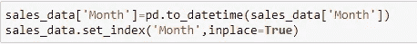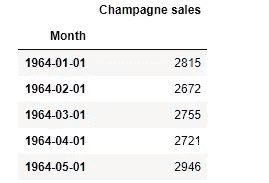

销售数据的前几行

👉**第三步:理解模式**

为了理解数据的模式，我们可以简单地用。plot()方法。

销售数据中的季节性模式

从上面我们可以观察到，数据存在季节性。从 1964 年到 1972 年，每年都有一个销售高峰。

👉**步骤 4:平稳性测试**

平稳性是时间序列中的一个重要概念，任何时间序列数据都应该在进行建模之前进行平稳性测试。

我们使用“扩展的 Dickey-Fuller 检验”来检查数据是否是平稳的，这在“pmdarima”包中是可用的。

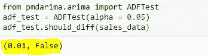

从上面我们可以得出结论，数据是非平稳的。因此，我们需要使用“综合(I)”概念，在时间序列中用值“d”表示，以使数据在构建自动 ARIMA 模型时保持平稳。

👉**第五步:训练和测试分割**

拆分为定型数据集和测试数据集，以在定型数据集上构建模型，并使用测试数据集进行预测。

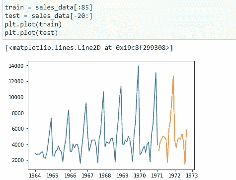

绘制训练和测试数据集

👉**第六步:建立汽车 ARIMA 模型**

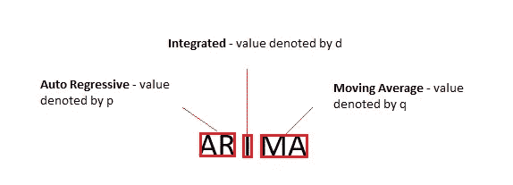

*自回归(p)* - >自回归项数。

*积分(d)* - >平稳性所需的非季节性差异数。

*移动平均(q)* - >预测方程中滞后预测误差的个数。

在自动 ARIMA 模型中，注意小的 P，D，Q 值代表非季节性成分，大的 P，D，Q 代表季节性成分。它的工作类似于超调谐技术，以找到不同组合的 p、d 和 q 的最佳值，并且最终值将通过考虑较低的 AIC、BIC 参数来确定。

这里，我们尝试使用范围从 0 到 5 的 p、d、q 值来从模型中获得更好的最优值。该模型中还有许多其他参数，要了解更多功能，请访问此链接[ [此处](https://alkaline-ml.com/pmdarima/modules/generated/pmdarima.arima.auto_arima.html)

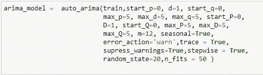

自动 ARIMA 模型参数

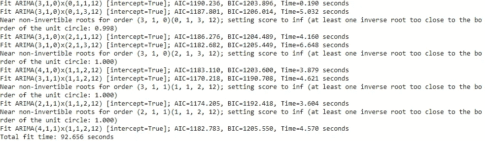

自动 ARIMA 模型的追踪

下面是模型的总结。

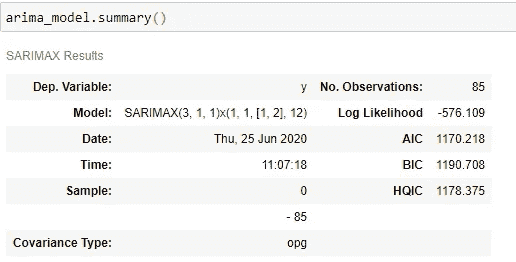

ARIMA 模式概述

👉**第七步:测试数据预测**

使用在前面步骤中建立的训练模型根据测试数据预测销售。

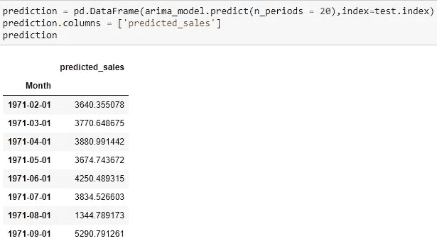

根据测试数据预测的销售额

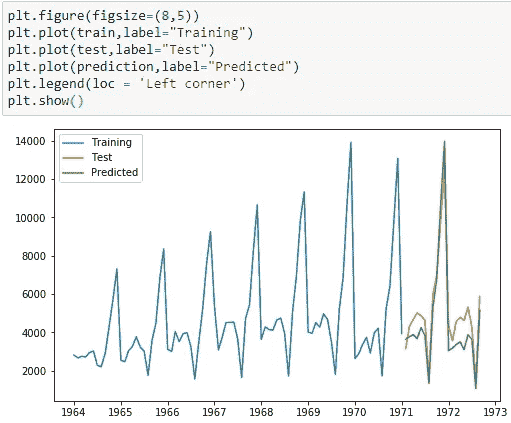

绘制培训对比测试对比预测销售

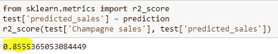

测试数据集的 R2 分数

**总结**

在本文中，我们学习了如何使用自动 ARIMA 模型的功能，如果您想从模型本身生成 p、d 和 q 值，这种方法将会很方便。在基本的 ARIMA 或萨里玛模型中，您需要进行差分并绘制 ACF 和 PACF 图来确定这些值，这非常耗时。

然而，如果你是时间序列的新手，建议你使用统计技术并实现基本的 ARIMA 模型来理解 p、d 和 q 值背后的直觉。

您可以从我的 GitHub [ [here](https://github.com/SushmithaPulagam/TimeSeries_Auto-ARIMA) ]获得数据集和完整代码

感谢阅读，快乐学习！🙂