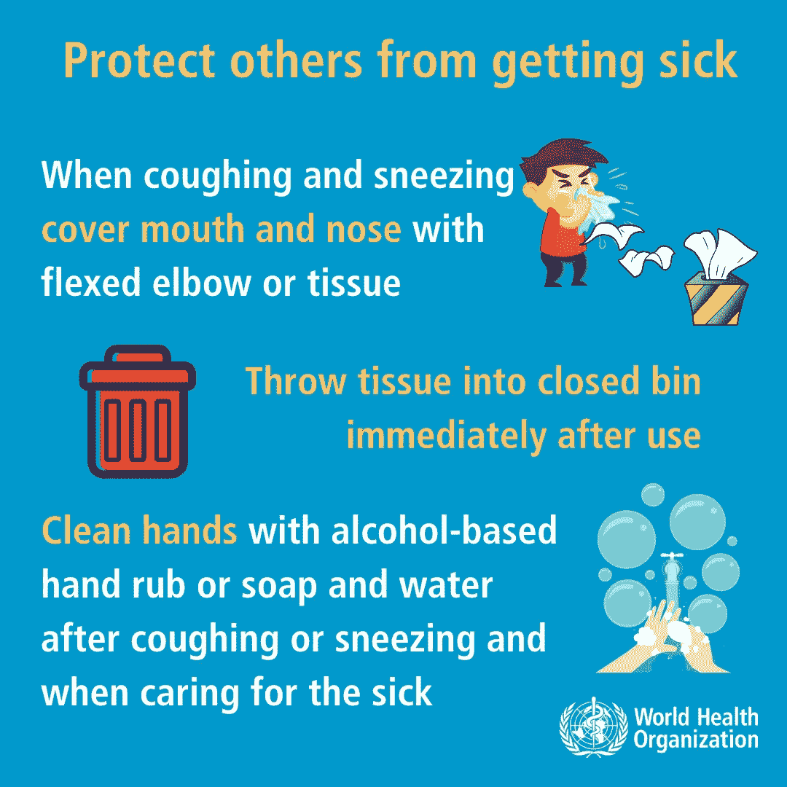
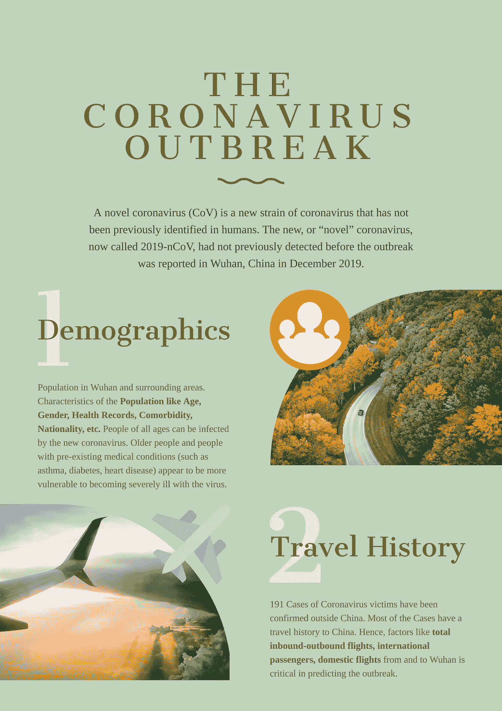
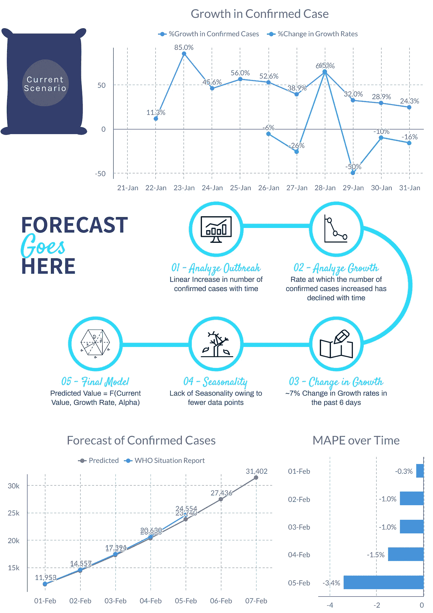

# 时间序列预测 vs .数据意义上的预测辩论！—行业需求是什么

> 原文：<https://towardsdatascience.com/time-series-forecasting-vs-the-data-sense-prediction-debate-what-industry-demands-807ef1ae0db2?source=collection_archive---------33----------------------->

## 我如何在预测冠状病毒爆发时实现 1.4%的 MAPE

> “每一个在中国和其他地方受苦的人，愿上帝加强受害者和他们的家庭，引导他们度过这段艰难的时光。请遵循[世卫组织网站](https://www.who.int/emergencies/diseases/novel-coronavirus-2019/advice-for-public)中的建议，保持安全并受到保护

**

*[乔·塞拉斯](https://unsplash.com/@joaosilas?utm_source=medium&utm_medium=referral)在 [Unsplash](https://unsplash.com?utm_source=medium&utm_medium=referral) 上拍照*

*在这个技术和变革的时代，商业智能和数据科学是两个最经常出现的术语。虽然两者都是建立在数据的基础上，但却完全不同。商业智能是收集、整合和分析当前数据以推动未来决策的过程，而数据科学更多的是分析数据以预测未来的结果。关于这两个术语的不同造词有多种版本，然而，归根结底是数学+商业+技术的结合！*

## *我们今天要谈论的四件事*

*   *问题陈述☄*
*   *方法-解决方案框架☀*
*   *验证机制▥*
*   *什么是对的或错的？☺ ☹*

# *问题陈述☄*

**“我们都知道 2019-nCoV(冠状病毒)的爆发，以及它的致命性。世界卫生组织目前正在密切监测局势，并努力制定一项全球战略准备。每天发布一份* [*情况报告*](https://www.who.int/emergencies/diseases/novel-coronavirus-2019/situation-reports) *跟踪确诊病例数、死亡数、痊愈数、新增病例数等。想象一下这样一种情景，对未来疫情的估计可以帮助各国在今天实施战略措施。战略措施包括建立保健中心、储备医疗必需品、传播意识等等。我们将努力预测确诊病例的数量，直到下周末”。**

**

*世卫组织——给公众的建议*

* [## 为什么质量和感觉检查在数据科学中如此重要？

### 世界卫生组织和 Kaggle 的 2019-nCoV(冠状病毒)数据库如何讲述同一个故事…

towardsdatascience.com](/why-quality-sense-checks-are-so-important-in-data-science-7ef80da760c3) 

# 方法-解决方案框架☀

为了预测确诊病例的数量，了解可能影响疫情的几个因素是很重要的。让我们看看下面的信息图。

*“考虑到目前无法获得所需的数据粒度，实施这些因素来开发回归或 ARIMAX 模型似乎很困难”*，但是，可以采用基于**进展/商业智能**的方法来预测未来结果。

*上述因素，如果不在模型中使用，也可以用来验证模型结果。例如，我们最终预测武汉的确诊病例数会更高，我们需要验证预测的数字。我们可以对武汉的人口统计进行初步研究。如果我们看到一个确定/证实武汉患有糖尿病和心力衰竭的老年人数量比周围省份高得多的场景，我们肯定可以验证我们的预测值；这两个因素总是高度相关的。*

> 我已经在分析行业工作了 5 年，我看到过这样的场景，当一个简单易懂的解决方案可以轻松实现时，我们却把过程复杂化了。想象一下这样一个场景，您被要求预测销售额，因为您的业务伙伴想要一个基线数字来计划下一年的预算。你可以一直致力于开发一个时间序列模型，但是你的商业伙伴能够理解 P-D-Q 框架意味着什么或者 ACF-PACF 图代表什么吗？

## 在你开发一个模型☃之前，想简单点

一个模型并不一定意味着，你开始使用复杂的数学来创建一些等式。对于任何时间序列数据，第一步是查看这三个组成部分:

*   ***趋势*** *—变量的大小是否随时间线性增加？例如，确诊病例的增长是否会随着时间的推移而增加？*
*   ***水平*** *—变量在一段时间内的平均值是多少？例如，过去 6 天的平均增长率是多少？*
*   ***季节性****——在特定的时间间隔内，我们会看到类似的价值模式吗？—我们是否在特定日期观察到类似的趋势，即每周一确诊病例/增长数字较高？*

## 现在怎么办？

*   绘制确诊病例数与时间的关系图。 ***检查线性、非线性趋势***
*   如果趋势存在， ***寻找增长的同方差或异方差***；增长数字是随时间增长还是像随机噪声一样分布不均
*   如果数字有增长趋势，看看是增加还是减少； ***计算 alpha***；α可以定义为增长随时间变化的比例
*   *任何时间序列数据都应该使用最近的事件进行预测。快速 PACF(部分自相关)图可用于理解从 t(n)到 t(n-1)时间间隔的不同确认数字的相互作用。PACF 图基本上用于理解我们是否可以使用最近值 的组合 ***的当前值来预测下一个结果****

* [## 冠状病毒爆发会有多糟糕？—预测疫情数字

### 数据分析师的观点—您应该知道的 4 件重要事情

towardsdatascience.com](/how-bad-will-the-coronavirus-outbreak-get-predicting-the-outbreak-figures-f0b8e8b61991) 

我通过使用截至 2020 年 1 月 31 日的最近 6 天的数据来调整模型参数，以得出 alpha 值。

# 验证机制▥

平均绝对百分比误差(MAPE)是我们预测模型精确度的统计度量。它以百分比的形式测量这种精度，并且可以计算为每个时间段的平均绝对百分比误差减去实际值除以实际值。它基本上帮助我们识别

*   我们的预测和实际值有多大的差异？即差异的大小
*   我们是低估了还是高估了？

MAPE 越低，模型结果越好。世界卫生组织每天发布一份情况报告，报告中的数值被用来验证模型数据。

# 什么是对的或错的？☺ ☹

## 什么顺利！☺

*   1.4%的 MAPE；适合任何型号的验证
*   简单易懂的解决方案，没有复杂的方法

## 什么不顺利！☹

*   MAPE 随着时间而增加。不适合用于预测长期值的模型
*   无法纳入可能有助于改善预测结果的外部因素* 

*这种爆发的致命性还有待观察，但利用现有的数据，如果我们能够确定高风险区，我们就可以迅速采取行动，对爆发进行一些抵抗。这就是数据科学家和分析师需要携手合作并帮助社区传播更多意识的地方。*

**关于作者:高级分析专家和管理顾问，帮助公司通过对组织数据的商业、技术和数学的组合找到各种问题的解决方案。一个数据科学爱好者，在这里分享、学习、贡献；你可以和我在* [*上联系*](https://www.linkedin.com/in/angel-das-9532bb12a/) *中。***