# 用 2D 卷积进行时间序列预测

> 原文：<https://towardsdatascience.com/time-series-forecasting-with-2d-convolutions-4f1a0f33dff6?source=collection_archive---------6----------------------->

在本文中，我将向您展示一种我在其他地方没有见过的时间序列预测方法。我怀疑这是一个新方法，但由于我还没有看到一篇关于它的伟大文章，这里是它。

**数据集**

我在这个项目中使用的数据来自全球能源预测竞赛，由我的家乡大学北卡罗来纳大学夏洛特分校举办。你可以在这里找到更多关于它的信息:【http://www.drhongtao.com/gefcom/2017】T2

你需要知道的是这些数据是来自一个能量网格的各种读数。我们的目标是利用这些数据点预测电网的实时能源需求。数据点还包括露点和干球温度，因为空调是能源消耗的巨大驱动力。

我们的目标变量是 RTDemand:我们正在工作的电网的实时能源需求。数据有明确的每日周期。这是我们三天的数据:

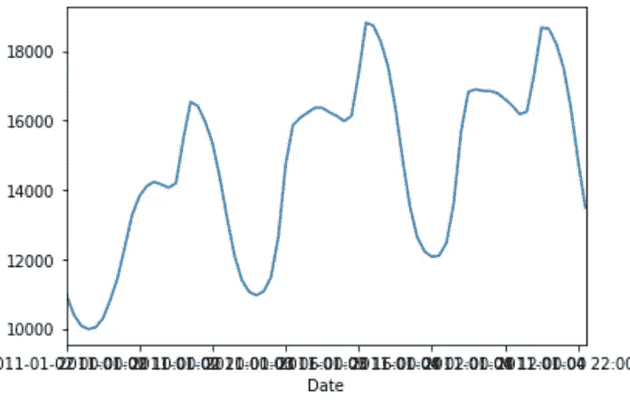

3 天每小时一次

在太阳下山、所有人都睡着的半夜，我们的功耗达到最低。我们早上醒来，开始工作，当太阳达到峰值强度时，我们的功耗达到最大。我认为每天的下降对应于通勤时间。

如果我们再放大一点，我们可以看到清晰的自相关和天数趋势，就像你在天气中看到的一样。这是大约 3 周的数据:

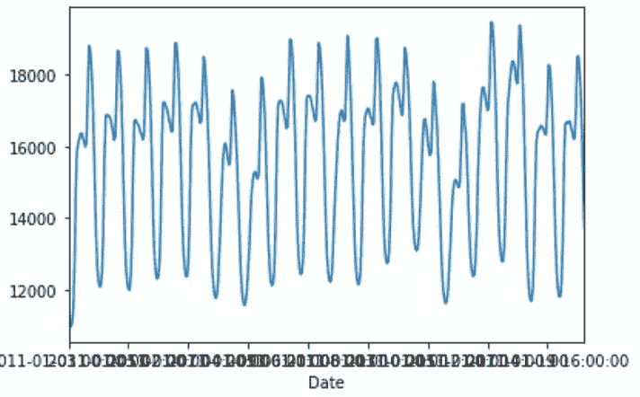

目标变量的 3 周

如果我们进一步缩小，查看一整年的数据，我们还可以注意到一个更大的季节性趋势:

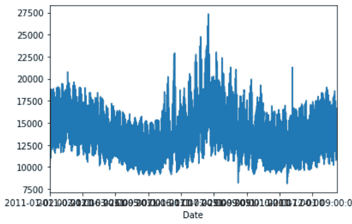

这是一个非常好的时间序列预测数据集。

**单变量纯时间序列模型**

对于时间序列预测来说，我们将需要做出导致目标结果的时间序列。在我们的例子中，我选择 72 小时作为时间序列的长度。这意味着我们模型的输入是代表过去 72 小时数据的 72 个独立数字，我们希望从我们模型得到的目标输出是第 73 小时的预测。我认为 72 小时是一个很好的长度，因为它可以很好地捕捉当地的趋势和昼夜循环。

让我告诉你我所说的时间顺序是什么意思。这是 X 的前 3 天，我们对模型的输入:

```
array([[12055., 11430., 10966., 10725., 10672., 10852., 11255., 11583.,
        12238., 12877., 13349., 13510., 13492., 13314., 13156., 13364.,
        14632., 15653., 15504., 15088., 14579., 13882., 12931., 11883.,
        10978., 10406., 10089.,  9982., 10031., 10289., 10818., 11444.,
        12346., 13274., 13816., 14103., 14228., 14154., 14055., 14197.,
        15453., 16531., 16410., 15954., 15337., 14347., 13178., 12106.,
        11400., 11059., 10959., 11073., 11485., 12645., 14725., 15863.,
        16076., 16222., 16358., 16362., 16229., 16123., 15976., 16127.,
        17359., 18818., 18724., 18269., 17559., 16383., 14881., 13520.], [11430., 10966., 10725., 10672., 10852., 11255., 11583., 12238.,
        12877., 13349., 13510., 13492., 13314., 13156., 13364., 14632.,
        15653., 15504., 15088., 14579., 13882., 12931., 11883., 10978.,
        10406., 10089.,  9982., 10031., 10289., 10818., 11444., 12346.,
        13274., 13816., 14103., 14228., 14154., 14055., 14197., 15453.,
        16531., 16410., 15954., 15337., 14347., 13178., 12106., 11400.,
        11059., 10959., 11073., 11485., 12645., 14725., 15863., 16076.,
        16222., 16358., 16362., 16229., 16123., 15976., 16127., 17359.,
        18818., 18724., 18269., 17559., 16383., 14881., 13520., 12630.], [10966., 10725., 10672., 10852., 11255., 11583., 12238., 12877.,
        13349., 13510., 13492., 13314., 13156., 13364., 14632., 15653.,
        15504., 15088., 14579., 13882., 12931., 11883., 10978., 10406.,
        10089.,  9982., 10031., 10289., 10818., 11444., 12346., 13274.,
        13816., 14103., 14228., 14154., 14055., 14197., 15453., 16531.,
        16410., 15954., 15337., 14347., 13178., 12106., 11400., 11059.,
        10959., 11073., 11485., 12645., 14725., 15863., 16076., 16222.,
        16358., 16362., 16229., 16123., 15976., 16127., 17359., 18818.,
        18724., 18269., 17559., 16383., 14881., 13520., 12630., 12223.]])
```

数组中的每个数字都是 RTDemand 的读数:这个特定的发电站在那个小时需要多少千瓦的电力。三个大阵列中的每一个都有 72 小时的数据。如果你仔细观察这三组 72 个读数的前 8 个左右，你会注意到每组新的 72 个读数都是向前移动了一个小时的系列。因此，这些 72 长度的输入数组中的每一个都代表了该能源电网实时需求的过去 72 小时的读数。

然后，我们希望预测第 73 个小时，因此我们的 y 数组将如下所示:

```
array([[12630.],
       [12223.],
       [12070.]])
```

注意，如果你看上面第二个 X 数组中的最后一个条目，它也是我们 Y 中的第一个条目，第三个 X 数组中的最后一个条目是我们 Y 中的第二个条目。对于第一个 X 数组，我们试图预测 Y 系列中的第二个值。

**数据转换**

一旦我们加载并窗口化了数据，我们接下来需要将它转换成一个合适的集合来训练机器学习模型。首先，我将缩放所有输入变量。稍后，我们将考虑使用数据集的所有 12 个输入，但现在我将只介绍一个变量。我将**而不是**缩放我的目标变量，我的 Y，因为我觉得它以最小的成本使得监控模型的进展更容易。接下来，我们将把它分成培训/测试部分:

```
from sklearn.preprocessing import StandardScalerscaler = StandardScaler()
X = scaler.fit_transform(X)split = int(0.8 * len(X))
X_train = X[: split - 1]
X_test = X[split:]y_train = y[: split - 1]
y_test = y[split:]
```

最后，我们的形状有点偏离。我们将使用的模型的输入是(样本、时间步长、特征)。在第一个模型中，我们仅使用时间窗口目标变量作为输入。所以，我们只有一个特征。我们的 X_train.shape 当前为(样本，时间步长)。在上面的训练/测试拆分之后，我们现在将重塑它:

```
X_train = X_train.reshape((X_train.shape[0], X_train.shape[1], 1))
X_test = X_test.reshape((X_test.shape[0], X_test.shape[1], 1))
X_train.shape
(61875, 72, 1)
```

即 61，875 个样本，每个样本由 72 个每小时读数和 1 个特征组成。准备好摇滚了。

**基准车型:**

首先，一个基准。我们的优化指标将是均方误差/均方根误差。所以首先我们需要知道这个数字是好是坏。我们还会考虑 R，不过如果有冲突，我们只会使用均方误差作为损失函数和优化目标。

对于基准模型，我们将看到我们得到的均方误差和 R 的读数。这里的基准模型将猜测我们的时间序列中的前一个值。下面是一些代码，可以快速阅读这个模型:

```
# Benchmark model
prev_val = y_test[0]
sse = 0for n in range(0, len(y_test)-1):
 err = y_test[n] — prev_val
 sq_err = err ** 2
 sse = sse + sq_err
 prev_val = y_test[n]mse = sse / n
mse
```

对于我们的测试数据集，这产生了 411，577.17 的答案，其平方根是 641.54。对此的一种解释是，平均而言，该基准模型在给定的一小时内下降了 641.54 兆瓦。下面是基准模型与真实结果的对比图。

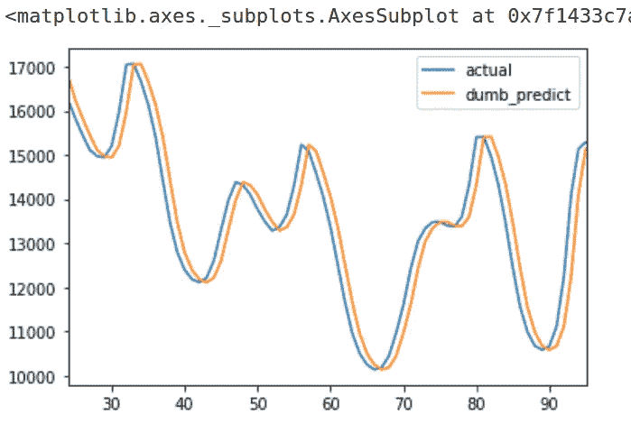

这不是一个容易被击败的模型，尽管它非常简单。

**1-可变 LSTM 模型:**

现在我们已经建立了数据集，我们可以开始使用机器学习模型进行预测。

预测时间序列的一种常用方法是 LSTM 模型。这将提供一个很好的基准学习模型来与我们的卷积模型进行比较。以下是使用 LSTM 模型进行设置和预测的一些代码:

```
def basic_LSTM(window_size=5, n_features=1):
 new_model = keras.Sequential()
 new_model.add(tf.keras.layers.LSTM(100, 
               input_shape=(window_size, n_features),
               return_sequences=True,
               activation=’relu’))
 new_model.add(tf.keras.layers.Flatten())
 new_model.add(tf.keras.layers.Dense(1500, activation=’relu’))
 new_model.add(tf.keras.layers.Dense(100, activation=’linear’))
 new_model.add(tf.keras.layers.Dense(1))
 new_model.compile(optimizer=”adam”, loss=”mean_squared_error”) 
 return new_modells_model = basic_LSTM(window_size=window_size, n_features=X_train.shape[2])ls_model.summary()Model: "sequential"
_________________________________________________________________
Layer (type)                 Output Shape              Param #   
=================================================================
lstm (LSTM)                  (None, 72, 100)           40800     
_________________________________________________________________
flatten (Flatten)            (None, 7200)              0         
_________________________________________________________________
dense (Dense)                (None, 1500)              10801500  
_________________________________________________________________
dense_1 (Dense)              (None, 100)               150100    
_________________________________________________________________
dense_2 (Dense)              (None, 1)                 101       
=================================================================
Total params: 10,992,501
Trainable params: 10,992,501
Non-trainable params: 0
```

训练后，我们可以评估模型:

```
ls_model.evaluate(X_test, y_test, verbose=0)
1174830.0587427279from sklearn.metrics import r2_score
predictions = ls_model.predict(X_test)
test_r2 = r2_score(y_test, predictions)
test_r2
0.8451637094740732
```

我们得到的结果还可以，但不是一流的。具体来说，我们得到了比以前的基准模型更高的误差。下面的图表可以让你了解它预测了什么:

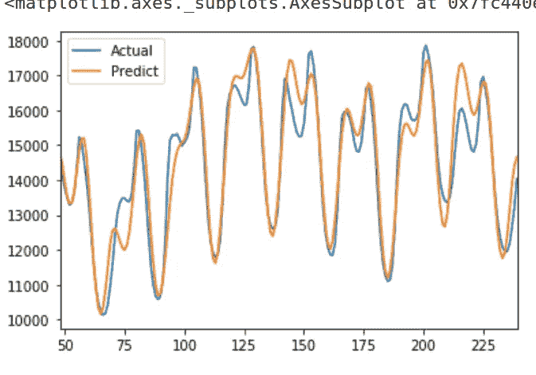

如你所见，它预测了相当多的可变性，但最终结果并不理想。问题似乎是在上午的“下降”过程中出现了相对较大的误差。我还发现这个模型非常不可靠，经常将其损失函数降低到 nan，并且不产生任何输出。

**引入 1D 卷积方法**

另一种预测时间序列的方法是使用 1D 卷积模型。1D 卷积使用滤波窗口，并在数据上循环该窗口以产生新的输出。根据卷积窗的学习参数，它们可以像移动平均线、方向指示器或模式检测器一样随时间变化。我用一些图片来解释一下方法。

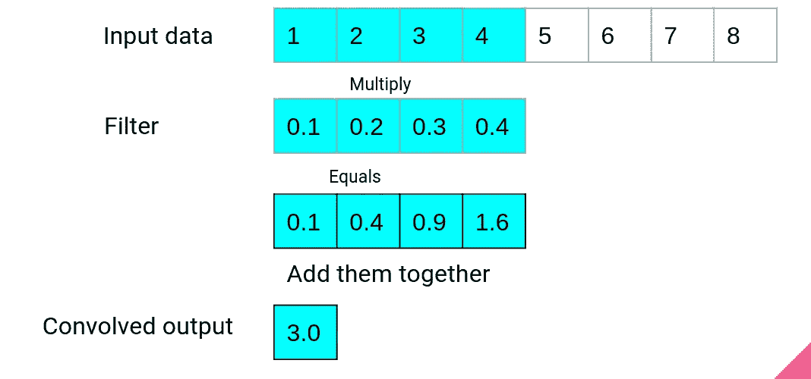

第一步

这里我们有一个包含 8 个元素的数据集，过滤器大小为 4。滤波器中的四个数字是 Conv1D 层学习的参数。在第一步中，我们将滤波器的元素乘以输入数据，并将结果相加，产生卷积输出。

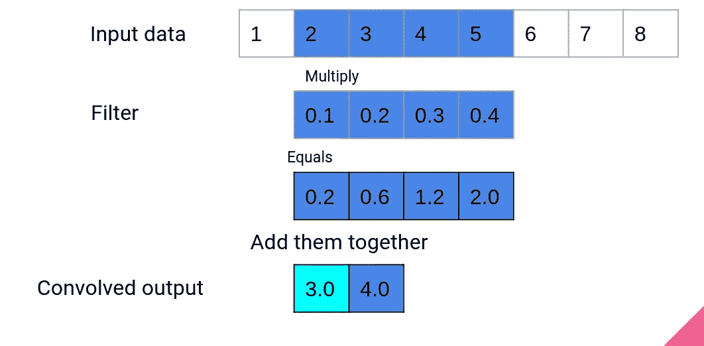

第二步

在卷积的第二步中，窗口移动一步，重复相同的过程以产生第二个输出。

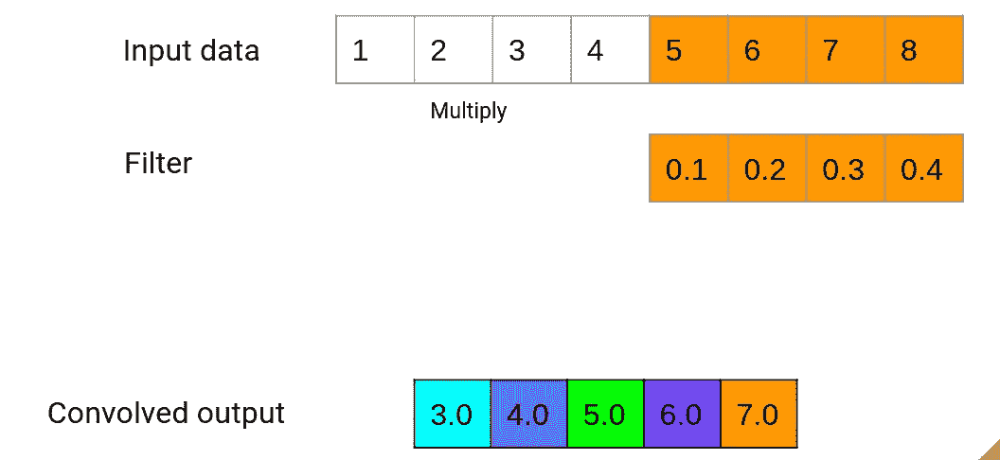

1D 卷积的最后一步

这个过程一直持续到窗口到达输入数据的末尾。在我们的例子中，一个输入数据序列是我们之前设置的 72 小时的数据。如果我们添加选项 padding =“same”，我们的输入数据将在开头和结尾用零填充，以保持输出长度等于输入长度。上面的演示使用了线性激活，这意味着最后一个多色数组是我们的输出。但是，您可以在这里使用大量的激活函数，这些函数将通过一个额外的步骤来运行这个数字。因此，在我们下面的例子中，将有一个 ReLU 激活函数应用于这个最后的输出，以产生最终的输出。

给定我们之前描述的数据设置，下面是设置和运行 1D 卷积的代码:

```
def basic_conv1D(n_filters=10, fsize=5, window_size=5, n_features=2):
 new_model = keras.Sequential()
 new_model.add(tf.keras.layers.Conv1D(n_filters, fsize, padding=”same”, activation=”relu”, input_shape=(window_size, n_features)))
 # Flatten will take our convolution filters and lay them out end to end so our dense layer can predict based on the outcomes of each
 new_model.add(tf.keras.layers.Flatten())
 new_model.add(tf.keras.layers.Dense(1800, activation=’relu’))
 new_model.add(tf.keras.layers.Dense(100))
 new_model.add(tf.keras.layers.Dense(1))
 new_model.compile(optimizer=”adam”, loss=”mean_squared_error”) 
 return new_model
```

我们的数据集看起来是这样的:

```
univar_model = basic_conv1D(n_filters=24, fsize=8, window_size=window_size, n_features=X_train.shape[2])univar_model.summary()Model: "sequential_1"
_________________________________________________________________
Layer (type)                 Output Shape              Param #   
=================================================================
conv1d (Conv1D)              (None, 72, 24)            216       
_________________________________________________________________
flatten_1 (Flatten)          (None, 1728)              0         
_________________________________________________________________
dense_3 (Dense)              (None, 1800)              3112200   
_________________________________________________________________
dense_4 (Dense)              (None, 100)               180100    
_________________________________________________________________
dense_5 (Dense)              (None, 1)                 101       
=================================================================
Total params: 3,292,617
Trainable params: 3,292,617
Non-trainable params: 0
```

注意这里我有 24 个卷积窗，滤波器大小是 8。因此，在我们的例子中，输入数据将是 72 小时，这将创建一个大小为 8 的窗口，并且将有 24 个这样的过滤器。因为我使用了 padding="same "，所以每个过滤器的输出宽度将是 72，就像我们的输入数据一样，输出的数量将是 24 个卷积数组。展平产生 72 * 24 = 1，728 长度数组输出。从上面继续我们的样本卷积，它看起来像这样:

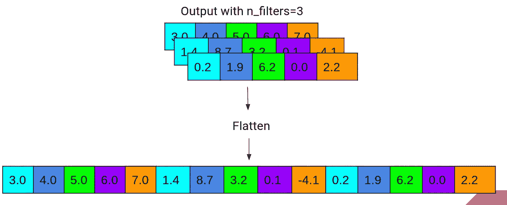

展平如何工作

那么，相对于一个 LSTM 和一个愚蠢的模型，这个方法是如何工作的呢？

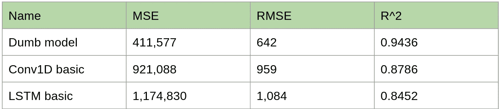

好吧，所以它比 LSTM 好一点，但它仍然达不到最初的基准模型“只是猜测以前的值”。当我们看这个图表时，我们可以看到这个模型中明显的偏差:

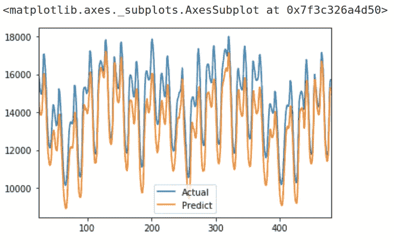

1 变量 Conv1D

**添加更多数据**

在我们的例子中，我们只使用我们想要预测的特征作为输入变量。然而，我们的数据集有 12 个可能的输入变量。我们可以把所有的输入变量叠加在一起，用它们来做一个预测。由于许多输入变量与我们的输出变量有中度到强烈的相关性，所以应该可以用更多的数据做出更好的预测，对吗？嗯，在 1D 卷积中有一点问题。

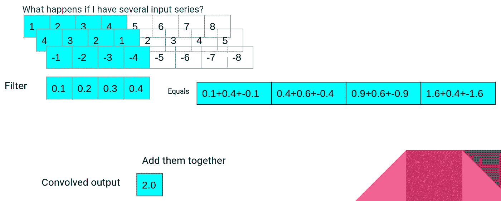

多元 Conv1D

我相信这就是 1D 卷积窗应用于多序列输入的情况。如果我是对的，那么添加更多的数据集将会“模糊”任何一个特定输入变化的影响，反而会产生一个不太准确的模型。

如果我想将不同的数据序列堆叠到我的模型中，我首先必须通过相同的窗口处理来运行它，以产生一组观察值，每个观察值包含变量的最后 72 个读数。例如，如果我想在第 1 列中添加变量 DADemand(提前一天的需求，此时来自前一天的需求)，我将对其执行以下操作:

```
(DADemand, _) = window_data(gc_df, window_size, 1, 1)scaler = StandardScaler()DADemand = scaler.fit_transform(DADemand)split = int(0.8 * len(X))DADemand_train = DADemand[: split — 1]DADemand_test = DADemand[split:]DADemand_test.shape
(61875, 72, 1)
```

然后，我可以对我的所有 12 个变量继续这个过程，并像这样把它们堆成一个集合:

```
data_train = np.concatenate((X_train, db_train, dew_train, DADemand_train, DALMP_train, DAEC_train, DACC_train, DAMLC_train, RTLMP_train, RTEC_train, RTCC_train, RTMLC_train), axis=2)data_test = np.concatenate((X_test, db_test, dew_test, DADemand_test, DALMP_test, DAEC_test, DACC_test, DAMLC_test, RTLMP_test, RTEC_test, RTCC_test, RTMLC_test), axis=2)data_train.shape(61875, 72, 12)
```

这是 61，875 个例子，每个例子都是 12 个不同时间序列的 72 小时单独读数。我们现在将通过一个 Conv1D 网络来运行它，看看我们会得到什么结果。如果回顾一下我们用于创建这些模型的函数，您会注意到其中一个变量是要素的数量，因此运行该函数和 LSTM 的代码与使用现有代码创建模型一样简单，只是使用了新的堆叠数据、拟合、评估和绘制。这就是事情的经过:

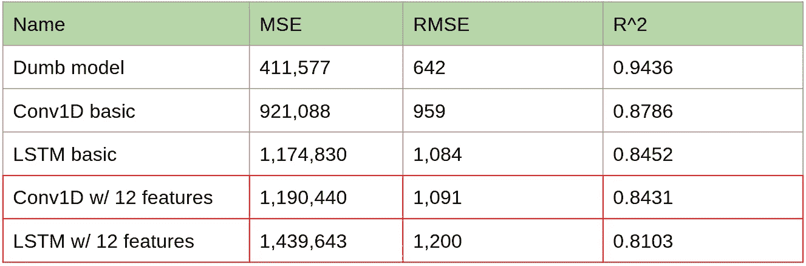

呦喂。

正如所料，我们在这里的表现实际上随着额外的变量而下降，我相信是因为模糊效应。当我坐在一个沉闷的午夜，虚弱而疲惫地沉思时，我找到了解决这个问题的办法。

**2D 卷积**

好了，这里我们需要的是一个卷积窗口，它可以查看我们的特征，并找出哪些特征是好的。它基本上应该是这样的:

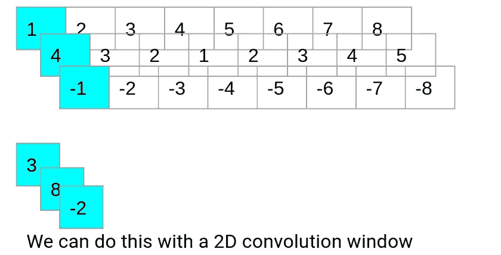

我需要什么

在做了一些研究后，这个形状可以通过一个形状为(1，filter_size)的 2D 卷积窗口来实现，在上图中，filter_size=3。回到我们的能源预测问题，我们有 12 个特征。为了让它进入 2D 卷积窗，我们实际上需要它有 4 个维度。我们可以得到另一个维度:

```
data_train_wide = data_train.reshape((data_train.shape[0], data_train.shape[1], data_train.shape[2], 1))
data_test_wide = data_test.reshape((data_test.shape[0], data_test.shape[1], data_test.shape[2], 1))data_train_wide.shape(61875, 72, 12, 1)
```

我对这个 2D 窗口的各种形状做了一些测试，发现一次做两个功能效果最好:

```
def basic_conv2D(n_filters=10, fsize=5, window_size=5, n_features=2):
 new_model = keras.Sequential()
 new_model.add(tf.keras.layers.Conv2D(n_filters, (1,fsize), padding=”same”, activation=”relu”, input_shape=(window_size, n_features, 1)))
 new_model.add(tf.keras.layers.Flatten())
 new_model.add(tf.keras.layers.Dense(1000, activation=’relu’))
 new_model.add(tf.keras.layers.Dense(100))
 new_model.add(tf.keras.layers.Dense(1))
 new_model.compile(optimizer=”adam”, loss=”mean_squared_error”) 
 return new_modelm2 = basic_conv2D(n_filters=24, fsize=2, window_size=window_size, n_features=data_train_wide.shape[2])m2.summary()Model: "sequential_4"
_________________________________________________________________
Layer (type)                 Output Shape              Param #   
=================================================================
conv2d (Conv2D)              (None, 72, 12, 24)        72        
_________________________________________________________________
flatten_4 (Flatten)          (None, 20736)             0         
_________________________________________________________________
dense_12 (Dense)             (None, 1000)              20737000  
_________________________________________________________________
dense_13 (Dense)             (None, 100)               100100    
_________________________________________________________________
dense_14 (Dense)             (None, 1)                 101       
=================================================================
Total params: 20,837,273
Trainable params: 20,837,273
Non-trainable params: 0
```

好的，这个模型非常庞大。在我的普通 CPU 上，每个纪元花了大约 4 分钟进行训练。当它完成后，我对它进行了评估并绘制了图表，我的朋友像买彩票一样得到了回报:

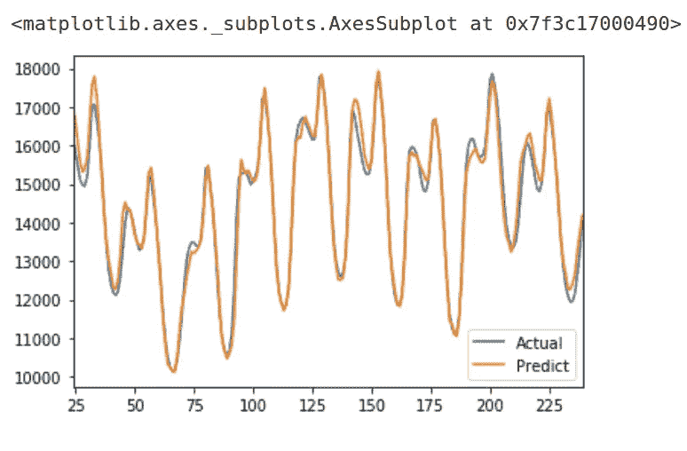

YOWZA

这款车型与我们之前的车型相比如何？

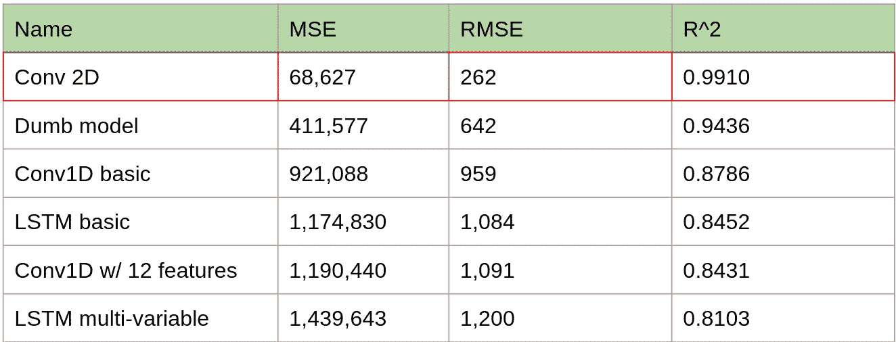

布丁中的证据

因此，这个模型远远优于所有以前的模型，并以巨大的优势击败了我们的基准“哑模型”。

但是等等，还有更多！

好吧，就像你没有想到的奖金模型:如果我们使用类似的想法，但也是一次卷积超过 8 小时，过滤形状为(8，1)，会怎么样？

下面是下一个更深层的代码:

```
def deeper_conv2D(n_filters=10, fsize=5, window_size=5, n_features=2, hour_filter=8):
 new_model = keras.Sequential()
 new_model.add(tf.keras.layers.Conv2D(n_filters, (1,fsize), padding=”same”, activation=”linear”, input_shape=(window_size, n_features, 1)))
 new_model.add(tf.keras.layers.Conv2D(n_filters, (hour_filter, 1), padding=”same”, activation=”relu”))
 new_model.add(tf.keras.layers.Flatten())
 new_model.add(tf.keras.layers.Dense(1000, activation=’relu’))
 new_model.add(tf.keras.layers.Dense(100))
 new_model.add(tf.keras.layers.Dense(1))
 new_model.compile(optimizer=”adam”, loss=”mean_squared_error”) 
 return new_model
```

这种模式表现也很好:

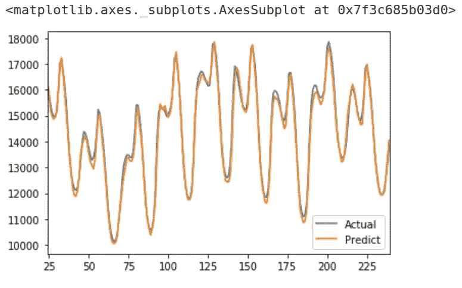

根据我们的损失指标/优化目标，该模型的表现优于任何其他模型:

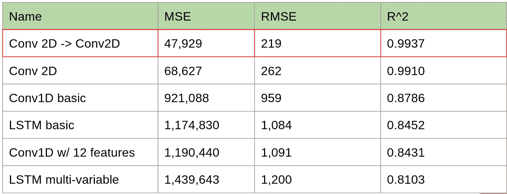

我们的最终结果！

您可以在以下位置找到所有相关代码以及样本数据集:【https://github.com/walesdata/2Dconv_pub

你可以在这里找到更多关于我和我在做什么的信息:【https://www.linkedin.com/in/john-wales-62832b5/