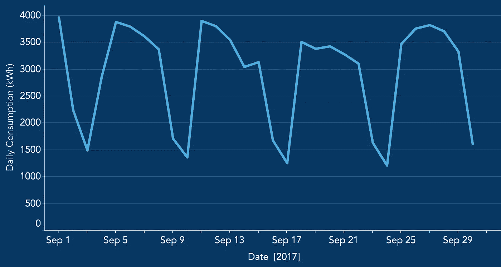
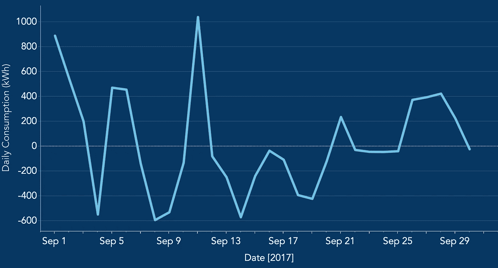
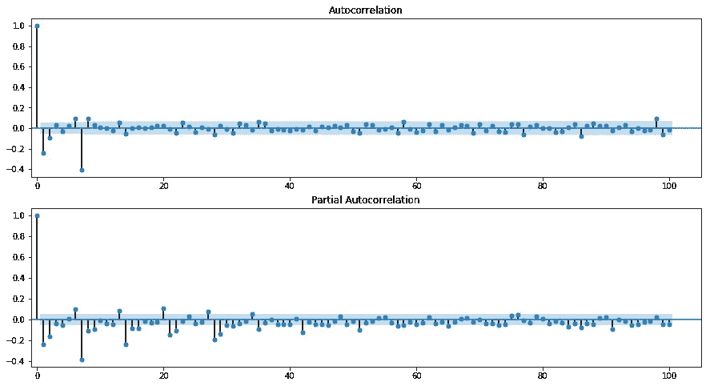
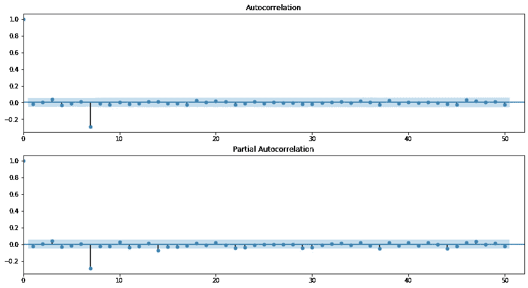
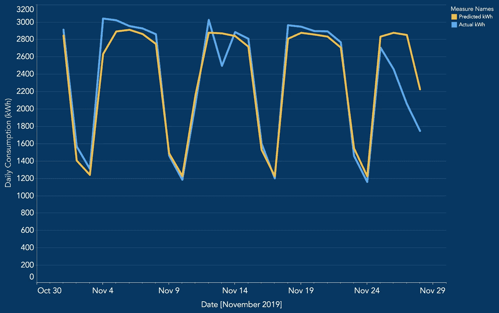

# 基于 SARIMA 模型的时间序列预测

> 原文：<https://towardsdatascience.com/time-series-forecasting-with-a-sarima-model-db051b7ae459?source=collection_archive---------0----------------------->

## 预测加州大学伯克利分校一栋建筑的每日电力负荷


图片来源:[艾琳娜·朱科娃](https://www.elenazhukova.com/educational#11)

# 背景

你好。在本文中，我将使用 SARIMA 模型运行一个电力负荷预测示例。为加州大学伯克利分校的一栋建筑收集了三年的[每日电力负荷数据](https://engagementdashboard.com/ucb/ucb/)，以根据该建筑从 2016 年 1 月到 2019 年 10 月的电力使用情况创建模型。该模型将预测 2019 年 11 月的日负荷，其有效性将使用平均绝对百分比误差来衡量。详细介绍该流程时，将涵盖以下主题:

1.  **平稳性(差分和增强的 Dickey-Fuller 检验)**
2.  **ACF 和 PACF 图**
3.  **网格搜索和 AIC**
4.  **向前走验证**
5.  **MAPE**
6.  **外生变量**

# EDA 和平稳性检查

在建模之前，我们先来看看一些数据，看能不能提取出什么有意义的信息。



图 1:每日电力负荷示例

看上面的图 1，数据中有一个非常清晰的周趋势。当一周中上课时，电力负荷很高，而在周末，电力负荷较低。在确定 SARIMA 参数时，这一见解将会派上用场。

对于许多类型的时间序列模型，验证您的数据是平稳的是很重要的。简而言之，数据需要满足以下要求，以确保稳定性:

*   常数平均值
*   恒定方差
*   恒定自相关结构(当前值取决于过去值)
*   没有周期性成分

从上面的 EDA 中可以清楚地看到，数据包含周期性的成分，因此需要应用转换来使数据保持稳定。在这种情况下，我们将应用第一个差异和每周季节差异。下面的图 2 显示了对数据进行差异处理后的相同日期范围；它不再包含周趋势。



图 2:首次差异和季节差异后的日负荷

验证数据平稳性的一种快速简单的方法是通过扩展的 Dickey-Fuller 检验。这可以通过下面的代码来完成:

```
from statsmodels.tsa.stattools import adfulleradf, pvalue, usedlag_, nobs_, critical_values_, icbest_ = adfuller(train)
```

该测试的零假设(p 值> 0.05)是数据不是稳定的。根据上面代码的输出，p 值被计算为~ 0，所以我们可以拒绝零假设，说数据实际上是稳定的。开始做模特！

# 萨里玛模型参数— ACF 和 PACF 图

简单介绍一下， [SARIMA 款](http://people.duke.edu/~rnau/Slides_on_ARIMA_models--Robert_Nau.pdf)是带有季节性元素的 ARIMA 款。根据公式萨里玛( *p* 、 *d* 、 *q* )x( *P* 、 *D* 、 *Q、s* )，这些型号的参数如下:

*   ***p*** 和季节性 ***P*** :表示自回归项的个数(平稳序列的滞后)
*   ***d*** 和季节性 ***D*** :表示为了平稳化系列必须进行的差分
*   ***q*** 和季节性 ***Q*** :表示移动平均项的个数(预测误差的滞后)
*   ***s*** :表示数据中的季节长度

采用两种方法来确定理想的萨里玛参数: [ACF 和 PACF 图](http://people.duke.edu/~rnau/411arim3.htm)，以及网格搜索。使用 ACF 和 PACF 图作为起点，缩小到几个潜在参数，然后使用网格搜索来确定最佳参数。我们来看看吧！

ACF 和 PACF 图是使用下面的代码生成的，可以在下面的图 3 中看到。

```
import matplotlib.pyplot as plt
import statsmodels.api as smfig, ax = plt.subplots(2,1)
fig = sm.graphics.tsa.plot_acf(train, lags=50, ax=ax[0])
fig = sm.graphics.tsa.plot_pacf(train, lags=50, ax=ax[1])
plt.show()
```



图 3: ACF 和 PACF 图(x 轴=滞后数，y 轴=相关性)

可以看出，在滞后 1 和滞后 7(每周季节性成分)的 ACF 图中有显著的负尖峰。在 PACF 图中，在滞后 1 和 2 处有显著的负尖峰(即滞后衰减较慢)，在滞后 7、14、21 等处也有显著的负尖峰。这些特征暗示了一个潜在的参数起点 **SARIMA(0，1，1)x(0，1，1，7)**

*   *p* 和 *P* 都等于 0(在 ACF 和 PACF 图中没有显著的正尖峰)
*   *d* 和 *D* 都等于 1(首差和季节差)
*   *q* 和 *Q* 都等于 1(显著的负尖峰，PACF 衰减更平缓)
*   s 等于 7(每周季节性成分)

使用这些参数，模型与数据拟合，然后评估模型残差的一组新的 ACF 和 PACF 图。参见下面的代码:

```
model = sm.tsa.statespace.SARIMAX(train, order=(0,1,1), 
                                  seasonal_order(0,1,1,7))
                                 .fit(max_iter=50, method='powell')res = model.residfig, ax = plt.subplots(2,1)
fig = sm.graphics.tsa.plot_acf(res, lags=50, ax=ax[0])
fig = sm.graphics.tsa.plot_pacf(res, lags=50, ax=ax[1])
plt.show()
```

残差的 ACF 和 PACF 图见下图 4。除了在滞后 7 时，没有显著的峰值。这些参数是模型的一个可接受的起点，可以使用网格搜索进一步改进。



图 4:模型残差的 ACF 和 PACF 图

# SARIMA 模型参数—网格搜索

以(0，1，1)x(0，1，1，7)为起点，建立网格搜索来测试许多不同的参数组合。值得关注的是那些 p = 0、1 或 2，q = 1 或 2 的模型。可以用来比较各模型相对质量的一个度量是 [AIC](https://en.wikipedia.org/wiki/Akaike_information_criterion) (阿凯克信息准则)，这是一个样本外预测误差的估计量；较低的 AIC 分数表明模型更具预测性。参见下面生成不同参数组合列表的代码，以及测试每个组合并打印相应 AIC 分数的 SARIMA 模型管道:

```
import itertools#set parameter range
p = range(0,3)
q = range(1,3)
d = range(1,2)
s = range(7,8)# list of all parameter combos
pdq = list(itertools.product(p, d, q))
seasonal_pdq = list(itertools.product(p, d, q, s))# SARIMA model pipeline
for param in pdq:
    for param_seasonal in seasonal_pdq:
        try:
            mod = sm.tsa.statespace.SARIMAX(train,
                                    order=param,
                                    seasonal_order=param_seasonal)
            results = mod.fit(max_iter = 50, method = 'powell')print('SARIMA{},{} - AIC:{}'.format(param, param_seasonal, results.aic))
        except:
            continue
```

在这种情况下，用 *p* ， *P* = 1 和 *q* ， *Q* = 2 获得了最低的 AIC 分数，因此要使用的最终 SARIMA 模型参数是 **SARIMA(1，1，2)x(1，1，2，7)** 。

# 与 MAPE 一起进行验证和评估

如本文背景所述，SARIMA 模型正在预测 2019 年 11 月的日用电负荷。虽然简单的训练/测试分割对于时间序列是可能的(在我们的例子中，测试数据是 2019 年 11 月的实际负荷数据)，但更可靠的选择是[向前行走验证](https://www.liip.ch/en/blog/time-series-prediction-a-short-comparison-of-best-practices)，其中测试数据被分割多次。参见下面的代码；在第一次遍历中，根据模型对训练数据的拟合，预测 11 月第一周的日负荷。在第二次遍历中，将 11 月第一周的实际日负荷添加到训练数据中，重新调整模型，并预测 11 月第二周的负荷。11 月的第三和第四周遵循同样的程序。

平均绝对百分比误差(MAPE)是一个可用于评估 SARIMA 模型的指标。对于每个预测数据点，计算与相应测试点的绝对差值，然后除以测试点。平均百分比给出了 MAPE。请参见下面的代码，了解向前遍历验证和 MAPE 计算。

```
# data = entire dataset
# n_test = point where data is split into training and test setsdef walk_forward_validation(data, n_test): predictions = np.array([])
    mape_list = []
    train, test = data[:n_test], data[n_test:]
    day_list = [7,14,21,28] # weeks 1,2,3,4 for i in day_list:
        # Fit model to training data
        model = sm.tsa.statespace.SARIMAX(train, order=(1,1,2), 
                                          seasonal_order(1,1,2,7))       
                                         .fit(max_iter = 50,
                                          method = 'powell')

        # Forecast daily loads for week i
        forecast = model.get_forecast(steps = 7)
        predictions = np.concatenate(predictions, forecast, 
                                     axis=None) # Calculate MAPE and add to mape_list
        j = i-7
        mape_score = (abs(test[j:i]-predictions[j:i])/test[j:i])*100
        mape_mean = mape_score.mean()
        mape_list.append(mape_mean) # Add week i to training data for next loop
        train = np.concatenate((train, test[j:i]), axis=None)return predictions, mape_list
```

我们的模型预测的 MAPE 为 9.74%。还不错！让我们将预测和实际数据一起绘制出来，看看它们在视觉上是如何比较的。请参见下面的图 5。


图 5:每日负载预测与实际每日负载

预测似乎很好地遵循了每周的趋势，尽管在一个月中的一些日子里有相当大的误差。仔细看看，这些都是假期(特别是 11 日的退伍军人节，以及月底的感恩节假期)。

# 外变量

提高模型性能的一个快速方法是添加一个外生变量，该变量考虑了全年的假期。Python 有一个“假日”包，可以导入并用于确定日期是否为假日(可以指定美国假日)。

到目前为止，我们一直使用的 SARIMAX 模型只是将外生变量作为一个额外的参数。请参见下面的代码摘录:

```
model2 = sm.tsa.statespace.SARIMAX(train, holiday_ex_var, 
                                   order=(1,1,2), 
                                   seasonal_order(1,1,2,7))
                                  .fit(max_iter = 50, 
                                   method = 'powell')
```

通过 walk_forward_validation 函数运行这个模型，我们得到的 MAPE 为 **7.04%** 。这比最初的型号提高了 25%以上！请参见下图 6，了解与实际日负荷相比的最新预测。退伍军人节和感恩节负荷预测有了明显的改进；加入假日变量是有益的！然而，仍有改进的余地，因为在感恩节假期的其他日子里仍有明显的误差。这里不探讨减少这些误差的方法。



图 6:每日负荷预测(带有外部变量)与实际每日负荷的对比

# 结论

总的来说，我们经历了一个电力负荷预测问题，并涵盖了一些重要的时间序列主题。检验平稳性、分析 ACF 和 PACF 图、执行验证以及考虑外生变量都是实现 SARIMA 模型时必不可少的。

这个项目扩展到 70 多栋加州大学伯克利分校的建筑，并创建了一个交互式 Tableau 仪表板来显示预测；这里可以查看。下面还可以看到一段录制的演示。点击[此处](https://github.com/gravesa333/Electricity_Load_Forecasting)进入该项目的 github repo。

希望这个概述是有帮助的。下次见！