# R 中 ARIMA 模型的时间序列预测

> 原文：<https://towardsdatascience.com/time-series-forecasting-with-arima-model-in-r-77f4e2ae7abb?source=collection_archive---------15----------------------->

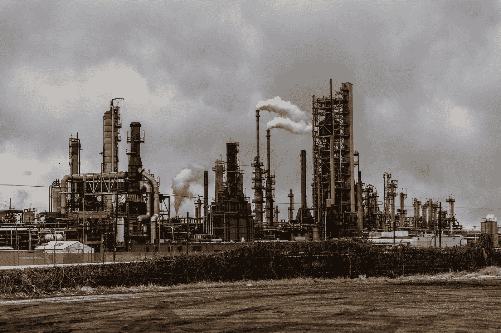

帕特里克·亨德利在 [Unsplash](https://unsplash.com/?utm_source=unsplash&utm_medium=referral&utm_content=creditCopyText) 上的照片

## 从勘探到预测 1970 年至 2015 年的二氧化碳排放数据。

C 气候变化是真实的。更糟糕的是，人类的活动对环境并不友好，例如使用化石燃料作为交通工具、燃煤发电机、水泥生产等。这些活动的影响之一是气温上升和臭氧层消耗。

众所周知，发达国家，尤其是欧洲，正在减少导致气候变化的排放量。如果我们想象一些欧洲国家的时间序列，它没有显示出明显的增长，它有同样的排放量，甚至在某些情况下排放量减少，特别是俄罗斯联邦在 1991 年苏联解体后。它显示几乎没有明显的增长。

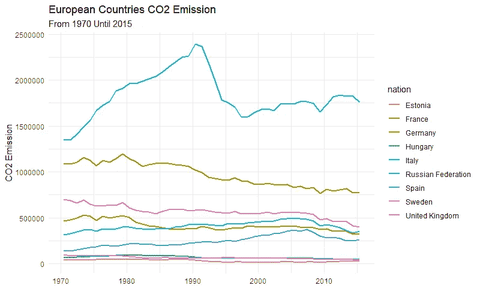

当我们看发展中国家时，情况就不同了。如果我们从东盟国家的角度来看这个图，它不时地显示出轻微的线性增长。正如你在下面看到的，

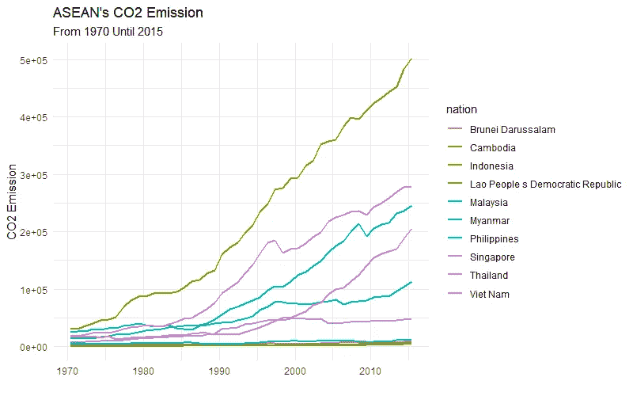

基于这个问题，本文将向您展示如何使用 R 中的 ARIMA 模型来预测欧盟委员会的 CO2 排放时间序列数据，您可以在此处获得数据[](https://edgar.jrc.ec.europa.eu/overview.php?v=CO2ts1990-2015)****以及我们为什么要使用该模型。****

> ****通过分析和预测排放物的产生量，我们可以知道已经产生了多少排放物，这对于制定什么样的政策来减少其增长是非常有用的。****

## ****注意:****

****这与我之前的文章不同，我之前的文章预测印度尼西亚的 CPI 是一个平稳的数据。在这种情况下，我将使用印度尼西亚的二氧化碳排放量向您展示如何处理非平稳数据。****

> ******但是等等，平稳和非平稳数据有什么区别？******

# ****平稳与非平稳数据****

****平稳数据和非平稳数据的区别在于时间的均值和方差。****

> ****静态数据在时间上具有恒定的均值、方差和相关性。而非平稳数据具有随时间变化的均值、方差和相关性。****

****还是一点想法都没有？好吧，看看这些可视化的东西:****

********

****回想一下我上一篇文章中的 CPI 图，这是一个平稳的数据。原因是 CPI 值不会随着时间的推移而增加，换句话说，无论它是否增加，都不存在趋势。****

****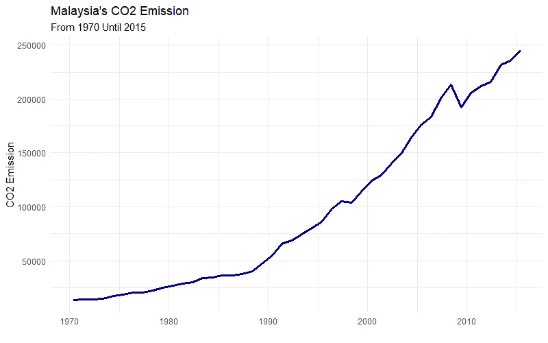****

****这是马来西亚随着时间的推移产生的二氧化碳排放量。正如我们所见，它显示了一些线性趋势。我们可以说，均值、方差和相关性随着时间的推移而增加。这就是为什么它是非平稳数据。****

****我希望你现在至少能理解平稳和非平稳时间序列数据之间的区别。****

# ****行动（或活动、袭击）计划****

****在我们进行分析之前，我会告诉你我是如何处理这些数据的。以下是我完成的步骤:****

1.  ******数据探索******
2.  ******型号识别和诊断******
3.  ******预测******

# ****分析****

## ****介绍****

****在建立模型之前，我们首先要知道数据。它看起来如何，与其他国家的模式有何不同，等等。我将描述什么是真正的数据集以及数据集中包含的信息。****

****该数据集代表了从 1970 年到 2015 年的二氧化碳排放总量。它记录了世界上所有国家的数量。欧洲委员会联合研究中心记录的 CO2 量是来自化石燃料使用和工业过程使用的排放，例如水泥生产、化学过程、非能源使用等等。这不包括生物质燃烧和其他农业相关活动，如森林火灾和农业废物燃烧。****

## ****探测****

****因为我已经告诉过你们一些国家的二氧化碳排放量，我将向你们具体展示印度尼西亚的二氧化碳排放量。这里展示了它的可视化，****

****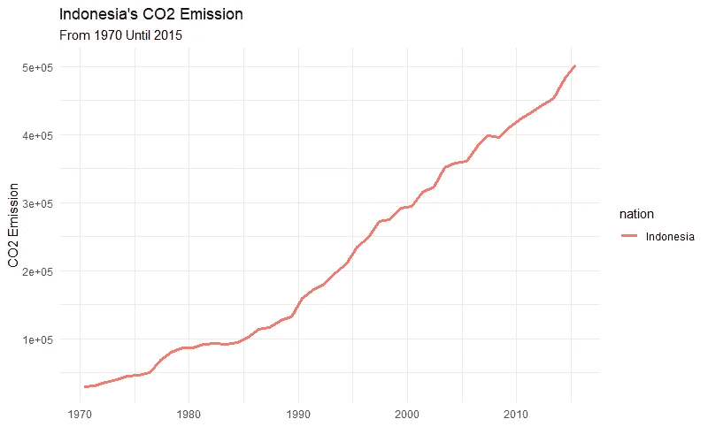****

****正如我们在这里看到的，它随时间呈线性趋势。这是一个不稳定的数据，因为均值、方差和相关性会随着时间而变化。在 1970 年，二氧化碳排放量仅为 30.066 千吨，而在 2015 年，二氧化碳排放量为 502.961 千吨。****

****这是一个很大的变化。根据这些数据，我们希望使用 ARIMA 模型进行预测，以了解如果政府政策不变，未来几年的排放量是多少。****

## ****模型识别****

****因为这不是一个平稳的时间序列，我们必须找到与以前的值有差异的数据。****

> ****如果差分数据具有平稳特性，则可以使用 ARMA 模型对其建模。因此，我们可以从中找到模型的完美滞后。****

****为此，我们必须将该值作为一个时间序列对象，然后查看应用于 diff 函数的时间序列的结果。下面是代码的样子，****

```
**indo <- df %>%
  filter(nation == "Indonesia") %>%
  pivot_longer(2:47, names_to = "year", values_to = "co2")indo.ts <- ts(indo$co2, frequency = 1, start = 1970)
indo.ts # Create Time Series Plot from 
plot(diff(indo.ts))**
```

****这是它的可视化结果，****

****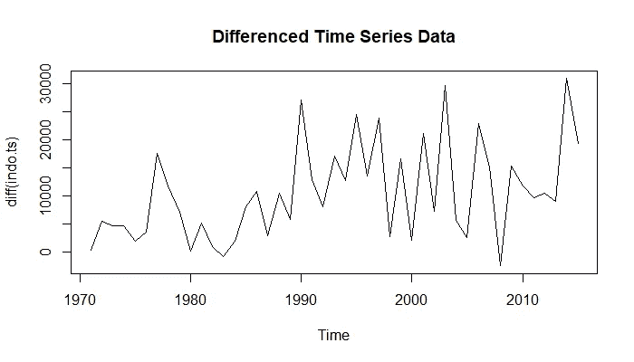****

****基于这种可视化，我们可以看到差异数据具有稍微更稳定的属性，并且没有趋势。因此，我们可以使用这些差异数据来找出哪些 AR 和 MA 参数适合我们的 ARIMA 模型。****

****为了找到适合我们的 ARIMA 模型的 AR 和 MA 的参数值，我们可以使用 ACF 和 PACF 函数来找到最佳值，****

****这是一个函数，我们可以看到 ACF 和 PACF 图，****

```
**library(astsa)
acf2(diff(indo.ts), max.lag = 40)**
```

****这是结果，****

****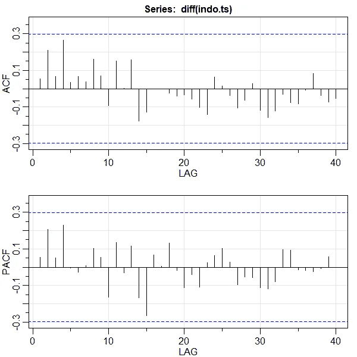****

****根据这个图，我们知道，ACF 和 PACF 函数略有下降，不会很快达到 0。因此，我们可以假设它将参数 p 与 1 一起使用，参数 q 也与 1 一起使用。所以，适合的 ARMA 模型是 ARMA(1，1)。****

****为了使模型成为 ARIMA 模型，我们只需添加另一个参数，即代表数据差异的 d。因此，我们的 ARIMA 模型将是 ARIMA(1，1，1)，其中每个参数代表 p、d 和 q。p 是 AR 模型参数，d 是数据的差异量，q 是 MA 模型参数。****

## ****模型诊断****

****如果其他模型之间没有显著变化，ARIMA(1，1，1)将是我们的模型。在这种情况下，我们将尝试 ARIMA(2，1，1)和 ARIMA(1，1，2)来查看参数是否具有显著的 p 值。****

****我们可以简单地通过使用下面的函数来诊断这个模型，****

```
**# ARIMA(1, 1, 1)
sarima(indo.ts, 1, 1, 1)# ARIMA(2, 1, 1)
sarima(indo.ts, 2, 1, 1)# ARIMA(1, 1, 2)
sarima(indo.ts, 1, 1, 2)**
```

****这是每个参数的 p 值，****

****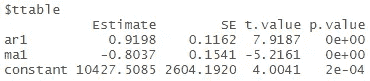********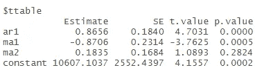********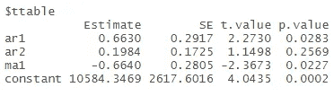****

****从左到右:ARIMA(1，1，1)，ARIMA(1，1，2)，ARIMA(2，1，1)****

****正如我们在这里看到的，ARIMA(1，1，1)在其参数上具有显著的 p 值。那么，ARIMA(1，1，2)和 ARIMA(2，1，1)这两个模型的 p 值都不显著。通过改变它的参数对模型没有任何影响。因此，我们可以用 **ARIMA(1，1，1)** 模型。****

****在我们为数据选择了最佳模型之后，我们还要诊断另一件事，那就是残差。以下是 sarima 函数的残差分析结果。****

****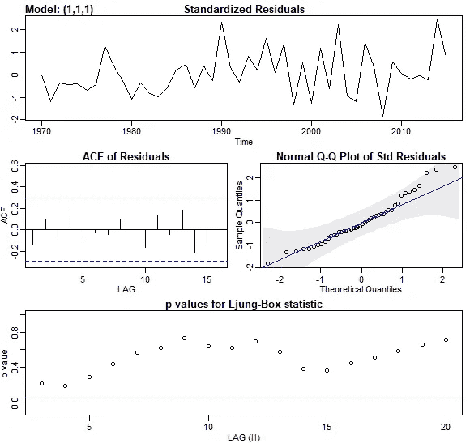****

****如果我们要使用这个模型，残差必须具有正态分布，并且其值的每个滞后之间没有相关性。基于这一可视化，我们可以看到残差没有任何显著的自相关性，正如我们从 ACF 图中看到的那样，大多数点也在直线上对齐，正如我们从 Q-Q 图中看到的那样，并且 Ljung-Box 统计 p 值没有越过蓝线。因此，我们可以用这个模型来做预测。****

## ****预测****

****如果我们想做一些预测，我们可以使用 sarima.for 函数来做。这个函数的每个参数都包括数据、我们要预测的时间，然后设置代表我们的 ARIMA 模型的 p、d 和 q 参数。****

****在本例中，我们想知道未来 35 年的二氧化碳排放量是多少，以及 2050 年的二氧化碳排放量是多少。****

****这是用来做预测的函数，****

```
**sarima.for(indo.ts, n.ahead = 35, 1, 1, 1)**
```

****这是它的视觉效果，****

****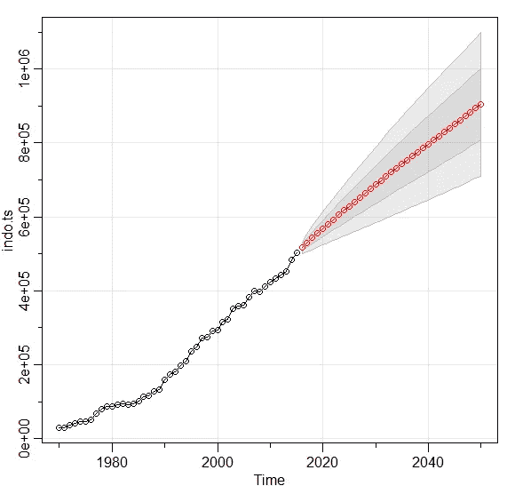****

****正如我们在这里看到的，黑点代表我们的数据，红色代表预测结果。正如我们在这里看到的，预测结果也显示了红线之间的灰色边界。它基本上表示预测结果的标准误差。该边界上没有大的边界，因此该模型具有良好的结果。****

****根据预测结果，我们知道 2050 年将产生约 904.186 千吨的二氧化碳排放量。这是一个巨大的二氧化碳排放量。因此，政府应该考虑如何减少排放的政策，这样才能对抗气候变化，使我们的地球更适合居住，而不是因为我们的活动而破坏地球的状况。****

# ****结论****

****总之，ARIMA 模型是对非平稳时间序列数据进行预测的良好模型。****

****我知道，这个模型并不完美，但至少它给出了未来的价值。知道这一点真的很重要，尤其是如果你是一个政策制定者，通过知道这个结果，你将知道制定什么样的政策。****

****我将引用这段话来结束这篇文章，以提醒我们，****

> ****“所有的模型都是错误的，但有些是有用的”——乔治·博克斯****

## ****参考****

****[1] Stoffer，D. S. & Shumway，R. H. [*时间序列:一种使用 R*](https://onlinelibrary.wiley.com/doi/abs/10.1111/jtsa.12508) (2019)的数据分析方法，Taylor & Francis Group。
【2】Hyndman，R.J. & Athanasopoulos，G. [*预测:原理与实践*](https://otexts.com/fpp2/) (2018)，第 2 版，OTexts。****

## ****感谢您阅读我的文章，您也可以在下面查看我以前的文章:****

****[](/introduction-to-time-series-analysis-with-r-a2f97650baa3) [## R 时间序列分析导论

### 从探索，到预测。使用印度尼西亚 2002 年 12 月至 2020 年 4 月的消费者价格指数(CPI)数据

towardsdatascience.com](/introduction-to-time-series-analysis-with-r-a2f97650baa3) [](/3-reasons-why-i-recommend-you-to-learn-python-first-8e72ed4a6c65) [## 我推荐你先学习 Python 的 3 个理由

### 如果你想从数据科学开始而不是先学 R

towardsdatascience.com](/3-reasons-why-i-recommend-you-to-learn-python-first-8e72ed4a6c65) [](/greater-accuracy-does-not-mean-greater-machine-learning-model-performance-771222345e61) [## 更高的准确性并不意味着更好的机器学习模型性能

### 我们可以定量地衡量机器学习模型的性能，但不仅仅是准确性，还有很多…

towardsdatascience.com](/greater-accuracy-does-not-mean-greater-machine-learning-model-performance-771222345e61)****