# 具有自回归过程的时间序列预测

> 原文：<https://towardsdatascience.com/time-series-forecasting-with-autoregressive-processes-ba629717401?source=collection_archive---------5----------------------->

## Python 中时间序列分析的 AR(p)过程实践教程


伊莲娜·科伊切娃在 [Unsplash](https://unsplash.com?utm_source=medium&utm_medium=referral) 上的照片

# 介绍

在本实践教程中，我们将讨论使用自回归过程进行时间序列建模的主题。

本文将涵盖时间序列分析中的以下关键要素:

*   自回归过程
*   尤尔-沃克方程
*   平稳性
*   扩充的迪克-富勒试验

确保准备好 Jupyter 笔记本，以便跟进。代码和数据集可在[这里](https://github.com/marcopeix/time-series-analysis)获得。

我们开始吧！

> 了解如何使用更复杂的模型，如 SARIMAX、VARMAX，并应用深度学习模型(LSTM、CNN、ResNet、自回归 LSTM)进行时间序列分析，并使用 Python 中的[应用时间序列分析](https://www.datasciencewithmarco.com/offers/tdU2mtVK)！

# 自回归过程

一个**自回归模型**使用目标过去值的线性组合进行预测。当然，回归是针对目标本身进行的。数学上，AR(p)模型表示为:

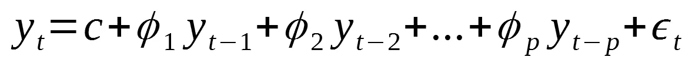

自回归模型

其中:

*   p:这是命令吗
*   c:是常数
*   ε:噪声

AR(p)模型非常灵活，可以模拟许多不同类型的时间序列模式。当我们模拟自回归过程时，这是很容易想象的。

通常，自回归模型仅适用于平稳时间序列。这限制了参数*φ*的范围。

例如，AR(1)模型会将 *phi* 限制在-1 和 1 之间。随着模型阶数的增加，这些约束变得更加复杂，但是在 Python 中建模时会自动考虑这些约束。

## AR(2)过程的模拟

让我们用 Python 模拟一个 AR(2)流程。

我们从导入一些库开始。并非所有这些都将用于模拟，但它们将是本教程其余部分所必需的。

```
from statsmodels.graphics.tsaplots import plot_pacf
from statsmodels.graphics.tsaplots import plot_acf
from statsmodels.tsa.arima_process import ArmaProcess
from statsmodels.tsa.stattools import pacf
from statsmodels.regression.linear_model import yule_walker
from statsmodels.tsa.stattools import adfuller
import matplotlib.pyplot as plt
import numpy as np%matplotlib inline
```

我们将使用 *ArmaProcess* 库来模拟时间序列。它要求我们定义我们的参数。

我们将模拟以下过程:

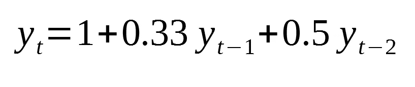

AR(2)过程

因为我们正在处理一个 2 阶的自回归模型，我们需要定义滞后 0，1 和 2 的系数。

此外，我们将取消移动平均线过程的影响。

最后，我们将生成 10 000 个数据点。

在代码中:

```
ar2 = np.array([1, 0.33, 0.5])
ma = np.array([1])simulated_AR2_data = ArmaProcess(ar2, ma).generate_sample(nsample=10000)
```

我们可以绘制时间序列:

```
plt.figure(figsize=[10, 7.5]); # Set dimensions for figure
plt.plot(simulated_AR2_data)
plt.title("Simulated AR(2) Process")
plt.show()
```

您应该会得到类似这样的结果:

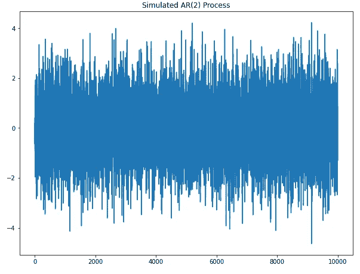

模拟 AR(2)过程的图

现在，让我们来看看自相关图(相关图):

```
plot_acf(simulated_AR2_data);
```

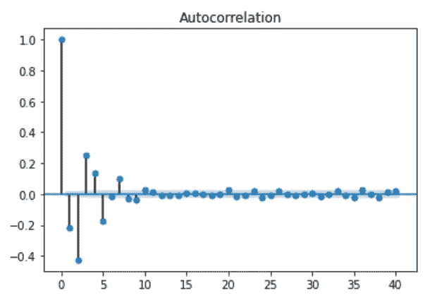

AR(2)过程的相关图

你可以看到系数在慢慢衰减。这意味着它不太可能是一个[移动平均过程](/basic-statistics-for-time-series-analysis-in-python-4cb147d56535)，这表明时间序列可能可以用一个自回归过程来建模(这是有意义的，因为这正是我们正在模拟的)。

为了确保这是正确的，让我们绘制偏自相关图:

```
plot_pacf(simulated_AR2_data);
```

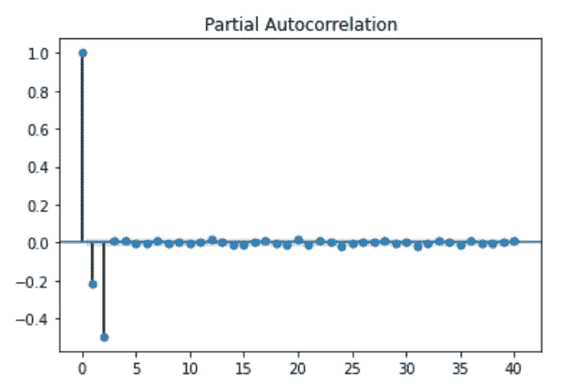

AR(2)过程的偏自相关图

正如你所看到的，滞后 2 之后，系数并不显著。因此，部分自相关图对于确定 AR(p)过程的阶数是有用的。

您还可以通过运行以下命令来检查每个系数的值:

```
pacf_coef_AR2 = pacf(simulated_AR2_data)
print(pacf_coef_AR2)
```

现在，在真实的项目设置中，可以很容易地找到 AR(p)过程的阶，但是我们需要找到一种方法来估计系数*φ*。

为此，我们使用了尤尔-沃克方程。这个方程允许我们在已知阶数的情况下估计 AR(p)模型的系数。

```
rho, sigma = yule_walker(simulated_AR2_data, 2, method='mle')
print(f'rho: {-rho}')
print(f'sigma: {sigma}')
```

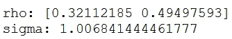

尤尔-沃克系数估计

如你所见，Yule-Walker 方程在估算我们的系数方面做得不错，非常接近 0.33 和 0.5。

## AR(3)过程的模拟

现在，让我们模拟一个 AR(3)过程。具体来说，我们将模拟:

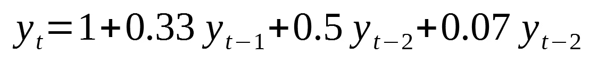

AR(3)过程模拟

类似于之前所做的，让我们定义我们的系数并生成 10 000 个数据点:

```
ar3 = np.array([1, 0.33, 0.5, 0.07])
ma = np.array([1])simulated_AR3_data = ArmaProcess(ar3,ma).generate_sample(nsample=10000)
```

然后，我们可以将时间序列可视化:

```
plt.figure(figsize=[10, 7.5]); # Set dimensions for figure
plt.plot(simulated_AR3_data)
plt.title("Simulated AR(3) Process")
plt.show()
```

您应该会看到类似如下的内容:

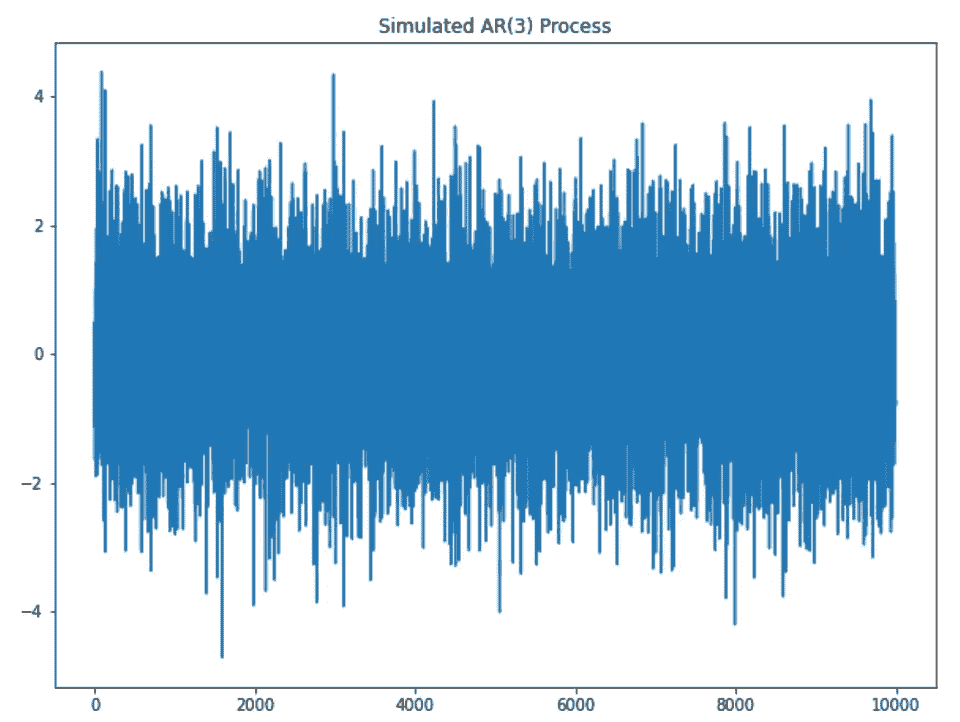

模拟 AR(3)过程

现在，看看 PACF 和 ACF:

```
plot_pacf(simulated_AR3_data);
plot_acf(simulated_AR3_data);
```

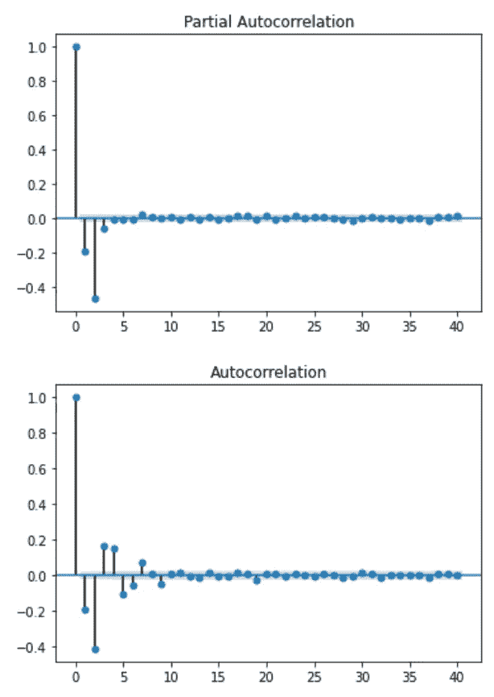

AR(3)流程的 PACF 和 ACF

你可以看到，对于 PACF 函数来说，滞后 3 之后的系数并不像预期的那样显著。

最后，让我们使用尤尔-沃克方程来估计系数:

```
rho, sigma = yule_walker(simulated_AR3_data, 3, method='mle')
print(f'rho: {-rho}')
print(f'sigma: {sigma}')
```

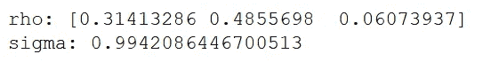

尤尔-沃克系数估计

同样，估计值相当接近实际值。

# 项目—预测强生公司的季度每股收益

现在，让我们将自回归过程的知识应用到项目设置中。

目标是模拟强生公司 1960 年至 1980 年间的每股季度收益(EPS)。

首先，我们来读一下[数据集](https://github.com/marcopeix/time-series-analysis):

```
import pandas as pddata = pd.read_csv('jj.csv')
data.head()
```

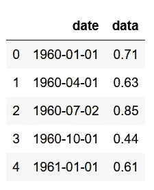

数据集的前五行

现在，前五行对我们来说不是很有用。让我们绘制整个数据集，以获得更好的可视化表示。

```
plt.figure(figsize=[15, 7.5]); # Set dimensions for figure
plt.scatter(data['date'], data['data'])
plt.title('Quaterly EPS for Johnson & Johnson')
plt.ylabel('EPS per share ($)')
plt.xlabel('Date')
plt.xticks(rotation=90)
plt.grid(True)
plt.show()
```


强生公司 1960 年至 1980 年间的每股收益

厉害！现在我们可以看到数据有明显的上升趋势。虽然这对公司来说可能是一个好迹象，但就时间序列建模而言，这并不好，因为这意味着时间序列不是平稳的。

如前所述，AR(p)过程仅适用于平稳序列。

因此，我们必须对数据进行一些转换，使其保持稳定。

在这种情况下，将取对数差。这相当于取每个值的对数，减去前一个值。

```
# Take the log difference to make data stationarydata['data'] = np.log(data['data'])
data['data'] = data['data'].diff()
data = data.drop(data.index[0])
data.head()
```

绘制转换后的时间序列:

```
plt.figure(figsize=[15, 7.5]); # Set dimensions for figure
plt.plot(data['data'])
plt.title("Log Difference of Quaterly EPS for Johnson & Johnson")
plt.show()
```

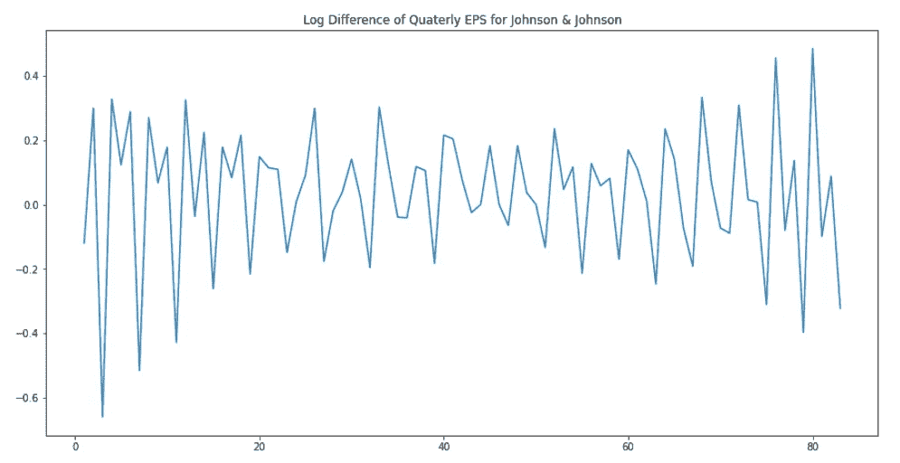

强生公司季度每股收益的对数差异

现在，似乎我们消除了这种趋势。然而，在用 AR(p)过程建模之前，我们必须确保我们的序列是平稳的。

因此，我们将使用扩展的 Dicker-Fuller 检验。这将给我们统计上的信心，我们的时间序列确实是平稳的。

```
ad_fuller_result = adfuller(data['data'])
print(f'ADF Statistic: {ad_fuller_result[0]}')
print(f'p-value: {ad_fuller_result[1]}')
```

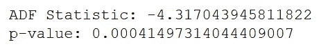

ADF 测试的结果

由于我们得到一个大的负 ADF 统计量和小于 0.05 的 p 值，我们可以拒绝零假设，说我们的时间序列是平稳的。

现在，让我们通过绘制 PACF 来找到该过程的顺序:

```
plot_pacf(data['data']);
plot_acf(data['data']);
```

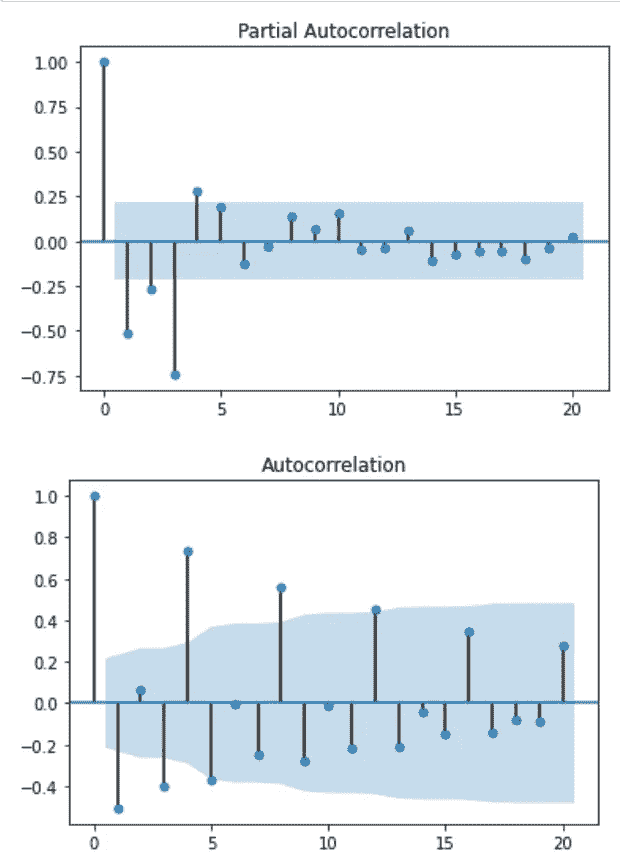

PACF 和 ACF

正如你所看到的，在滞后 4 之后，PACF 系数不再重要。因此，我们将假设一个 4 阶的自回归过程。

现在，我们将利用这些信息，通过 Yule-Walker 方程来估算系数:

```
# Try a AR(4) model
rho, sigma = yule_walker(data['data'], 4)
print(f'rho: {-rho}')
print(f'sigma: {sigma}')
```

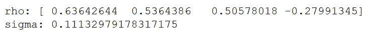

尤尔-沃克系数估计

因此，该函数近似为:

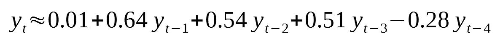

请注意，此等式模拟了转换后的序列。

# 结论

恭喜你！您现在了解了什么是自回归模型，如何识别自回归过程，如何确定其顺序，以及如何使用它来模拟现实生活中的时间序列。

提高您的时间序列分析技能，并学习 Python 中时间序列分析的最新最佳实践:

*   [在 Python 中应用时间序列分析](https://www.datasciencewithmarco.com/offers/tdU2mtVK)

干杯🍺