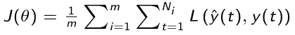

# 基于深度学习和注意机制的时间序列预测

> 原文：<https://towardsdatascience.com/time-series-forecasting-with-deep-learning-and-attention-mechanism-2d001fc871fc?source=collection_archive---------1----------------------->

## 入门指南

## 用于时间序列预测的最重要的深度学习算法的架构和实现细节的概述

图片来自[https://images . unsplash . com/photo-1506555191898-a 76 bacf 004 ca？IX lib = r b-1 . 2 . 1&ixid = eyjhchbfawqiojeymdd 9&auto = format&fit = crop&w = 500&q = 60](https://images.unsplash.com/photo-1506555191898-a76bacf004ca?ixlib=rb-1.2.1&ixid=eyJhcHBfaWQiOjEyMDd9&auto=format&fit=crop&w=500&q=60)

# 动机

时间序列预测在许多领域一直是一个非常重要的研究领域，因为许多不同类型的数据都存储为时间序列。例如，我们可以在医学、天气预报、生物学、供应链管理和股票价格预测等领域找到大量的时间序列数据。

鉴于近年来数据可用性和计算能力的不断增长，深度学习已成为新一代时间序列预测模型的基础部分，并取得了优异的效果。

虽然在经典的机器学习模型(如自回归模型(AR)或指数平滑)中，特征工程是手动执行的，并且通常还会考虑领域知识来优化一些参数，但深度学习模型仅直接从数据中学习特征和动态。得益于此，他们加快了数据准备的过程，并能够以更完整的方式学习更复杂的数据模式。

随着不同时间序列问题在许多不同领域的研究，近年来开发了大量新的体系结构。开源框架的日益普及也简化了这一过程，它使得新的定制网络组件的开发更加容易和快速。在这篇文章中，我们总结了时间序列预测最常见的深度学习方法。

# 应用程序

让我们看看时间序列预测的一些重要应用。

**股票价格预测-** 许多先进的时间序列预测模型被用于预测股票价格，因为在历史序列中存在大量噪声和高度不确定性的信息，这些信息可能依赖于不总是与股票市场密切相关的几个因素。

**天气预测**——时间序列预测模型被广泛用于
提高天气预测的准确性。

**预测交通** -旅行规划应用程序使用时间序列预测模型来预测道路上的交通，以便更准确地决定到达所选目的地的最快方式。

许多公司使用时间序列预测模型来预测他们在哪个月可以预期更高的流动率，以便他们可以实施最佳的员工保留计划。

**文本生成-** 当我们在智能手机上写文本时，它会查看最后写的单词和键入的字母，并建议接下来的字母甚至整个单词。

# 时间序列组件

首先，解释时间序列的主要组成部分是很重要的。

## **长期趋势**

长期趋势是数据的总体方向，忽略任何短期影响，如季节变化或噪音。

## 季节性

季节性是指在整个时间序列期间重复的周期性波动。

## 平稳性

平稳性是时间序列的一个重要特征。如果时间序列的均值、方差和协方差不随时间发生显著变化，则称该时间序列是平稳的。有许多变换可以提取非平稳过程的平稳部分。

## 噪音

每组数据都有噪声，即由于不可控因素导致的随机波动或变化。

## 自相关

自相关是时间序列与其自身的滞后版本之间的相关性，用于识别时间序列数据中的季节性和趋势。

# 基于传统机器学习的时间序列预测

在谈论时间序列预测的深度学习方法之前，回忆一下用于解决这个问题的最经典的机器学习模型是 ARIMA 模型和指数平滑是有用的。

ARIMA 主张在建立时间序列的复合模型时结合自回归(AR)和移动平均(MA)方法。这个模型非常简单，但可能会有好的结果。它包括说明季节性、长期趋势、自回归和移动平均项的参数，以便处理数据中嵌入的自相关。

在指数平滑法中，预报是在加权平均值的基础上进行的，就像在 ARIMA 模型中一样，但是在这种情况下，不同的递减权重被分配给每个观测值，随着我们离现在越来越远，对观测值的重视程度越来越低。

## 传统机器学习的劣势

众所周知，这些传统的机器学习模型有许多局限性:

*   缺少值确实会影响模型的性能；
*   他们不能识别数据中的复杂模式；
*   它们通常只在分步预报中有效，在长期预报中无效。

# 时间序列预测的深度学习

使用深度学习进行时间序列预测克服了许多不同方法的传统机器学习缺点。本文提出了 5 种不同的时间序列预测深度学习架构:

*   *递归神经网络(RNNs)，*时间序列预测问题最经典、最常用的架构；
*   *长短期记忆(LSTM)* ，其是为了克服消失梯度问题而开发的 RNNs 的进化；
*   *门控循环单元(GRU)* ，那是 RNNs 的另一种进化，类似于*LSTM；*
*   *编码器-解码器模型*，这是为了解决输入序列与输出序列长度不同的问题而引入的 *RNNs* 模型；
*   *注意机制*，它是*编码器-解码器模型*的一种进化，其开发是为了避免忘记序列的较早部分。

# 递归神经网络

递归神经网络是组织成连续层的神经元样节点的网络，具有类似于标准神经网络的架构。事实上，像在标准神经网络中一样，神经元被分为输入层、隐藏层和输出层。神经元之间的每个连接都有相应的可训练权重。

不同之处在于，在这种情况下，每个神经元都被分配到一个固定的时间步长。隐藏层中的神经元也在时间相关的方向上被转发，这意味着它们中的每一个都仅与具有相同分配时间步长的隐藏层中的神经元完全连接，并且与分配到下一个时间步长的每一个神经元单向连接。输入和输出神经元仅连接到具有相同指定时间步长的隐藏层。

由于一个时间步长的隐藏层的输出是下一个时间步长的输入的一部分，神经元的激活是按时间顺序计算的:在任何给定的时间步长，只有分配给该时间步长的神经元计算它们的激活。

## 体系结构

作者图片

**权重-** 在 *RNNs 中，*时刻 *t* 的输入向量通过权重矩阵 *U* 连接到时刻 *t* 的隐层神经元，隐层神经元通过权重矩阵 *W* 连接到时刻 *t-1* 和 *t+1* 的神经元，隐层神经元连接到输出所有权重矩阵在每个时间步都是常数

**输入-** 向量 *x(t)* 是网络在时间步长*t*的输入

**隐藏状态-** 向量 *h(t)* 是时间*处的隐藏状态，是网络的一种*内存*y；它是基于当前输入和前一时间步的隐藏状态计算的:*

**

***输出—** 矢量 *y^(t)* 是网络在时间 *t* 的输出:*

**

## *学习算法*

*学习过程的目标是从真实值 *y(t)* 的输入 *x(t)* 开始，找到给出 *y^(t)* 的最佳预测的最佳权重矩阵 *U* 、 *V* 和 *W* 。*

*为了实现这一点，我们定义了一个目标函数，称为*损失函数*并表示为 *J，*，它量化了整个训练集的实际值和预测值之间的距离。它是由*

**

*在哪里*

*   *成本函数 *L* 评估单个时间步长上的实际值和预测值之间的距离；*
*   **m* 是训练集的大小；*
*   **θ* 模型参数的向量。*

*使用这两个主要步骤使损失函数 *J* 最小化:通过时间的*向前传播*和*向后传播**。**这些步骤迭代多次，迭代次数称为*历元数。***

**前向传播* -使用固定参数 *U* 、 *W* 和 *V* ，数据通过网络传播，在每个时刻 *t* ，我们使用之前定义的公式计算 y^ *(t)* 。最后计算损失函数。*

**通过时间的反向传播-* 相对于不同的参数计算成本函数的梯度，然后应用下降算法以便更新它们。每个输出端的梯度既取决于同一时间步的元素，也取决于前一时间步的存储器状态。*

## *递归神经网络的优势*

*一般来说，RNNs 解决了时间序列预测的传统机器学习模型的许多问题。*

1.  *RNNs 的性能不会受到丢失值的显著影响。*
2.  *RNNs 可以发现输入时间序列中的复杂模式。*
3.  *RNNs 在预测多于几步的情况下给出了良好的结果。*
4.  *RNNs 可以对数据序列进行建模，以便可以假设每个样本都依赖于前一个样本。*

## *递归神经网络的缺点*

1.  *当在长时间序列上训练时，rnn 通常会遭受*消失梯度*或*爆炸梯度*问题，这意味着隐藏层中的参数要么不会改变太多，要么会导致数值不稳定和混沌行为。这是因为成本函数的梯度包括影响其记忆能力的 *W、*的幂。*
2.  *上面描述的内在循环网络存在记忆力差的问题，在预测未来时不能考虑过去的几个因素。*
3.  *递归神经网络的训练很难并行化，并且计算量也很大。*

*鉴于这些缺点，RNNs 的各种扩展被设计来修整内部存储器:双向神经网络、LSTM、GRU、注意力机制。在金融等特定领域，扩大记忆可能至关重要，在这些领域，最基本的是尽可能多地记忆历史，以便预测接下来的步骤。*

# *长短期记忆(LSTM)*

*长短期记忆网络(LSTM)已经被开发出来，通过改善网络内的梯度流来克服标准 RNN 中的梯度消失问题。这是通过使用 LSTM 单元代替隐藏层来实现的。如下图所示，一个 LSTM 单元包括:*

*   *一个*信元状态*，它带来整个序列的信息并代表网络的存储；*
*   *一个*忘记门*，它决定从先前的时间步骤中保留什么；*
*   *一个*输入门*，它决定从当前时间步长添加什么相关信息；*
*   *一个*输出门*，决定当前时间步长的输出值。*

*类似于 *RNNs，*时间 *t* 的输入向量通过权重矩阵 *U* 连接到时间 *t* 的 LSTM 单元，LSTM 单元通过权重矩阵 *W* 连接到时间 *t-1* 和 *t+1* 的 LSTM 单元，LSTM 单元连接到时间*t*的输出向量矩阵 *W* 和 *U* 被分成子矩阵( *Wf* 、 *Wi* 、 *Wg* 、*Wo；Uf* 、 *Ui* 、 *Ug* 、 *Uo* )连接到 LSTM 单元的不同元件，如下图所示。所有权重矩阵在时间上是共享的。*

**

*作者图片*

*细胞状态在处理过程中传递相关信息，因此来自前一时间步的信息也会到达每个时间步，从而减少短期记忆的影响。在所有时间步骤的训练中，门学习哪些信息是重要的，应该保留或忘记，并将它们添加到细胞状态中，或从细胞状态中删除。*

*通过这种方式，LSTM 允许恢复内存中传输的数据，解决了消失梯度问题。LSTM 可用于分类、处理和预测具有未知持续时间的时间滞后的时间序列。*

## *忘记大门*

*第一道门是遗忘之门。这个入口决定哪些信息应该被删除或保存。来自先前隐藏状态的信息和来自当前输入的信息通过 sigmoid 函数传递。输出接近 0 意味着信息可以被遗忘，而输出接近 1 意味着信息必须被保存。*

**

## *输入门*

*第二个门是输入门。这用于更新单元状态。最初，先前的隐藏状态和当前输入作为输入被给定到 sigmoid 函数(输出越接近 1，信息越重要)。它还将隐藏状态和当前输入传递给一个 *tanh* 函数，以将值压缩在-1 和 1 之间，从而改善网络的调谐。然后， *tanh* 和 *sigmoid* 的输出被逐元素相乘(在下面的公式中，符号*表示两个矩阵的逐元素相乘)。 *sigmoid* 输出决定哪些信息对 *tanh* 输出是重要的。*

**

## *细胞状态*

*输入门激活后，可以计算单元状态。首先，前一时间步的单元状态按元素乘以遗忘门的输出。当单元状态中的值乘以接近 0 的值时，这提供了忽略这些值的可能性。然后，输入门的输出被逐元素添加到单元状态。输出是新的单元状态。*

**

## *输出门*

*第三个也是最后一个门是输出门，它决定下一个隐藏状态的值，该值包含有关先前输入的信息。首先，将先前的隐藏状态和当前输入相加，并传递给一个 sigmoid 函数。然后，新的单元状态被传递给 *tanh* 函数。最后， *tanh* 输出与 sigmoid 输出相乘，以决定隐藏状态应该包含什么信息。输出是新的隐藏状态。然后，新的单元状态和新的隐藏状态被带到下一个时间步骤。*

**

# *门控循环单元(GRU)*

*GRU 是新一代的递归神经网络，非常类似于 LSTM。为了解决标准 RNN 的消失梯度问题，GRU 使用了*更新门*和*重置门*。这两个门决定什么信息应该被传递到输出。这两个门可以被训练以保持来自实际时间步长之前的许多时间步长的信息，而不随时间推移清洗它，或者移除与预测无关的信息。如果仔细训练，GRU 甚至可以在复杂的情况下表现得非常好。*

*如下图所示，一个 GRU 单元包括:*

*   *一个*复位门*，它决定有多少来自先前时间步骤的信息可以被遗忘；*
*   *一个*更新门*，它决定必须保存多少来自先前时间步骤的信息；*
*   *一个*存储器*，它携带整个序列的信息并代表网络的存储器。*

**

*作者图片*

## *复位门*

*第一个门是复位门。它决定了如何将新的输入与以前的记忆结合起来，决定了可以忘记多少以前时间步骤的信息。首先，执行输入 *x(t)* 和存储器*h(t-1)*之间的加权和，该存储器保存先前 *t-1* 步骤的信息。然后应用 sigmoid 激活函数将结果压缩在 0 和 1 之间。*

**

## *更新门*

*第二个门是更新门。它有助于模型确定有多少来自先前时间步骤的信息需要传递到未来。这真的很强大，因为模型可以决定复制过去的所有信息，并消除消失梯度问题的风险。计算它的公式类似于复位门的公式，但是不同之处在于权重和门的用途(在存储器的计算中会很清楚)。*

**

## *当前内存*

*存储器内容使用复位门来存储来自过去的相关信息。为了获得它，首先计算复位门 *r(t)* 的输出与前一时间步 *h(t-1)* 的最终存储器之间的逐元素乘法，然后执行结果与输入 *x(t)* 之间的加权和。最后，应用非线性激活函数 *tanh* 。*

**

## *最终记忆*

*作为最后一步，网络需要计算 *h(t)* ，即保存当前单元信息的向量，并将其传递到下一个时间步骤。它决定了从当前内存内容 *h* ~ *(t)* 中收集什么，从前面的步骤 *h(t-1)* 中收集什么。它是通过在更新门 *z_t* 和 *h_(t-1)* 之间以及 *(1-z_t)* 和 *h~(t)* 之间应用逐元素乘法来计算的，最后在两个结果*之间执行 yhr 加权求和。**

**

# *RNN、LSTM、GRU 的执行情况*

*RNN、LSTM 和 GRU 可以使用 Keras API 实现，该 API 旨在易于使用和定制。Keras 中存在以下 3 个 RNN 层:*

*   **keras.layers.SimpleRNN**
*   **keras.layers.LSTM**
*   **keras.layers.GRU**

*它们允许您快速创建重复模板，而不必做出困难的配置选择。此外，可以定义一个具有所需行为的自定义 RNN 细胞层，允许以最少的代码灵活地快速测试各种不同的原型。在 Tensorflow 网站上，可以找到使用这些图层的说明和许多示例。*

# *编码器-解码器模型*

*在 RNN、LSTM 和 GRU，每个输入对应于同一时间步的一个输出。然而，在许多实际情况下，我们希望在给定不同长度的输入序列的情况下预测输出序列，而不需要每个输入和每个输出之间的对应关系。这种情况称为*序列到序列映射*模型，是众多常用应用的基础，例如语言翻译、语音设备和在线聊天机器人。*

*为了解决*序列到序列* *映射*模型，引入了递归神经网络的编码器-解码器模型。编码器-解码器将一个序列作为输入，并生成最可能的下一个序列作为输出。顾名思义，该模型由两个子模型组成:*

*   **编码器*，负责逐步通过输入时间步骤，并将整个序列编码成称为*上下文向量*的固定长度向量；*
*   **解码器*，负责在从上下文向量中读取时步进输出时间步长。*

**

*作者图片*

## *编码器*

*编码器是几个递归单元的堆叠，这些递归单元可以是简单的 rnn、LSTM 单元或 GRU 单元。每个单元接受输入序列的单个元素，从该元素收集信息并将其向前传播。*

*使用所选择的递归单元的函数来计算隐藏状态向量 *h(t)* 。该函数以适当的权重应用于先前的隐藏状态 *h(t-1)* 和输入向量*x(t)**

**

*最终隐藏状态向量 *h(t)* 包含来自先前隐藏表示和先前输入的所有编码信息。*

## *上下文向量*

*上下文向量是从模型的编码器部分产生的最终隐藏状态，并表示解码器的初始隐藏状态。它封装了所有输入元素的信息，以帮助解码器做出准确的预测。*

## *解码器*

*解码器由几个循环单元的堆栈组成。每个递归单元从前一个单元接受一个隐藏状态 *s(t-1)* ，并产生和输出 *y^(t)* 以及它自己的隐藏状态 *s(t)* 。*

*隐藏状态 *s(t)* 是根据所选递归单元的功能计算的:*

**

*使用当前时间步 *s(t)* 处的隐藏状态以及相应的权重，使用 *softmax* 函数来计算输出 *y^(t)* ，以便创建概率向量:*

**

## *优点和缺点*

*该模型的强大之处在于它可以将不同长度的序列相互映射，因为输入和输出是不相关的，它们的长度可以不同。这开启了一系列全新的问题，现在可以使用这种架构来解决。*

*这种技术适用于小序列，但是当序列的长度增加时，很难将长序列总结成单个向量，然后 model 在处理最后部分时经常忘记输入序列的前面部分。这就是为什么许多实验表明，随着序列大小的增加，该模型的性能下降。*

# *注意机制*

*注意机制是深度学习中的主要前沿之一，并且是编码器-解码器模型的进化，开发该模型是为了提高对长输入序列的性能。*

*主要思想是允许解码器在解码期间选择性地访问编码器信息。这是通过为解码器的每个时间步长构建不同的上下文向量、根据编码器的前一隐藏状态和所有隐藏状态来计算它、为它们分配可训练的权重来实现的。*

*这样，注意机制对输入序列的不同元素赋予不同的重要性，对更相关的输入给予更多的*注意* 。这解释了模型的名称)。*

**

*作者图片*

## ***编码器***

*编码器操作非常类似于编码器-解码器模型的相同操作。在每个时间步长，每个输入序列的表示作为前一个时间步长和当前输入的隐藏状态的函数进行计算。最终隐藏状态包含来自先前隐藏表示和先前输入的所有编码信息。*

**

## *上下文向量*

*注意机制和编码器-解码器模型之间的主要区别在于，为解码器的每个时间步长 *t* 计算不同的上下文向量 *c(t)* 。*

*为了计算时间步长 *t* 的上下文向量 *c(t)* ，我们进行如下。首先，对于编码器的时间步长 *j* 和解码器的时间步长 *t* 的每个组合，所谓的*对准分数 e(j，t)* 用以下加权和计算:*

**

*在这个方程中， *Wₐ，*uₐ， *Vₐ* 为可训练权重，称为*注意力权重。*权重 *Wₐ* 与编码器的隐藏状态相关联，权重 *Uₐ* 与解码器的隐藏状态相关联，权重 *Vₐ* 定义计算校准分数的函数。*

*对于每个时间步长 *t* ，在编码器时间步长 *j* 上使用 softmax 函数对分数 *e(j，t)* 进行归一化，得到*注意力权重* *α(j，t)**

**

**注意力权重α(j，t)* 捕捉时间步长 *j* 的输入对于解码时间步长 *t* 的输出的重要性。上下文向量 *c(t)* 根据注意力权重计算为编码器所有隐藏值的加权和:*

**

*该上下文向量允许对输入句子中更相关的输入给予更多*关注* 。*

## *解码器*

*现在上下文向量 *c(t)* 被传递给解码器，解码器计算下一个可能输出的概率分布。这种解码操作适用于输入中出现的所有时间步长。*

*然后根据递归单元函数计算当前隐藏状态 *s(t)* ，输入上下文向量 *c(t)* ，隐藏状态 *s(t-1)* 和输出前一时间步的 *y^(t-1)* :*

**

*因此，使用这种机制，该模型能够找到输入序列的不同部分和输出序列的相应部分之间的相关性。*

*对于每个时间步长，将 softmax 函数应用于加权隐藏状态来计算解码器的输出:*

**

## *优势*

*   *正如已经提到的，注意机制在存在长输入序列的情况下也给出了好的结果。*
*   *由于注意力权重，注意力机制还具有比其他深度学习模型更易解释的优势，其他深度学习模型通常被认为是黑盒，因为它们不具有解释其输出的能力。*
*   *此外，注意机制在 NLP 模型中给出了突出的结果，因为它允许记住输入中的所有单词，并在制定响应时识别最相关的单词。*

## *履行*

*注意机制可以使用 TensorFlow 和 Keras 开发，并很容易与其他 Keras 层集成。在 Github 上可以找到许多实现，例如:*

*[https://github.com/uzaymacar/attention-mechanisms](https://github.com/uzaymacar/attention-mechanisms)*

*[https://github.com/philipperemy/keras-attention-mechanism](https://github.com/philipperemy/keras-attention-mechanism)*

*在这些环节，也有很多关于情感分类、文本生成、文档分类、机器翻译的例子。*

# *结论*

*递归神经网络是用于时间序列预测的最流行的深度学习技术，因为它们允许在许多不同的问题中对时间序列进行可靠的预测。rnn 的主要问题是，当应用于长序列时，它们遭受消失梯度问题。*

*LSTM 和 GRU 是为了通过使用门来减轻 RNNs 的消失梯度问题而创建的，门通过序列链来调节信息流。LSTM 和 GRU 的使用在诸如语音识别、语音合成、自然语言理解等应用中给出了显著的结果。*

*递归神经网络的编码器-解码器模型是序列到序列映射问题中最常见的技术，其中输入序列与输出序列的长度不同。*

*注意机制是编码器-解码器模型的发展，其诞生是为了解决编码器-解码器模型在长序列存在时的性能下降，对每个时间步长使用不同的上下文向量。它在许多领域都取得了显著的效果，例如自然语言处理、文本分类、文档分类等。*

# *作者*

*我关于走向数据科学的文章:[https://medium.com/@marcodelpra](https://medium.com/@marcodelpra)*

*我的 LinkedIn 个人资料:【https://www.linkedin.com/in/marco-del-pra-7179516/ *

*领英集团 *AI 学习:*[https://www.linkedin.com/groups/8974511/](https://www.linkedin.com/groups/8974511/)*